## 按位运算

& 和 && 的区别，前者在二进制下进行计算，后者是在对结果进行“与” 运算

同理 | 和 || 、也是如此

“^"表示异或二进制运算

”~“ 表示按位进行取反

”<< “ 表示按位左移，相当于x << y  == x*(2^y)

">>" 表示按位右移，相当于 x>> y  == x//(2^y)

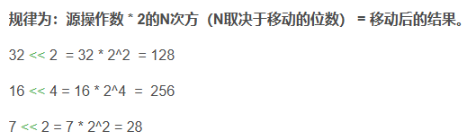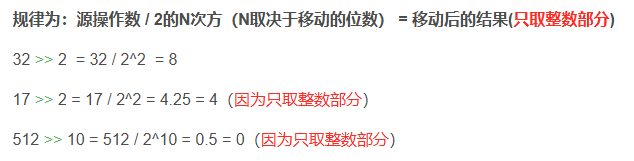

```C++
int result = 5 & 3; // result will be 1 (0000 0101 & 0000 0011 = 0000 0001)
int result = 5 ^ 3; // result will be 6 (0000 0101 ^ 0000 0011 = 0000 0110)
int result = ~5; // result will be -6 (1111 1010)
int result = 5 << 1; // result will be 10 (0000 0101 << 1 = 0000 1010)
int result = 5 >> 1; // result will be 2 (0000 0101 >> 1 = 0000 0010)
```

## Union

联合用于在同一内存位置存储不同的数据类型。

```cpp
union Data {
    int num;
    char letter;
    float decimal;
};

Data myData;
myData.num = 42;
```

## 数组在函数传递

在C++中，数组作为参数传递给函数时，实际上是通过指针的方式来传递的。这意味着，无论数组是一维数组还是多维数组，传递的都是数组第一个元素的地址。

以下是几个要点：

1. **数组退化为指针** ：当数组作为参数传递给函数时，它自动退化为指向其第一个元素的指针。因此，函数无法直接知道数组的大小。
2. **传递的是地址** ：由于传递的是指针，因此在函数内部对数组元素的修改将影响原始数组。
3. **需要显式传递大小** ：由于数组的大小信息在传递时丢失，所以通常需要将数组的大小作为另一个参数传递给函数。

## 函数的分文件编写

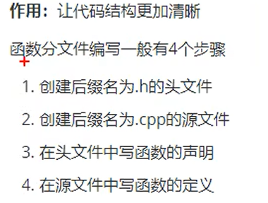

在源文件中加上 #include " .h", 头文件，这样可以建立二者的关联，

而要使用标准库，还要在相应的头文件中，加上引用#include `<iostream> 如此`

t

### CMakeList.txt多源文件工程的标准目录形式

在构建大型工程时将所有的源文件放在**src子目录中**，所得头文件放在**include子目录**中是一种较为常见的工程文件分布形式。

```cmake

cmake_minimum_required (VERSION 2.6)   #版本要求
project (Tutorial)                     #工程名称
#find_package(OpenCV REQUIRED)
 
#link_libraries(${Opencv_LIBS})
#message(${Opencv_LIBS})
 
include_directories(include) #添加头文件
 
FILE(GLOB_RECURSE CURRENT_INCLUDE include/*.hpp)
FILE(GLOB_RECURSE CURRENT_SOURCES src/*.cpp)     #aux_source_directory(src CURRENT_SOURCES)
add_executable(Tutorial ${CURRENT_SOURCES} ${CURRENT_INCLUDE})  #制定生成目标
 
```

```cmake
cmake_minimum_required(VERSION 3.5.0)
project(main VERSION 0.1.0 LANGUAGES C CXX)

include_directories(include) 

# 将找到的源文件列表存储在一个变量中 src文件夹下的所有cpp文件存储在SRC_SUB下
aux_source_directory(src SRC_SUB)
aux_source_directory(. SRC_CUR)


# 添加src目录下的所有源文件到可执行文件test1
add_executable(main ${SRC_SUB} ${SRC_CUR})

```

## 函数

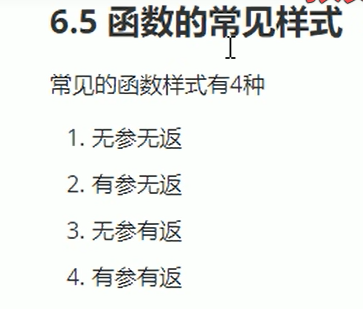

---

### **函数的默认参数**

* 返回值类型 函数名 （数据类型 参数 = 默认值）{}
* 如果某个位置已经有了默认参数，那么，从左到右都必须有默认值。
* 如果函数声明有了默认参数，函数实现就不能有默认参数。（二异性）声明和实现只能有个一个地方有默认值。

---

### 函数的占位参数

* 返回值类型 函数名 （数据类型）{}
* 

---

### 函数重载

作用： 函数名可以相同，提高复用性。

函数重载条件：

1. 同一个作用域下
2. 函数名称相同
3. 函数参数类型不同、个数不同、顺序不同都可以

> 函数的返回值不可以作为重载的条件。

引用作为重载条件

```cpp
void fun(int &a)
{
	cout << "int & a" << endl;
}

void fun(const int &a)
{
	cout << "const int &a" << endl;
}
//引用重载合法
int main()
{
	fun(10);//执行第二个
	int  a= 100;
	fun(a);//执行第一个

}
```

函数重载与函数默认参数。

```cpp
void func(int a ,int b = 100)
{
}
void func(int a)
{
}

//出现二异性，使用func(100)会出现错误。但是使用func(1,100)不会出错。
```

### const 修饰函数传入参数

```cpp
return_datatype function_name ( const datatype __)
{
}
```

防止误操作修改函数传入的参数。

## 指针

在32位操作系统下，占用4个字节空间，通常采用16进制0x开头表示；64位，占用8个字节。

> ***空指针：*** 指针变量指向内存中编号为0的空间，通常用于初始化指针变量。空指针是不可以访问的。

```cpp
int *p = NULL;
```

> 野指针：指针变量指向非法的内存空间。 编译器是不会发现语法问题，但是运行访问权限冲突，会崩溃。避免野指针

```cpp
 int *p = (int *) 0x1100;
```

### const 修饰指针

常量指针 ：指针的指向可以修改，但是指针指向的值不可以修改。

指针常量： 指针的指向不可以改，指针指向的值可以改。

const 即修饰指针，又修饰常量： 指向和指向的值都不可以修改。

看const后面紧跟的是什么即可

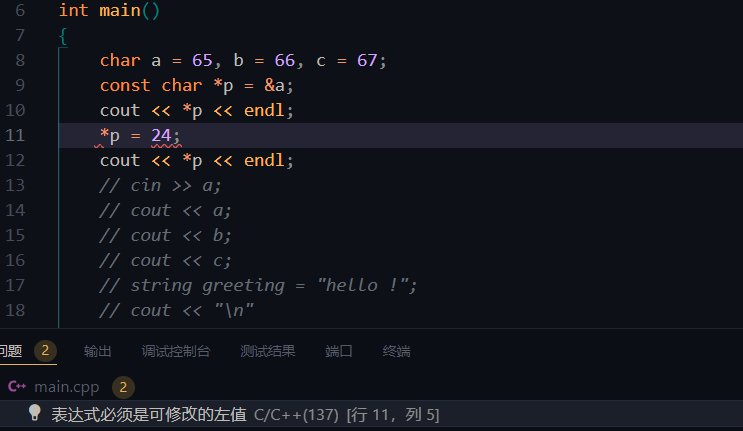

```cpp
 const int  *p = &a; / 常量指针
int * const p = &a; /指针常量
const int * const p = &a; /常量即修饰指针又修饰值
```

### 野指针

野指针（Wild Pointer）在C或C++编程语言中是一个未初始化的指针。它指向一个不确定的内存地址。使用野指针可能会导致不可预测的行为，包括程序崩溃和数据损坏。
以下是关于野指针的几个关键点：

1. 未初始化的指针：如果指针在声明后没有赋予一个具体的地址，它就是一个野指针。例如：
   int *p; // 此时p是一个野指针
2. 指向已释放内存的指针：如果一个指针曾经指向了一块动态分配的内存，而在调用free()或delete释放该内存后，指针没有被设置为nullptr，那么它也变成了野指针。例如：
   int *p = new int;
   delete p; // 正确释放内存，但p现在是野指针
3. 越界指针：如果一个指针指向数组中的一个元素，但在数组范围之外被解引用，它也可能成为一个野指针。

## 结构体

```cpp
struct S{
};

struct S a = { , , ,};
```

## 内存分配区域

* ***machine code：源码(机器码)，二进制代码，由操作系统管理。 共享、只读***
* *globals:全局变量和静态变量（static int a = 10;)  以及常量的存放。字符串常量，const修饰的全局变量*
* heap:堆，可分配的内存。malloc函数（C语言）或new函数（C++）申请所分配的内存。由程序员分配和释放。若程序不释放，由操作系统释放。
* stack:栈。 存储和使用带有变量和参数的函数时，***这一部分所使用的内存。由编译器自动分配和释放，不要返回局部变量的地址！！！！

### new 分配空间

```cpp
#include <iostream>
using namespace std;

int main()
{
	int *p = new int (10); //new关键字，可以分配数据到堆区，但是返回的是一个地址
	int *arr = new int [10]; //分配数组，用中括号。
	delete p; //释放堆区的数据，关键词delete 
	delete [] arr; //释放数组，要加上[],告诉他，释放的是一个连续的数组。
	return 0;
}

```

调用函数进行处理时，实际上是拷贝传入的参数然后操作自己所分配的内存，并未改变原始的存储数据。

 **采用地址的方式可以实质改变函数的值。**

同理，为什么scanf输入需要取地址符号。`scanf("%d",&n)`事实上就是通过传入地址的方式真实的修改这个值。

> 同时对于字符输入，我们很难确定用户有多少个字符，这个时候，就很容易出现用户的字符数超过我们所预设的内存空间，这个时候，就需要不断检查用户输入并为其分配内存空间。

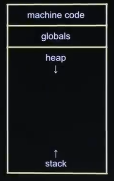

## 引用

引用的意义就是给变量一个新的名字。

本质： 引用的本质实现就是一个指针常量。

```cpp
int & ref = a;
//实质上，自动转换为 int * const ref = &a;因此指向地址不可以改，但是值可以修改。
ref = 100;
//内部会自动帮我们转换为 *ref = 100;

```

---

* 引用必须要初始化。
* 引用一旦初始化之后，就不可以更改。

```cpp
int b = 100;
int &a = b; // 数据类型 & 别名 = 原名；
cout << a << endl; //100
```

### 引用与函数

1. 利用引用可以形参修饰实参。

> 实质上，引用 &a 对变量去别名，修改的是原始的值，相比与地址传参，可以更加节省空间。

```cpp
void swap（int &a, int &b)
{
	int temp = a;
	a = b;
	b = temp;
}
```

2. 引用可以作为函数返回值，但是不要返回局部变量的引用。局部变量是栈区由编译器分配和释放，会出现错误。
3. 同时引用可以作为左值。

```cpp
int & swap（int &a, int &b)
{
	int temp = a;
	a = b;
	b = temp;
	return temp
}

int main(){
	int &ref2 = swap();//相当于取出函数返回值。
	swap() = 100;//可以做为左值存在，前提是，改数据是可以改动访问修改的。
}
```

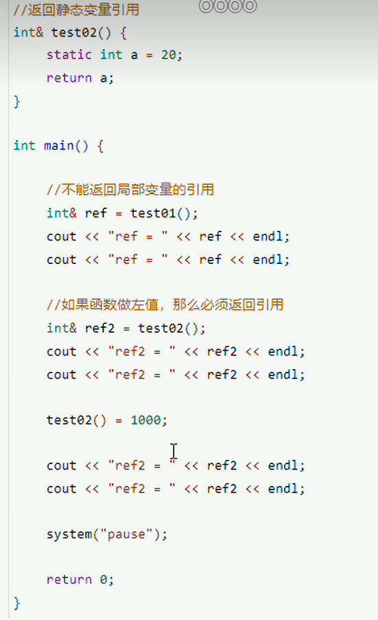

### 常量引用

const 修饰形参，防止误操作，改变实参。

```cpp
void shw(const int &std) //防止我们在函数中误修改该数据，防止出现错误。
{
	cout << "val = " << std << endl;
}
int main(){
	int a = 100;
	int &ref = 10 ;// 这种方式不合法，引用必须给一个合法的内存空间，常量不可以修改。
	const int &ref = 10;//变为只读数据，这种方式合法。实质上编译器将代码修改为 int temp = 10; const int &ref = temp;

}
```

## 类Class

> **封装、继承、多态。**

### 封装

* 属性和行为作为一个整体。
* 属性和行为加上权限控制。

> 类中的属性和行为，统称为**成员**
>
> 属性  ==   成员属性，成员变量。
>
> 行为  ==   成员函数，成员方法

```cpp

double Pi = 3.1415926;
//设计一个类，关键词class
class Circle
{
public:
    int M_r;
    double calculateZC()
    {
        return Pi * 2 * M_r;
    }

private:

protected:


};
int main()
{
    Circle C1;
    C1.M_r = 100;
    cout << C1.calculateZC() << endl;
```

#### 权限

1. public  	 公共权限                           		成员 类内可以访问，类外可以访问
2. protected  保护权限						成员 类内可以访问，类外不可以访问   	 	子类也可以访问父类的保护内容
3. private	 私有权限						成员 类内可以访问，类外不可以访问  	   	子类不可以访问父类的保护内容

---

> struct 和class 的区别，默认的访问权限不同。
>
> * struct 默认权限是公共权限
> * class 默认是私有权限

#### 成员属性私有化

1. 可以自己控制读写权限。
2. 对于写权限，可以检测数据的有效性。

> set 设置为可写，get设置为可读，控制二者的权限，实现属性的控制。

```cpp

class Person
{
public:
    void setName(string name)
    {
        m_Name = name;
    }

    string getName()
    {
        return m_Name;
    }

    void set_idol(string idol)
    {
        m_idol = idol;
    }

    void set_age(int age)
    {
        if (age < 0 || age > 150)
        {
            cout << "age error" << endl;
            cout << " set age is unseccessed !" << endl;
        }
        else
        {
            m_age = age;
            cout << "age have been changed! " << endl;
        }
    }

private:
    string m_Name;
    int m_age;
    string m_idol;
};
bool isSamePerson(Person &P1, Person &P2)
{
    if (P1.getName() == P2.getName())
    {
        return true;
    }
    else
    {
        return false;
    }
};

int main()
{
    Person P1;
    P1.setName("lisi");
    Person P2;
    P2.setName("lisis");
    cout << isSamePerson(P1, P2) << endl;
    cout << P1.getName() << endl;
    Circle C1;
    C1.M_r = 100;
    cout << C1.calculateZC(Pi) << endl;
    P1.set_age(180);
```

> 类也可分文件编写，同理将.h头文件中写成员属性和函数的声明，但是要指出属于公有还是私有；.cpp 源文件写函数的定义。
>
> #progma once 与下防止重复定义有相同的效果，因此可只用一个就可以了
>
> ```cpp
> #ifndef XXX_H
> #define XXX_H
> ....
> #endif
> ```

---

* [ ] Circle.h

```cpp
#include <string>
#include <stdio.h>
#include "Point.h"
using namespace std;

class Circle
{
public:
    int get_R();
    Point get_Point();
    void set_R(int r);
    void set_Point(Point P);

private:
    int C_r;
    Point C_Point;
};
```

* [ ] Point.h

```cpp
#include <string>
#include <stdio.h>
using namespace std;

class Point
{
public:
    void set_X(int x);

    void set_Y(int y);

    int get_X();

    int get_Y();

private:
    int m_x;
    int m_y;
};
```

* [ ] Circle.cpp

```cpp
#include "Circle.h"

int Circle::get_R()
{
    return C_r;
};
Point Circle::get_Point()
{
    return C_Point;
};
void Circle::set_Point(Point P)
{
    C_Point = P;
};
void Circle::set_R(int r)
{
    C_r = r;
};

```

* [ ] Point.cpp

```cpp
#include "Point.h"

void Point::set_X(int x)
{
    m_x = x;
};
void Point::set_Y(int y)
{
    m_y = y;
};
int Point::get_X()
{
    return m_x;
};
int Point::get_Y()
{
    return m_y;
};

```

* [ ] main.cpp

```cpp
#include <iostream>
#include <string>
#include <stdio.h>
#include "Circle.h"
#include "swap.h"
using namespace std;

bool IsSameCircleCenter(Circle &C1, Circle &C2)
{
    cout << C1.get_Point().get_X() << endl;
    cout << C1.get_Point().get_Y() << endl;
    cout << C2.get_Point().get_X() << endl;
    cout << C2.get_Point().get_Y() << endl;
    if ((C1.get_Point().get_X() == C2.get_Point().get_X()) && (C1.get_Point().get_Y() == C2.get_Point().get_Y()))
    {

        cout << "wqs" << endl;
        return 1;
    }
    else
    {
        cout << "tss" << endl;
        return 0;
    }
};

int main()
{

    Circle C1, C2;
    Point P1, P2;
    P1.set_X(10);
    P1.set_Y(10);
    P2.set_X(10);
    P2.set_Y(10);
    C1.set_Point(P1);
    C2.set_Point(P2);
    cout << IsSameCircleCenter(C1, C2) << endl;

    return 0;
}
```

### 构造函数和析构函数（对象的初始化和清理）

**出发点：面向对象编程，初始化的对象需要初始状态，保证其结果的有效性。同时一个用完的对象或是变量没有及时清理，会造成安全问题。**

**特点：构造函数和析构函数 编译器会自动调用，完成对对象的初始化和清理。**

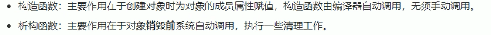

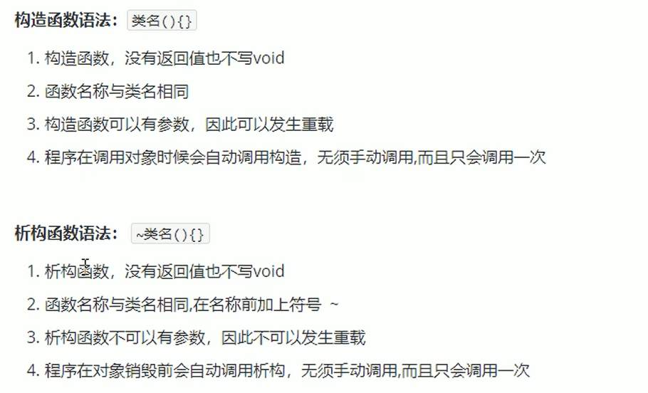

> 注意！ 是在公共作用域下起作用。编译器自动执行！
>
> 即使我们没有写构造和析构函数，编译器也会提供一个空实现的构造和析构函数

```cpp
class Person
{

public:
    Person()
    {
        cout << "Person ! gouzao " << endl;
    }
    ~Person()
    {
        cout << "Person ! xigou" << endl;
    }
  
private:
    string m_Name;
    int m_age;
    string m_idol;
};
int main()
{
    Person sp;
    cout << "main cpp" << endl;
    return 0;
}
```

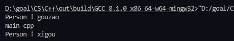

##### 普通构造与拷贝构造

拷贝构造使用场景：

* 使用一个已经创建完毕的对象来初始化一个新对象
* 值传递给函数参数传递值
* 值方式返回局部对象        ！！！！！！！！！！！！！！！分情况而定

```cpp
// 拷贝一个现成的对象。
void test1()
{
    Person P1(100);
    Person P2(P1);
};

// 函数在使用类作为传入参数时，会直接执行拷贝函数，进行拷贝
// 而我们使用 引用就不会触发拷贝。实质上只是一个指针常量，最好加上const 防止误操作
void test2(const Person &P) {

};

// 返回值是Person，是以值传递返回，为什么地址会相同，可能是因为下图C++11所示
Person test1()
{
    Person P1(100);

    return P1;
};
```

> // 返回值是Person，是以值传递返回，但是编译器现在返回值不会执行拷贝了。而是直接返回局部对象的地址和值，见下图

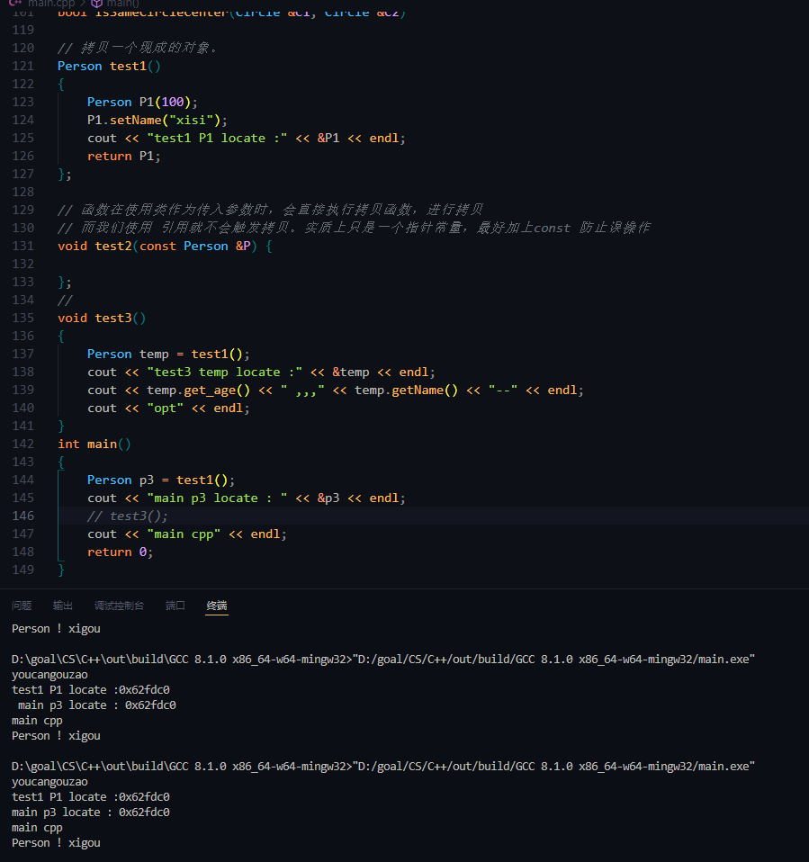

[关于C++函数返回值的使用方式以及局部对象何时析构的问题_c++ 怎么样局部变量不会析构-CSDN博客](https://blog.csdn.net/weixin_40390964/article/details/105450605)

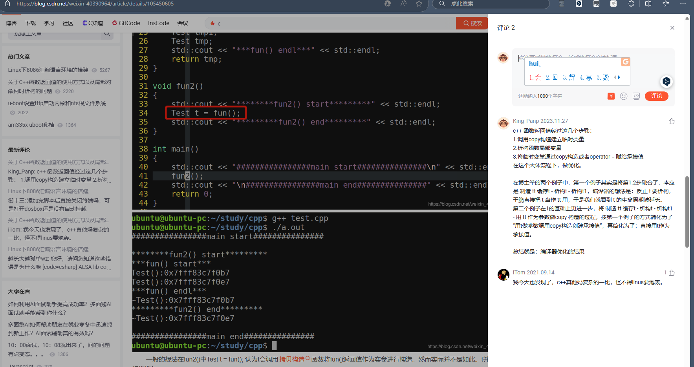

**可能是编译器优化过，return的对象没有在函数结束后被析构，而是隐式转换的形式将地址传递给对象。之所以说是“类似隐式转换的形式”是因为，真正的隐式转换是会创建一个有新地址的新对象的，这个只是老对象改名了。大家可以多套几个娃试试**

> 注意！！！ 调用默认构造函数，不要加“（）”。编译器会认为这是一个函数的声明，不会创建对象。

```cpp
class Person
{

public:
    // 无参数构造
    Person()
    {
        cout << "Person ! gouzao " << endl;
    }

    // 有参数构造
    Person(int age)
    {
        m_age = age;
        cout << "youcangouzao " << endl;
    }

    // 拷贝构造 这个引用&不能舍去。const是防止误操作修改原始的对象
    Person(const Person &P)
    {
        cout << "kaobei gouzao" << endl;
        m_age = P.m_age;
        m_Name = P.m_Name;
    }
    // 析构函数
    ~Person()
    {
        cout << "Person ! xigou" << endl;
    }
}

int main()
{
    // 调用默认构造函数，不要加“（）”。编译器会认为这是一个函数的声明，不会创建对象。
    //Person std();

    Person sp;
    sp.setName("xiaohua");

    // 拷贝构造
    Person P2(sp);           // option1
    Person P3 = Person(100); // option2      等号后面视为匿名对象，执行结束立即释放。
    Person P5 = 100;
    // Person(P2);              // 这个是使用拷贝构造初始化匿名对象，编译器内部Person(P2) = Person P2; 不合法，不能使用!!!!!!!!!
    cout << P2.getName() << "" << endl;

```

##### 构造函数调用规则

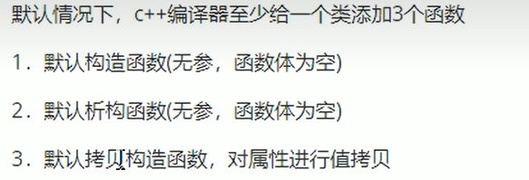

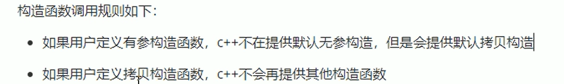

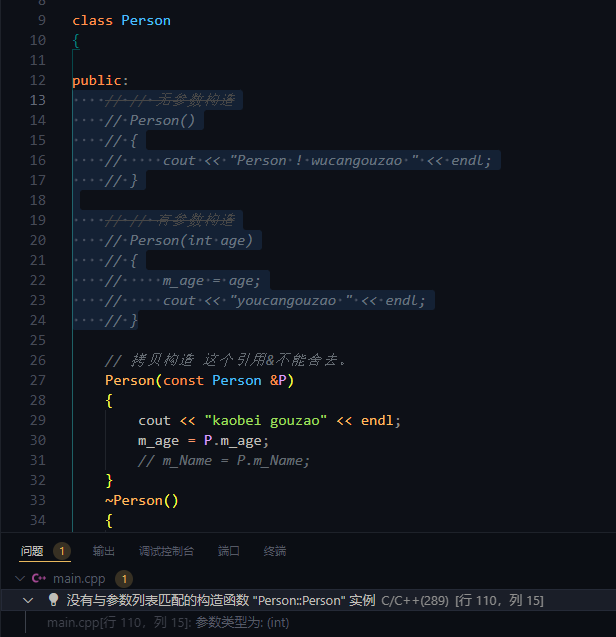

##### 深拷贝与浅拷贝

浅拷贝： 简单的赋值操作。编译器提供的是浅拷贝。

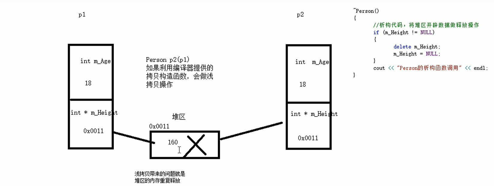

深拷贝： 为拷贝的数据赋值一块新的地址空间。防止两个指针指向同一个地点，导致指向同一个内存重复释放。

```cpp
 // 拷贝构造 这个引用&不能舍去。
    Person(const Person &P)
    {
        cout << "kaobei gouzao" << endl;
        m_age = P.m_age;
        m_Name = P.m_Name;
        // // 浅拷贝，只是将数据的地址赋值过去，因此二者指向的同一个内存块，另一个类释放后，再去释放就会中断。
        // m_height = P.m_height;
        // 深拷贝，先为其分配一篇地址空间存储数据，然后在将分配的地址赋值给height
        m_height = new int(*P.m_height);
    }

// 这里我们在给其初始化值的时候，也需要相应的为其分配一块内存。
    void set_height(int hei)
    {
	//m_height = &hei; //这是错误的，int hei只是在栈区生成的局部变量，用完就会释放，因此，他无法保留有效的数据地址，我们正确的是给其分配一块合法的堆区内存空间。
        m_height = new int(hei);
    }


```

##### 构造函数初始化列表

作用： 初始化对象属性

> 实质上和有参数构造函数效果一样，只是简化的语法方式。

```cpp
class Person
{

public:
    // 无参数构造
    Person()
    {
        cout << "Person ! wucangouzao " << endl;
    }

    // 有参数构造
    Person(int age)
    {
        m_age = age;
        cout << "youcangouzao " << endl;
    }

    // 初始化列表方式，初始化属性 。。这里多加入一个参数，函数重载，防止出现二异性，会出现错误
    Person(int age, int ab) : m_age(age) {}
private：
	int m_age;
}
```

#### 类对象作为类成员

当其他类对象作为本类成员时，构造时候先构造类对象，再构造本类自身。

析构的顺序刚好相反，先进行析构本类自身，在进行析构作为成员的类对象。

```cpp
class Person
{
public:
    // 无参数构造
    Person()
    {
        cout << "           wucangouzao Person " << endl;
    }

    // 有参数构造 //这是对于Person的初始化，缺少对于指针m_height 的初始化，因此他是一个野指针，会出错
    // 避免出现这种情况，指针设置一定要初始化！！！！！！！！！！！！！！！！！！！！！！！！！！！！！！！！！！！！！！！！
    Person(int age, Point temp)
    {
        m_age = age;
        m_point = temp;
        cout << "           youcangouzao Person " << endl;
    }
}

void tsd()
{
    Point temp;
    temp.set_X(100);
    temp.set_Y(89);
    Person P1(100, temp, 97);
    cout << "ending " << endl;
}

int main(){
	tsd();
	return 0
}
```

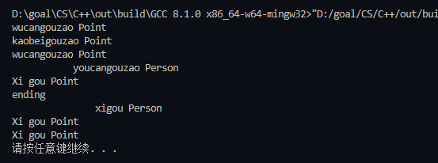

1. 第一条，无参构造，是初始化temp 点。
2. 第二条，拷贝构造，是执行Person P1(100,temp,97)的时候，类内进行有参构造函数，需要拷贝temp，放在堆区。
3. 第三条，无参构造，是对P1的成员m_point进行初始化自动执行的为其分配位置，而后才利用Person P1(100,temp,97)将值给m_point;
4. 第四条，有参构造 Person，条件齐全，成员空间已经分配好，进行构造
5. 第五条 ，析构 Point 是对拷贝的temp进行析构，堆区。
6. 第六条 ，打印ending
7. 第七条，析构Person，先进后出，后出先进，person是最后构造的所以最先出去。
8. 第八条，析构 无参数构造的Person 内部的m_point 成员
9. 第九条，析构temp。

#### 静态成员

加关键字static ，称为静态成员。

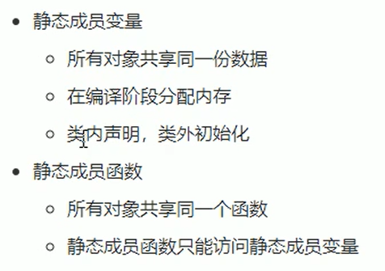

---

静态成员变量和静态成员函数

```cpp
class Person2
{
public:
    static int P_m; //静态成员变量
    static void test() // 静态成员函数
    {
        cout << "static void test function " << endl;
        P_p = 100;
        P_m = 300;
        test2(); // void test2()私有成员函数，只能通过类内进行访问 .static void test2()静态成员函数可以操作
        // sdm = 100; // 非静态成员使用，必须通过对象使用。静态成员函数只能操作静态成员属性。编译器无法区分该属性属于那个对象。所以不允许
    }

private:
    static void test2()  //静态成员函数
    {
        cout << "static void test2 function" << endl;
    }
    static int P_p;
    int sdm;
};

// 静态成员在编译时就已经分配内存到全局区，因此需要事先声明
int Person2::P_m = 100;
int Person2::P_p = 500;

int main()
{

    Person2 P1;
    cout << P1.P_m << endl; // 100
    Person2 P2;
    P2.P_m = 200;
    cout << P1.P_m << endl; // 200
    // P1.P_m变化是因为，静态成员共享静态属性，因此任一方的修改都会影响他。
    cout << Person2::P_m << endl; // 静态成员也可以通过类名进行访问
                                  //

    // 静态成员函数，调用方法，每一个对象都可以使用，包括使用类名也可以调用
    P1.test();
    P2.test();
    Person2::test();

    // P1.test2();  //私有成员函数，无法在类外进行访问。类内可以操作
    cout << "---------------------------------------------------ending";
    //  system("pause");
    // cout << P1.P_p << endl; // 私有静态属性，无法访问
    return 0;
}
```

---

### 对象模型和this指针

#### 成员变量和成员函数分开存储

> 类内的成员变量和成员函数分开存储。只有非静态成员变量才属于类的对象。

1. 静态成员属性（变量）位于全局区，不属于类的对象上。
2. 非静态成员属性（变量）属于类的对象上。
3. 非静态成员函数 不属于类的对象上。
4. 静态成员函数 不属于类的对象上。

```cpp
int Person2::P_m = 100;
// int Person2::P_p = 500;

int main()
{

    Person2 P1, P2;
    // 空对象，没有属性占用内存空间是1个字节.
    // C++ 编译器会给每个空对象分配一个字节空间，区分空对象占内存的位置.
    // 而当类有成员如int ，会根据成员去分配4个字节的空间
    cout << "Empty class memory = " << sizeof(P1) << endl; // Empty class memory = 1 根据类内属性调整

    // cout << &P1 << "   " << &P2 << endl;
    cout << "Person2.P_m locate =  " << &P1.P_m << endl; // 静态成员 地址为0x404018 ，不属于对象
    cout << "P1.stds locate = " << &P1.stds << endl;     // 非静态成员，地址0x62fe18 ，和对象绑定一起

    // P1.test2();  //私有成员函数，无法在类外进行访问。类内可以操作
    cout << "---------------------------------------------------ending";
    //  system("pause");
    // cout << P1.P_p << endl; // 私有静态属性，无法访问
    return 0;
}


```

#### this 指针

> this指针实质上是一个指针常量，指向的地址不可以修改，每次自动指向所在的对象
>
> this 定义 ： classname * const this;

- 每一个非静态成员函数只有一份函数实例，同类型的对象共用同一个代码。
- C++内部的this指针，this指针指向被调用的成员函数的所属的对象。
- this指针不需要定义，直接使用。

1. 通过this指针，区分形参和成员变量。

错误案例：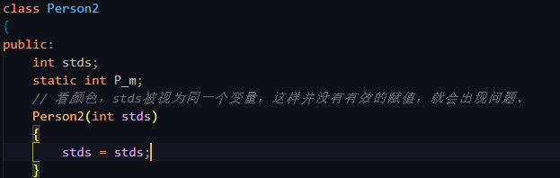

正确做法：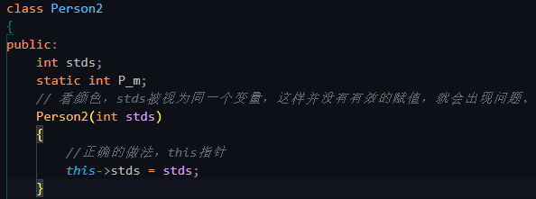和Python中的self.xxx = xxx一个道理

2. *this 用于指向本地对象，但是注意其变化。 链式

```cpp
class Person2
{
public:
    int stds;
    static int P_m;
    Person2()
    {
        cout << "wucangouzao" << endl;
    }
    Person2(const Person2 &temp)
    {
        stds = temp.stds;
        cout << "kaobei gouzao" << endl;
    }
    // 函数以值传递返回时，会拷贝一个person2对象
    // 函数返回值传递是以拷贝函数返回一个匿名对象，所以需要&，否则后面链式调用会出错。！！！！！！！！！！！！！
    Person2 &tes(Person2 &Ps)
    {
        cout << "tes this ptr = " << this << endl; // 如果不加引用，可以观察到，this指针的值一直在发生变化
        this->stds = Ps.stds + stds;
        // 等同于 stds = Ps.stds+stds

        return *this;
    }
};

int main()
{
    Person2 temp, t2;
    temp.stds = 10;
    t2.stds = 10;
    temp.tes(t2).tes(t2);      // 链式
    cout << temp.stds << endl; // 30
    return 0;
}
```

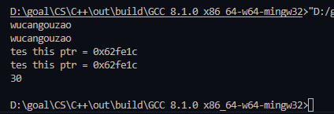

> 评论： 试试我这个方法，在return *this之前加一句cout <<this <<endl;可以发现this指向的地址一直在变化。

#### 空指针访问成员函数

！！空指针可以调用成员函数，但是留意this 指针是否为空，为空，说明该对象不存在，就不能进行访问。做检验！！！

```cpp
class test
{
public:
    int std;
    static int sts;
    void show()
    {
        cout << this << endl;
        cout << " hello world " << endl;
    }
    void showtime()
    {
        // 提前进行判断，该实体的指针是否为空，否则直接退出
        if (this == NULL)
        {
            return;
        }
        cout << "show std " << std << endl;
    }
    static void show_static()
    {
        cout << "static hello world " << endl;
    }
    static void showtime_static()
    {
        cout << "static show sts :  " << sts << endl;
    }
};
int test::sts = 100;
// int Person2::P_p = 500;

int main()
{
    // 初始化一个空指针，一定要设置为空，否则野指针越界访问
    test *p = NULL;
    // test temp;
    // temp.std = 111;
    // p = &temp;
    // 空指针，对于静态属性和静态函数，可以执行和访问，因为他们是事先在全局区进行分配，有预先设定的值
    p->show_static();
    p->showtime_static();
    // 空指针访问 ，因为不涉及实体类的成员属性，可以正常运行
    p->show();
    // 涉及真实成员属性，但是没有实体对象同时没有this指针的判断，会崩溃。
    p->showtime();

    return 0;
}
```

#### 常函数与常对象

> this指针实质上是一个指针常量，指向的地址不可以修改，每次自动指向所在的对象
>
> this 定义 ： classname * const this;

常函数：

1. 成员函数后加const 关键字，作为常函数
2. 常函数不可以修改成员属性，**可以修改静态成员属性**
3. 想要常函数修改成员属性，需要给属性加上mutable关键字才可以修改

常对象：

1. 声明对象前加const 关键字
2. 常对象只能调用常函数

```cpp
class test
{
public:
    int std;
    static int sts;    //
    mutable int m_spi; // mutable 关键字是相当于特殊属性，这个属性可以被常函数所操作
    void show()
    {
    }

    // this指针是指针常量 指针的指向不可以修改   test * const this;
    //  相当于                           const test * const this;
    //  现在我们将其改变，使其不能对成员属性修改，因此，就相当于再使用 const 修饰this指针指向的值，但是加在函数名之后。
    void change_std() const
    {

        // std = 100; // std是非成员属性，常函数不可以修改
        sts = 9; // sts是静态成员属性，常函数可以修改
        m_spi = 110;
        cout << "change_std" << endl;
    }
    static void show_static()
    {
        cout << "static hello world " << endl;
    }
    static void showtime_static()
    {
        cout << "static show sts :  " << sts << endl;
    }
};

int test::sts = 100;
void test2(test temp)
{
    const test P(temp); // 常对象，需要初始化预设值,否则出现错误
    P.change_std();
    // P.show(); // 同时，常对象，只能调用常函数，无法调用其他成员函数
    // P.std = 100;  // 常对象的值，无法直接操作去修改
};
int main()
{
    // 初始化一个空指针，一定要设置为空，否则野指针越界访问
    test *p = NULL;
    test temp;
    temp.std = 111;
    p = &temp;
    // 空指针，对于静态属性和静态函数，可以执行和访问，因为他们是事先在全局区进行分配，有预先设定的值
    p->show_static();
    p->change_std();
    p->showtime_static();
    test2(temp);

    return 0;
}
```

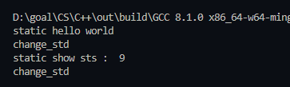

### 友元

友元让一个函数或是类访问另一个类内的私有属性。

使得私有属性不局限于类内访问。

> friend 关键字

#### 全局函数做友元

```cpp
class friends_test
{
    // 对于函数tst() ,我们在此处声明，他是 类friends_test 的友元，有了权限访问私有属性
    // 测试知道，这个声明，放在public或是private下均有效果
    friend void tst();

public:
    // 有参构造函数
    friends_test(string m_fr, string m_p_fr) : m_fr(m_fr), m_p_fr(m_p_fr) {}

    string m_fr;

private:
    string m_p_fr;
};

void tst()
{
    friends_test Xiaohua("xiaohua_fr", "xiaohua_p_fr");
    cout << "Xiaohua_fr = " << Xiaohua.m_fr << endl;
    // tst 不作为友元时，无法访问 Xiaohua的私有属性m_p_fr ,会出现错误，但是，我们在
    cout << "Xiaohua_p_fr = " << Xiaohua.m_p_fr << endl;
};

int main()
{
    tst();
    return 0;
}
```

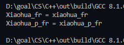

#### 类做友元

```cpp
class yourfriend; //声明

class friends_test
{
    // 告诉friends_test类， yourfriend 是友元，于是yourfriend就有了权限去访问私有属性。
    // 但是作为友元类，yourfriend也只能在类内去访问，friends_test的私有属性
    friend class yourfriend;
    // 对于函数tst() ,我们在此处声明，他是 类friends_test 的友元，有了权限访问私有属性
    // 测试知道，这个声明，放在public或是private下均有效果
    friend friends_test tst();
public:
    // 有参构造函数
    friends_test(string m_fr, string m_p_fr) : m_fr(m_fr), m_p_fr(m_p_fr) {}
    string m_fr;
private:
    string m_p_fr;
};
//友商
class yourfriend
{
private:
    string m_name;

public:
    friends_test m_fr;
    // 构造函数
    yourfriend(string m_name, friends_test temp_fr) : m_name(m_name), m_fr(temp_fr) {};
    ~yourfriend();
    void visit_friend();
};

// 类外定义析构函数
yourfriend::~yourfriend()
{
}
// 类外定义类内函数
void yourfriend::visit_friend()
{
    // 类嵌套另一个类，但是我们只能访问公有属性
    cout << "visit friend public fr = " << this->m_fr.m_fr << endl;
    // m_fr是我的一个公有属性，但是friend_test的m_p_fr是私有属性，一旦我们使用友元，便有权限去访问该私有属性
    cout << "visit friend private p_fr = " << m_fr.m_p_fr << endl;
}

friends_test tst()
{
    friends_test Xiaohua("xiaohua_fr", "xiaohua_p_fr");
    cout << "Xiaohua_fr public = " << Xiaohua.m_fr << endl;
    // tst 不作为友元时，无法访问 Xiaohua的私有属性m_p_fr ,会出现错误，但是，我们在
    cout << "Xiaohua_p_fr  private = " << Xiaohua.m_p_fr << endl; //<< endl;
    return Xiaohua;
};

int main()
{
    friends_test Xiaohua = tst();
    yourfriend Lisi("LiSi", Xiaohua);
    // 友元在类外也只能访问公有属性，m_p_fr 作为私有属性，无法访问，所以这行代码会出错
    //  Lisi.m_fr.m_p_fr;
    Lisi.visit_friend();
    return 0;
}
```

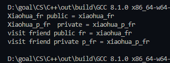

#### 成员函数做友元

```cpp
#include <iostream>
#include <string>
#include <stdio.h>
using namespace std;
double Pi = 3.1415926;

class Building;

class gay
{
public:
//这里为什么要用指针，而不能用变量，会出错该类为提前声明大小。！！！！！！！！！！解释见下图
    Building *friend_build;
    string name;
    gay();
    void visit();
};

class Building
{
// 关键，成员函数做友元
    void friend gay::visit();

public:
    string sitingroom;
    Building();

private:
    string bedroom;
};

Building::Building()
{
    sitingroom = "keting";
    bedroom = "friends";
}
gay::gay()
{
    name = "xiaohua";
    friend_build = new Building;
}
void gay::visit()
{
    cout << friend_build->sitingroom << endl;
    cout << friend_build->bedroom << endl;
}

void test1()
{
    gay gg;
    gg.visit();
}

int main()
{
    test1();
    return 0;
}
```

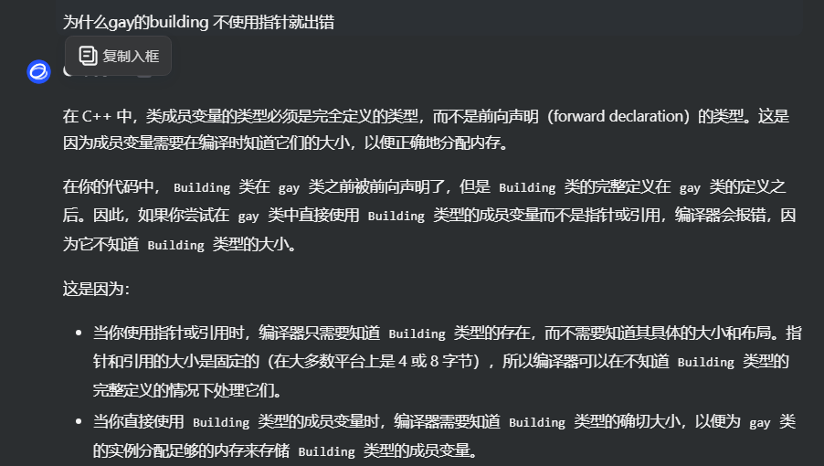

> 在 C++ 中，类成员变量的类型必须是完全定义的类型，而不是前向声明（forward declaration）的类型。这是因为成员变量需要在编译时知道它们的大小，以便正确地分配内存。
>
> 在你的代码中，`Building` 类在 `gay` 类之前被前向声明了，但是 `Building` 类的完整定义在 `gay` 类的定义之后。因此，如果你尝试在 `gay` 类中直接使用 `Building` 类型的成员变量而不是指针或引用，编译器会报错，因为它不知道 `Building` 类型的大小。
>
> 这是因为：
>
> * 当你使用指针或引用时，编译器只需要知道 `Building` 类型的存在，而不需要知道其具体的大小和布局。指针和引用的大小是固定的（在大多数平台上是 4 或 8 字节），所以编译器可以在不知道 `Building` 类型的完整定义的情况下处理它们。
> * 当你直接使用 `Building` 类型的成员变量时，编译器需要知道 `Building` 类型的确切大小，以便为 `gay` 类的实例分配足够的内存来存储 `Building` 类型的成员变量。

### 运算符重载

概念： 对已有的运算符进行定义，赋予一种新的功能，能够做其他数据类型的运算。

> operator

1. 运算符重载只能针对我们自己定义的数据类型，对于已经存在的int 、float 运算重载不可以进行
2. 运算符重载注意他的合理性。可以将+法重载为-法，避免恶意或是错误使用。

#### 加法重载

```cpp
#include <iostream>
#include <string>
#include <stdio.h>
#include <string.h>
using namespace std;
double Pi = 3.1415926;

class Place
{
private:
public:
    int weidu;
    int jingdu;
    string name;
    Place(string name, int weidu, int jingdu);
    Place();
    Place(const Place &temP);
    ~Place();
    void PlaceShow();
    Place operator+(Place &temp);
};
Place ::Place(string name, int weidu, int jingdu)
{
    this->name = name;
    this->jingdu = jingdu;
    this->weidu = weidu;
    cout << "Place Youcan gouzao" << endl;
}
Place::Place()
{
    cout << "Place wucan init" << endl;
}
Place::~Place()
{
    cout << "Place XiGou " << endl;
}
Place::Place(const Place &temP)
{
    this->jingdu = temP.jingdu;
    this->weidu = temP.weidu;
    this->name = temP.name;
    cout << "Place KaoBeigouzao" << endl;
}
void Place::PlaceShow()
{
    cout << "This Place name: " << name << endl;
    cout << "This Place Jingdu: " << jingdu << endl;
    cout << "This Place Weidu: " << weidu << endl;
    cout << "--------------------------------------------------------------------" << endl;
}
// 加法运算符重载，可以定义在函数内，也可定义在函数外
Place Place::operator+(Place &temp)
{
    Place tempP;
    tempP.jingdu = this->jingdu + temp.jingdu;
    tempP.weidu = this->weidu + temp.weidu;
    return tempP;
}
// 定义在全局函数重载，无法操作私有属性，这个是需要注意的地方，最好还是定义在类内，私有属性也可以访问
// Place operator+(Place &temp, Place &temp2)
// {
//     Place tempP;
//     tempP.jingdu = temp2.jingdu + temp.jingdu;
//     tempP.weidu = temp2.weidu + temp.weidu;
//     return tempP;
// };
void test1()
{

    Place P1("Nanjing", 128, 128);
    Place P2("BeiJing", 100, 100);

    // 实质上编译器内部仍然是调用函数，只是重载加法后，编译器会判断传入的数据，自动进行函数运算
    // Place P3 = operator+(P1, P2);
    // Place P3 = P1.operator+(P2); //定义在类内重载时候的原始状态
    Place P3 = P1 + P2;
    P1.PlaceShow();
    P2.PlaceShow();
    P3.PlaceShow();
};
int main()
{
    test1();
    return 0;
}
```

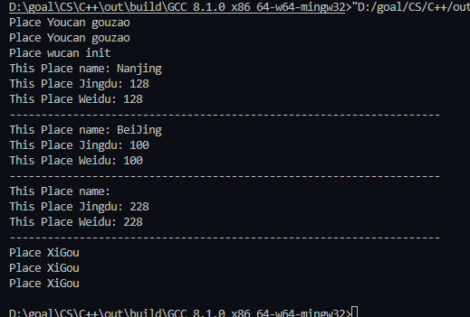

#### 左移重载

> << 左移运算符，常见就是与cout搭配使用。而cout 是标准输出函数，实质上也是一个类（变量）。
>
> 而左移重载的作用：打印我们自定义的数据类型.同时对于类内私有属性，通过友元的方式访问

```cpp
#include <iostream>
#include <string>
#include <stdio.h>
#include <string.h>
using namespace std;
double Pi = 3.1415926;

class Place
{
    friend ostream &operator<<(ostream &cout, Place &P); //友元进行声明

private:
    int P_weidu;
    int p_jingdu;

public:
    int weidu;
    int jingdu;
    int *ptr;
    string name;
    Place(string name, int weidu, int jingdu);
    Place();
    Place(const Place &temP);
    ~Place();
    void PlaceShow();
    Place operator+(Place &temp);
};
Place ::Place(string name, int weidu, int jingdu)
{
    this->name = name;
    this->jingdu = jingdu;
    this->weidu = weidu;
    this->ptr = new int;
    cout << "Place Youcan gouzao" << endl;
}
Place::Place()
{
    this->ptr = new int;
    cout << "Place wucan init" << endl;
}
Place::Place(const Place &temP)
{
    this->jingdu = temP.jingdu;
    this->weidu = temP.weidu;
    this->name = temP.name;
    this->ptr = new int(*temP.ptr);
    cout << "Place KaoBeigouzao" << endl;
}
Place::~Place()
{
    if (this->ptr != NULL)
    {
        cout << "Place  release      ";
        delete (this->ptr);
    }
    else
    {
        cout << "Place XiGou-- " << endl;
    }
}

void Place::PlaceShow()
{
    cout << "This Place name: " << name << endl;
    cout << "This Place Jingdu: " << jingdu << endl;
    cout << "This Place Weidu: " << weidu << endl;
    cout << "This Place ptr: " << *ptr << endl;

    cout << "--------------------------------------------------------------------" << endl;
}
// 加法运算符重载，可以定义在函数内，也可定义在函数外
Place Place::operator+(Place &temp)
{
    Place tempP;
    tempP.jingdu = this->jingdu + temp.jingdu;
    tempP.weidu = this->weidu + temp.weidu;
    *tempP.ptr = *temp.ptr + *this->ptr;

    return tempP;
}
// 定义在全局函数重载，无法操作私有属性，这个是需要注意的地方，最好还是定义在类内，私有属性也可以访问
// Place operator+(Place &temp, Place &temp2)
// {
//     Place tempP;
//     tempP.jingdu = temp2.jingdu + temp.jingdu;
//     tempP.weidu = temp2.weidu + temp.weidu;
//     return tempP;
// };

// cout 标准输出流，其是ostream 类，并且只能有一个，所以& ，
// 同时为什么返回要ostream & ,是为了迎合链式法则，否则cout << xx <<endl会出错。
ostream &operator<<(ostream &cout, Place &P)
{
    cout << "This Place name: " << P.name << endl;
    cout << "This Place Jingdu: " << P.jingdu << endl;
    cout << "This Place Weidu: " << P.weidu << endl;
    cout << "This Place ptr: " << *P.ptr << endl;
    cout << "This Place private p_weidu: " << P.P_weidu << endl; //私有属性，这里友元定义了
    cout << "This Place private p_jingdu: " << P.p_jingdu << endl; // 私有属性
    cout << "--------------------------------------------------------------------" << endl;
    return cout;
};

void test2()
{

    int t2 = 100, t1 = 110;
    Place P1("Nanjing", 128, 128);
    Place P2("BeiJing", 100, 100);
    Place P3 = P1 + P2;
    cout << P1;
    // cout << P1;
};

int main()
{
    test2();
    return 0;
}
```

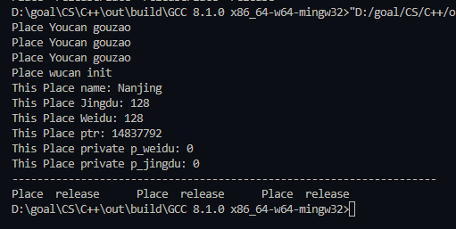

> 运算符<< 就相当于符号左右两个类（或是数据类型),编译器自动帮我们操作类和类之间的操作，cout<< "xx" <endl；就是链式的输出字符
>
> 而我们重载<< 就同样需要我们给他指定两个类，告诉编译器我们还可以用那些数据类型进行相似的操作。因此如果作为类内成员函数会出错，需要以友元形式作为全局函数。

#### 递增递减运算符重载

##### 前后置递增与递减运算符

(只适用于整形数据和字符char类型)

```cpp
//前置和后置递增递减符号的区别
void test1()
{
    int ts = 1;
    cout << "qianzhidizeng:" << endl;
    cout << ++ts << endl; // 2
    cout << ts << endl;   // 2
    int ts2 = 1;
    cout << "houzhidizeng: " << endl;
    cout << ts2++ << endl; // 1
    cout << ts2 << endl;   // 2
};

void test2()
{
    int ts = 1;
    cout << "qianzhidijian:" << endl;
    cout << --ts << endl; // 0
    cout << ts << endl;   // 0
    int ts2 = 1;
    cout << "houzhidijian: " << endl;
    cout << ts2-- << endl; // 1
    cout << ts2 << endl;   // 0
}
```

##### 递增与与递减运算符重载

```cpp
class Music
{
    friend ostream &operator<<(ostream &cout, const Music &M);

private:
    int M_ID;
    string M_name;
    string M_Singer;
    int M_hot;

public:
    Music(int M_ID, string M_name, string M_Singer, int M_hot);
    Music(const Music &tempM);
    ~Music();
    // 重载 前置递增运算符
    Music &operator++();
    // 函数重载不能进依赖返回值，要求同一个作用域并且有函数名或是传入参数的差异，因此这里使用占位符int，告诉编译器他俩不同
    Music operator++(int);
    // 重载 前置递减运算符
    Music &operator--();
    // 函数重载不能进依赖返回值，要求同一个作用域并且有函数名或是传入参数的差异，因此这里使用占位符int，告诉编译器他俩不同
    Music operator--(int);
};

Music::Music(int M_ID, string M_name, string M_Singer, int M_hot)
{
    this->M_ID = M_ID;
    this->M_name = M_name;
    this->M_Singer = M_Singer;
    this->M_hot = M_hot;
    cout << "Gouzao coef One Music" << endl;
}

Music::~Music()
{
    cout << "Xigou one Music !" << endl;
}
Music::Music(const Music &tempM)
{
    this->M_ID = tempM.M_ID;
    this->M_name = tempM.M_name;
    this->M_Singer = tempM.M_Singer;
    this->M_hot = tempM.M_hot;
    cout << "Gouzao copy One Music" << endl;
}

ostream &operator<<(ostream &cout, const Music &M)
{
    cout << M.M_name << ":" << endl;
    cout << " ID:       " << M.M_ID << endl;
    cout << " Singer:   " << M.M_Singer << endl;
    cout << " Hot:      " << M.M_hot << endl;
    cout << "----------------------------------------------------------------------------" << endl;
    return cout;
}
// 递增运算符的重载，返回引用也是为了链式操作的有效性，否则将返回局部变量
Music &Music::operator++()
{
    this->M_ID++;
    this->M_hot++;
    return *this;
}
// 函数重载不能进依赖返回值，要求同一个作用域并且有函数名或是传入参数的差异，因此这里使用占位符int，告诉编译器他俩不同
Music Music::operator++(int)
{
    Music temp = *this;
    this->M_ID++;
    this->M_hot++;
    return temp;
}

// 递减运算符的重载，返回引用也是为了链式操作的有效性，否则将返回局部变量
Music &Music::operator--()
{
    this->M_ID--;
    this->M_hot--;
    return *this;
}
// 函数重载不能进依赖返回值，要求同一个作用域并且有函数名或是传入参数的差异，因此这里使用占位符int，告诉编译器他俩不同
Music Music::operator--(int)
{
    Music temp = *this;
    this->M_ID--;
    this->M_hot--;
    return temp;
}
void test3()
{
    Music M(0, "ZaiJian", "Xiaohua", 1000);
    cout << M++;  // 0,1000
    cout << M;    // 1,1001
    Music M2 = M; // 1,1001
    cout << ++M2; // 2,1002
    cout << M2;   // 2,1002
}
void test4()
{
    Music M(100, "LiBai", "XiaoMing", 1000);
    cout << M--;  // 100,1000
    cout << M;    // 99,999
    Music M2 = M; // 99,999
    cout << --M2; // 98,998
    cout << M2;   // 98,998
}

int main()
{
    test4();

    // system("pause");
    return 0;
}
```

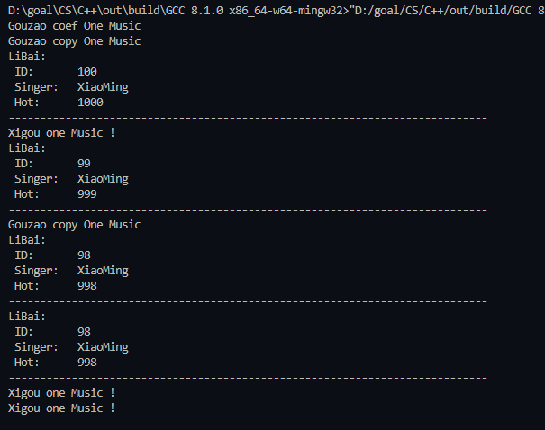

#### 赋值运算符重载

##### 编译器对类的初始化

1. 默认无参数构造函数
2. 默认析构函数
3. 默认拷贝构造函数（值拷贝）
4. 赋值运算符operator=，对属性进行值拷贝

（classname A,B; A=B//这个时候就是调用编译器生成的默认赋值运算，对于内部赋值运算是没有针对该类的，但是顺利执行，就是编译器所构造的默认复制运算符重载）

```cpp
#include <iostream>
#include <string>
#include <stdio.h>
#include <string.h>
using namespace std;
double Pi = 3.1415926;

class GTR
{
private:
    int *m_years;

public:
    void print();
    GTR();
    GTR(int years);
    GTR &operator=(const GTR &G);
    ~GTR();
};

void GTR::print()
{
    cout << "Years ptr:  " << this->m_years << endl;
    cout << "Years num:  " << *this->m_years << endl;
    cout << "-----------------------------------------" << endl;
}
GTR::GTR()
{
    this->m_years = new int(0);
    cout << "Gouzao NULL" << endl;
}
GTR::GTR(int years)
{
    this->m_years = new int(years);
    cout << "Gouzao coef " << endl;
}

GTR::~GTR()
{
    if (this->m_years != NULL)
    {
        delete this->m_years;
        this->m_years = NULL;
        cout << "Xigou Release " << endl;
    }
    else
    {
        cout << " error " << endl;
    }
}
GTR &GTR::operator=(const GTR &G)
{
    // idea1 我们初始化已经分配空间了，只是值存储的不一样，我更新一下位置的值就可以.实践结果合理
    // 但是要考虑一件事情，如果这个是一个数组，并且和原始的要赋值的数组长度不一样就会崩溃，所以他只能局限于单个数据存储
    //----------------------------------------------------------------------------------------------------------------------
    // *this->m_years = *G.m_years;

    // test1()

    // Gouzao coef
    // Gouzao coef
    // Years ptr:  0xf27dd0
    // Years num:  100
    // -----------------------------------------
    // Years ptr:  0xf27df0
    // Years num:  200
    // -----------------------------------------
    // Years ptr:  0xf27dd0
    // Years num:  200
    // -----------------------------------------
    // Years ptr:  0xf27df0
    // Years num:  200
    // -----------------------------------------
    // Xigou Release
    // Xigou Release

    // idea2 我们可以释放原先的地址，然后重新申请并给其分配值并检验他是否有空间可用
    //----------------------------------------------------------------------------------------------------------------------
    if (this->m_years != NULL)
    {
        cout << "res" << endl;
        delete this->m_years;
        this->m_years = NULL;
    }
    this->m_years = new int(*G.m_years);
    return *this; // 满足链式调用的需求，需要返回原始值
    // test1()

    //  Gouzao coef
    //  Gouzao coef
    //  Years ptr:  0x767dd0
    //  Years num:  100
    //  -----------------------------------------
    //  Years ptr:  0x767df0
    //  Years num:  200
    //  -----------------------------------------
    //  res
    //  Years ptr:  0x767dd0
    //  Years num:  200
    //  -----------------------------------------
    //  Years ptr:  0x767df0
    //  Years num:  200
    //  -----------------------------------------
    //  Xigou Release
    //  Xigou Release
}
void test2()
{
    GTR g1(100), g2(200), g3;
    g1.print();
    g2.print();
    g3.print();
    g3 = g1 = g2; //
    g1.print();
    g2.print();
    g3.print();

    // Gouzao coef
    // Gouzao coef
    // Gouzao NULL
    // Years ptr:  0x787dd0
    // Years num:  100
    // -----------------------------------------
    // Years ptr:  0x787df0
    // Years num:  200
    // -----------------------------------------
    // Years ptr:  0x787e10
    // Years num:  0
    // -----------------------------------------
    // res
    // res
    // Years ptr:  0x787dd0
    // Years num:  200
    // -----------------------------------------
    // Years ptr:  0x787df0
    // Years num:  200
    // -----------------------------------------
    // Years ptr:  0x787e10
    // Years num:  200
    // -----------------------------------------
    // Xigou Release
    // Xigou Release
    // Xigou Release
};
void test1()
{
    GTR g1(100), g2;
    g1.print();
    g2.print();
    g1 = g2; // 编译器给我们重载的类赋值函数，但是简单的值拷贝，所以出现下指向同一个地址，导致最后释放失败的问题
    g1.print();
    g2.print();

    // Gouzao coef
    // Gouzao NULL
    // Years ptr:  0x6c7dd0
    // Years num:  100
    // -----------------------------------------
    // Years ptr:  0x6c7df0
    // Years num:  0
    // -----------------------------------------
    // Years ptr:  0x6c7df0
    // Years num:  0
    // -----------------------------------------
    // Years ptr:  0x6c7df0
    // Years num:  0
    // -----------------------------------------
    // Xigou Release
}

int main()
{
    test2();
    // system("pause");
    return 0;
}
```

#### 关系运算符重载

```cpp
//判断相等的关系运算符重载
bool GTR::operator==(const GTR &G)
{
    if (*this->m_years == *G.m_years)
    {
        return true;
    }
    else
    {
        return false;
    }
}
//判断不相等的关系运算符重载
bool GTR::operator!=(const GTR &G)
{
    if (*this->m_years == *G.m_years)
    {
        return false;
    }
    else
    {
        return true;
    }
}
```

#### 函数调用运算符（）重载

1. 函数调用运算符（）也可以重载
2. 重载后的函数调用运算符像函数的调用，我们称之为仿函数
3. 仿函数没有固定写法，灵活使用

> 匿名函数对象
>
> classname() // 这是匿名对象，没有给任何初始值
>
> classname()() //通过初始化一个匿名对象，并用该匿名对象内重载函数调用符的方式，就是匿名函数对象

```cpp
void GTR::operator()(const string temp)
{
    cout << temp << endl;
}

void test5()
{
    GTR()("hello world !"); // GTR()就是无参数构造一个匿名对象，而这个匿名对象，又拥有一个对于函数调用符号的重载输出，因此可以实现输出的功能
    // Gouzao NULL
    // hello world !
    // Xigou Release
}
```

### 继承

面向对象编程的核心之一，通过继承的方式减少冗余代码，实现更高度的集成。

#### 语法规则

> class 子类　：　继承方式　父类
>
> 子类	也叫做	派生类
>
> 父类	也叫做	基类

```cpp
class Point
{
public:
    Point();
    Point(int m_X, int m_Y);
    Point(const Point &tempP);
    ~Point();
    void set_X(int x);
    void set_Y(int y);
    int get_X();
    int get_Y();

private:
    int m_x;
    int m_y;
};

class grid : public Point
{
public:
    void show()
    {
        cout << get_X() << endl;
        cout << get_Y() << endl;
    }
    void set(int x, int y)
    {
        set_X(x);
        set_Y(y);
    }
private:
    string name;
};
```

#### 继承方式

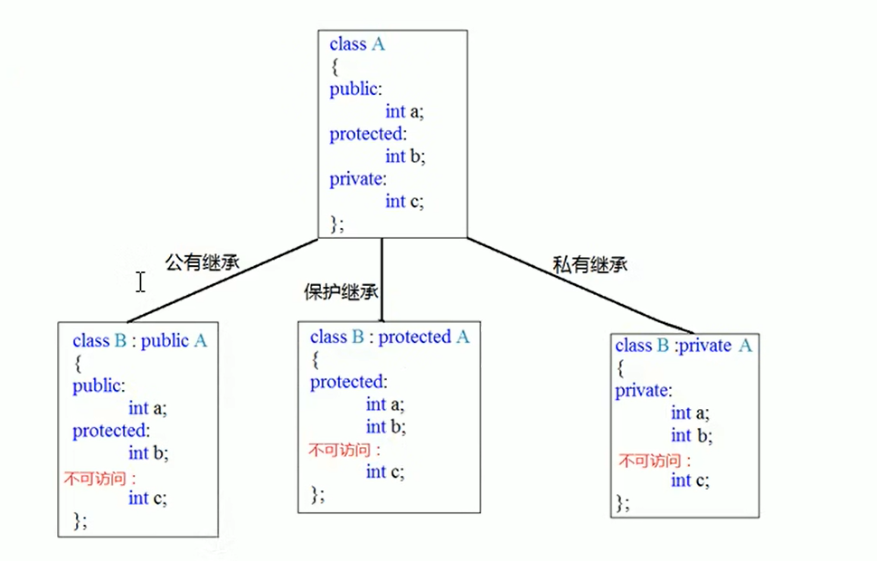

#### 继承对象模型状态

> 父类的非静态成员属性（静态属性是独立放在全局区，不属于实体对象上）都会被子类继承保留下去
>
> 相当于，子类的内存大小 = 父类的所有成员属性的大小 + 新增成员属性的大小
>
> 编译器隐藏父类的私有属性，子类无法访问，但是子类一直继承存储着，但是可以间接访问

```cpp
void test1()
{
    grid g1;
    g1.set(2, 2);
    g1.show();
    cout << sizeof(Point) << endl; // 8 point 有int x,y 属性 ，grid 有 int ID 属性
    cout << sizeof(g1) << endl;    // 12
};
```

#### 继承关系的构造与析构顺序

> 栈的结构，后进现出，先进后出。
>
> 创建和销毁子类对象时，也会调用父类的构造函数和析构函数
>
> 先构造父类，在构造子类
>
> 先析构子类，在析构父类

```cpp
void test1()
{
    grid g1;

// wucangouzao Point 
// wucangouzao Grid
// Xigou Grid
// Xi gou Point
};
```

#### 继承同名成员处理方式

1. 子类和父类出现同名的成员属性或是成员函数，子类会隐藏继承的成员函数和属性。
2. 同名时，子类对象可以直接访问子类的成员属性和函数。
3. 而想要访问父类的成员属性或是函数，需要添加作用域。
4. 同时，如果有重载的函数出现在同名情况，且在子类和父类都存在，也需要加作用域

```cpp
void test1()
{
    grid g1;
    // g1.set(2, 2);
    // g1.show();
    // cout << sizeof(Point) << endl; // 8 point 有int x,y 属性 ，shape 有 int ID 属性
    // cout << sizeof(g1) << endl;    // 12
    g1.tempP = 100;
    g1.Point::tempP = 200;
    cout << g1.tempP << endl;        // 100
    cout << g1.Point::tempP << endl; // 200
    g1.Point::show(); //Point show
    g1.show(); //Grid show 
};
```

#### 继承中同名静态成员处理

与上一致，加作用域的方法可以访问。

同时可以通过类名或是对象的方式进行访问静态成员函数和成员属性

```cpp
void test2()
{
    // option1:
    grid g1;
    cout << g1.st_grid << endl;        // 100
    cout << g1.Point::st_grid << endl; // 200
    // option2:
    cout << "-------------------------------------" << endl;
    cout << grid::st_grid << endl;        // 100
    cout << grid::Point::st_grid << endl; // 200
}
```

#### 多继承

> class 子类 ：继承方式 父类1，继承方式 父类2 ......

多个父类出现同名的成员属性或是函数，需要使用作用域，避免二异性。

这种方式容易引发开发问题，不建议

#### 菱形继承

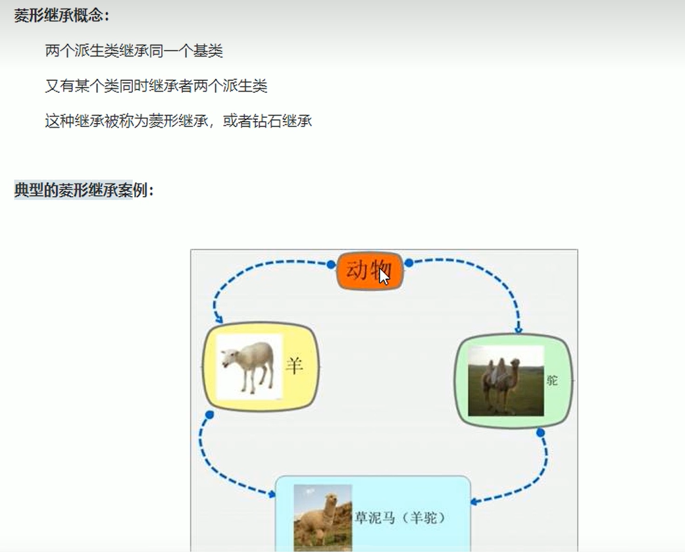

菱形继承，会导致最后的子类会拥有最顶上父类的双重数据，并且访问需要添加作用域，否则出现二异性。

**解决办法：虚继承 virtual**

vbptr   （virtual base pointer） 虚基类指针   			指向  vbtable（虚基类表）

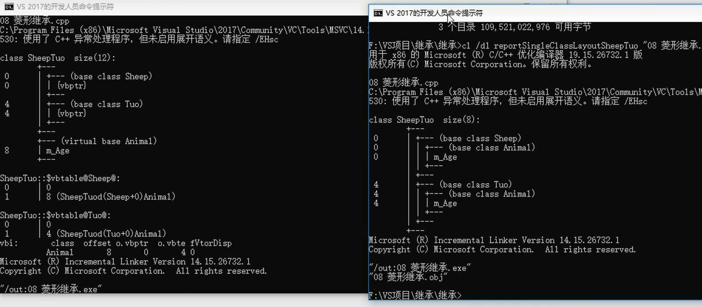

原始的继承从继承属性，转变为继承虚基类指针。

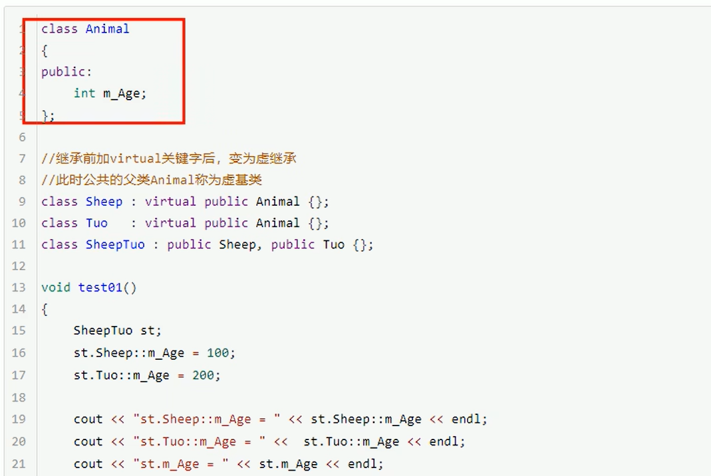

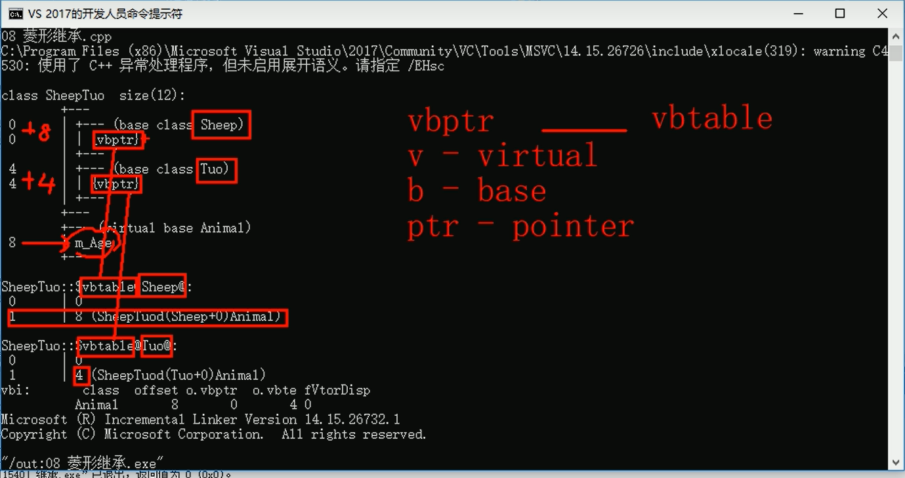

### 多态

1. 静态多态： 函数重载 和运算符重载都属于静态多态，复用函数名
2. 动态多态：派生类和虚函数实现运行时多态

- 静态多态的函数地址早绑定，在编译阶段确定函数地址
- 动态多态的函数地址晚绑定 ，在运行阶段确定函数地址

动态多态条件：

    1. 继承关系（子类和父类）

2. 子类重写父类的虚函数（	virtual return_dtype funcname()	）（重写：函数返回值，名称，参数完全相同）

使用： 父类的指针或是引用指向子类对象 ， 执行子类对象的函数

```cpp
class Father
{
public:
    // 虚函数关键字 virtual
    virtual void show()
    {
        cout << "father speak " << endl;
    }

private:
};
class Son : public Father
{
public:
    // 与父类中相同的函数，重写与父类相同的函数 前面 关键词 virtual 可有可无
    void show()
    {
        cout << "Son speak" << endl;
    }
};

// 多态条件： 1.有继承关系 2.子类有对于父类的函数重写
void test1(Father &father)
{
    father.show();
};
void test2()
{
    Son s1;
    test1(s1); // 不加virtual 关键词，输出father speak
               //  加virtual 关键词，输出son speak
};
```

#### vfptr(virtual function pointer,虚函数（表）指针)

```cpp

void test3()
{
    int *p = NULL;
    cout << sizeof(p) << endl;                             // 8 指针在64位系统下8个字节
    cout << "sizeof(father) = " << sizeof(Father) << endl; // 不添加 虚函数virtual 为 1
    cout << "sizeof(son) = " << sizeof(Son) << endl;       // 不添加 虚函数virtual 为 1
    /*
    添加虚函数关键字时，均为8（64位系统）。
    当设置虚函数时，类内存储结构发声改变，此时存储的是vfptr，虚函数指针（8个字节）
    指针指向vftable，存储类内虚函数的地址和偏移量信息。
    父类和子类同时这样存储，同时因为虚函数的缘故，子类的vftable有一些变化，他会将
    自己的从父类继承的vftable做些改动将Father：：show（）改写成 Son：：show（）
    */
}
```

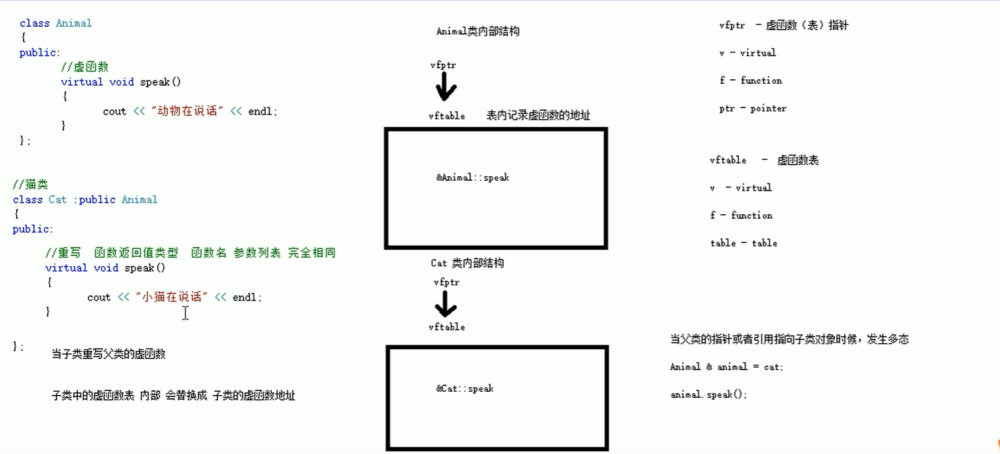

#### 多态的作用

1. 组织结构清晰
2. 可读性强
3. 对于前期和后期的扩展和维护性高
4. 适合扩展和补充

> 总计来说，我们做设计开发，建议一个基本的类，而我们后期进行维护和补充新的功能，
>
> 如果不使用多态，我们需要在这个基类上拓展新的功能就要反复回去做修正或是继承的方式去补充。而想要使用新的功能，还需要修改为继承后的
>
> 但是有了多态，我们可以让这个基类有多个子类，从而以一个基类的视角去使用子类的功能（通过指针或是引用的方式）。

```cpp
void test4()
{
    // 通过指针的方式去使用子类的功能，也就是拓展的功能
    Father *F = new Son; // 我们创建的是一个 Father类的指针，但是我们指向的地址与是否有重写虚函数有关。如果没有重写虚函数，实质上他指向的还是子类继承的父类
    // 如果有重写虚函数，他就会是对应子类的虚函数
    F->show(); // 调用子类的show（）
    cout << F << endl;
    delete F; // 指针要及时释放
    F = NULL;
    cout << F << endl;

    F = new Father;
    F->show(); // 调用父类的show()
    cout << F << endl;
    delete F;
    F = NULL;
    cout << F << endl;
};
```

#### 纯虚函数、抽象类

1. 纯虚函数：父类的虚函数，空实现，内部不执行任何操作
2. **抽象类：内部是纯虚函数的类，就是抽象类，无法实例化。**

> 抽象类就是一个统一的接口

1. 子类必须重写抽象类中的纯虚函数，否则也是抽象类。

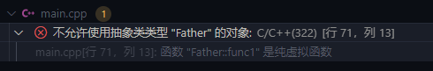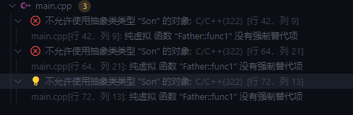

> 纯虚函数语法：  virtual 返回值类型 函数名（参数列表） = 0；

```cpp
class Father
{
public:
    // 虚函数关键字 virtual
    virtual void show()
    {
        cout << "father speak " << endl;
    }
    // 纯虚函数写法
    virtual void func1() = 0;

private:
};
```

#### 纯虚析构和虚析构

多态条件下

- 问题：子类有属性开辟到堆区，父类指针释放时无法调用子类的析构代码
- 解决方式：将**父类的析构函数**改为虚析构或纯虚析构（虚析构和纯虚析构都需要进行定义，因为父类也可能有自己的属性需要释放）

> 1. 只要一个类内有纯虚函数或是纯虚析构，他就属于抽象类，无法进行实例化对象。
> 2. 纯虚析构和虚析构都是为了解决父类指针无法释放子类对象的问题
> 3. 如果子类没有堆区数据（指针），可以不写虚析构或纯虚析构

```cpp
#include <iostream>
#include <string>
#include <stdio.h>
#include <string.h>
// #include "shape.h"
using namespace std;
double Pi = 3.1415926;

class AbstractMusic
{
public:
    AbstractMusic();
    AbstractMusic(int id);
    // 纯虚析构.需要有父类的析构定义和子类的析构定义
    virtual ~AbstractMusic() = 0;

    // 虚析构,这个并不需要我们在子类中进行再次声明定义,只是告诉编译器,我们父类析构时,子类的析构函数也要执行,同时我们父类析构也按照要求执行
    // 效果等同于纯虚析构
    // virtual ~AbstractMusic()
    // {
    //     cout << "Father Xigou xuxigou" << endl;
    // }
    virtual void Show() = 0;

private:
    int ID;
};
// 无参构造,会执行,注意时机
AbstractMusic::AbstractMusic()
{
    ID = 0;
    cout << "Father Gouzao wucan" << endl;
}

// 有参构造父类,实质上,我们抽象类是不能实例化对象的,因此这个构造函数没有意义,
// 就相当于写了也没有任何价值
AbstractMusic::AbstractMusic(int id)
{
    this->ID = id;
    cout << "Father Gouzao" << endl;
}
// 纯虚析构,这个就是纯虚析构,告诉编译器,子类析构之后,我们的资源也要按要求释放
AbstractMusic::~AbstractMusic()
{
    cout << "Father Xigou" << endl;
}

// 继承子类
class Rock : public AbstractMusic
{
public:
    Rock(int ID, string name, int Hot)
    {
        this->ID = ID;
        this->name = new string(name);
        this->Hot = Hot;
        cout << "Son GouZao Rock" << endl;
    }

    virtual void Show()
    {
        cout << *this->name << ":" << endl;
        cout << "       Hot:     " << this->Hot << endl;
        cout << "       ID:      " << this->ID << endl;
        // 继承后为私有属性,我们无法进行访问
        // cout << "FatherID:" << ID << endl;
        cout << "----------------------------------------" << endl;
    }
    ~Rock()
    {
        if (this->name != NULL)
        {
            delete this->name;
            cout << "Son xigou Rock" << endl;
        }
        else
        {
            cout << "error Rock" << endl;
        }
    }

private:
    string *name;
    int Hot;
    int ID;
};

// 继承子类
class Piano : public AbstractMusic
{
public:
    Piano(int ID, string name, int Hot, int time)
    {
        this->ID = ID;
        this->name = new string(name);
        this->Hot = Hot;
        this->time = time;
        cout << "Son GouZao Piano " << endl;
    }

    virtual void Show()
    {
        cout << *this->name << ":" << endl;
        cout << "       Hot:     " << this->Hot << endl;
        cout << "       ID:      " << this->ID << endl;
        cout << "       time:    " << this->time << endl;
        // 继承后为私有属性,我们无法进行访问
        // cout << "FatherID:" << ID << endl;
        cout << "----------------------------------------" << endl;
    }
    ~Piano()
    {
        if (this->name != NULL)
        {
            delete this->name;
            cout << "Son xigou Piano" << endl;
        }
        else
        {
            cout << "error Piano" << endl;
        }
    }

private:
    string *name;
    int Hot;
    int ID;
    int time;
};

void test1()
{
    // 由于我们定义了纯虚函数,因此我们无法进行初始化实体对象ABstractMusic
    //  AbstractMusic ab1;
    AbstractMusic *abc = new Rock(1, "superstar", 1000);
    abc->Show();
    delete abc;
    abc = NULL;
    cout << "---------------------------------------------------------------" << endl;
    // 多态的使用,我们使用父类的函数,完成不一样的输出,输出Piano的结果.多态的灵活使用,但是统一的接口
    abc = new Piano(2, "Ther Truth", 100, 345);
    abc->Show();
    // 人工申请的堆区内存要及时释放,而编译器自动申请的在栈区
    delete abc;
    abc = NULL;

    // Father Gouzao wucan
    // Son GouZao Rock
    // superstar:
    //        Hot:     1000
    //        ID:      1
    // ----------------------------------------
    // Son xigou Rock
    // Father Xigou
    // ---------------------------------------------------------------
    // Father Gouzao wucan
    // Son GouZao Piano
    // Ther Truth:
    //        Hot:     100
    //        ID:      2
    //        time:    345
    // ----------------------------------------
    // Son xigou Piano
    // Father Xigou
};
int main()
{
    test1();
    system("pause");
    return 0;
}
```

## 文件操作

`<fstream> `

- ofstream :写操作
- ifstream :读操作
- fstream :读写操作

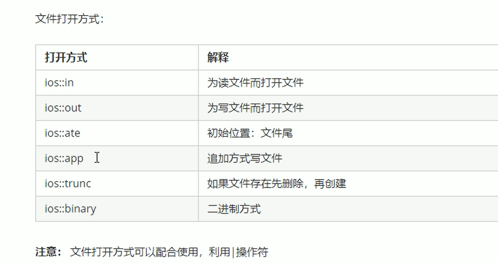

### 文本文件

> EOF, end of file 文件是否到末尾

```cpp
#include <fstream>

void test2()
{
    ofstream ofs;
    ofs.open("test.txt", ios::out);
    ofs << "hello world" << endl;
    ofs << "yhq" << endl;
    ofs << "t";
    ofs << "gg";
    ofs << "nihao你好";
    ofs.close();
}
```

> 在C++中，使用 `std::ifstream` 读取文件时，默认情况下，`>>` 操作符会跳过空白字符（包括空格、换行符和制表符）。当 `ifs >> buf` 读取字符串时，遇到空格就会停止读取，并将缓冲区中的内容输出，然后继续读取下一个单词，直到文件结束。

```cpp
void test3()
{
    ifstream ifs;
    ifs.open("test.txt", ios::in);

    // 判断是否正常打开,若异常直接中止
    if (!ifs.is_open())
    {
        cout << "lose" << endl;
        return;
    }
    // function 1
    // // 这种方法遇见空格、换行符和制表符会中止读取,不太友好
    // char buf[1024] = {0};
    // while (ifs >> buf)
    // {
    //     cout << buf << endl;
    // }

    // func2
    // 这种方式读取没有问题,推荐使用
    // char buf[1024] = {0};
    // while (ifs.getline(buf, sizeof(buf)))
    // {
    //     cout << buf << endl;
    // }

    // func3
    // 同func2
    string s;
    while (getline(ifs, s))
    {
        cout << s << endl;
    }

    ifs.close();
}
```

### 二进制文件

```cpp
class Music
{
public:
    int age;
    char name[100];
};
void test3()
{
    ofstream ofs("test2.txt", ios::binary | ios::out);
    Music M1 = {199, "zaijian"};
    // M1.name = "ZaiJian";
    ofs.write((const char *)&M1, sizeof(Music));
    ofs.close();

    ifstream ifs;
    ifs.open("test2.txt", ios::in | ios::binary);
    if (!ifs.is_open())
    {
        return;
        cout << "Error" << endl;
    }
    Music M2;
    ifs.read((char *)&M2, sizeof(M2));
    cout << M2.age << "   " << M2.name << endl;

    ifs.close();
}
```

## 模板

1. 泛型编程思想（模板）和STL技术。
2. 模板只是框架，不可以直接使用
3. 模板的通用并不是万能的

模板机制：

- 函数模板
- 类模板

### 函数模板

建立一个通用的函数，函数的返回值和形参类型不具体指定，用一个虚拟的类型代表。

> 就相当于我们不知道输入和输出数据类型，但是我们可以实行一个广泛的接口，针对不同数据类型都可以执行一样的操作

```cpp
template<typename T>
函数声明或定义

/*
template - 关键字，声明创建模板
typename - 关键字，表明后面的符号T是表示一种数据类型，也可以用class 关键字
T  	 - 通用的数据类型的表示，就是一个简要的名称。
*/
```

```cpp
// 函数模板
template <typename T> // 声明一个模板，告诉编译器后面代码紧跟的T不要报错，T是一个通用数据类型
void Swap(T &a, T &b)
{
    T temp = a;
    a = b;
    b = temp;
};
template <typename T>
void func()
{
    cout << "hello world! " << endl;
}

void test1()
{
    int a = 100;
    int b = 300;
    char c;
    // 模板使用
    cout << "a = " << a << endl;
    cout << "b = " << b << endl;
    //  1. 直接使用，模板根据内容进行推算数据类型
    Swap(a, c);  // 推导不出一致的数据类型
    func();      // 没有输入确定的数据类型T，因此无法进行
    func<int>(); // 编译器只是需要一个模板的参数类型，无论给什么类型都可以进行。所以可以正常执行
    // 2. 告诉模板所指定的数据类形
    Swap<int>(a, b);
    cout << "a = " << a << endl;
    cout << "b = " << b << endl;
}
int main()
{
    test1();
    system("pause");
    return 0;
}
```

#### 函数模板注意事项

1. 自动类型推导，必须推导出一致数据类型T才可以使用自动推导的使用
2. 模板必须确定T的数据类型，才可以使用

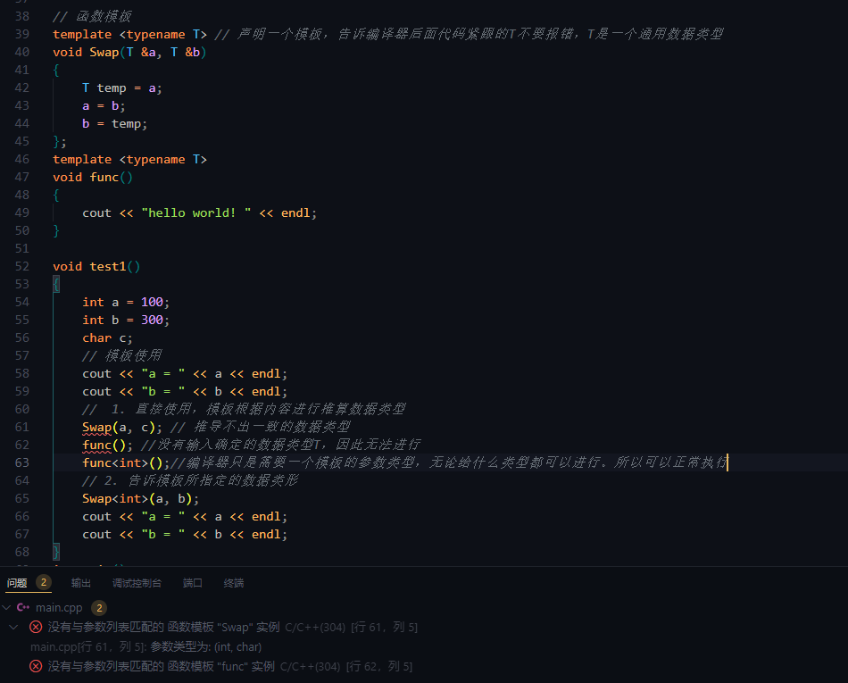

#### 函数模板与普通函数

> 隐式类型转换（也称为隐式转换）是编程语言中的一种机制，它允许编译器自动将一种数据类型的值转换为另一种数据类型，而不需要程序员明确编写转换代码。

##### 区别

- 普通函数调用可以发生自动类型转换（隐式类型转换）
- 函数模板调用，如果利用自动类型推导，不会发生隐式类型转换
- 利用显示指定类型，可以发生隐式类型转换

```cpp
int Add(int a, int b)
{
    return a + b;
};
template <typename T>
T AddT(T a, T b)
{
    return a + b;
};

//这里是错误的，C++不支持返回多个值
int Swap1(int a, int b)
{
    int temp = a;
    a = b;
    b = temp;
    return a, b;
};
// 函数模板
template <typename T> // 声明一个模板，告诉编译器后面代码紧跟的T不要报错，T是一个通用数据类型
int Swap(T a, T b)
{
    T temp = a;
    a = b;
    b = temp;
    return a, b;
};

void test4()
{
    int a = 100; // ASCII 是“d"
    int b = 2000;
    char c = 65;                 // 字符型对应ASCII是 “A”
    cout << "a = " << a << endl; // 100
    cout << "b = " << b << endl; // 2000
    cout << "c = " << c << endl; // A

    int outd = 0;
    // 1.  以普通函数调用 ，c作为字符型变量，编译器会自动进行类型转换为int
    // outd= Add(a, c);
    // 2. 以模板函数调用，但是自动类型推导会出现错误，编译器不知道要给出什么样的数据类型给T，因此无法完成自动类型转换出错。
    // outd = AddT(a, c);
    // 3. 以模板函数调用，但是给出T指定的数据类型，因此编译器会执行自动类型转换 
    outd = AddT<int>(a, c);
    cout << "outd = " << outd << endl; // 165
    cout << "---------------------------------------------------------" << endl;
    cout << "a = " << a << endl; //
    cout << "b = " << b << endl;
    cout << "c = " << c << endl;
};
```

##### 调用规则

1. 如果函数模板和普通函数都可以实现，优先调用普通函数
2. 可以通过空模板参数列表来强制调用函数模板
3. 函数模板也可以发生重载
4. 如果函数模板可以产生更好的匹配，优先调用函数模板

```cpp
// 普通函数
int Add(int a, int b)
{
    cout << "putonghanshu" << endl;
    return a + b;
};
// 函数模板
template <typename T>
T Add(T a, T b)
{
    cout << "mobanhanshu" << endl;
    return a + b;
};
// 函数模板也支持重载技术，可以通过重载的方式，实现新的定义
template <typename T>
T Add(T a, T b, T c)
{
    cout << "mobanhanshu" << endl;
    return a + b;
};


void test5()
{
    int a = 100; // ASCII 是“d"
    int b = 2000;
    char c = 65;                 // 字符型对应ASCII是 “A”
    cout << "a = " << a << endl; // 100
    cout << "b = " << b << endl; // 2000
    cout << "c = " << c << endl; // A
    int outd;
    outd = Add(a, b);   //此时同时满足普通函数和模板函数的调用，但是编译器会优先调用普通函数。
    outd = Add<>(a, b); // 此时我们强制给出一个模板参数列表，此时编译器知道我们想要调用的是模板函数
    outd = Add(a, b, b); // 函数模板重载
    outd = Add(c, c); // 此时C是一个字符型，如果调用普通函数我们需要先进行强制类型转换才可以进行操作。相反模板函数就可以直接操作将T为char，更好的匹配。
			// 因此此处执行的是函数模板

//-----------------------------outprint--------------------------------------------
    // a = 100
    // b = 2000
    // c = A
    // putonghanshu
    // mobanhanshu
    // mobanhanshu
    // mobanhanshu
}
```

> 函数模板还可以具体化模板，给出具体化的数据类型，这样编译器会优先执行这些满足具体化数据类型的函数模板.
>
> 模板针对已经存在的数据类型可以非常轻松的应对，但是对于我们自定义的数据类型（结构体、类）在执行相似的操作会出错，很多时候需要我们进行运算符重载之类操作才可以顺利进行
>
> 除此之外就是我们可以具体化模板，可以解决自定义类型的通用化
>
> 学习模板不是为了写模板，而是STL能够运用系统提供的模板
>
> ！ 模板不是万能的

### 类模板

```cpp
template<typename T>// typename 可以用class代替
类声明定义
```

```cpp
// 构造模板，我们想要使用多个参数时，可以通过下面方式给出多个要引用的数据类型换成class也可以
template <typename NameType, typename AgeType>
class Person
{
private:
    /* data */
public:
    NameType Name;
    AgeType Age;
    Person(NameType name, AgeType age)
    {
        this->Name = name;
        this->Age = age;
        cout << "Youcan Gouzao Person" << endl;
    };
    ~Person()
    {
        cout << "Xigou Person" << endl;
    };
    void PersonShow()
    {
        cout << this->Name << endl;
        cout << this->Age << endl;
    }
};

void test1()
{
    // 因为我们要使用多个数据类型，这里就要给出模板参数列表，告诉编译器数据类型
    Person<string, int> P1("ZhangSan", 18);
    P1.PersonShow();

    // Youcan Gouzao Person
    // ZhangSan
    // 18
    // Xigou Person
};
```

#### 类模板与函数模板区别

1. 类模板没有自动类型推导的使用方式。（只有显式指定数据类型）
2. 类模板在模板参数列表中可以有默认参数

```cpp
// 构造模板，我们想要使用多个参数时，可以通过下面方式给出多个要引用的数据类型换成class也可以
template <class NameType, class AgeType = int>
class Person
{
private:
    NameType Name;
    AgeType Age;

public:
    Person(NameType name, AgeType age)
    {
        this->Name = name;
        this->Age = age;
        cout << "Youcan Gouzao Person" << endl;
    };
    ~Person()
    {
        cout << "Xigou Person" << endl;
    };
    void PersonShow()
    {
        cout << this->Name << endl;
        cout << this->Age << endl;
    }
};

void test1()
{
    // 因为我们要使用多个数据类型，这里就要给出模板参数列表，告诉编译器数据类型
    // 同时我们给了默认模板参数后，可以不给出参数.也可以修改新的参数类型都是可以的
    Person<string> P1("ZhangSan", 18);
    Person<string, float> P2("Xiaohua", 18.24);

    P1.PersonShow();
    P2.PersonShow();
    // Youcan Gouzao Person
    // Youcan Gouzao Person
    // ZhangSan
    // 18
    // Xiaohua
    // 18.24
    // Xigou Person
    // Xigou Person
};
```

#### 类模板中成员函数创建时机

1. 普通类中的成员函数早创建
2. 类模板中的成员函数调用时才创建

```cpp
class C1
{
public:
    void ShowC1()
    {
        cout << "C1 Show" << endl;
    }
};

class C2
{
public:
    void ShowC2()
    {
        cout << "C2 Show" << endl;
    }
};

template <class T>
class TC
{
public:
    T TC_m;
    void TC1()
    {
        TC_m.ShowC1();
    }
    void TC2()
    {
        TC_m.ShowC2();
    }
};
void test1()
{
    /*
    想要验证具体模板中成员函数和成员属性的创建时机
    具体发生在调用该模板时，编译器根据你给定的数据类型，他才可以创建你所需要的对应数据的成员函数或是属性
    对应的成员函数和属性也只能操纵自己范围内的属性或是成员函数
    */
    TC<C1> t1;
    t1.TC1(); // 这里已经声明是一个C1类型的数据，因此TC1函数可以顺利执行
    // t1.TC2(); // 这里我们模板类里面虽然有这个函数，但是执行该函数发现类内没有对应的函数，程序会崩溃
}
```

#### 类模板对象作为函数参数

类模板实例化出的对象，向函数传参数：

1. 指定传入数据类型  -- 直接显示对象的数据类型
2. 参数模板化	       -- 将对象中的参数变为模板进行传递
3. 整个类模板化         -- 将这个对象类型模板化进行传递

> 实质上都是反复使用函数模板和类模板的结合，但是嵌套会很麻烦使用，通常情况下，还是使用第一种为主！！！！

```cpp
// 构造模板，我们想要使用多个参数时，可以通过下面方式给出多个要引用的数据类型换成class也可以
template <class NameType, class AgeType = int>
class Person
{
private:
    NameType Name;
    AgeType Age;

public:
    Person(NameType name, AgeType age)
    {
        this->Name = name;
        this->Age = age;
        cout << "Youcan Gouzao Person" << endl;
    };
    ~Person()
    {
        cout << "Xigou Person" << endl;
    };
    void PersonShow()
    {
        cout << "Name: " << this->Name << endl;
        cout << "Age: " << this->Age << endl;
    }
};

// 1.指定数据类型告诉函数类型
void ShowTime1(Person<string> &P)
{
    P.PersonShow();
};
// 2.参数模板化
template <class T1, class T2>
void SHowTime2(Person<T1, T2> &P)
{
    P.PersonShow();
    cout << "T1 type: " << typeid(T1).name() << endl;
    cout << "T2 type: " << typeid(T2).name() << endl;
};
// 3. 整个类模板化
template <class T>
void SHowTime3(T &P)
{
    P.PersonShow();
    cout << "T type: " << typeid(T).name() << endl;
};

void test1()
{
    // 因为我们要使用多个数据类型，这里就要给出模板参数列表，告诉编译器数据类型
    // 同时我们给了默认模板参数后，可以不给出参数.也可以修改新的参数类型都是可以的
    Person<string> P1("ZhangSan", 18);
    Person<string, float> P2("Xiaohua", 18.24);
    ShowTime1(P1);
    SHowTime2(P2);
    SHowTime3(P1);
    // --------------------------------------------------------------------------------
    // Youcan Gouzao Person
    // Youcan Gouzao Person
    // Name: ZhangSan
    // Age: 18
    // Name: Xiaohua
    // Age: 18.24
    // T1 type: NSt7__cxx1112basic_stringIcSt11char_traitsIcESaIcEEE
    // T2 type: f
    // Name: ZhangSan
    // Age: 18
    // T type: 6PersonINSt7__cxx1112basic_stringIcSt11char_traitsIcESaIcEEEiE
    // Xigou Person
    // Xigou Person
};
```

#### 类模板与继承

1. 当子类继承的父类是一个类模板时，子类在声明的时候，要指定父类模板中模板列表数据类型
2. 如果不指定，编译器无法分配给子类内存
3. 想要灵活指定父类中模板列表属性中的数据类型，子类也必须要变成类模板。

```cpp
// 构造模板，我们想要使用多个参数时，可以通过下面方式给出多个要引用的数据类型换成class也可以
template <class NameType, class AgeType = int>
class Person
{
private:
    NameType Name;
    AgeType Age;

public:
    // Person(NameType name, AgeType age)
    // {
    //     this->Name = name;
    //     this->Age = age;
    //     cout << "Youcan Gouzao Person" << endl;
    // };
    Person()
    {
        cout << "Gouzao Person" << endl;
    }
    ~Person()
    {
        cout << "Xigou Person" << endl;
    };
    void PersonShow()
    {
        cout << "Name: " << this->Name << endl;
        cout << "Age: " << this->Age << endl;
    }
};

// 我们想要继承模板类就需要指定模板类中数据类型，否则无法分配所占据的内存空间，不然就会出错
class ADC : public Person<string>
{
private:
    /* data */
public:
    ADC()
    {

        cout << "gouzao ADC" << endl;
    };
    ~ADC()
    {
        cout << "Xigou ADC" << endl;
    };
};

// 另一种想要自定义数据类型，就是还是使用模板，将模板属性初始给编译代码的人员来决定
template <class TypeName, class TypeAge = int>
class ADC2 : public Person<TypeName, TypeAge>
{
private:
    /* data */
public:
    ADC2()
    {

        cout << "gouzao ADC2" << endl;
    };
    ~ADC2()
    {
        cout << "Xigou ADC2" << endl;
    };
};

void test1()
{
    // 因为我们要使用多个数据类型，这里就要给出模板参数列表，告诉编译器数据类型
    // 同时我们给了默认模板参数后，可以不给出参数.也可以修改新的参数类型都是可以的
    // Person<string> P1("ZhangSan", 18);
    // Person<string, float> P2("Xiaohua", 18.24);
    // ADC ad1;
    // Gouzao Person
    // gouzao ADC
    // Xigou ADC
    // Xigou Person
    // --------------------------------------------------------------------------------

    ADC2<int, int> ad2;
    // Gouzao Person
    // gouzao ADC2
    // Xigou ADC2
    // Xigou Person
};
```

#### 类模板成员函数类外实现

```cpp
template <class MusicNameType, class MusicHotType, class MusicIDType>
class Music
{
private:
    MusicNameType MName;
    MusicHotType Hot;
    MusicIDType ID;

public:
    Music();
    ~Music();
    void Show();
};

template <class MusicNameType, class MusicHotType, class MusicIDType>
Music<MusicNameType, MusicHotType, MusicIDType>::Music()
{
    this->Hot = 100;
    this->ID = 1;
    this->MName = "hello World";
}

template <class MusicNameType, class MusicHotType, class MusicIDType>
Music<MusicNameType, MusicHotType, MusicIDType>::~Music()
{
}

template <class MusicNameType, class MusicHotType, class MusicIDType>
void Music<MusicNameType, MusicHotType, MusicIDType>::Show()
{
    cout << "Music Name: " << this->MName << endl;
    cout << "Music ID: " << this->ID << endl;
    cout << "Music Hot: " << this->Hot << endl;
}
```

#### 类模板分文件编写

> 在C++中，模板函数的定义通常需要在头文件中完成，因为模板函数的实例化是在编译时进行的，而不是链接时。因此，一般不能像非模板函数那样在头文件中声明而在源文件中定义。

解决办法：

1. 直接包含.cpp源文件
2. 将声明和实现写到同一个文件中，并更改后缀名为.hpp,hpp是约定俗成的名称要求，并不强制，就算是.h文件也同样可以。

#### 类模板与友元函数的配合使用

1. 全局函数类内实现 - 直接在类内声明友元即可
2. 全局函数类外实现 - 需要提前让编译器知道全局函数的存在

```cpp
// 我们想要写全局函数运用模板类，但是编译器自上而下要先知道这个模板类的存在先，因此此处先进行声明才可以
template <class NameType, class AgeType>
class Person;
// 想要模板类外实现全局函数对模板类的访问， 就需要实现告诉编译器该全局函数的存在，因此就需要写在模板类的前面
template <class NameType, class AgeType>
void FriendShow2(Person<NameType, AgeType> &P)
{
    cout << "Name: " << P.Name << endl;
    cout << "Age: " << P.Age << endl;
};

// 构造模板，我们想要使用多个参数时，可以通过下面方式给出多个要引用的数据类型换成class也可以
template <class NameType, class AgeType>
class Person
{
    // 全局函数做模板类的友元时，类内实现方法
    friend void FriendShow(Person<NameType, AgeType> &P)
    {
        cout << "Name: " << P.Name << endl;
        cout << "Age: " << P.Age << endl;
    };
    // 全局函数做模板类的友元，类外实现，因此我们内部需要告诉模板类，该函数是友元
    //  同时 针对下方的全局函数，因为需要添加模板属性列表，下面的全局函数定义，也需要提前进行声明模板的template <class NameType, class AgeType = int>
    //  这就相当于这个全局函数实际上在编译器眼里就是一个函数模板，因此我们这里就需要改动这里的声明，天加上模板属性列表<>
    friend void FriendShow2<>(Person<NameType, AgeType> &P);

private:
    NameType Name;
    AgeType Age;

public:
    Person(NameType name, AgeType age)
    {
        this->Name = name;
        this->Age = age;
        cout << "Youcan Gouzao Person" << endl;
    };
    Person()
    {
        cout << "Gouzao Person" << endl;
    }
    ~Person()
    {
        cout << "Xigou Person" << endl;
    };
    void PersonShow()
    {
        cout << "Name: " << this->Name << endl;
        cout << "Age: " << this->Age << endl;
    }
};

void test1()
{
    // 因为我们要使用多个数据类型，这里就要给出模板参数列表，告诉编译器数据类型
    // 同时我们给了默认模板参数后，可以不给出参数.也可以修改新的参数类型都是可以的
    Person<string, int> P1("ZhangSan", 18);
    Person<string, float> P2("Xiaohua", 18.24);
    // P1.FriendShow(); //在不添加friend关键字时，FriendShow()是私有成员函数，无法直接调用，这句函数是错误的无法编译
    FriendShow(P1);
    FriendShow2(P2);
    // --------------------------------------------------------------------------------
    // Youcan Gouzao Person
    // Youcan Gouzao Person
    // Name: ZhangSan
    // Age: 18
    // Name: Xiaohua
    // Age: 18.24
    // Xigou Person
    // Xigou Person
};
```

> 没有特殊需求还是类内实现友元全局函数，不然太过于繁琐。

## STL （Standard Template Library，标准模板库）

- C++ 编程思想（面向对象）和泛型编程 ，目的就是提高复用性。
- STL广义划分： 容器（container）、算法（algorithm）、迭代器（iterator）
- 容器和算法之间通过迭代器进行衔接
- STL几乎所有的代码都采用模板类或者模板函数

### STL六大组件

1. 容器：各种数据结构，如vector、list、deque、set、map等，用于存放数据

   (1)存储数据。运用常规数据结构，实现数据存储。（2）分为序列式容器和关联式容器。前者强调值的排序，后者是二叉树结构，没有严格地顺序关系
2. 算法：各种常见算法，如sort、find、copy、for_each等

   (1)有限的步骤，解决逻辑或是数学问题。 （2）质变算法和非质变算法。是否修改数据元素内容。
3. 迭代器：扮演容器和算法直接的结合件

   (1) 提供一种方法，使得能够依照序去访问容器中的元素，而无需了解或是暴露容器内部的实现方式。(2)每个容器都要有自己的迭代器

   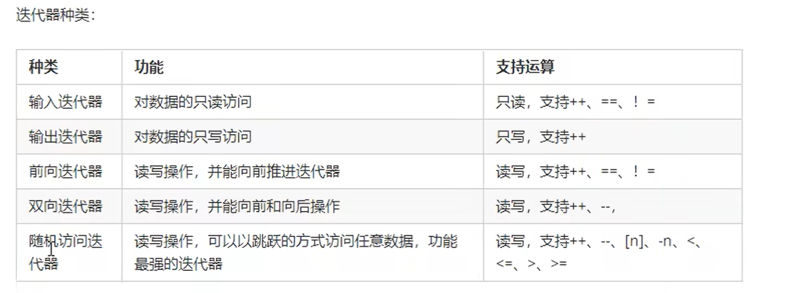

   > 常见的迭代器是双向迭代器和随机访问迭代器。
   >
4. 仿函数：行为类似函数，可作为算法的某种策略。
5. 适配器：一种用于修饰容器或者仿函数或是迭代器接口的东西。
6. 空间配置器：负责空间的配置与管理。

##### vector示例

```cpp
#include <iostream>
#include <string>
#include <algorithm>
#include <vector>

using namespace std;
double Pi = 3.1415926;

void ShowInt(int &a)
{
    cout << "a = " << a << endl;
}
void test1()
{
    // 创建vector容器对象，内部就是一个通用类模板，我们可以指定模板数据类型来指定容器中存放的数据类型
    vector<int> V;
    // 尾插法进行数据的插入数据，这是容器所必须要有的功能
    V.push_back(100);
    V.push_back(200);
    V.push_back(300);
    /*
    每个容器都有自己的迭代器，迭代器用来遍历容器中的数据
    V.begin 就是容器内部的迭代器，用于指向容器所存储数据的第一个数据地址
    V.end 就是指向容器所指向容器内数据的最后一个数据的下一个位置
     vector<int>::iterator 就是拿到vector<int> 这种容器的迭代器
    */
    vector<int>::iterator itBegin = V.begin();
    vector<int>::iterator itEnd = V.end();

    // 遍历并输出数据的方法 1
    while (itBegin != itEnd)
    {
        cout << *itBegin << endl;
        itBegin++;
    };
    // 遍历输出数据的方法 2
    for (vector<int>::iterator itBegin1 = V.begin(); itBegin1 != V.end(); itBegin1++)
    {
        cout << "b = " << *itBegin1 << endl;
    };
    vector<int>::iterator itBegin2 = V.begin();

    // 遍历输出，使用算法内置函数
    for_each(itBegin2, itEnd, ShowInt);
};
int main()
{
    test1();
    // system("pause");
    return 0;
}
```

vector容器存放自定义数据类型

```cpp


void test2()
{
    Person P1(18, "zhangsan", 180);
    Person P2(20, "zhaosi", 178);
    Person P3(23, "laoda", 198);
    vector<Person *> V1;
    V1.push_back(&P1);
    V1.push_back(&P2);
    V1.push_back(&P3);
    for (vector<Person *>::iterator V_begin = V1.begin(); V_begin != V1.end(); V_begin++)
    {
        cout << "::" << **V_begin << endl;
    }
    //         youcangouzao Person
    //         youcangouzao Person
    //         youcangouzao Person
    // ::Person Name = zhangsan
    // Person Age =  18
    // Person Height=180
    // -------------------------------------
    // ::Person Name = zhaosi
    // Person Age =  20
    // Person Height=178
    // -------------------------------------
    // ::Person Name = laoda
    // Person Age =  23
    // Person Height=198
    // -------------------------------------
    //             xigou Person
    //             xigou Person
    //             xigou Person
}

```

### 容器嵌套vector

```cpp
void test3()
{
    // 容器嵌套容器实际上就是变向的实现二维数组，同理可以实现三维数组等等
    vector<vector<int>> V1;
    vector<int> v1;
    vector<int> v2;
    vector<int> v3;
    for (size_t i = 0; i < 5; i++)
    {
        v1.push_back(i);
        v2.push_back(i + 10);
        v3.push_back(i + 100);
    }

    V1.push_back(v1);
    V1.push_back(v2);
    V1.push_back(v3);
    for (vector<vector<int>>::iterator itBegin = V1.begin(); itBegin != V1.end(); itBegin++)
    {
        // 这是一种不推荐的做法。只能说访问了首个数据而已。
        // itBegin 是一个指向 vector<int> 的迭代器
        //  *itBegin 返回 的是一个vector<int> 类型的对象
        // &操作符获取 vector<int>对象[0] 数据的地址（就是vector<int> 第一个元素的地址），然后解引用这个地址
        // 最后 * 就是取出vector<int>[0] 位置存储数据的值。

        cout << "V1: " << *(&(*itBegin)[0]) << endl;
        // cout << " = V1:  " << itBegin->at(0) << endl;
        // 二者等同 。在这里，itBegin->at(0) 使用了成员访问运算符 ->，这是专门为迭代器设计的，使得代码更加简洁易读。
    }

    cout << "------------------------------------------------------------" << endl;
    // 正确的方式我们应该合理的当作二维数组去访问
    for (vector<vector<int>>::iterator itBegin = V1.begin(); itBegin != V1.end(); itBegin++)
    {
        for (vector<int>::iterator itN = (*itBegin).begin(); itN != (*itBegin).end(); itN++)
        {
            cout << *itN << " ";
        }
        cout << endl;
    }
    // V1: 0
    // V1: 10
    // V1: 100
    // ------------------------------------------------------------
    // 0 1 2 3 4
    // 10 11 12 13 14
    // 100 101 102 103 104
}
```

### string 容器

本质：

- string是C++风格的字符串，实质上就是一个类。我们只是使用这个类完成一些工作。

string 和char * 区别：

- char* 是一个指针。
- string 是个类，类内有成员属性封装保存着char * ,管理着这个字符串，是一个char * 的容器。

特点：

- string内部有很多成员方法。（查找find，拷贝 copy，删除 delete 替换 replace，插入 insert等等）
- string 容器管理char * 所分配的的内存，不用担心复制越界和取值越界等。都由类内负责检查和确定。

#### string 构造函数

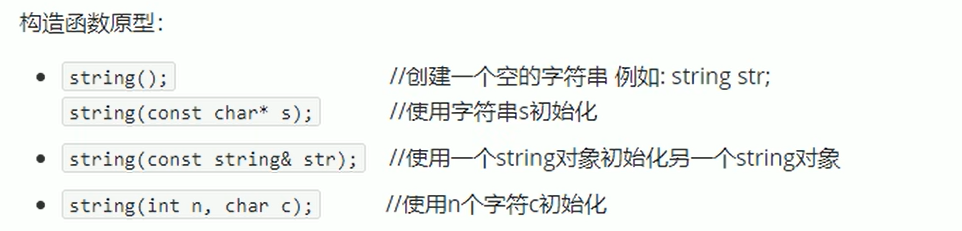

```cpp
void test4()
{
    // 在内存的常量区分配空间以存储字符串 "nihao" 加上一个额外的空字符 '\0' 以表示字符串的结束。
    // 将这个字符串的地址赋给指针 c。
    char *c = "nihao";
    // 有参数构造
    string s1(c);
    string s2;     // 无参数构造
    string s3(s1); // 拷贝构造
    string s4(10, 'W');
    cout << "c[1] = " << c[1] << endl;
    cout << "s1 =   " << s1 << endl;
    cout << "s2 =   " << s2 << endl;
    cout << "s3 =   " << s3 << endl;
    cout << "s4 =   " << s4 << endl;

    // c[1] = i
    // s1 =   nihao
    // s2 =
    // s3 =   nihao
    // s4 =   WWWWWWWWWW

```

#### string 赋值操作

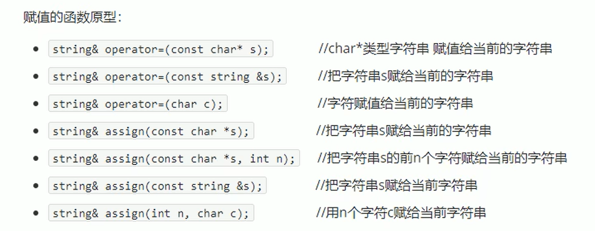

```cpp
void test1()
{
    string Str1 = "My string ";
    char c[] = "My c";
    cout << "Str1 = " << Str1 << endl;
    string Str2;
    Str2 = c; // 赋值运算 char型数组地址赋值
    cout << "Str2 = " << Str2 << endl;
    string Str3;
    Str3 = Str1; // 字符串赋值
    cout << "Str3 = " << Str3 << endl;
    string Str4;
    Str4 = c[1]; // char 型单个数值赋值
    cout << "Str4 = " << Str4 << endl;
    string Str5;
    char c2[] = "Hello!";
    Str5.assign(c2); // 类成员函数赋值， char型数组地址
    cout << "Str5 = " << Str5 << endl;
    string Str6;
    Str6.assign(c2, 2); // 类成员函数赋值，这个可以指定赋值的位数
    cout << "Str6 = " << Str6 << endl;
    string Str7;
    Str7.assign(Str1); // 类成员函数赋值，输入是字符串地址
    cout << "Str7 = " << Str7 << endl;
    string Str8;
    Str8.assign(10, c2[5]); // 类成员函数赋值，对某个字符重复n遍进行赋值
    cout << "Str8 = " << Str8 << endl;

    // Str1 = My string
    // Str2 = My c
    // Str3 = My string
    // Str4 = y
    // Str5 = Hello!
    // Str6 = He
    // Str7 = My string
    // Str8 = !!!!!!!!!!
};
```

#### string 拼接

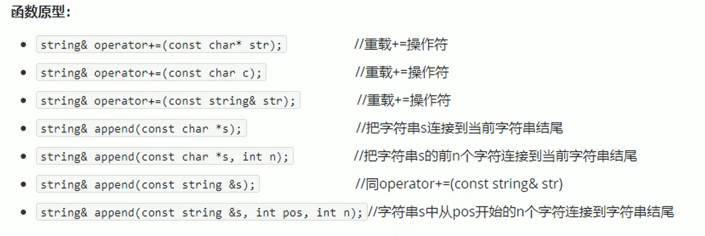

```cpp
void test1()
{
    string Str1 = "My string !";
    char c[] = "My c";
    cout << "Str1 = " << Str1 << endl;
    string Str2 = Str1;
    Str2 += c; // 重载的+=进行和char型数组的拼接
    cout << "Str2 = " << Str2 << endl;
    string Str3 = "SB USA";
    Str3 += 'C'; // 重载的+=进行和char型字符的拼接
    cout << "Str3 = " << Str3 << endl;
    string Str4 = Str3;
    Str4 += Str1; // 重载的+=进行和string型拼接
    cout << "Str4 = " << Str4 << endl;
    string Str5 = Str4;
    char c2[] = "Hello!";
    Str5.append(c2); // 类成员函数append 对字符串进行拼接， char型数组地址
    cout << "Str5 = " << Str5 << endl;
    string Str6 = Str5;
    Str6.append(c2, 2); // 类成员函数append 对字符串进行拼接， char型数组地址,指定拼接char 数组中 n个字符进行拼接
    cout << "Str6 = " << Str6 << endl;
    string Str7 = Str6;
    Str7.append(Str1); // 类成员函数append 对字符串进行拼接，输入是字符串地址
    cout << "Str7 = " << Str7 << endl;
    string Str8 = Str1;
    Str8.append(Str1, 3, 6); // 类成员函数append 对字符串指定子串部分进行拼接
    cout << "Str8 = " << Str8 << endl;
// Str1 = My string !
// Str2 = My string !My c
// Str3 = SB USAC
// Str4 = SB USACMy string !
// Str5 = SB USACMy string !Hello!
// Str6 = SB USACMy string !Hello!He
// Str7 = SB USACMy string !Hello!HeMy string !
// Str8 = My string !string
};
```

#### string 查找和替换

- 查找： 查找字符串是否存在
- 替换：在指定的位置替换字符串

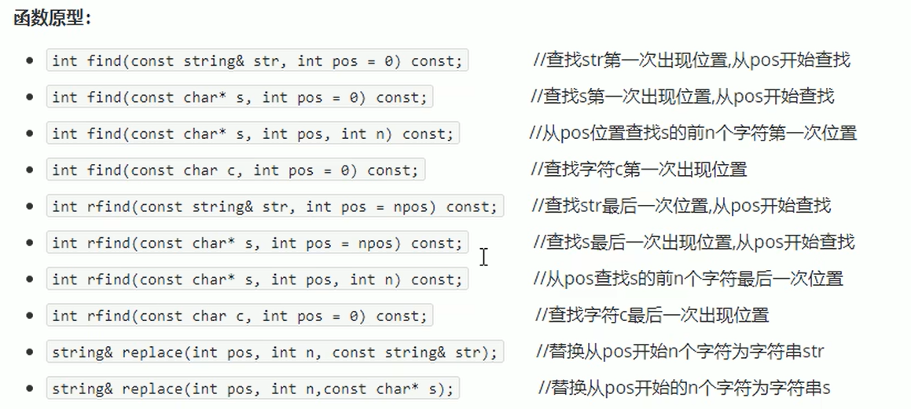

```cpp
void test1()
{
    string Str1 = "My string!Hello World ! string WBNB";

    int pos = Str1.find("ing", 0);
    // find 是从前往后查找第一次出现的位置索引，未找到返回-1
    // rfind 是默认从后往前查找，未找到返回-1，但是我们同样可以修改传入的参数。修改查找的起始位置
    int pos1 = Str1.rfind("ing");
    if (pos != -1)
    {
        cout << "Find Position is : " << pos << endl;
    }
    else
    {
        cout << "Dont Find " << endl;
    }

    if (pos1 != -1)
    {
        cout << "::Find Position is : " << pos1 << endl;
    }
    else
    {
        cout << "::Dont Find " << endl;
    }
    // Find Position is : 6
    // ::Find Position is : 27
};
void test2()
{
    string Str1 = "My string!Hello World ! string WBNB";

    cout << "---------------------------------------------" << endl;
    cout << "Before Replace:    " << Str1 << endl;
    // 替换是从我们指定的位置开始的n个字符串。这个就是从0位置开始的n个字符串
    // 同时注意，即使我们给出的数据长度大于要替换的或是小于要替换的长度，他都会把我们要替换的数据放到中间
    Str1.replace(0, 3, "HongG");
    cout << "After Replace:     " << Str1 << endl;
    Str1.replace(0, 4, "G");
    cout << "After Replace2:    " << Str1 << endl;
    // ---------------------------------------------
    // Before Replace:    My string!Hello World ! string WBNB
    // After Replace:     HongGstring!Hello World ! string WBNB
    // After Replace2:    GGstring!Hello World ! string WBNB
}
```

#### string 字符串比较

- 字符串比较是按照字符的ASCII码进行逐个对比
  1. =返回 0
  2. 大于返回 1
  3. 小于 返回 -1

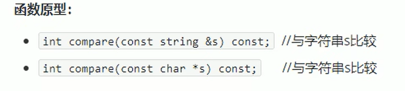

```cpp
void test1()
{
    string str1 = "hello";
    string str2 = "hello";
    if (str1.compare(str2) == 0)
    {
        cout << "Str1 == Str2" << endl;
    }
    else
    {
        cout << "Str1 != Str2" << endl;
    }
};
```

#### string 字符串获取

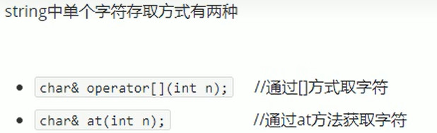

```cpp
void test1()
{
    string str1 = "hello";
    string str2 = "hello";
    cout << str1[1] << endl; //e
    cout << str1.at(1) << endl;//e
    str1[1] = 'H';
    cout << str1[1] << endl;//H
    str1.at(1) = 'G';
    cout << str1[1] << endl;//G
};
```

#### string 字符串插入和删除

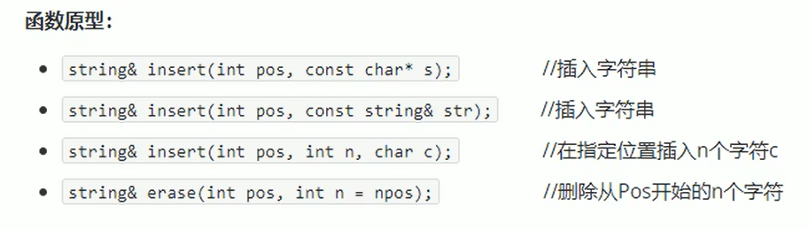

```cpp
void test1()
{
    string str1 = "hello";
    string str2 = "hello";
    cout << str1 << endl;
    str1.insert(2, "1234");
    cout << str1 << endl;
    str1.erase(3, 2);
    cout << str1 << endl;
    // hello
    // he1234llo
    // he14llo
};
```

#### string 片段获取

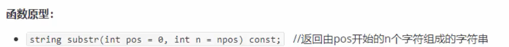

```cpp
void test1()
{
    string str1 = "hello";
    string str2 = "hello";
    cout << str1 << endl;//hello
    string str3 = str1.substr(2, 3);
    cout << str3 << endl;// llo
};
```

#### string 字符转换

```cpp
#include <iostream>
#include <string>

int main() {
    std::string str1 = "12345";
    std::string str2 = "1010";
    std::string str3 = "3.14";
    std::string str4 = "Hello";

    int num1 = std::stoi(str1); // 将 "12345" 转换为整数 12345
    int num2 = std::stoi(str2, nullptr, 2); // 将二进制 "1010" 转换为整数 10
    int num3 = std::stoi(str3); // 将 "3.14" 转换为整数 3（忽略小数部分）
    // int num4 = std::stoi(str4); // 这将抛出 std::invalid_argument 异常

    std::cout << "num1: " << num1 << std::endl;
    std::cout << "num2: " << num2 << std::endl;
    std::cout << "num3: " << num3 << std::endl;

    return 0;
}
```

### vector 容器

- vector 数据结构和数组非常相似，也称为单端数组
- 常规数组是静态空间，而vector可以动态扩展
- 每次根据要扩增的空间，在内存区域找个新的更大的空间，然后将原有数据拷贝到新空间，释放原始空间
- **vector容器的迭代器是支持随机访问的迭代器。**

---

迭代器的随机访问能力意味着你可以使用迭代器直接访问容器中的任何元素，而不需要从容器的一个端点开始逐个遍历。对于支持随机访问的迭代器，以下操作是有效的：

1. **直接索引访问** ：你可以使用迭代器像数组索引一样直接访问元素，例如 `iter[n]` 来访问距离 `iter` 第 `n` 个位置的元素。
2. **算术运算** ：你可以对迭代器进行加法（`+`）、减法（`-`）运算，以及与整数进行加减运算，来移动迭代器的位置。
3. **比较运算** ：你可以使用 `<`、`>`、`<=`、`>=` 等比较运算符来比较两个迭代器的位置。
4. **距离计算** ：你可以计算两个迭代器之间的距离，通常使用 `std::distance` 函数。

---

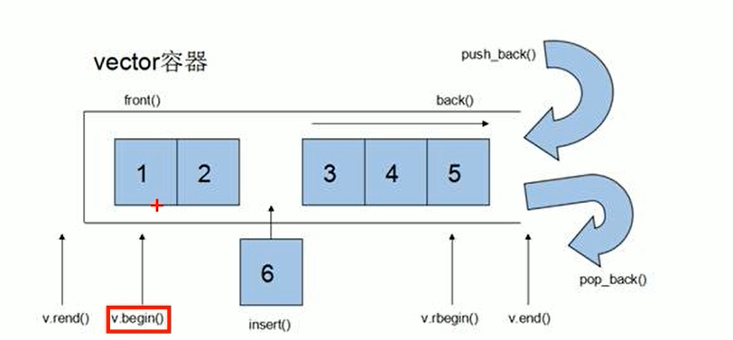

#### vector容器 构造函数

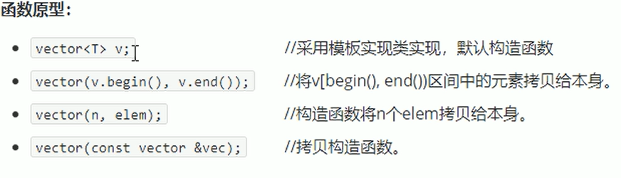

```cpp
void printVector(vector<int> &V)
{
    for (vector<int>::iterator itB = V.begin(); itB != V.end(); itB++)
    {
        cout << " " << *itB;
    }
    cout << endl;
};
void test1()
{
    vector<int> V;
    for (size_t i = 0; i < 8; i++)
    {
        V.push_back(i);
    }
    printVector(V);

    vector<int> V2(V.begin() + 3, V.end());
    printVector(V2);
    vector<int> V3(6, 24);
    printVector(V3);
    vector<int> V4(V3);
    printVector(V4);
//  0 1 2 3 4 5 6 7
//  3 4 5 6 7
//  24 24 24 24 24 24
//  24 24 24 24 24 24
};
```

#### vector 容器 赋值 操作

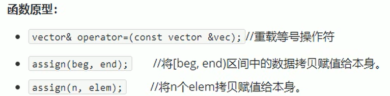

> VD.assign(V.begin(),V.end())  // 将V指定区间的数据拷贝赋值给本身

```cpp
void printVector(vector<int> &V)
{
    for (vector<int>::iterator itB = V.begin(); itB != V.end(); itB++)
    {
        cout << " " << *itB;
    }
    cout << endl;
};
void test1()
{
    vector<int> V;
    for (size_t i = 0; i < 8; i++)
    {
        V.push_back(i);
    }
    printVector(V);

    vector<int> V2;
    V2 = V;
    printVector(V2);
    vector<int> V3;
    V3.assign(V.begin() + 2, V.end());
    printVector(V3);
    vector<int> V4;
    V4.assign(7, 11);
    printVector(V4);
    //  0 1 2 3 4 5 6 7
    //  0 1 2 3 4 5 6 7
    //  2 3 4 5 6 7
    //  11 11 11 11 11 11 11
};
```

#### vector容器 容量和大小

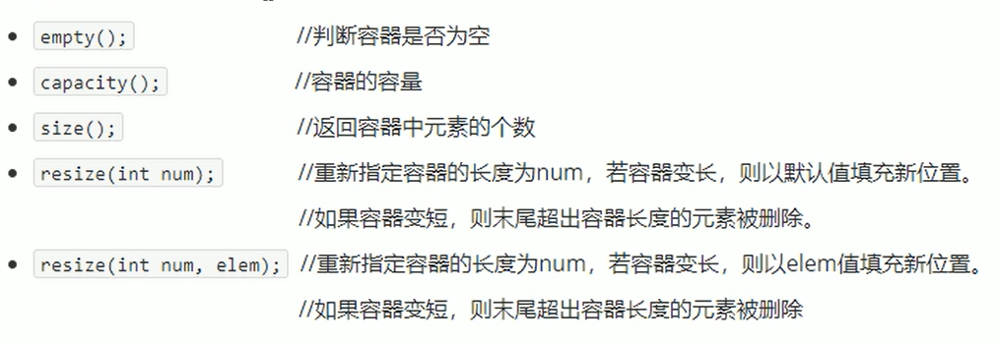

```cpp
void printVector(vector<int> &V)
{
    for (vector<int>::iterator itB = V.begin(); itB != V.end(); itB++)
    {
        cout << " " << *itB;
    }
    cout << endl;
};
void test1()
{
    vector<int> V;
    for (size_t i = 0; i < 8; i++)
    {
        V.push_back(i);
    }
    printVector(V);
    vector<int> V1;
    cout << "V empty return: " << V.empty() << endl;
    cout << "V1 empty return: " << V1.empty() << endl;
    cout << " V capacity: " << V.capacity() << endl;
    cout << "V1 capacity: " << V1.capacity() << endl;
    cout << "V size: " << V.size() << endl;
    cout << "V1 size: " << V1.size() << endl;
    V1.resize(10, 24); // 如果默认将容器变长，默认填充参数是 0
    printVector(V1);
    cout << " V capacity: " << V.capacity() << endl;
    cout << "V1 capacity: " << V1.capacity() << endl;
    //  0 1 2 3 4 5 6 7
    // V empty return: 0
    // V1 empty return: 1
    //  V capacity: 8
    // V1 capacity: 0
    // V size: 8
    // V1 size: 0
    //  24 24 24 24 24 24 24 24 24 24
    //  V capacity: 8
    // V1 capacity: 10
};
```

#### vector容器 插入和删除

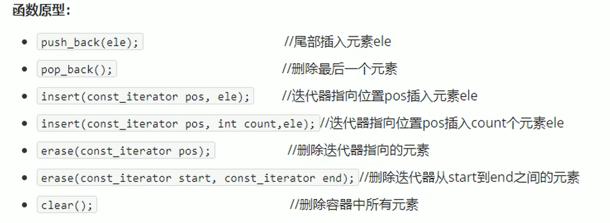

```cpp
void printVector(vector<int> &V)
{
    for (vector<int>::iterator itB = V.begin(); itB != V.end(); itB++)
    {
        cout << " " << *itB;
    }
    cout << endl;
};
void test1()
{
    vector<int> V;
    for (size_t i = 1; i < 8; i++)
    {
        V.push_back(i);
    }
    printVector(V);
    V.pop_back();
    printVector(V);
    V.insert(V.begin() + 2, 5, 100);
    printVector(V);
    V.erase(V.begin() + 3, V.begin() + 6);
    printVector(V);
    V.clear();
    cout << "V size: " << V.size() << endl;
    cout << "V capacity: " << V.capacity() << endl;
    //  1 2 3 4 5 6 7
    //  1 2 3 4 5 6
    //  1 2 100 100 100 100 100 3 4 5 6
    //  1 2 100 100 3 4 5 6
    // V size: 0
    // V capacity: 12
};
```

#### vector容器 数据存取

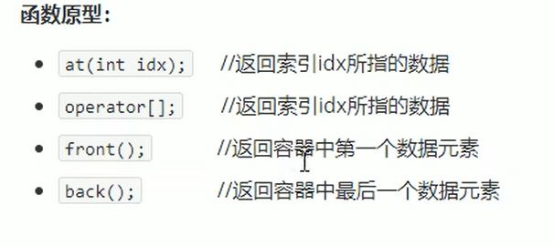

```cpp
void test1()
{
    vector<int> V;
    for (size_t i = 1; i < 8; i++)
    {
        V.push_back(i);
    }
   V.at(1) = 100;
    V[5] = 24;
    for (size_t i = 0; i < V.size(); i++)
    {
        cout << V.at(i) << " ";
        cout << V[i] << " :: ";
    }
    cout << endl;
    cout << V.front() << endl;
    cout << V.back() << endl;
  
};
```

#### vector容器 互换容器

- swap(vec); 将传入参数vec与本身容器进行互换。交换二者全部成员属性

> 合理利用swap 可以收缩内存空间，合理利用匿名对象

```cpp
void printVector(vector<int> &V)
{
    for (vector<int>::iterator itB = V.begin(); itB != V.end(); itB++)
    {
        cout << "  " << *itB;
    }
    cout << endl;
};
void test1()
{
    vector<int> V1, V2;
    for (size_t i = 1; i < 10; i++)
    {
        V1.push_back(i);
        V2.push_back(i + 10);
    }
    printVector(V1);
    printVector(V2);

    V1.swap(V2);
    cout << "---------------------------------" << endl;
    printVector(V1);
    printVector(V2);
    //   1  2  3  4  5  6  7  8  9
    //   11  12  13  14  15  16  17  18  19
    // ---------------------------------
    //   11  12  13  14  15  16  17  18  19
    //   1  2  3  4  5  6  7  8  9
};
void test2()
{
    vector<int> V1, V2;
    for (size_t i = 0; i < 10000; i++)
    {
        V1.push_back(i);
        if (i < 1000)
        {
            V2.push_back(i);
        }
        // cout << "--" << endl;
        // V2[i] = i; //在初始化时，并未给其分配空间，我们采用这种方式初始化回崩溃
    }
    cout << "V1 capacity: " << V1.capacity() << endl;
    cout << "V2 capacity: " << V2.capacity() << endl;
    cout << "V1 size: " << V1.size() << endl;
    cout << "V2 size: " << V2.size() << endl;
    // V1.swap(V2) // 简单的交换数据只会将分配的数据进行交换，数据量较小时不会浪费内存
    // 但是当分配的数据量较大时，编译器会预先分配更多的内存导致数据的浪费。

    // vector<int>(V1)  看做vector容器模板，模板参数列表int ，进行匿名拷贝构造V1得到一个匿名对象
    // 之后使用匿名对象的成员函数swap(V1)与前面我们创建的数据V1进行交换得到匿名对象的占据的内存大小
    // 而匿名对象由编译器进行销毁释放
    //  同时知道编译器分配内存是根据2的次数幂进行分配，所以一般会预留更多的内存使用
    vector<int>(V1).swap(V1);
    cout << "------------------------------------------" << endl;
    cout << "V1 capacity: " << V1.capacity() << endl;
    cout << "V2 capacity: " << V2.capacity() << endl;
    cout << "V1 size: " << V1.size() << endl;
    cout << "V2 size: " << V2.size() << endl;

    // V1 capacity: 16384
    // V2 capacity: 1024
    // V1 size: 10000
    // V2 size: 1000
    // ------------------------------------------
    // V1 capacity: 10000
    // V2 capacity: 1024
    // V1 size: 10000
    // V2 size: 1000
};
```

#### vector容器 预留空间

- 减少vector容器在动态扩展容量时的扩展次数
- reserve（int len) ;  // **容器预留len个元素长度，预留位置不初始化，元素不可以访问**

```cpp
void test1()
{
    vector<int> V1;
    V1.reserve(1000);
    // 我们可以实现预留告诉编译器提前预留多少的空间给我们程序，这样就可以避免反复寻找空间的繁琐和消耗时间
    int flag = 0;
    int *p = NULL;
    // vector 是每次添加新的数据可能都需要进行拷贝寻找新的地址空间，因此，可以计算拷贝寻找新空间的次数

    for (size_t i = 0; i < 1000; i++)
    {
        V1.push_back(i);
        if (p != &V1[0])
        {
            p = &V1[0];
            flag++;
        }
    }
    cout << flag << endl;
};
```

### deque 容器

- 双端数组，可以对头端进行插入删除操作
- deque 与vector 区别：
  1. vector 对于头部的插入删除效率低，数据量越大，效率越低
  2. deque 相对而言，对头部的插入删除速度比vector快
  3. vector访问元素时的速度比deque快，这和两者的内部实现有关。

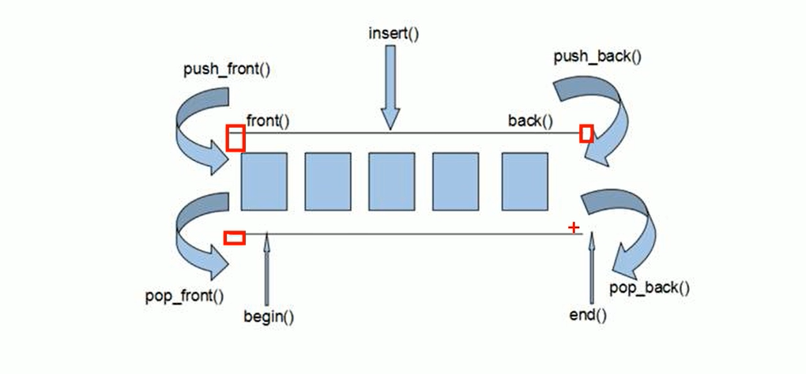

- 内部工作原理：

deque 内部有个中控器，维护每段缓冲区的中的地址，缓冲区存放真实的数据

中控器维护的是每个缓冲区的地址，使得deque像一片连续的内存空间

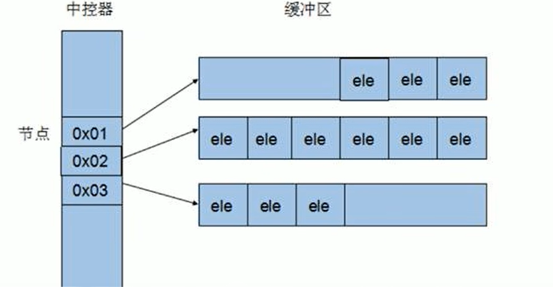

> deque 容器的迭代器也是支持随机访问的。

#### deque构造函数

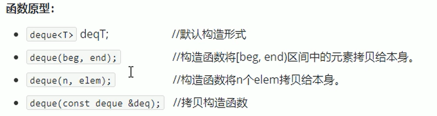

> 常量迭代器

```cpp
void printdeque(const deque<int> &dq)
{
    // 引用常量时，要使用常量迭代器
    for (deque<int>::const_iterator it = dq.begin(); it != dq.end(); it++)
    {
        cout << *it << " ";
    }
    cout << endl;
};

void test1()
{
    deque<int> dq1;
    for (size_t i = 0; i < 10; i++)
    {
        dq1.push_front(i);
    }
    printdeque(dq1);
    deque<int> dq2(dq1.begin() + 2, dq1.end());
    printdeque(dq2);
    deque<int> dq3(10, 24);
    printdeque(dq3);
    deque<int> dq4(dq2);
    printdeque(dq4);
    // 9 8 7 6 5 4 3 2 1 0
    // 7 6 5 4 3 2 1 0
    // 24 24 24 24 24 24 24 24 24 24
    // 7 6 5 4 3 2 1 0
};
```

#### deque赋值操作

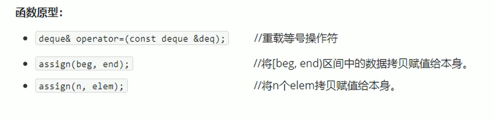

```cpp
void printdeque(const deque<int> &dq)
{
    // 引用常量时，要使用常量迭代器
    for (deque<int>::const_iterator it = dq.begin(); it != dq.end(); it++)
    {
        cout << *it << " ";
    }
    cout << endl;
};

void test1()
{
    deque<int> dq1;
    for (size_t i = 0; i < 10; i++)
    {
        dq1.push_front(i);
    }
    printdeque(dq1);
    deque<int> dq2;
    dq2 = dq1;
    printdeque(dq2);
    dq2.assign(dq1.begin() + 3, dq1.end() - 3);
    printdeque(dq2);
    dq2.assign(10, 66);
    printdeque(dq2);
};
```

#### deque 大小操作

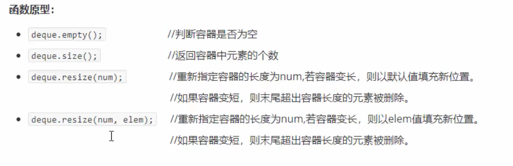

> deque 没有容量capacity概念，可以无限扩展空间.

#### deque 插入和删除

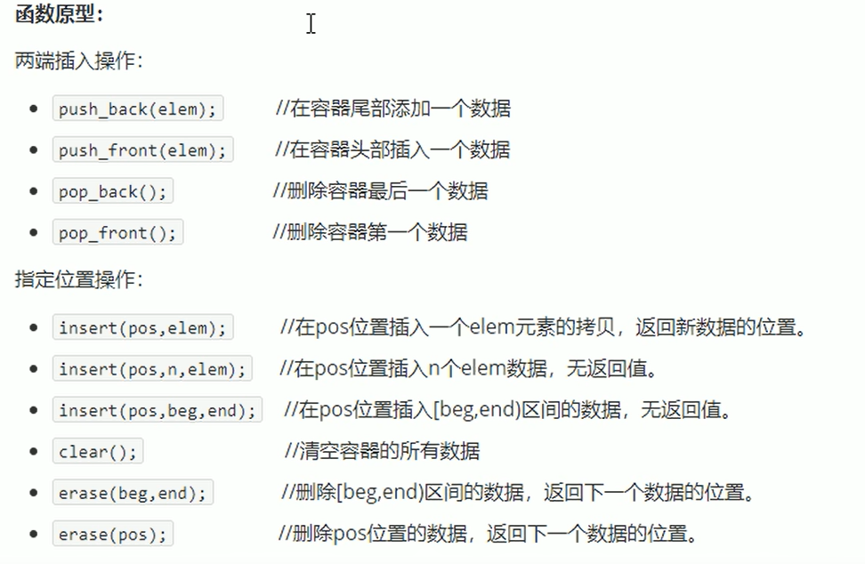

```cpp
void printdeque(const deque<int> &dq)
{
    // 引用常量时，要使用常量迭代器
    for (deque<int>::const_iterator it = dq.begin(); it != dq.end(); it++)
    {
        cout << *it << " ";
    }
    cout << endl;
};

void test1()
{
    deque<int> dq1;
    for (size_t i = 0; i < 10; i++)
    {
        dq1.push_back(i);
        dq1.push_front(i + 10);
    }
    printdeque(dq1);
    dq1.pop_back();
    dq1.pop_front();
    printdeque(dq1);
    dq1.insert(dq1.begin() + 3, 100);
    printdeque(dq1);
  
};
```

#### deque 数据存取

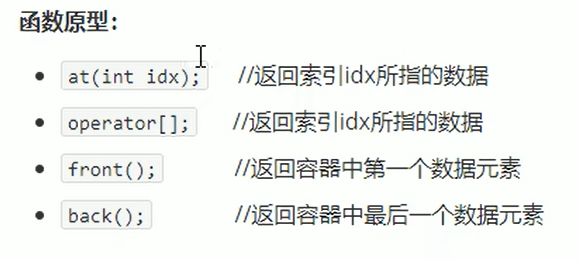

#### deque 排序操作

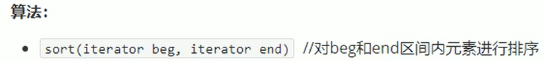

```cpp
void test1()
{
    deque<int> dq1;
    for (size_t i = 0; i < 10; i++)
    {
        dq1.push_back(i);
        dq1.push_front(i + 10);
    }
    printdeque(dq1);
    deque<int>::iterator dqBegin = dq1.begin();
    deque<int>::iterator dqEnd = dq1.end();
    // 从小到大排序。对于支持随机访问的迭代器的容器，都可以利用sort算法直接进行排序，如vector
    sort(dqBegin, dqEnd);
    printdeque(dq1);
};
```

---

vector容器与deque容器尝试案例，进行评委打分排序

```cpp
#include <iostream>
#include <deque>
#include <algorithm>
#include <vector>
using namespace std;
double Pi = 3.1415926;

void printdeque(const deque<float> &dq)
{
    // 引用常量时，要使用常量迭代器
    for (deque<float>::const_iterator it = dq.begin(); it != dq.end(); it++)
    {
        cout << *it << " ";
    }
    cout << endl;
};

class Person
{
    friend ostream &operator<<(ostream &cout, const Person &P)
    {
        cout << "Person Name:  " << P.Name << endl;
        cout << "Person Score: " << P.Score << endl;
        cout << "-----------------------------------------" << endl;
        return cout;
    }

private:
    string Name;
    float Score;

public:
    Person(string name, float score);

    ~Person();
    void SetScore(float score);
};

Person::Person(string name, float score)
{
    this->Name = name;
    this->Score = score;
}

Person::~Person()
{
}
void Person::SetScore(float score)
{
    this->Score = score;
}

void CreatePerson(vector<Person> &V, const int &Count)
{
    char begin = 'A';

    for (size_t i = 0; i < Count; i++)
    {
        string Name = "person ";
        char temp = begin + i;
        Name = Name + temp;
        Person P(Name, 0.00);
        V.push_back(P);
    }
};
void ShowVectorPerson(const vector<Person> &V)
{
    for (vector<Person>::const_iterator it = V.begin(); it != V.end(); it++)
    {
        cout << *it;
    }
};
void SetScore(deque<deque<float>> &DQ, const int &PersonNum, const int &ScoreNum)
{
    for (size_t i = 0; i < PersonNum; i++)
    {
        deque<float> TempDq;
        for (size_t i = 0; i < ScoreNum; i++)
        {
            float score = rand() % 41 + 60;
            TempDq.push_back(score);
        }
        DQ.push_back(TempDq);
    }
};
void CaculateAvg(deque<deque<float>> &DQ, vector<Person> &V)
{
    int flag = 0;
    for (deque<deque<float>>::iterator it = DQ.begin(); it != DQ.end(); it++)
    {
        // 根据输入的评分进行排序
        sort((*it).begin(), (*it).end());
        // 去除最高分和最低分
        (*it).pop_back();
        (*it).pop_front();
        float sum = 0;
        // 测试打印输出
        for (deque<float>::iterator itself = (*it).begin(); itself != (*it).end(); itself++)
        {
            sum += *itself;
            cout << *itself << " ";
        }
        cout << endl;
        float avg = sum / (*it).size();
        // 将计算好的平均分传递保存到vector容器当中
        V.at(flag).SetScore(avg);
        flag++;
    }
};
void test1()
{
    vector<Person> V;
    int PersonCount = 100;
    CreatePerson(V, PersonCount);
    ShowVectorPerson(V);
    deque<deque<float>> DQ;
    SetScore(DQ, PersonCount, 10);
    for (deque<deque<float>>::iterator it = DQ.begin(); it != DQ.end(); it++)
    {
        printdeque(*it);
    }
    cout << "---------------------------------------------------------------------" << endl;
    CaculateAvg(DQ, V);
    cout << "---------------------------------------------------------------------" << endl;
    ShowVectorPerson(V);
};
```

### stack 容器

#### stack 介绍

- stack 是一种先进后出的数据结构，只有一个出口
- 栈只有一个入口和出口，内部元素不能轻易访问遍历。只能访问栈顶部的元素
- 栈可以判断内部是否为空 。empty
- 栈可以返回元素个数。 size

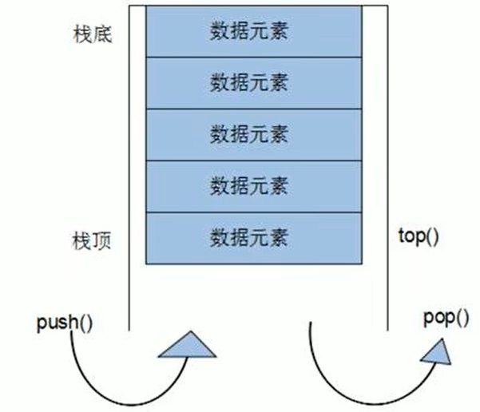

#### stack 常用接口

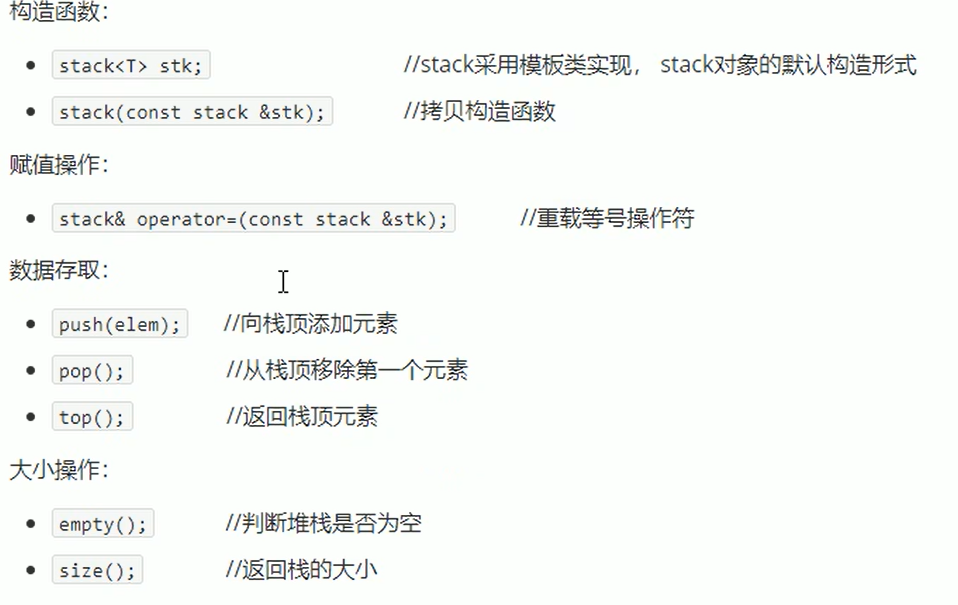

> `stack` 类型确实支持默认的赋值运算符，这是因为 `stack` 继承自其底层容器的赋值行为。这意味着你可以使用 `=` 运算符将一个 `stack` 对象赋值给另一个相同类型的 `stack` 对象，只要它们的元素类型和底层容器类型相同。

```cpp
void test1()
{
    stack<int> S;
    S.push(100);
    S.push(67);
    S.push(11);
    while (!S.empty())
    {
        cout << "Stack pop Variable is : " << S.top() << endl;
        S.pop();
        cout << "Stack Size: " << S.size() << endl;
    }
};
```

### queue 容器

#### queue 介绍

- queue是先进先出的数据结构，有两个出口。
- 队列允许一端增加新数据，从另一端移出数据
- 队列中只有队头和队尾可以被外界访问，因此队列也不允许访问内部的其他数据，不可以进行遍历

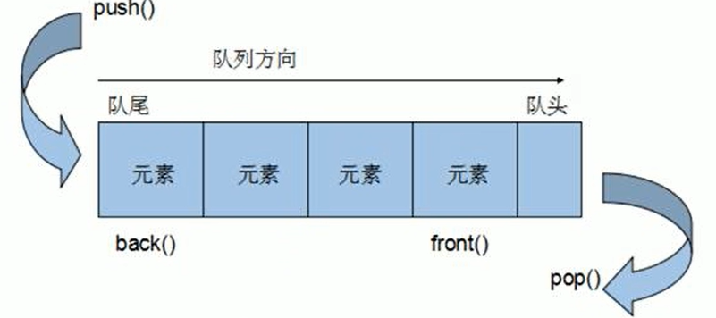

#### queue 接口介绍

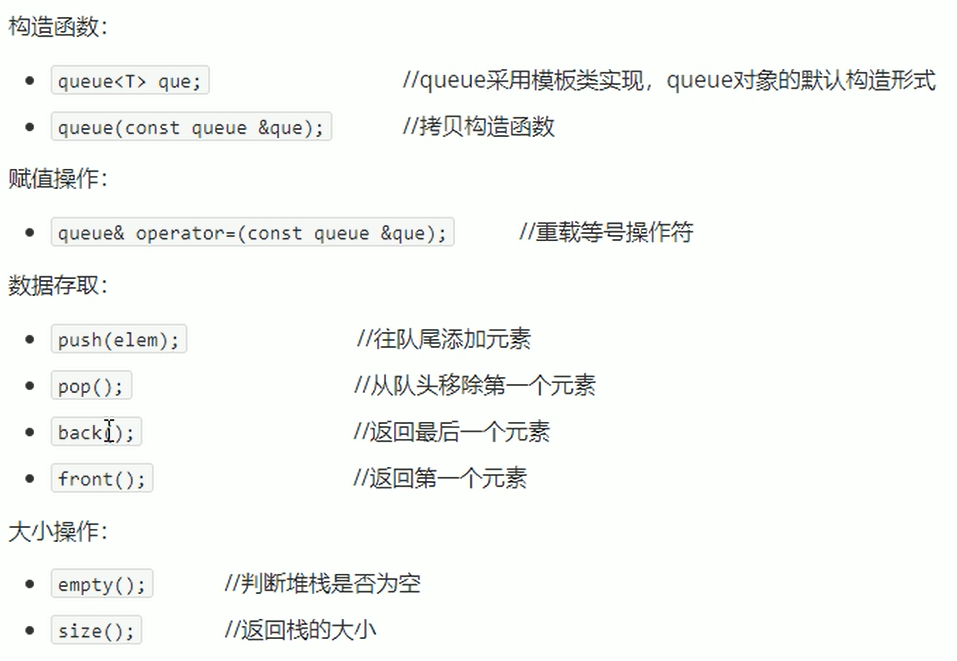

### list 容器（链表）

#### list 介绍

- 将数据进行链式存储。采用动态存储分配，不会造成内存的浪费和溢出
- 可以对任意位置进行快速的插入和删除元素。不需要移动大量元素。
- list容器遍历速度慢，内部内存非连续。占用空间大。
- STL中链表是一个双向循环链表。（第一个数据的指针域的前向地址指向最后一个数据的地址，最后一个数据的next指针域存储的是第一个数据的地址）

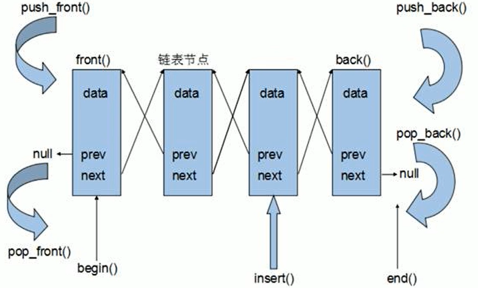

> 链表的存储方式并不是连续的内存空间，因此链表的迭代器只支持前移和后移，属于双向迭代器。

---

> list链表容器，无论插入或是删除操作都不会造成原有的list迭代器失效。
>
> 但是对于vector恰恰相反。vector每次插入或是删除元素可能会发生将原有数据拷贝到新分配的一块连续内存空间中去。迭代器存储的是数据地址，如果没有改变迭代器，那他指向的是过去那片内存区域，会出错。

---

#### list 构造函数

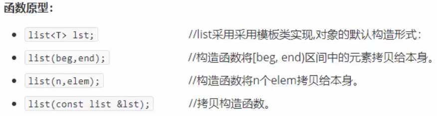

```cpp
void ShowList(const list<int> &L)
{
    for (list<int>::const_iterator it = L.begin(); it != L.end(); it++)
    {
        cout << *it << " ";
    }
    cout << endl;
}
void test1()
{
    list<int> L1;
    L1.push_front(100);
    L1.push_back(110);
    L1.push_back(120);
    L1.push_back(130);
    ShowList(L1);
    list<int> L2(++L1.begin(), L1.end());
    ShowList(L2);
};
```

#### list 赋值和交换

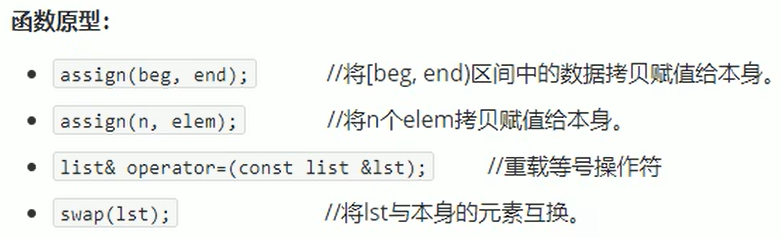

#### list 大小操作

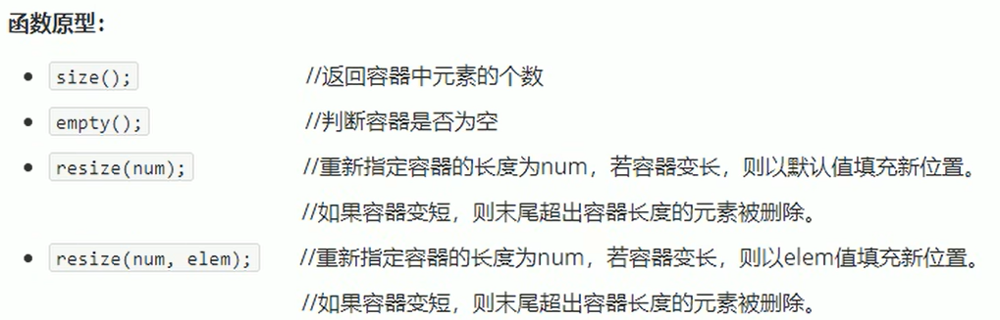

#### list 插入和删除

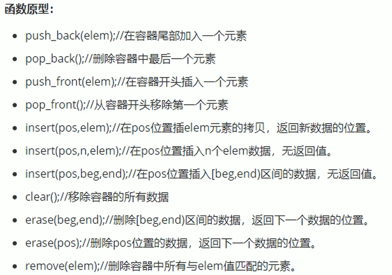

#### list 数据存取

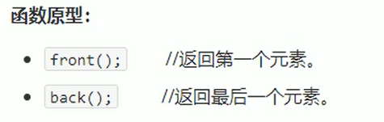

> list 不支持[ ]和at(index) 进行跳跃式访问，链表结构非连续线性空间存储，迭代器不支持随机访问。

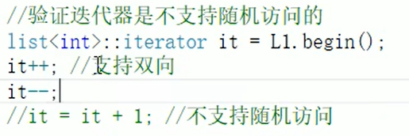

#### list 反转和排序（自定义数据类型）

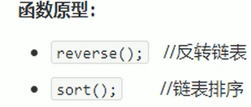

> 不支持随机访问迭代器的容器，不可以使用标准算法
>
> 但是这类容器会提供部分相关的算法。

---

```cpp
void ShowList(const list<int> &L)
{
    for (list<int>::const_iterator it = L.begin(); it != L.end(); it++)
    {
        cout << *it << " ";
    }
    cout << endl;
}
bool MyCompare(int a, int b)
{
    return a > b;
};
void test1()
{
    list<int> L1;
    L1.push_front(100);
    L1.push_back(110);
    L1.push_back(120);
    L1.push_back(130);
    L1.push_front(12);
    L1.push_front(24);
    ShowList(L1); // 24 12 100 110 120 130
    cout << "----------------------------" << endl;
    L1.sort();
    ShowList(L1); // 12 24 100 110 120 130
    L1.sort(MyCompare);
    ShowList(L1); // 130 120 110 100 24 12
};

```

> 在 C++ 中，`list` 容器的 `sort` 函数可以接受一个可选的比较函数参数，这个比较函数用于确定元素之间的排序顺序。默认情况下，如果不提供比较函数，`sort` 函数会使用 `<` 运算符来比较元素，从而按升序排列元素。在您提供的代码中，`MyCompare` 函数是一个自定义的比较函数，它接收两个 `int` 类型的参数，并返回一个布尔值。
>
> 对于自定义数据类型，必须要指定排序规则，否则编译器不知道如何进行排序
>
> 高级排序只是回调用我们定义的排序规则进行排序。

```cpp
#include <iostream>
#include <string>
#include <list>
using namespace std;
double Pi = 3.1415926;
class Person
{
    friend bool MyCompare(const Person &a, const Person &b);
    friend ostream &operator<<(ostream &cout, const Person &P)
    {
        cout << "Person Name:  " << P.Name;
        cout << "         \tPerson Score: " << P.Score;
        cout << "         \tPerson Age: " << P.Age << endl;
        // cout << "-----------------------------------------" << endl;
        return cout;
    }

private:
    string Name;
    float Score;
    int Age;

public:
    Person(string name, float score, int age);

    ~Person();
};

Person::Person(string name, float score, int age)
{
    this->Name = name;
    this->Score = score;
    this->Age = age;
}

Person::~Person()
{
}

void ShowList(const list<Person> &L)
{
    for (list<Person>::const_iterator it = L.begin(); it != L.end(); it++)
    {
        cout << *it << " ";
    }
    cout << endl;
}
bool MyCompare(const Person &a, const Person &b)
{
    if (a.Age == b.Age)
    {
        return a.Score > b.Score;
    }
    return a.Age > b.Age;
};
void test1()
{
    list<Person> L1;
    Person p1("libai", 96, 24);
    Person p2("liyuan", 98, 30);
    Person p3("zhaoyun", 100, 30);
    Person p4("hanxin", 66, 30);
    Person p5("ake", 90, 26);
    Person p6("yunying", 6, 2);
    L1.push_back(p1);
    L1.push_back(p2);
    L1.push_back(p3);
    L1.push_back(p4);
    L1.push_back(p5);
    L1.push_back(p6);
    ShowList(L1);
    L1.sort(MyCompare);
    cout << "----------------------------------------------------" << endl;
    ShowList(L1);
};

int main()
{
    test1();
    // test2();
    // system("pause");
    return 0;
}

```

---

### set 容器/ multiset容器

#### set介绍

- 所有元素在插入时自动被排序
- set/multiset 属于关联式容器，内部是二叉树结构
- set 容器不允许容器中有重复的元素，而multiset允许容器中有重复的元素。

#### set构造函数和赋值

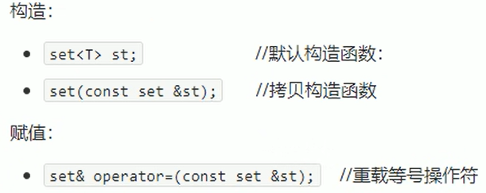

#### set 大小和交换

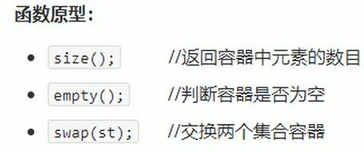

#### set 插入和删除

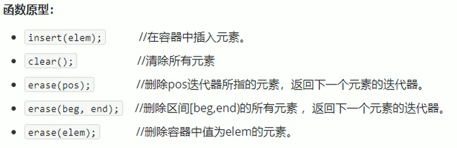

#### set查找和统计

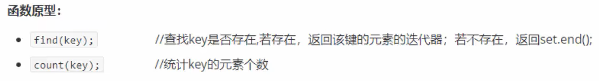

#### set和multiset区别

- set不可以插入重复数据，而multiset可以
- set 插入数据的同时会返回插入结果，表示插入成功
- multiset 不会检测数据，因此可以插入重复数据。

```cpp
void test1()
{
    multiset<int> S2;
    set<int> s1;

    pair<set<int>::iterator, bool> result = s1.insert(111);
    if (result.second)
    {
        cout << "insert finished!" << endl;
    }
    else
    {
        cout << "insert error!" << endl;
    }
    // 对组模板，我们想要接受结果对组，就需要声明变量类型
    pair<set<int>::iterator, bool> result1 = s1.insert(111);
    // 这个就是获取pair组的第二个数据
    if (result1.second)
    {
        cout << "insert finished!" << endl;
    }
    else
    {
        cout << "insert error!" << endl;
    }
}
```

#### pair对组创建

- 成对出现的数据，可以利用对组返回两个数据。

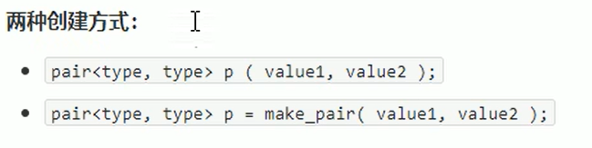

#### set容器排序

- set容器排序默认规则是从小到大。
- 想要修改排序规则，就要利用仿函数。

```cpp
class mycompare
{
public:
    bool operator()(const int &a, const int &b)
    {
        return a > b;
    }
};
void test1()
{
    set<int, mycompare> S; // set在插入数据时就会自动排序，我们需要的就是在插入前创建对象的时候就要声明降序
	// 而降序就需要我们利用仿函数技术。
    S.insert(23);
    S.insert(27);
    S.insert(25);
    S.insert(30);
    for (set<int, mycompare>::iterator it = S.begin(); it != S.end(); it++)
    {
        cout << *it << " ";
    }
    cout << endl;
}
```

> 除此之外，set容器对于自定义数据类型，需要自己制定排序规则。同样需要我们写个比较类，并做仿函数进行设计排序规则。参照list中排序规则方法。

### map 容器（multimap）

#### map 介绍

- map中所有的**元素都是pair**
- pair中第一个元素是key（键值），第二个元素是value值
- **所有元素根据元素的键值进行自动的排序**。
- multimap和map都是关联式容器，底层结构是用二叉树实现。

1. 可以根据key值快速定位得到value值。
2. map不允许有重复的key值元素。multimap允许容器中有重复的key值。

#### map 构造和赋值

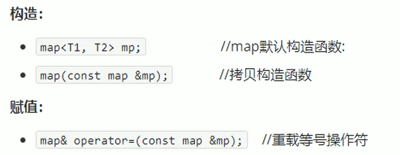

```cpp
void test2()
{
    map<int, int> MP;
    MP.insert(pair<int, int>(10, 20));
}
```

#### map 大小和交换

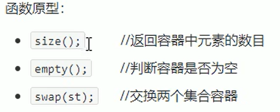

#### map 插入和删除

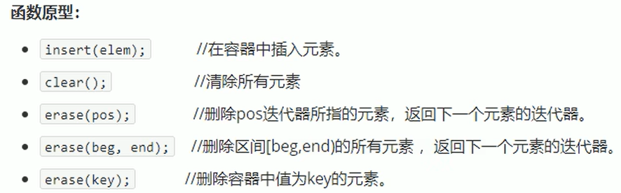

> map容器支持mp[key]进行访问和修改数据，但是不建议这种方式创建数据。mp[key] = value;
>
> map不允许插入相同key值的value，当已经出现在内的，后者不能插入成功。

#### map 查找和统计

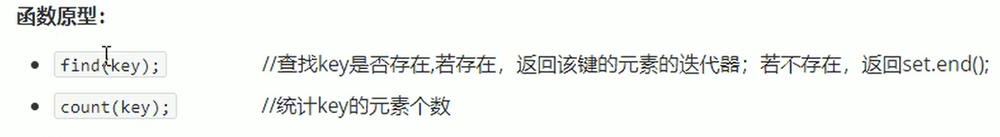

#### map 容器排序

> 同样采用（比较类中写仿函数）操作进行修改排序规则，因为他和set容器一样在插入时候，就会自动进行排序，所以我们想要按照自己的顺序进行插入排序，就需要我们在声明变量时候，就告诉他降序或是升序。（默认升序）
>
> 在仿函数编写时候，我们比较的参数是key，因为map是按照key值进行排序的。因此仿函数传入参数，应该是key值的数据类型
>
> 就算是自定义数据类型的map，也需要我们写好仿函数对应的类

```cpp
class mycompare
{
public:
    bool operator()(const int &a, const int &b)
    {
        return a > b;
    }
};
void showmap(const map<int, int, mycompare> &MP)
{
    for (map<int, int>::const_iterator it = MP.begin(); it != MP.end(); it++)
    {
        cout << it->first << "    " << it->second << endl;
    }
    cout << endl;
}
void test2()
{
    map<int, int> MP;
    MP.insert(pair<int, int>(10, 20));
    map<int, int, mycompare> MP2;
    MP2.insert(make_pair(10, 109));
    MP2.insert(make_pair(110, 120));
    showmap(MP2);
}
```

### 函数对象（仿函数类）

- 重载函数调用操作符的类，其对象称为函数对象
- 函数对象使用重载的（）时，行为类似函数调用，也叫做仿函数。
- 但本质上，函数对象（仿函数）是一个类，不是一个函数。

特点：

1. 函数对象在使用时，可以像普通函数那样调用，可以有参数，可以有返回值。（函数调用符号的重载，可以自己定义输入输出）
2. 函数对象超出普通函数的概念，函数对象可以有自己的状态。 （函数对象作为类，可以拥有自己的属性，可以完成一些其他的统计和计算保存）
3. 函数对象可以作为参数传递。（函数对象作为类，可以传递给其他函数。）

### 谓词

- 返回bool类型的仿函数称为谓词
- 如果operator（）重载接受一个参数，那叫一元谓词
- 如果operator（）重载接受两个参数，那叫二元谓词

#### 一元谓词

```cpp
class A
{
public:
    // 一元谓词，只有一个传入参数，bool型数据返回
    bool operator()(float &C)
    {
        return C > 5;
    }
};

void test2()
{
    vector<float> V;
    for (int i = 0; i < 10; i++)
    {
        V.push_back(i);
    }
    // find_if 就是STL算法库中，的一个算法，根据我们的数据，进行使用函数对象，进行判断是否满足条件
    // 因为内部执行判断，所以使用谓词
    vector<float>::iterator it = find_if(V.begin(), V.end(), A());
    if (it == V.end())
    {
        cout << "No find" << endl;
    }
    else
    {
        cout << "Find ! " << *it << endl;
    }
};
```

#### 二元谓词

```cpp
class A
{
public:
    // 二元谓词，两个传入参数，bool型数据返回
    bool operator()(float &C, float &D)
    {
        return C > D;
    }
};

void test2()
{
    vector<float> V;
    for (int i = 0; i < 20; i++)
    {
        V.push_back(i);
    }
    for (vector<float>::iterator its = V.begin(); its != V.end(); its++)
    {
        cout << *its << " ";
    }
    cout << endl;

    sort(V.begin(), V.end(), A());
    for (vector<float>::iterator its = V.begin(); its != V.end(); its++)
    {
        cout << *its << " ";
    }
    cout << endl;
};
```

### 内建函数对象

- STL 内部提供的一些标准函数对象

1. 算数仿函数
2. 关系仿函数
3. 逻辑仿函数

- 仿函数所产生的对象，所使用方法和一般函数完全相同
- 使用内建函数对象，需要引入头文件#include `<functional>`

#### 算数仿函数

- 实现自定义数据类型进行四则运算
- negate 是一元运算，其他都是二元运算

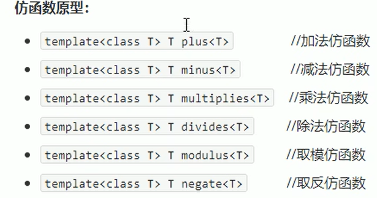

```cpp
void test2()
{
    vector<float> V;
    for (int i = 0; i < 20; i++)
    {
        V.push_back(i);
    }
    for (vector<float>::iterator its = V.begin(); its != V.end(); its++)
    {
        cout << *its << " ";
    }
    cout << endl;
    vector<float>::iterator it = V.begin();
    // 对象函数，这里使用匿名对象的方式进行使用仿函数。
    float s = plus<float>()(*it, *(++it));
    cout << *it << endl; // 1
    cout << s; // 2  
    // 这里为什么是2暂时还不理解，后期找教程吧
};
```

#### 关系仿函数(有问题!!!!自定义数据类型)

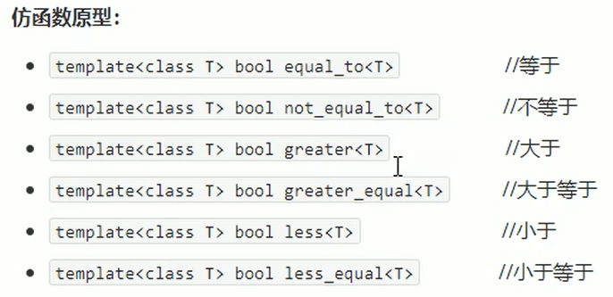

```cpp
#include <iostream>
#include <vector>
#include <algorithm>
#include <functional>
#include <Person.h>
using namespace std;
double Pi = 3.1415926;
class mycopart
{
public:
    bool operator()(Person &A, Person &B)
    {
        return A > B;
    }
};

void test2()
{
    vector<float> V;
    for (int i = 0; i < 10; i++)
    {
        V.push_back(i);
    }
    for (vector<float>::iterator its = V.begin(); its != V.end(); its++)
    {
        cout << *its << " ";
    }
    cout << endl;

    vector<float>::iterator it = V.begin();
    // 对象函数，这里使用匿名对象的方式进行使用仿函数。
    sort(V.begin(), V.end(), greater<float>());
    for (vector<float>::iterator its = V.begin(); its != V.end(); its++)
    {
        cout << *its << " ";
    }
    cout << endl;
};
void test3()
{
    vector<Person> VP;
    Person P1(18, "xiaohua", 66);
    Person P2(24, "zhangfei", 17);
    Person P3(1, "lvbu", 76);
    Person P4(89, "beijing", 66);
    VP.push_back(P1);
    VP.push_back(P2);
    VP.push_back(P3);
    VP.push_back(P4);
    for (vector<Person>::iterator it = VP.begin(); it != VP.end(); it++)
    {
        cout << *it << endl;
    }
     sort(VP.begin(), VP.end()); // 默认升序. Person中重载了小于比较符号,可以正常运行,但是
    // 下面这个使用STL标准函数对象,greater和less均无法顺利执行
    // sort(VP.begin(), VP.end(), less<Person>()); // 使用标准库中的关系仿函数对象
    for (vector<Person>::iterator it = VP.begin(); it != VP.end(); it++)
    {
        cout << *it << endl;
    }
}

int main()
{
    test3();
    // test2();
    // system("pause");
    return 0;
}
```

```cpp
#ifndef PERSON_H
#define PERSON_H

#include <iostream>
#include <stdio.h>
#include <string>
#include "Point.h"
using namespace std;

class Person
{
    friend ostream &operator<<(ostream &cout, const Person &P);

public:
    // 无参数构造
    Person()
    {
        cout << "           wucangouzao Person " << endl;
    }

    // 有参数构造
    Person(int age, string s, int height)
    {
        m_age = age;
        m_height = height;
        m_Name = s;
        cout << "           youcangouzao Person " << endl;
    }

    // 初始化列表方式，初始化属性
    Person(int age, int ab) : m_age(age) {}

    // 拷贝构造 这个引用&不能舍去。
    Person(const Person &P)
    {
        cout << "           kaobei gouzao Person " << endl;
        m_age = P.m_age;
        m_Name = P.m_Name;
        // // 浅拷贝，只是将数据的地址赋值过去，因此二者指向的同一个内存块，另一个类释放后，再去释放就会中断。
        // m_height = P.m_height;
        // 深拷贝，先为其分配一篇地址空间存储数据，然后在将分配的地址赋值给height
        m_height = P.m_height;
        // m_point = P.m_point;
    }
    ~Person()
    {
        //     if (m_height != NULL)
        //     {
        //         delete m_height;
        //         m_height = NULL;
        //         // cout << "m_HHH" << endl;
        //         cout << "               xigou Person" << endl;
        //     }
        //     else
        //     {
        //         cout << "        Loss  xigou Person
        // }
    }
    // set name
    void setName(string name)
    {
        m_Name = name;
    }
    // get name
    string getName()
    {
        return m_Name;
    }
    // set idol
    void set_idol(string idol)
    {
        m_idol = idol;
    }

    void set_age(int age)
    {
        if (age < 0 || age > 150)
        {
            cout << "age error" << endl;
            cout << " set age is unseccessed !" << endl;
        }
        else
        {
            m_age = age;
            cout << "age have been changed! " << endl;
        }
    }
    int get_age()
    {
        return m_age;
    }
    void set_height(int hei)
    {
        m_height = hei;
    };
    int get_height()
    {
        return m_height;
    }
    bool operator>(Person &P);
    bool operator<(Person &P);

private:
    string m_Name;
    int m_age;
    string m_idol;
    int m_height;
    // Point m_point;
};

ostream &operator<<(ostream &cout, const Person &P)
{
    cout << "Person Name = " << P.m_Name << endl;
    cout << "Person Age =  " << P.m_age << endl;
    cout << "Person Height=" << P.m_height << endl;
    cout << "-------------------------------------";
    return cout;
};
bool Person::operator>(Person &P)
{
    return this->m_age > P.m_age;
};
bool Person::operator<(Person &P)
{
    return this->m_age < P.m_age;
}
#endif
```

#### 逻辑仿函数

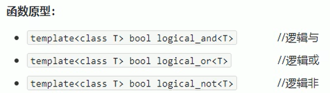

### STL 常见内置算法

- 算法主要由头文件 `<algorithm> <functional> <numeric> 组成`
- `<algorithm> 是所有STL头文件中最大的一个,包含的算法是最多和最广泛的`
- `<numeric>  体积小,只包含几个在序列上进行简单数学运算的模板函数`
- `<functional>  定义了一些模板类,用于声明函数对象`

#### for_each

- 利用回调函数遍历变量中全部数据

```cpp
#include <iostream>
#include <vector>
#include <algorithm>
#include <functional>
#include <Person.h>
using namespace std;
double Pi = 3.1415926;
class mycopart
{
public:
    bool operator()(Person &A, Person &B)
    {
        return A > B;
    }
};
class myprint
{
public:
    void operator()(const Person &P)
    {
        cout << P << endl;
    }
};
void printMYPerson(const Person &P)
{
    cout << P << endl;
};
void test3()
{
    vector<Person> VP;
    Person P1(18, "xiaohua", 66);
    Person P2(24, "zhangfei", 17);
    Person P3(1, "lvbu", 76);
    Person P4(89, "beijing", 66);
    VP.push_back(P1);
    VP.push_back(P2);
    VP.push_back(P3);
    VP.push_back(P4);
    // 使用自定义函数作为算法的回调函数，不需要加函数符号
    for_each(VP.begin(), VP.end(), printMYPerson);
    sort(VP.begin(), VP.end()); // 默认升序. Person中重载了小于比较符号,可以正常运行,但是
    // 下面这个使用STL标准函数对象,greater和less均无法顺利执行
    // sort(VP.begin(), VP.end(), less<Person>()); // 使用标准库中的关系仿函数对象
    // 对于函数对象作为算法的回调函数，需要添加函数符号，表示匿名对象
    for_each(VP.begin(), VP.end(), myprint());
}
```

#### transform

- 搬运容器到另一个容器中去。func表示在进行搬运前对数据做写操作，在搬运如其他容器中去。

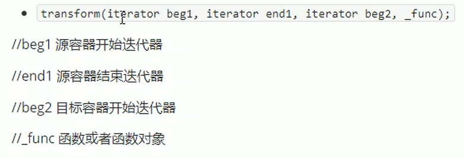

```cpp
#include <iostream>
#include <vector>
#include <algorithm>
#include <functional>
#include <Person.h>
using namespace std;
double Pi = 3.1415926;
class mycopart
{
public:
    bool operator()(Person &A, Person &B)
    {
        return A > B;
    }
};
class myprint
{
public:
    void operator()(const Person &P)
    {
        cout << P << endl;
    }
};
void printMYPerson(const Person &P)
{
    cout << P << endl;
};
class myAdd
{
public:
    Person operator()(Person &P)
    {
        P.set_height(155);
        return P;
    }
};

void test3()
{
    vector<Person> VP;
    Person P1(18, "xiaohua", 66);
    Person P2(24, "zhangfei", 17);
    Person P3(1, "lvbu", 76);
    Person P4(89, "beijing", 66);
    VP.push_back(P1);
    VP.push_back(P2);
    VP.push_back(P3);
    VP.push_back(P4);
    // 使用自定义函数作为算法的回调函数，不需要加函数符号
    for_each(VP.begin(), VP.end(), printMYPerson);
    sort(VP.begin(), VP.end()); // 默认升序. Person中重载了小于比较符号,可以正常运行,但是
    // 下面这个使用STL标准函数对象,greater和less均无法顺利执行
    // sort(VP.begin(), VP.end(), less<Person>()); // 使用标准库中的关系仿函数对象
    // 对于函数对象作为算法的回调函数，需要添加函数符号，表示匿名对象
    for_each(VP.begin(), VP.end(), myprint());

    vector<Person> V2;
    V2.resize(VP.size());                                 // 目标容器进行转移前，需要开辟空间，但是reserve不行，只是预留空间，但是未初始化，所以无法使用，没有权限写入和访问
    transform(VP.begin(), VP.end(), V2.begin(), myAdd()); // transform 进行容器拷贝转移，还是操作，都需要我们写一个有返回值类型的回调函数或函数对象才行
    for_each(V2.begin(), V2.end(), myprint());
}
```

#### 常见查找算法

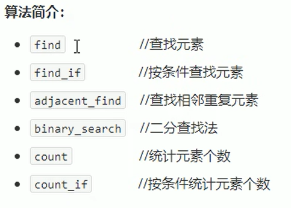

##### find 算法，查找指定元素，找到返回指定元素的迭代器，找不到返回结束迭代器位置。 对于自定义数据类型，需要重载关系运算符==

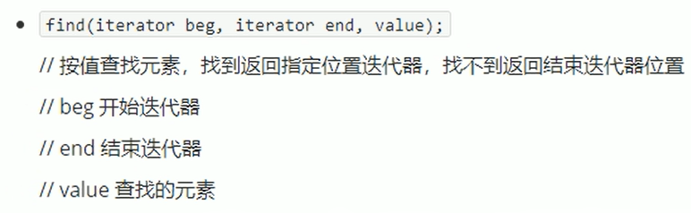

```cpp
    Person P5(89, "beijing", 66);
    // find算法使用前，需要实现在我们的数据类型内进行重载==比较运算符，不然不知道怎么进行判断会崩溃
    vector<Person>::iterator it = find(VP.begin(), VP.end(), P5);
    if (it != VP.end())
    {
        cout << *it;
    }
    else
    {
        cout << "NO ! Find !" << endl;
    }
```

##### find_if  按条件查找元素

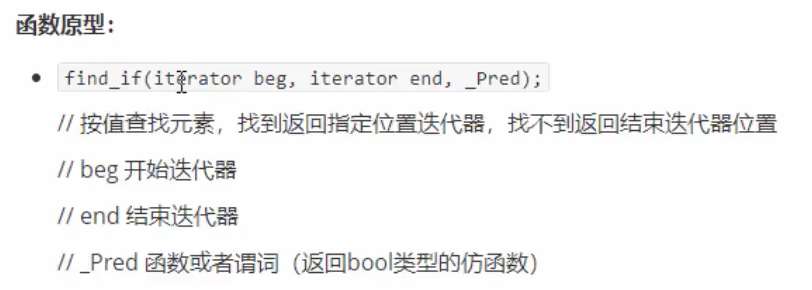

```cpp
bool gerater(Person &P)
{
    int temp = P.get_height();
    if (temp >= 76)
    {
        return true;
    }
    return false;
};
  
// 同理 需要一个返回值为bool型的函数或是函数对象，进行写判别条件。 也可以写函数对象进行
    vector<Person>::iterator it = find_if(VP.begin(), VP.end(), gerater);
```

##### adjacent_find 查找相邻重复元素

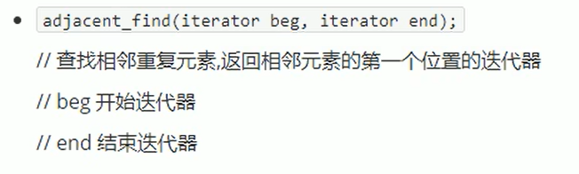

##### binary_search 查找指定元素是否存在

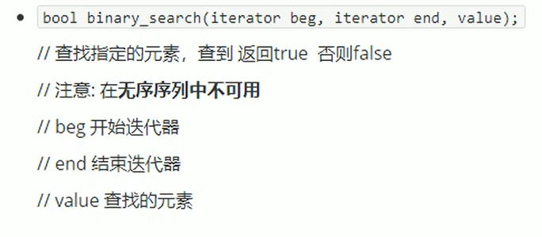

##### count  统计元素个数

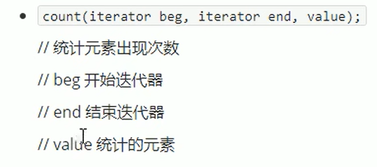

##### count_if  按照条件统计元素个数 。。内部回调函数等同于find_if  使用函数对象或者bool返回值的函数均可以

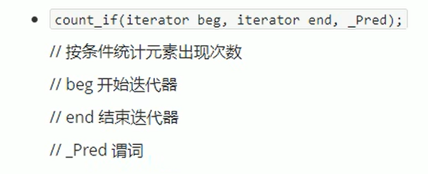

#### 常用排序算法

- sort   		  		  // 对容器内部元素进行排序
- random_shuffle     	  	 // 洗牌  指定范围内的元素随机调整次序
- merge				// 容器元素合并，并存储到另一个容器中
- reverse				// 反转指定范围内的元素

##### random_shuffle

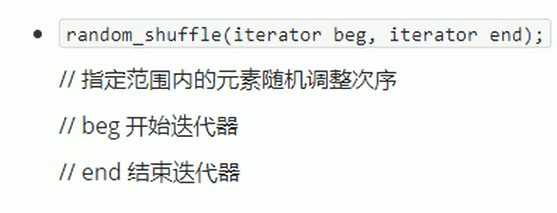

##### merge  (要求两个容器内必须是有序的才可以进行，归并排序)

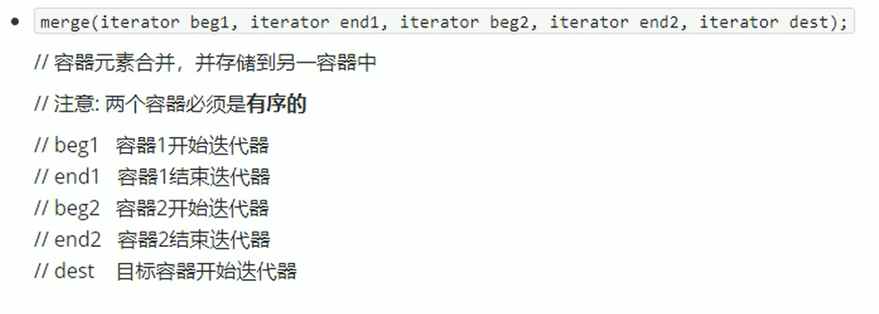

##### reverse

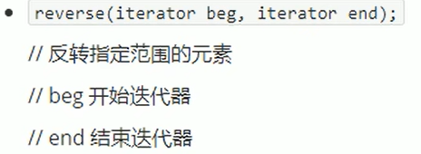

#### 常用拷贝算法

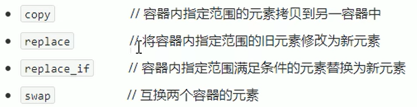

##### copy

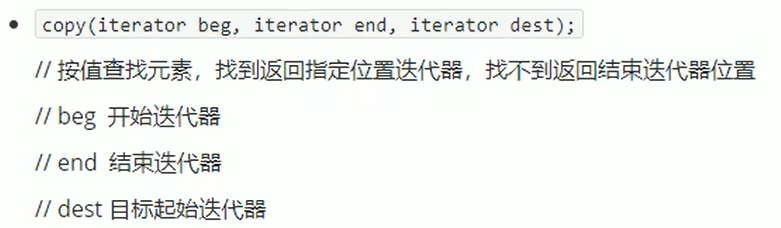

##### replace

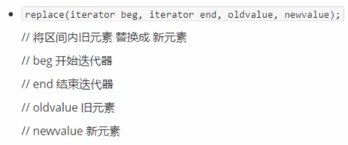

##### replace_if

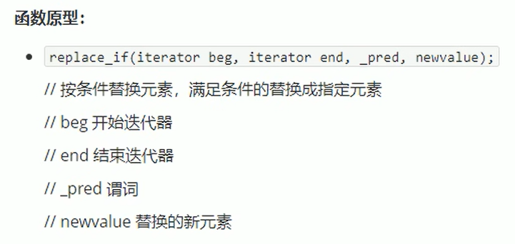

##### swap

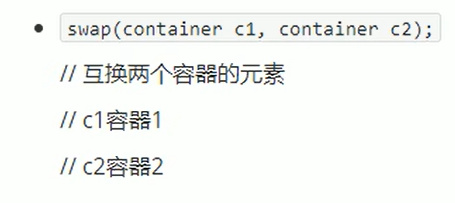

#### 常用算术生成算法

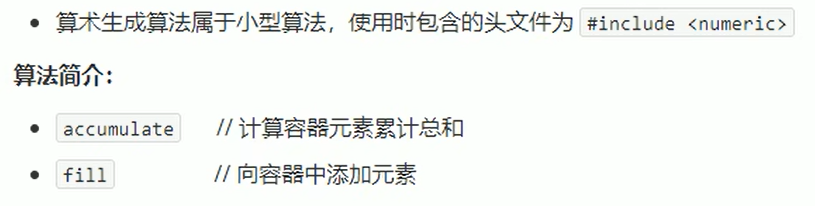

##### accumulate     // value 相当于初始化起点sum

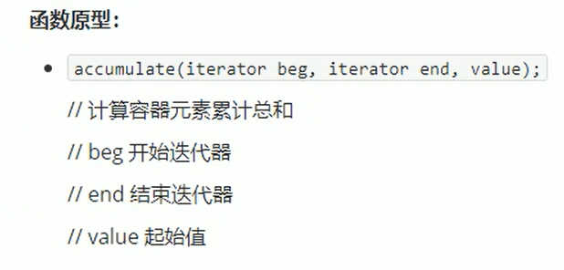

##### fill

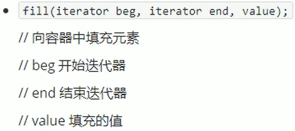

#### 常用集合算法

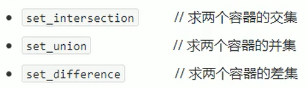

##### set_intersection

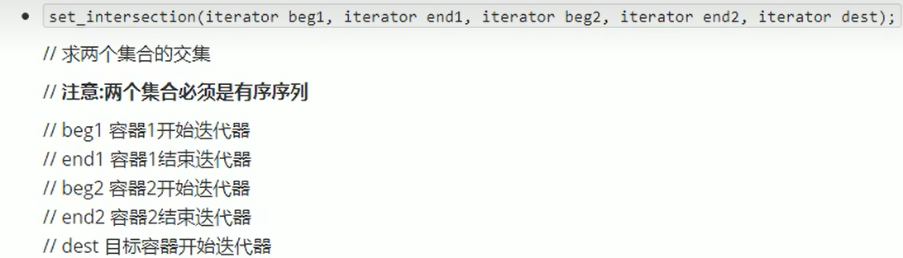

##### set_union

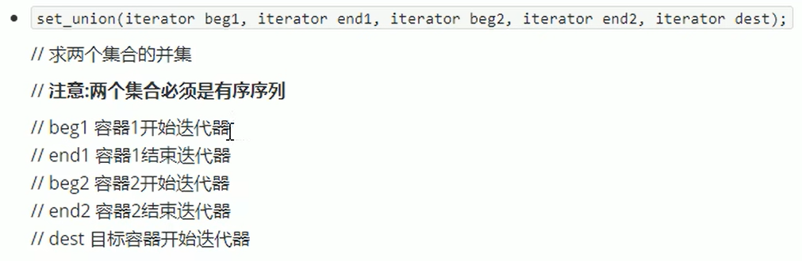

##### set_difference

- 差集区分V1和V2的差集还是V2和V1的差集两者是不同的

---

* V1和V2的差集（通常表示为 V1 - V2 或 V1 \ V2）是指所有属于V1但不属于V2的元素组成的集合。
* V2和V1的差集（通常表示为 V2 - V1 或 V2 \ V1）是指所有属于V2但不属于V1的元素组成的集合。

---

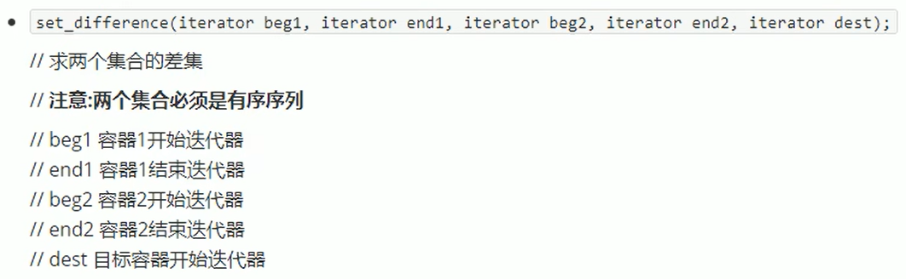

### push_back and emplace_back

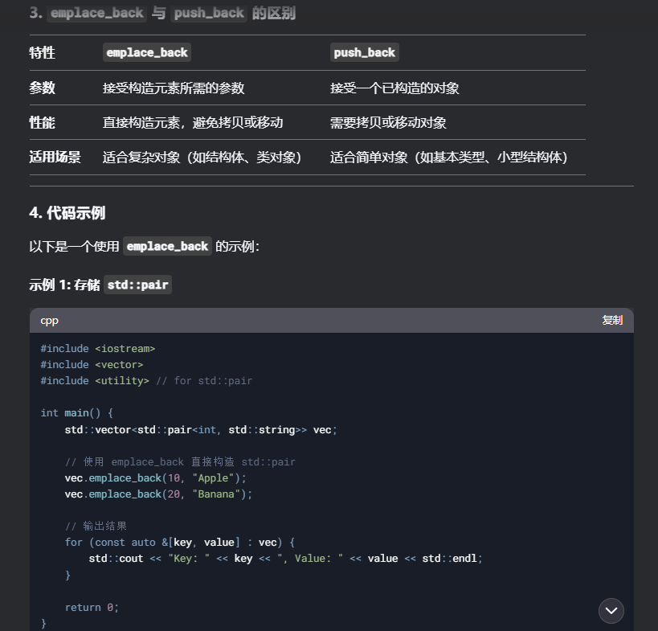
