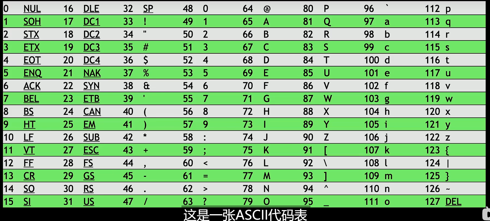
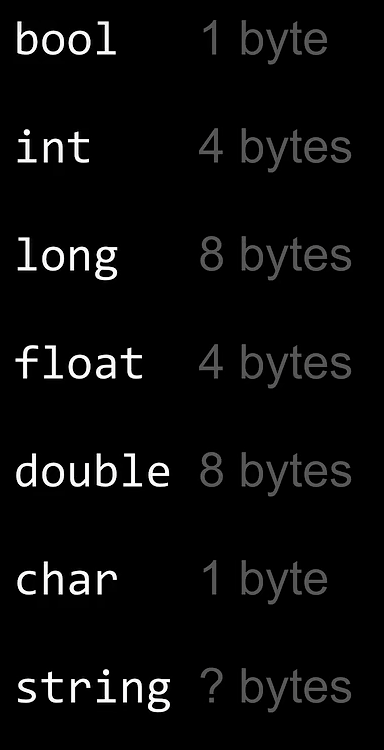
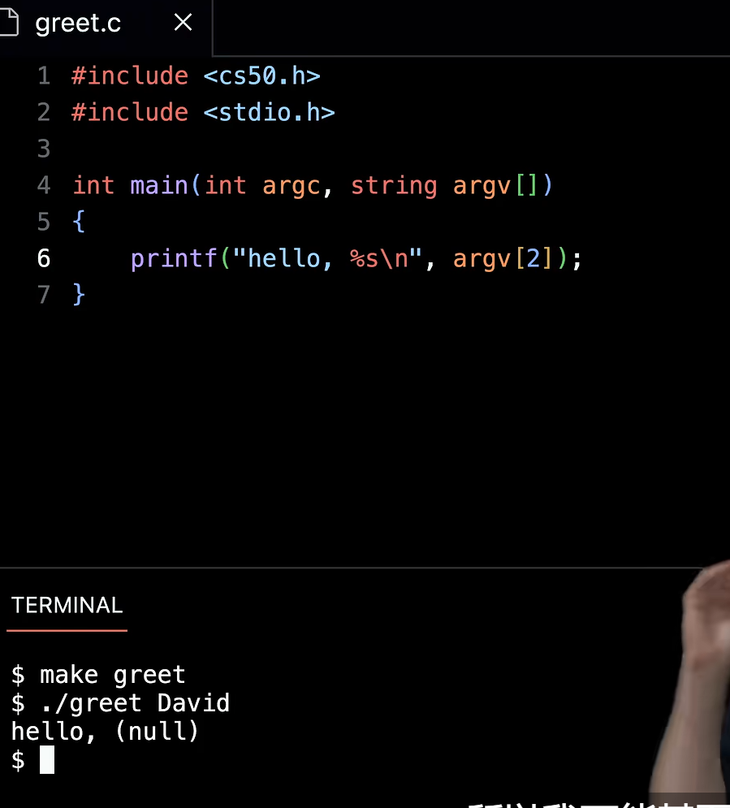
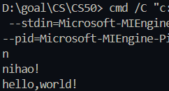
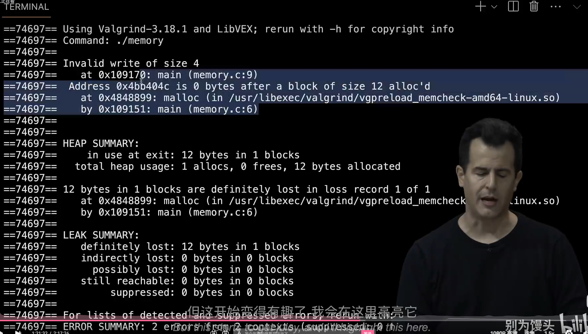
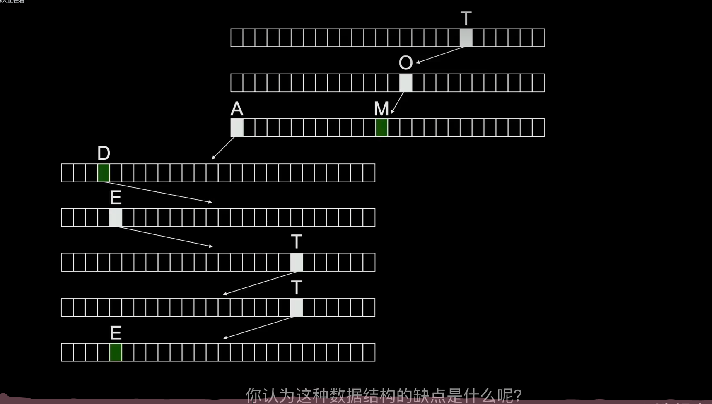
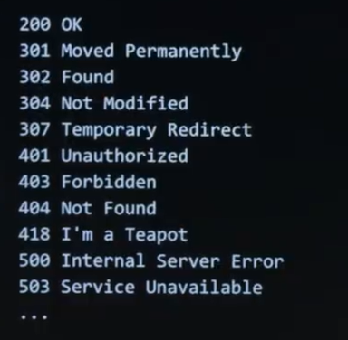

## scratch

一个字节（byte）表示8位0或1比特（bit）。



Unicode新的编码格式，超集。记录更多表达字符可能是emoji。

> 设计逻辑结构时，意外之举，搜索的结果可能不存在于数据之中，程序会崩溃。这种情况要处理。电话铺查找理查德，但他都没有记录。

## C

机器码（0或1的源码）<   编译  <  源代码（人为编译，更高层级）

使用第三方库时，在编译要进行链接。

***字符串在计算机存储数据时，会以一个全零“\0"作为结尾。作为分界点。***


> [浅显易懂的GCC使用教程——初级篇_gcc -ddebug-CSDN博客](https://blog.csdn.net/qq_42475711/article/details/85224010)
>
> [echo命令详解 （一） 真的很详细_echo -n-CSDN博客](https://blog.csdn.net/Jerry00713/article/details/123508414)

1. 预处理过程（将第三方库与相关库中使用到的函数、声明代码拷贝到我的文件中来，找到并替换过来）
2. 编译（将上一步代码转换为汇编语言）他不会去寻找我们对于一个函数有没有定义，他只在乎你的代码是否有语法错误
3. 汇编（获取汇编代码并将其转换为机器码）
4. 链接（将所有文件涉及相关的机器码使用方式连接起来能够完整的完成工作）链接就是需要找到我们具体定义并衔接所有的汇编组合在一起给cpu



## 算法复杂度

 伪代码 > 计算复杂度 >

> 时间复杂度 O是上界，oumega 是下界。取最高位保留。

计算机可以通过牺牲内存换取时间，提升效率。相比与冒泡排序、选择排序，更具有效率的是合并排序。

## 存储空间分配

地址和指针（指针通常八个字节）

```c
string s = "xxx"   
char *s = "xxx";
```

事实上C语言背后string表示就是 `typedef char *string`

```echarts
#include 
```



C语言 数据类型:无符号八位数据 uint8_t 表示一个字节BYTE，通常采取 `typedef uint8_t BYTE`

---

### stdlib.h

    malloc函数提供内存区域分配的函数，输入参数是字节数，返回值是首块字节的地址。同时malloc可能会因为内存受限，而无法分配内存的情况，此时将返回NULL。

    无效检查！！！内存或是其他资源是否得到分配成功。

    freee 释放资源，内存管理。 只释放由malloc所分配的资源。

---

```c
#include <stdio.h>
#include <stdlib.h>

int main(void)
{
	int x[] = {3,2,3};
	int *x = malloc(3*sizeof(int)); #并不是每台计算机都是int4位，同时分配指定大小的空间可以通过计算得到。
}
```

### valgrind （查看内存分配情况,可以检查是否有内存泄露。）

```
valgrind xx.exe

```



### garbage value （垃圾值，存储在内存中过去的值）

    某些情况下会设置为0，但另一种情况下他是未知的。

```c
#include <stdio.h>
#inclued <stdlib.h>
int main(void)
{
	int *p1 ;
	int *p2 ;
	p1 = malloc(sizeof(int));# 为指针p1分配一个内存，他个指定一个合理的内存空间。

	*p1 = 43; #对p1进行有效赋值。

	*p2 = 13;# 对于p2，此时他并未发配内存，他可能指向一个不确定的区域，随意修改可能导致计算机崩溃。
	p2 = p1; #修正，将地址指向一个合理的位置！此时p1和p2指向同一个内存块。
	*p2 = 55;
	return 0;

}
```

### 内存分配区域

***machine code：源码***

***globals:全局变量***

***heap:堆，可分配的内存。malloc函数申请所分配的内存。***

***stack:栈。 存储和使用带有变量和参数的函数时，这一部分所使用的内存。***

调用函数进行处理时，实际上是拷贝传入的参数然后操作自己所分配的内存，并未改变原始的存储数据。

 **采用地址的方式可以实质改变函数的值。**

同理，为什么scanf输入需要取地址符号。`scanf("%d",&n)`事实上就是通过传入地址的方式真实的修改这个值。

> 同时对于字符输入，我们很难确定用户有多少个字符，这个时候，就很容易出现用户的字符数超过我们所预设的内存空间，这个时候，就需要不断检查用户输入并为其分配内存空间。


## 数据结构

### 队列（FIFO，first in first out）

链表的形式，动态分配内存，按照需求分配所需的内存量

### 栈 stack（LIFO，last in first out,先进不出)

### 图

### 树结构

    树结构并不能一定保证他左右均衡，有些时候他会因为一些原因而出现偏斜，这时候就需要纠正。

### 字典（键值对）

### 哈希表（hash tables）链表数组，类似于字典

### tires  O(1)时间复杂度



## Python

```python
def get_int(prompt):
	while True:
		try: 
			return int(input(prompt))
		except ValueError:
			print("Not an integer")
```

```python
import sys

if len(sys.argv) !=2:
	print("Misssing command-line argument")
	sys.exit(1)# 返回值，并未完成
print(f"hello,{sys.argv[1]}")
sys.exit(0)#返回值，顺利完成
```

```python
import csv
with open("test.csv",'r') as file:
	reader = csv.reader(file)
	next(reader)
```

## SQL

create，insert，select，update，delete，drop

数据类型

主键、外键

索引（B-Tree）

事务（要么执行，要么失败。防止因资源的分配失败导致的错误）

数据注入攻击db

## HTML、CSS、JAVAScript



### TCP/IP 传输控制协议和网际协议。

### DNS域名服务器

正则表达式

$A=\begin{bmatrix}1&2&3\\4&5&6\end{bmatrix}$

Bootstrap 界面美化
