---

title: MySQL 基础
published: 2026-04-20
description: MySQL 基础知识，参考黑马程序员
tags: [MySQL, 数据库, SQL, 事务, 存储引擎, 索引, 视图, 存储过程]
category: 学习记录
# image: image/MySQL/1733811477039.png
draft: false
---


## SQL

### 1. MySQL 启动
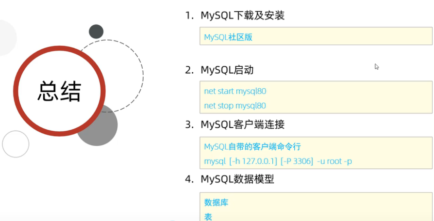

1. 启动 MySQL 服务。
    - net start MySQL90
    - mysql -h localhost -p port  -u root -p password # 连接 MySQL 服务 localhost地址，端口号 port，用户名 root，密码 password，
2. 关闭 MySQL 服务。
    - net stop MySQL90 # 关闭 MySQL 服务


### 2. SQL 语句

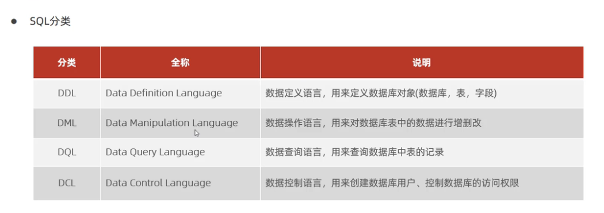


#### 2.1 DDL(Data Definition Language 数据定义语言)

- 数据库定义
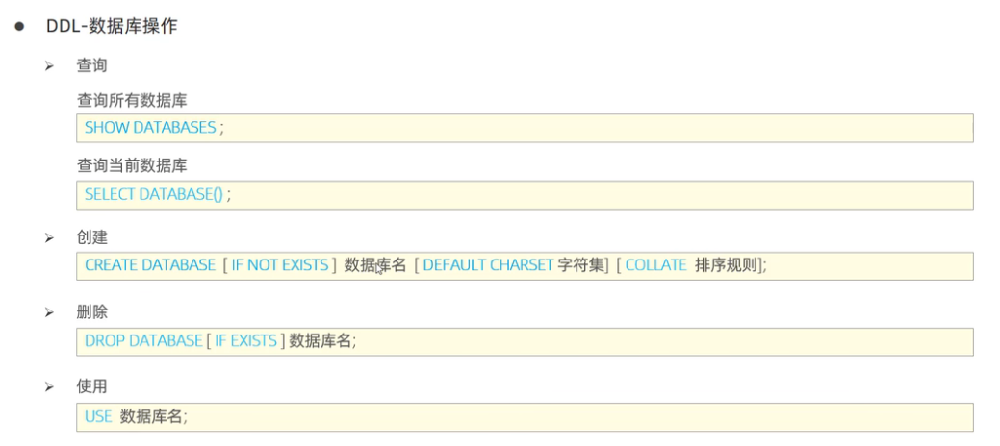

1. 查询所有数据库：
   ```sql
   SHOW DATABASES;
   ```
2. 查询所有表：
   ```sql
   SHOW TABLES;
   ```

3. 查询当前数据库：
   ```sql
   SELECT DATABASE();
   ```
4. 创建数据库：
   ```sql
   CREATE DATABASE [IF NOT EXISTS] 数据库名 
   [DEFAULT CHARSET 字符集名 COLLATE 字符集排序规则 COMMENT '数据库注释'] ENGINE=InnoDB; -- 创建数据库时指定存储引擎为InnoDB
   ```
5. 删除数据库：
   ```sql
   DROP DATABASE IF EXISTS 数据库名;
   ```
6. 使用数据库：
   ```sql
   USE 数据库名;
   ```

##### 2.1.1 表查询


1. 查询所有表：
   ```sql
   SHOW TABLES;
   ```
2. 查询表结构：
   ```sql
   DESC 表名;
   ```
3. 查询指定表的创建语句：
   ```sql
   SHOW CREATE TABLE 表名;
   ```

##### 2.1.2 表创建
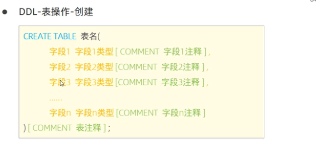
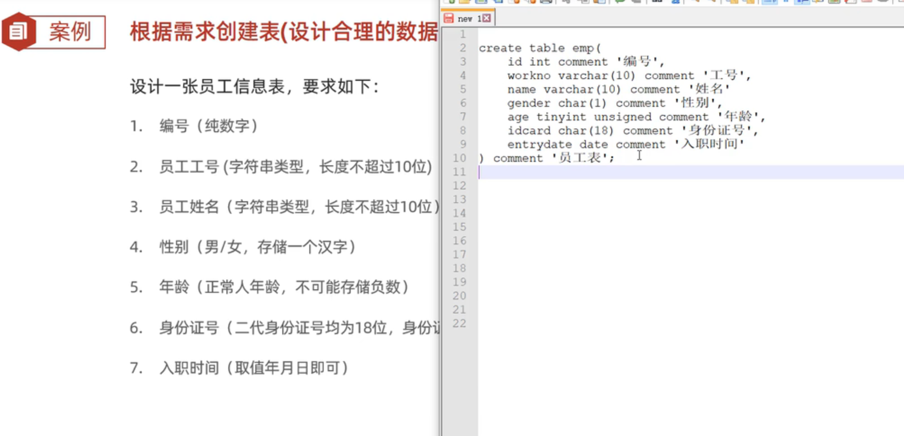
1. 创建表：
   ```sql
      CREATE TABLE [IF NOT EXISTS] 表名 (
         字段名 数据类型 [COMMENT '字段注释'],
         字段名 数据类型 [COMMENT '字段注释'],
         ...
      );
   ```

- 数据类型
  - `char`与`varchar`：char是固定长度的，varchar是可变长度的(根据内存分配大小)。char速度更快，varchar更灵活。
  - 主要三大类：数值型、字符型、日期型。

##### 2.1.3 表修改

1. 添加字段：
   ```sql
   ALTER TABLE 表名 ADD 字段名 数据类型 [COMMENT '字段注释'];d
   ```
2. 删除字段：
   ```sql
   ALTER TABLE 表名 DROP 字段名;
   ```
3. 修改字段：
   ```sql
   ALTER TABLE 表名 MODIFY 字段名 数据类型 [COMMENT '字段注释'];
   ```
4. 修改表名：
   ```sql
   ALTER TABLE 表名 RENAME TO 新表名;
   ```
5. 删除表：
   ```sql
   DROP TABLE IF EXISTS 表名;
   ```


#### 2.2 DML(Data Manipulation Language 数据操作语言)

##### 2.1.1 添加数据
 ```sql
 INSERT INTO 表名 (字段名1, 字段名2, ...)
 VALUES (值1, 值2, ...);
 ```

##### 2.1.2 修改数据
 ```sql
 UPDATE 表名
 SET 字段名1 = 值1, 字段名2 = 值2, ...
 WHERE 字段名1 = 值1;
 ```

##### 2.1.3 删除数据
 ```sql
 DELETE FROM 表名
 WHERE 字段名1 = 值1;
 ```


#### 2.3 DQL(Data Query Language 数据查询语言)

```sql
SELECT * FROM 表名 [AS 别名]
WHERE 字段名1 = 值1;
GROUP BY 字段名1;
HAVING 字段名1 = 值1;
ORDER BY 字段名1;
LIMIT 偏移量(起始索引), 行数;
```

#### 2.4 DCL(Data Control Language 数据控制语言)

- 用于管理用户对数据库的访问权限

1. 查询所有用户：
   ```sql
   SHOW USERS;
   ```
2. 查询用户
   ```sql
   USE 数据库名; # 切换到 mysql 数据库,用户表在 mysql 数据库中user表
   SELECT * FROM user; 
   ```
3. 创建用户(用户名@主机名共同确定一个用户)
   ```sql
   CREATE USER [IF NOT EXISTS] 用户名@主机名 IDENTIFIED BY '密码';
   ```
  creat user 'abc'@'%' identified by '123456';# 创建用户 abc，主机名任意，密码 123456
4. 删除用户
   ```sql
   DROP USER [IF EXISTS] 用户名@主机名;
   ```
5. 修改用户密码
   ```sql
   ALTER USER 用户名@主机名 IDENTIFIED BY '新密码';
   ```

6. 授权用户

- 权限
  - `SELECT`：查询权限
  - `INSERT`：插入权限
  - `UPDATE`：更新权限
  - `DELETE`：删除权限
  - `CREATE`：创建权限
  - `DROP`：删除权限
  - `GRANT OPTION`：授权权限
  - `REVOKE`：撤销权限
  - `ALL PRIVILEGES`：所有权限

- 查询用户权限
   ```sql
   SHOW GRANTS FOR 用户名@主机名;
   ```

- 授权用户
   ```sql
   GRANT 权限 ON 数据库名.表名 TO 用户名@主机名;
   ```

7. 撤销用户权限
   - `REVOKE`：撤销权限
   ```sql
   REVOKE 权限 ON 数据库名.表名 FROM 用户名@主机名;
   ```

### 3. 函数

- 函数是一段可以直接被调用的程序

#### 3.1 内置函数1：字符串函数

1. `concat(字符串1, 字符串2, ...)`：拼接字符串
2. `lower`：将字符串转换为小写
3. `upper`：将字符串转换为大写
4. `lpad`：在字符串左侧填充指定字符，达到指定长度
5. `rpad`：在字符串右侧填充指定字符，达到指定长度
6. `substring`: 提取子字符串。
7. `trim`:：删除字符串首尾的空格。
  
#### 3.2 内置函数2：数值函数

1. `CEIL(数值)`：向上取整
2. `FLOOR(数值)`：向下取整
3. `ROUND(数值, 小数位数)`：四舍五入
4. `MOD(数值1, 数值2)`：取余
5. `RAND()`：随机数,范围[0, 1)


#### 3.3 内置函数3：日期函数

1. `CURDATE()`：当前日期
2. `CURTIME()`：当前时间
3. `NOW()`：当前日期时间
4. `YEAR(日期)`：提取日期中的年份
5. `MONTH(日期)`：提取日期中的月份
6. `DAY(日期)`：提取日期中的日期
7. `DATE_ADD(日期, INTERVAL 数值 时间间隔)`：日期加法
8. `DATEDIFF(日期1, 日期2)`：日期差值

#### 3.4 内置函数4： 流程控制函数

1. `IF(条件式, 值1, 值2)`：根据条件式返回不同的值
2. `CASE WHEN 条件式 THEN 值1 WHEN 条件式 THEN 值2 ELSE 值3 END`：根据多个条件返回不同的值
3. `IFNULL(表达式, 值)`：如果表达式为NULL，则返回指定值
4. `CASE 表达式 WHEN 值 THEN 值1 WHEN 值 THEN 值2 ELSE 值3 END`：根据表达式的值返回不同的值

### 4. 约束
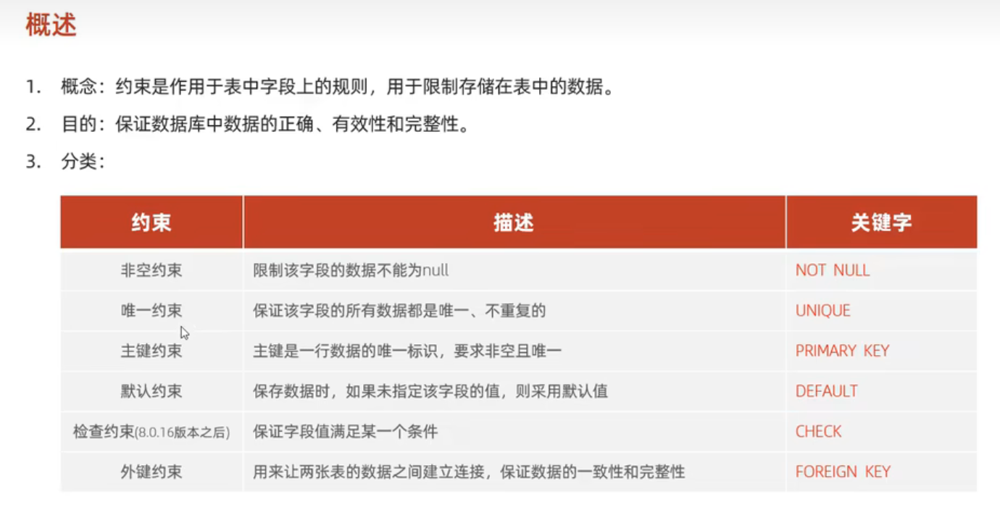
- 约束：限制表中数据的值，确保数据的完整性和一致性。
- 外键：用于关联两个表之间的关系，确保数据的一致性。主表（主键所在表）变动时，从表（外键表）会自动更新。
- 主键：用于唯一标识表中的每一行数据，确保数据的唯一性。


1. 外键约束
   ```sql
   ALTER TABLE 表名 ADD CONSTRAINT 外键名 FOREIGN KEY (外键字段名) REFERENCES 主表名(主键字段名);
   ```
2. 删除外键 
   ```sql
   ALTER TABLE 表名 DROP FOREIGN KEY 外键名;
   ```

3. 外键删除/更新行为设置
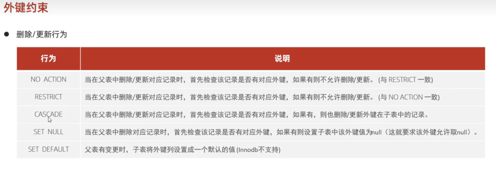

```sql
ALTER TABLE 表名
ADD CONSTRAINT 外键名 -- 添加外键约束 关联主表的主键字段 外键字段名
FOREIGN KEY (外键字段名) REFERENCES 主表名(主键字段名)
ON UPDATE CASCADE ON DELETE CASCADE;
```


### 5. 多表查询


- 表关系：
  - 一对一关系：一个实体只能与另一个实体相关联，不能与多个实体相关联。
     - 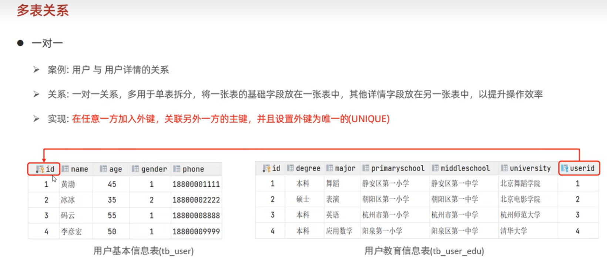
  - 一对多关系：一个实体可以与多个实体相关联，一个实体只能与一个实体相关联。
     - 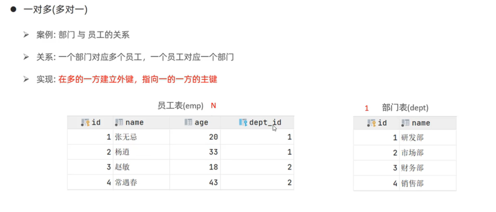
  - 多对多关系：多个实体可以与多个实体相关联，每个实体都可以与其他多个实体相关联。
     - 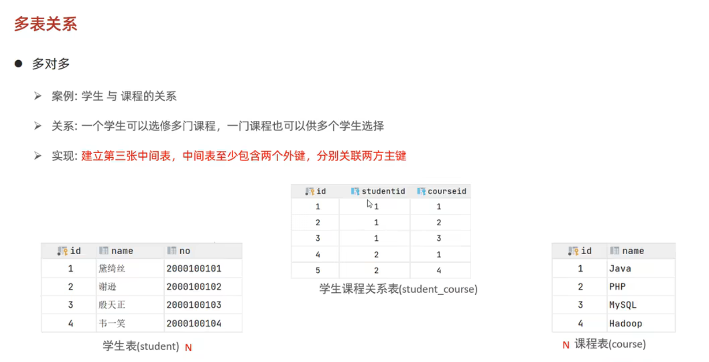

- 笛卡尔积：两个表的笛卡尔积是两个表中所有可能的组合。
- 消除笛卡尔积：通过添加连接条件，消除两个表的笛卡尔积，只保留符合条件的组合
- 连接查询方式
  - 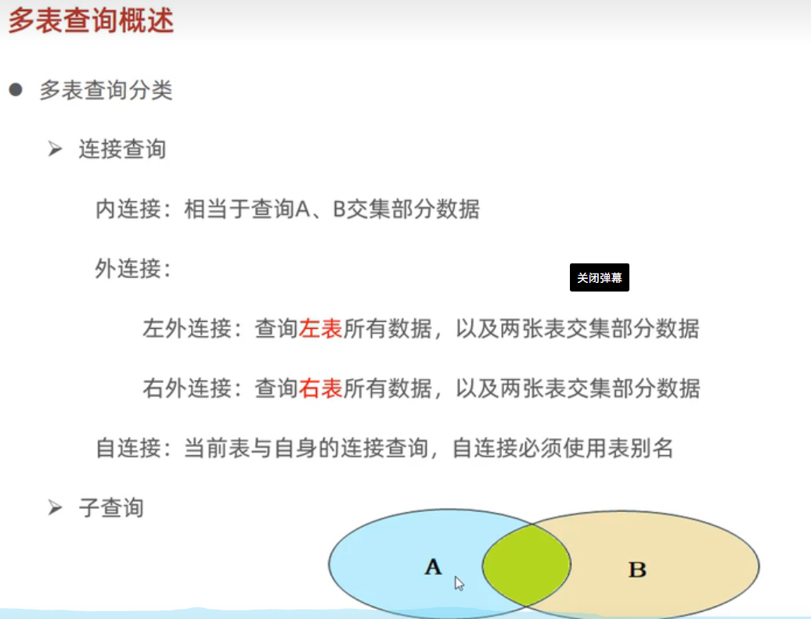

#### 5.1 内连接查询

1. 隐式内连接查询
```sql
SELECT * FROM 表名1, 表名2 WHERE 连接条件;
```
2. 显式内连接查询
```sql
SELECT * FROM 表名1
INNER JOIN 表名2
ON 连接条件;
```

#### 5.2 外连接查询

1. 左外连接查询
```sql
SELECT * FROM 表名1
LEFT [OUTER] JOIN 表名2
ON 连接条件;
```
2. 右外连接查询
```sql
SELECT * FROM 表名1
RIGHT [OUTER] JOIN 表名2
ON 连接条件;
```

3. 全外连接查询
```sql
SELECT * FROM 表名1
FULL JOIN 表名2
ON 连接条件;
```

#### 5.3 自连接查询

- 自连接查询：一个表与自身进行连接，用于查询表中数据的关联关系。
```sql 
SELECT * FROM 表名 [AS 表名1] # 自连接需要给表起别名
JOIN 表名 [AS 表名2]
ON 连接条件;
```

#### 5.4 联合查询

```sql
SELECT * FROM 表名1
UNION [ALL] -- UNION 合并两个查询结果，保留所有行包含重复满足的数据  而UNION会进行去重复
SELECT * FROM 表名2;
```
- 查询字段列表必须相同

#### 5.5 子查询（嵌套查询）

- 子查询：一个查询嵌套在另一个查询中，用于查询子查询的结果。
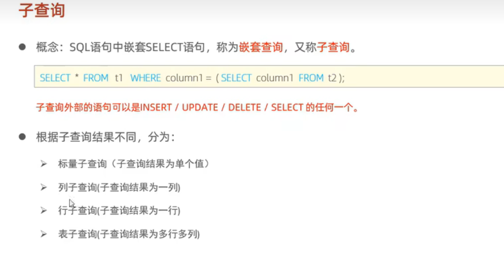
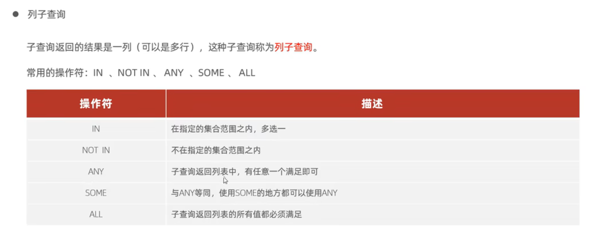
```sql
SELECT * FROM 表名1 WHERE 子查询;

```

### 6. 事务

- 事务：事务是指数据库中的一组操作，这些操作要么全部成功执行，要么全部失败执行。
- 

#### 6.1 事务操作

1. 查看/设置事务提交方式
```sql
SELECT @@autocommit; -- 查看事务提交方式
                         -- autocommit = 1  自动提交方式
                         -- autocommit = 0  手动提交方式
                         -- 其他提交方式关键词
SET @@autocommit = 0; -- 关闭事务(自动提交方式)
```

2. 提交事务

```sql
COMMIT; -- 提交事务
```


3. 回滚事务

```sql
ROLLBACK; -- 回滚事务
```


------- 
---
4. 开启事务
```sql
START TRANSACTION ; -- 开启事务 也可以使用BEGIN关键词
BEGIN; -- 开启事务
```
5. 提交事务
```sql
COMMIT; -- 提交事务
```
6. 回滚事务
```sql
ROLLBACK; -- 回滚事务
```

#### 6.2 事务的四大特性

1. 原子性（ Atomicity）: 事务中的操作必须全部成功执行，要么全部失败执行。
2. 一致性（ Consistency）: 事务操作全部成功执行，数据库的状态必须保持一致。
3. 隔离性（ Isolation）: 事务操作必须与其他事务操作隔离开来，不能被其他事务操作干扰。**依靠数据库系统提供的隔离机制。**
4. 持久性（ Durability）: 事务操作必须持久化存储，即使数据库系统崩溃或断电，数据也不会丢失。

#### 6.3 事务并发的问题


- Read uncommitted: 脏读 一个事务读取到另一个事务未提交的数据。
- Read committed: 读已完成事务  一个事务读取到另一个事务已提交的数据，但是读取到的数据是不可重复的。
- Repeatable read: 可重复读 一个事务读取到另一个事务已提交的数据，但是读取到的数据是可重复的。


#### 6.4 事务并发的解决方法（隔离级别）
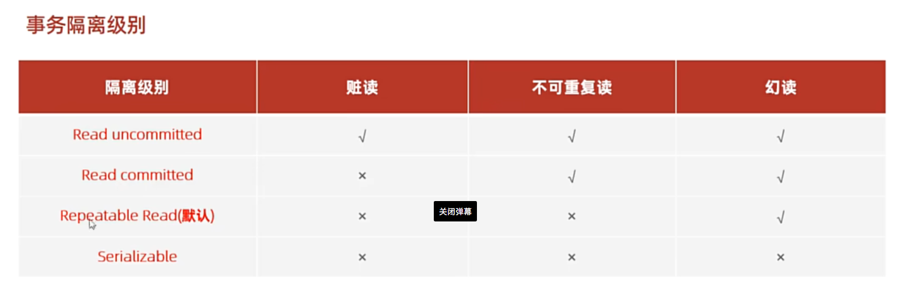
其中mysql默认的隔离级别是REPEATABLE READ（RR）,解决了脏读和不可重复读问题。

- 查看当前事务的隔离级别
```sql
SELECT @@TRANSACTION_ISOLATION; -- 查看当前事务的隔离级别
```

- 设置当前事务的隔离级别
```sql
SET [SESSION|GLOBAL] TRANSACTION ISOLATION LEVEL 隔离级别; -- 设置当前事务的隔离级别
```

### 7. 存储引擎

#### 7.1 MySQL体系结构

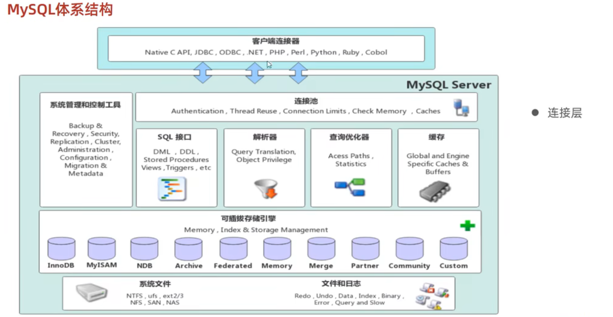
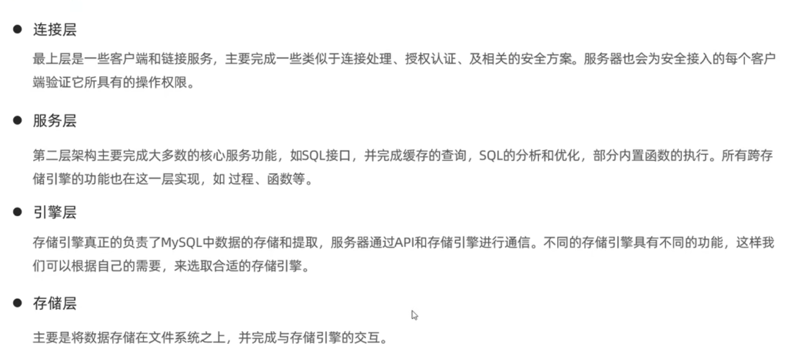

#### 7.2 存储引擎
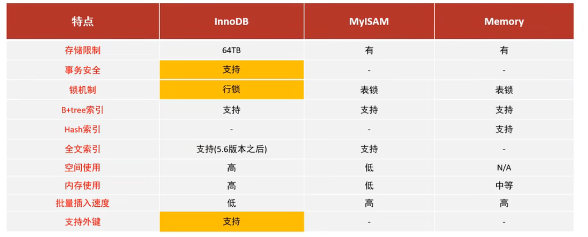
1. InnoDB是默认的存储引擎，支持**事务和外键和行级锁**。
    - 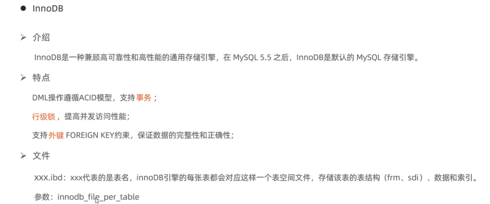
    - 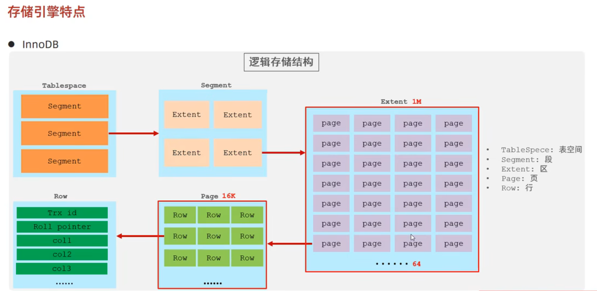
2. MyISAM是非事务型存储引擎，不支持事务和外键。
    - 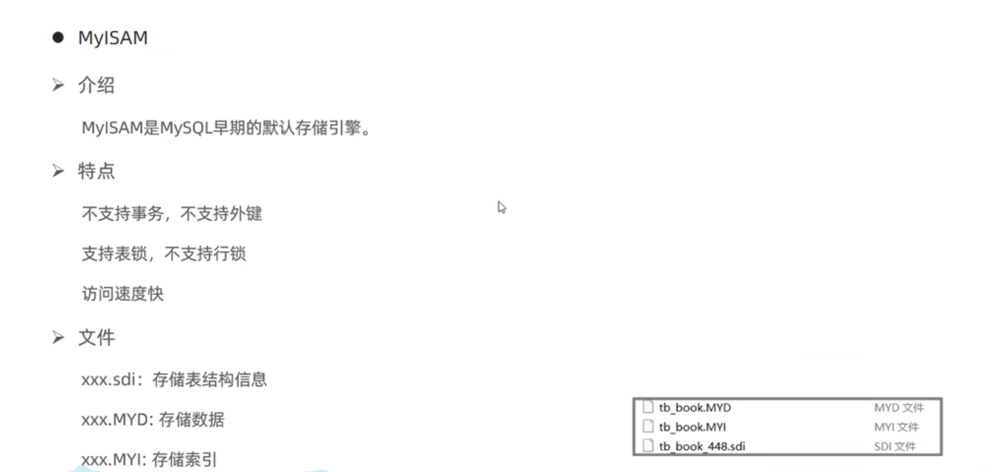
3. Memory是内存存储引擎，不支持事务和外键。
    - 
4. 查看当前数据库支持的存储引擎
```sql
SHOW ENGINES; -- 查看当前数据库支持的存储引擎
```


- MyISAM被现在主流的**mongodb替代**
- Memory被现在主流的**redis**替代。


### 8. 索引

- 索引：索引是指数据库中用于快速定位数据的数据结构。


#### 8.1 索引的结构

- 索引在存储引擎层实现，不同存储引擎的索引结构不同。
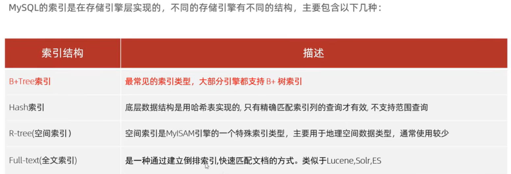
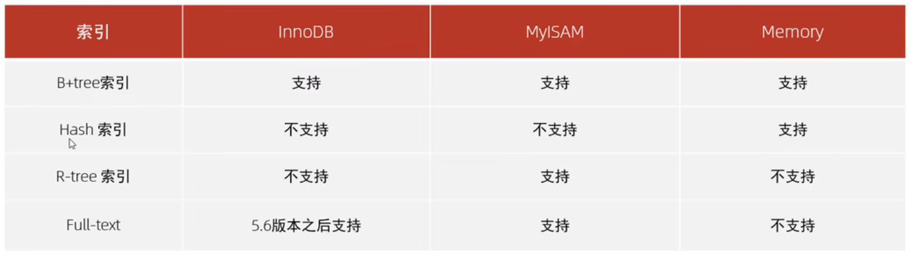

##### 8.1.1 B树（多路平衡树）
[树结构介绍](https://www.cnblogs.com/henuliulei/p/15114440.html)
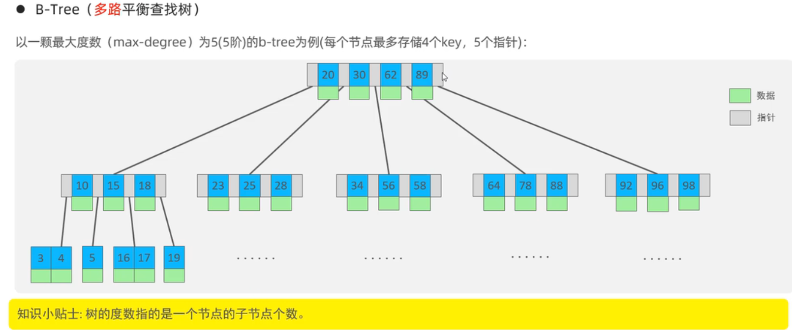

- B+树：B树的一种变种，用于存储非叶子节点，叶子节点只存储数据指针。
- 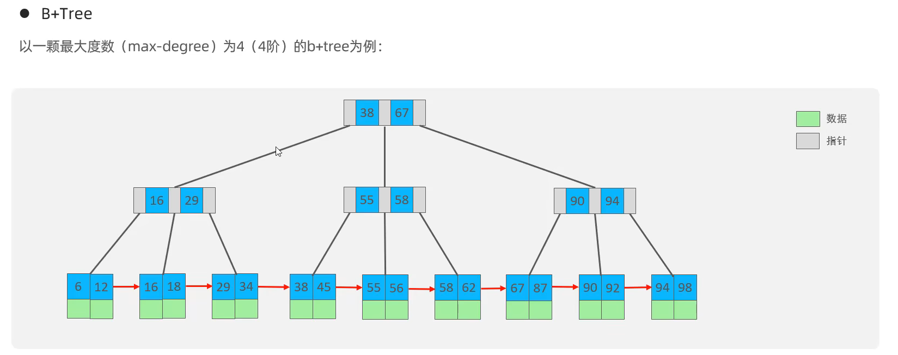
- MySQL使用B+树的叶子节点链表基础上，增加了双向循环链表，用于快速定位到下一个叶子节点。
- 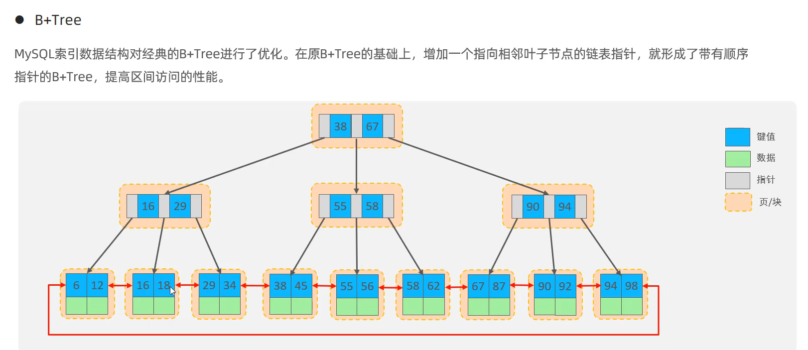

##### 8.1.2 Hash索引
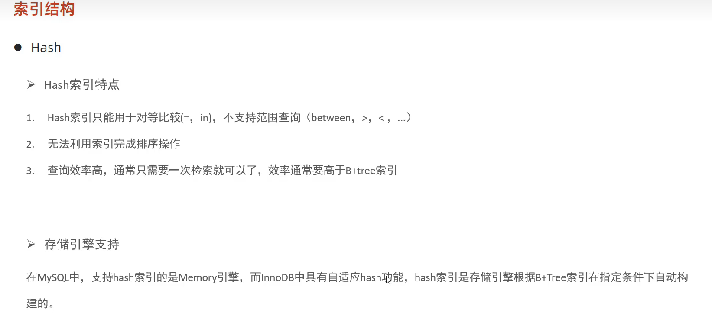

- InnoDB使用B+树结构的原因
   - 1. 相对于二叉树，层级更少，查询效率更高。
   - 2. 相比于B树，叶子节点和非叶子节点的指针更少，存储密度更高。
   - 3. 相比于B树，B+树的叶子节点只存储数据指针，非叶子节点只存储键值对，存储密度更高。

#### 8.2 索引的类型


- InnoDB索引分为聚焦索引和二级索引。
- 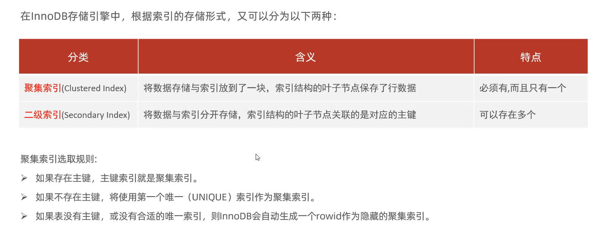
- 
- InnoDB索引树高度
- 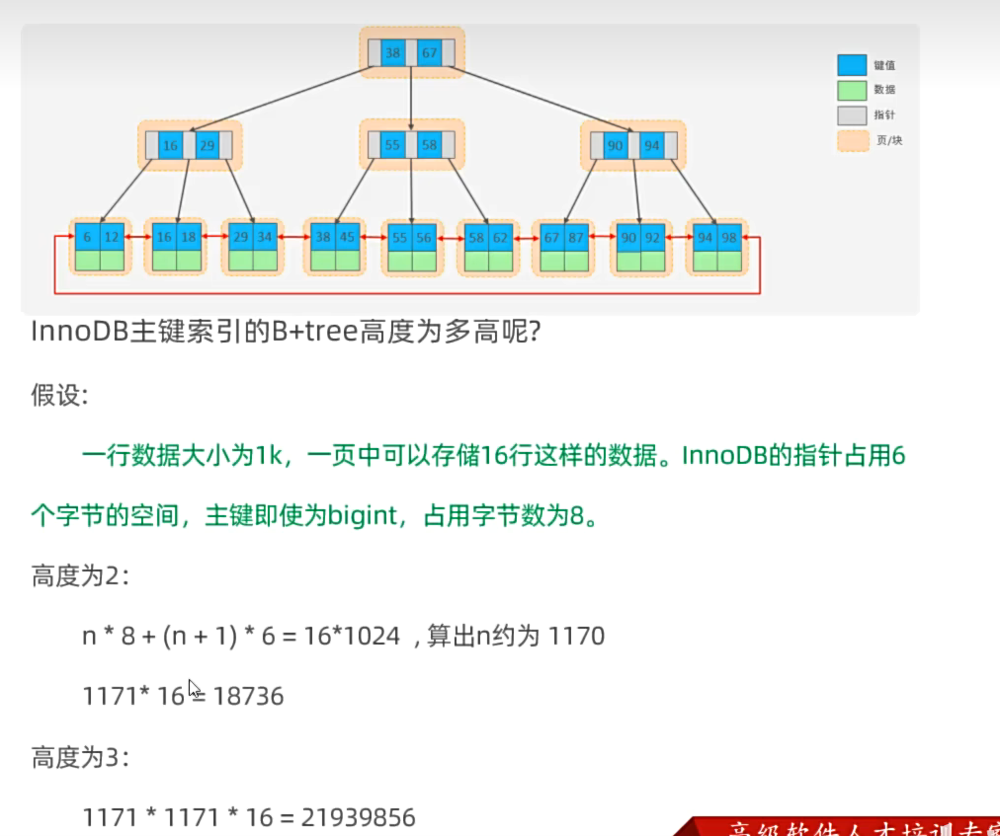

#### 8.3 索引的使用


1. 创建索引
```sql
CREATE [UNIQUE|FULLTEXT] 索引名 ON 表名(字段名);
``````
2. 查看索引
```sql
SHOW INDEXES FROM 表名; -- 查看表的索引
```

3. 删除索引
```sql
DROP INDEX 索引名 ON 表名; -- 删除表的索引
```

#### 8.4 索引的优化（SQL性能分析）

1. 查看执行频次
```sql
SHOW GLOBAL STATUS LIKE 'Com_______'; -- 查看查询日志
```

2. 慢查询日志

 - 需要先开启慢查询日志，具体在mysql配置文件中开启。配置慢查询日志的阈值时间
```sql
SHOW SLOW_QUERY_LOG; -- 查看慢查询日志
```

3. profile详情分析（是否支持是前提）

```sql
SELECT @@HAVE_PROFILE; -- 查看是否支持profile功能
SELECT @@PROFILING; -- 查看是否开启了profile功能

SET PROFILESILING = 1; -- 开启profile功能

SHOW PROFILES; -- 查看profile详情

SHOW PROFILE FOR QUERY QUERY_ID; -- 查看指定ID的profile


SHOW PROFILE CPU FOR QUERY QUERY_ID; -- 查看指定ID的profile的CPU时间
```

4. explain 执行计划分析

```sql
EXPLAIN SELECT * FROM 表名 WHERE

```
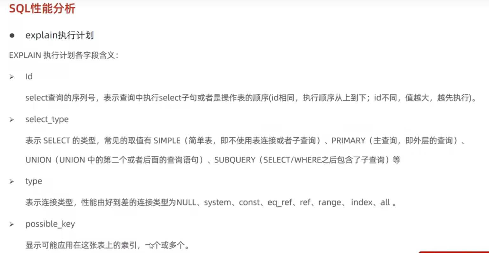
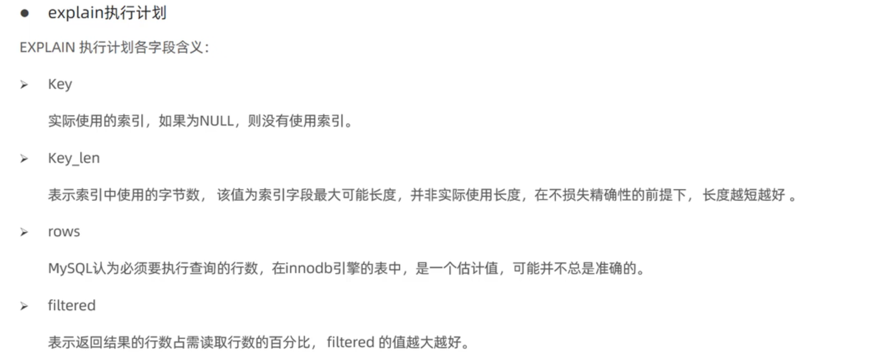

- `SELECT_type`可忽略

- `type`查询性能： const通常见于唯一索引（主键等），eq_ref通常见于二级索引，ref通常见于非唯一索引。

#### 8.5 索引的使用

1. 最左前缀法则
   - 针对联合索引，mysql会使用最左前缀进行查询。最左前缀是指联合索引中最左侧的字段，不跳过任何字段。
   - 如果查询条件中不包含最左前缀，将不会使用索引。
   - 
   - 索引字段长度也根据字段顺序和查询条件进行决定
   - 范围查询（>、< ）在复合索引中，右侧字段会失效。
   - 

2. 索引失效
   - 索引失效是指在查询条件中使用了索引列的函数，导致mysql无法使用索引。
   - 字符串类型字段使用时，不加引号，会导致索引失效。
   - **模糊匹配**：**模糊匹配进行时，前面模糊匹配的字段，会导致索引失效。而后面模糊匹配的字段，不会导致索引失效。**
   - **OR运算**：如果OR运算中，有一个字段是索引列，另一个字段不是索引列，会导致索引失效。  
   - **数据分布优化：**如果数据分布不均匀，会导致索引失效。默认进行全表扫描。

3. SQL提示
   - 优化数据库手段，在SQL语句添加提示，用于建议使用哪个索引、忽略那些索引等
```SQL
SELECT /*+ INDEX(索引名) */ * FROM 表名 WHERE  -- 建议指定使用索引

SELECT /*+ IGNORE INDEX(索引名) */ * FROM 表名 WHERE  -- 忽略索引

SELECT /*+ FORCE INDEX(索引名) */ * FROM 表名 WHERE  -- 强制使用索引

```


4. 覆盖索引

   - 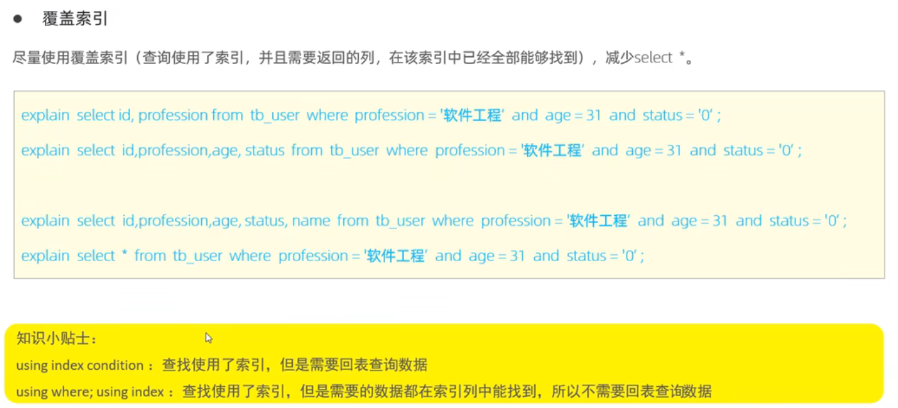
   - 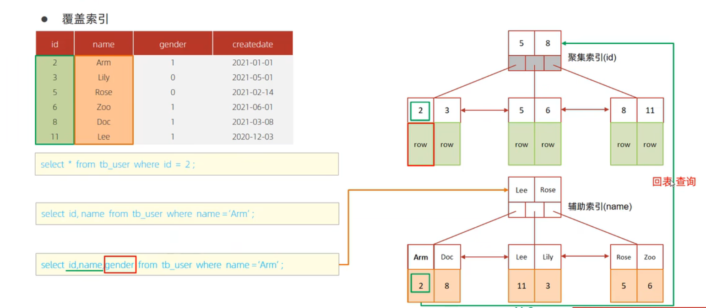
   - 覆盖索引是指查询条件中只使用了索引列，没有使用其他列。mysql会直接从索引中进行表扫描。
   - 覆盖索引可以避免回表查询操作。

5. 前缀索引

   - 当字段类型为字符串类型时，需要创建索引时，会造成索引变大浪费磁盘空间。使用前缀索引，可以解决这个问题。
   - 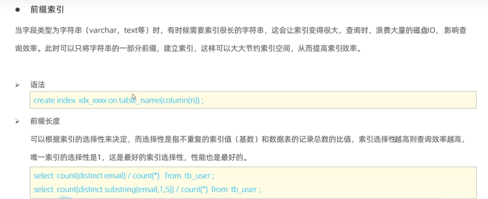
   - 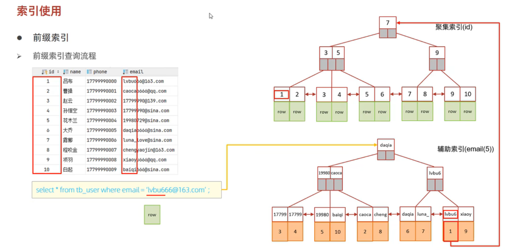

```SQL
CREATE INDEX 索引名 ON 表名(字段名(前缀长度));
```

6. 联合索引与单列索引
   - 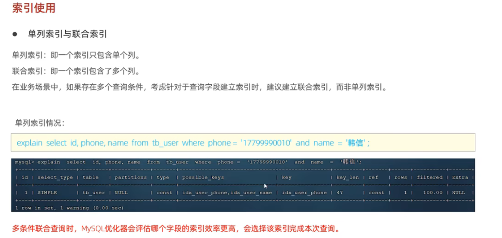

7. 索引建立原则
   - 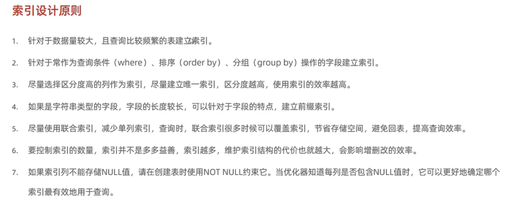

### 9. SQL优化

#### 9.1 插入数据优化

1. 批量插入数据，避免每次插入数据都提交事务，提高插入效率。
2. 手动事务提交，避免自动提交事务，提高插入效率。
3. 主键顺序插入，可以提高插入效率。
4. 大批量数据插入，使用`INSERT`效率低，使用`LOAD `指令进行批量插入
```sql
mysql --local-infile 1 -u root -p 数据库名 < 数据文件路径  # 批量插入数据
Set global local_infile = 1;

Load data local infile '数据文件路径' into table 表名 fields terminated by ',' lines terminated by '\n';  -- 批量插入数据，字段分隔符为逗号，行分隔符为换行符
```


#### 9.2 主键优化

- 数据组织方式：在InnoDB中，主键索引是聚焦索引，表数据是按主键索引顺序组织存放的。
- 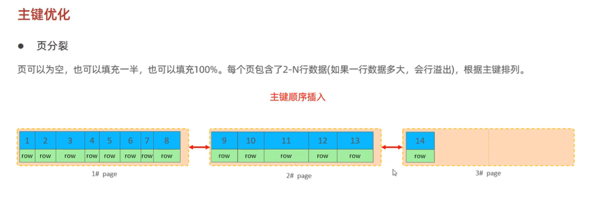
- 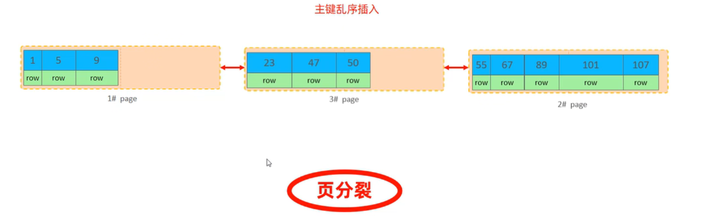
- 主键乱序插入时，会引发页分裂问题，导致插入效率下降。
- 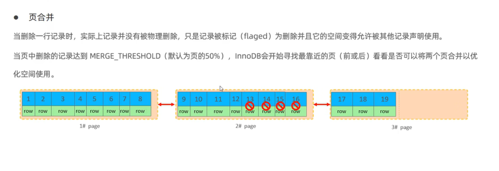
- `MERGE_THRESHOLD`：合并阈值，用于控制合并页的阈值。可修改为其他值，
- 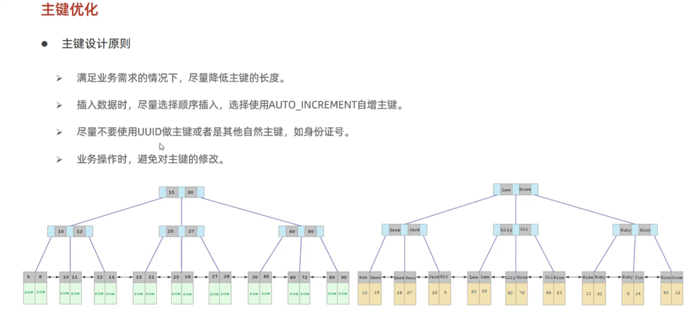


#### 9.3 ORDER BY 优化


- ORDER BY 优化是指ORDER BY 语句中包含字段未使用索引FileSort进行排序，效率低。
- `ORDER BY`在对于多个属性值进行排序时，会根据语句中的字段顺序进行排序。**因此，如果语句中的字段顺序不是最左前缀，会导致对应的索引失效。**
- 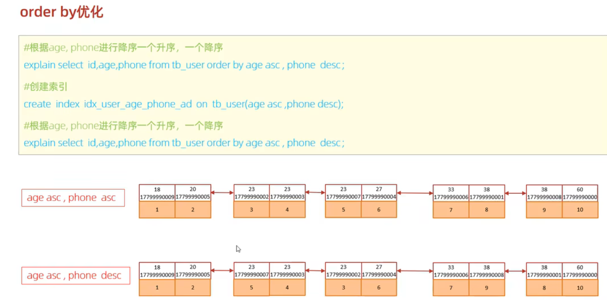


#### 9.4 GROUP BY 优化
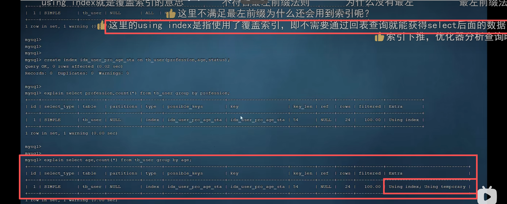


#### 9.5 LIMIT 优化
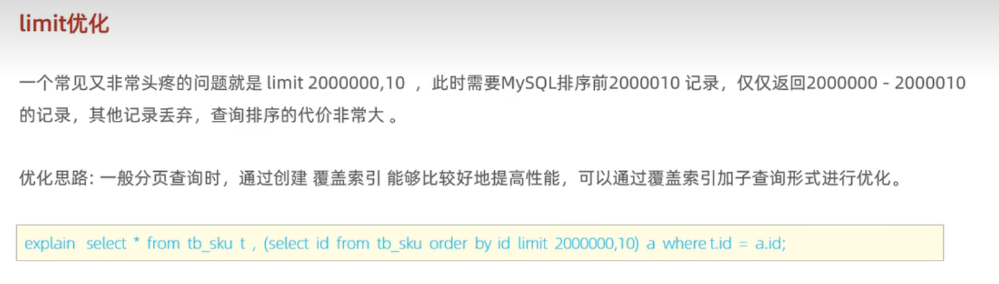
- 在limit查询不能使用in子查询，mysql会报错。
```sql
SELCET * FROM 表名 Where id in(SELECT ID FROM 表名 WHERE 条件 LIMIT 0,100)  -- 这种语法 MySQL会报错，采取图中表关联查询的方式
```

#### 9.6 COUNT 优化
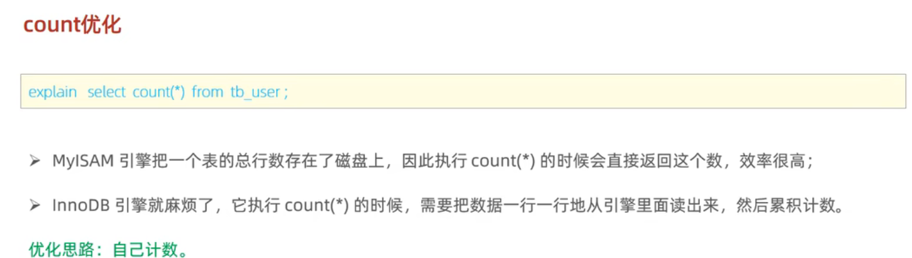
- · `COUNT(*)`：统计所有行，包括NULL值。
- · `COUNT(列名)`：统计非NULL值的行数。
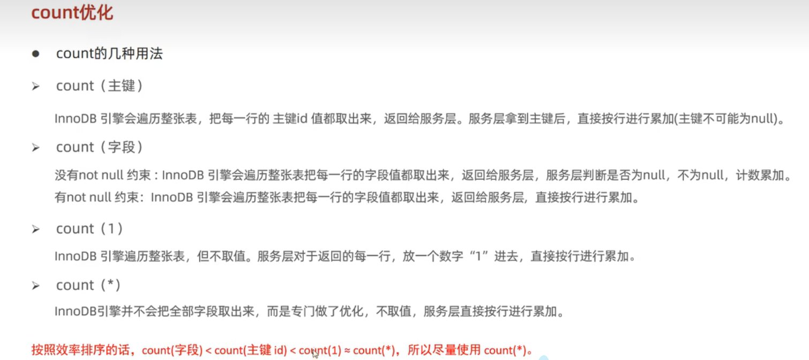


#### 9.7 UPDATE 优化 

- InnoDB中，有事务 外键 行级锁，因此更新数据时，会根据**SQL语句执行的条件和索引情况**进行锁定行或者表。因此，更新数据时，要根据索引进行锁定，避免锁定表。锁定会降低并发访问性能。
- 

### 10. 视图/ 存储过程/ 触发器

#### 10.1 视图

- 视图就是一个虚拟表，它不存在于物理表中，而是根据查询语句进行动态生成的
  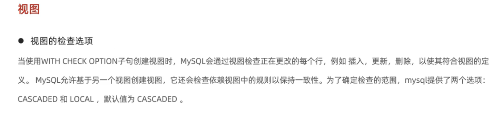

- **视图的作用：**
    - 简化用户对数据的理解，简化操作。
    - 视图可以隐藏数据的复杂性，只暴露必要的信息。
    - 安全保护必要的数据。
    - 独立性，视图可以独立于表存在，不会依赖于表的结构。
  
- `CASCADE`：级联检查，用于限制视图插入不符合视图创建语句条件的数据 ** （即使依赖的视图没有检查选项，也会进行检查） **。但是基于视图的依赖关系，会检查另外一个视图的检查选项选择是否执行。
   - 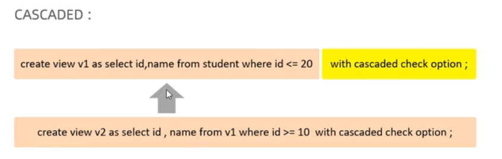
   - 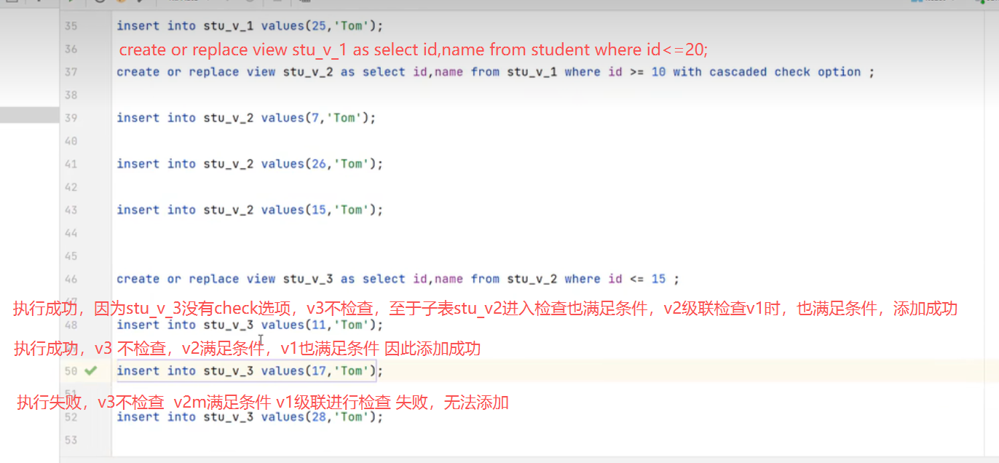
  - `LOCAL`：本地检查，检查当前创建语句是否进行检查，级联检查不会进行 **（检查依赖的视图是否有检查选项，没有则不会进行检查）**。但是基于视图的依赖关系，会检查另外一个视图的检查选项选择是否执行。
    - 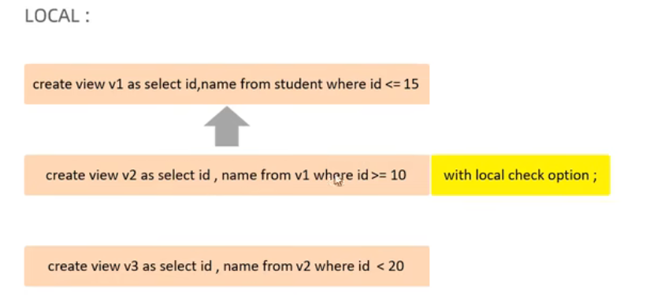
    - 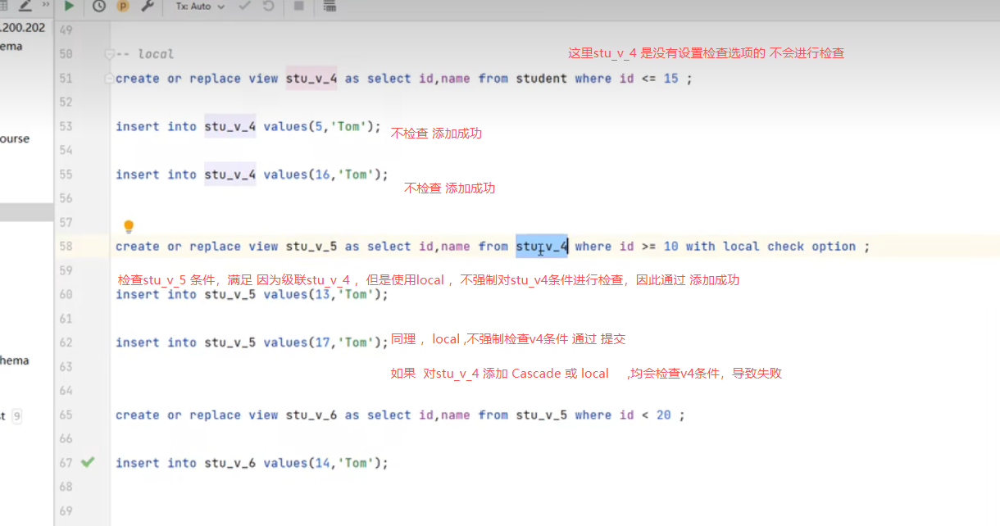

1. 视图的创建
```sql
CREATE [OR REPLACE] VIEW 视图名 AS SELECT 语句 WITH [CASCADE | LOCAL ] CHECK OPTION;  -- with check option 用于限制视图插入不符合视图创建语句条件的数据
```
1. 视图的查询
   
```SQL
SHOW CREATE VIEW 视图名; -- 查询视图的创建语句
SELECT * FROM 视图名; -- 查询视图中的数据
```

3. 修改视图
```sql
ALTER VIEW 视图名 AS SELECT 语句;
```

4. 删除视图
```sql
DROP VIEW [IF EXISTS] 视图名;
```


5. 视图添加数据

- 视图添加数据时，会根据视图的查询语句将数据插入到视图对应的表中。

```
INSERT INTO 视图名 (字段名) VALUES (值);
```

6. 视图的更新权限


#### 10.2 存储过程

- 存储过程是一个预编译的SQL语句，用于执行重复性的工作。
- 
- 作用： 
    -  封装重复性的工作，提高开发效率。
    -  减少网络流量，提高数据库性能。
    -  可以接收参数，返回结果。
-  

1. 存储过程的创建
```sql
CREATE PROCEDURE 存储过程名 (参数列表)
BEGIN
    -- 存储过程的SQL语句
END;
```


2. 存储过程的调用

```sql
CALL 存储过程名 (参数列表);
```

3. 查看存储过程
```sql
SELECT * FROM INFORMATION_SCHEMA.ROUTINES WHERE ROUTINE_SCHEMA = '数据库名';  -- 查看数据库中的所有存储过程

SHOW CREATE PROCEDURE 存储过程名; -- 查询存储过程的创建语句
```

4. 删除存储过程

```sql
DROP PROCEDURE [IF EXISTS] 存储过程名;
```

- **命令行中使用`delimiter `命令修改分隔符，用于在存储过程的创建语句中使用分号分隔多个语句。**

##### 10.2.1 存储过程涉及的变量

1. 系统变量（Session / Global Variables）


2. 用户定义变量

 - 用户定义变量不需要声明，直接使用即可。


3. 局部变量


##### 10.2.2 存储过程参数


```sql
CREATE PROCEDURE 存储过程名 (IN/OUT/INOUT 参数名 参数类型)
BEGIN
    -- 存储过程的SQL语句
END;
```


##### 10.2.3 存储过程的逻辑语句

1. IF语句

```sql
IF 条件 THEN
    -- 语句块
ELSEIF 条件 THEN   -- 多个条件的IF语句
    -- 语句块
ELSE
    -- 语句块
END IF;

```

2. CASE语句

```sql
CASE 表达式
    WHEN 值 THEN 语句块
    WHEN 值 THEN 语句块
    ELSE 语句块
END CASE;
```

3. WHILE语句

```sql
WHILE 条件 DO
    -- 语句块
END WHILE;
```

4. LOOP语句

```sql
[begin_label:] LOOP  -- 循环语句 begin_label是循环的标签（名字），用于在循环中使用`LEAVE`语句退出循环。 嵌套循环可以指定退出的循环。
    -- 语句块 
    if 条件 then
        LEAVE begin_label;
    end if;

    if 条件 then
        ITERATE begin_label;
    end if;

END LOOP[begin_label];
```
- LEVEL：循环的，用于在循环中使用`LEAVE`语句退出循环。
- ITERATE：用于在循环中跳过当前迭代，继续下一次迭代。

5. REPEAT语句

```sql
REPEAT
    -- 语句块
UNTIL 条件  -- 循环条件,直到条件为真时，退出循环
END REPEAT;
```


##### 10.2.4 游标（Cursor）

- 游标（Cursor）是一种用于遍历查询结果集的工具，在存储过程中可以用于在循环语句中使用。

- 条件处理程序（Condition Handler）


`Declare exit handler for condition 条件名 close cursor 游标名`
1. 游标的声明
```sql
DECLARE 游标名 CURSOR FOR SELECT 语句;
```

1. 游标的打开
```sql
OPEN 游标名;
```
1. 获取游标数据
```sql
FETCH 游标名 INTO 变量名[, 变量名2];
```

1. 游标的关闭
```sql
CLOSE 游标名;
```

##### 10.2.5 存储函数（Stored Function）


存储过程比存储函数方便。可以优先考虑存储过程。


#### 10.3 触发器

- 触发器（Trigger）是一种数据库对象，用于在表的插入、更新或删除操作时自动执行预定义的SQL语句。触发器可以用于实现数据的自动更新、自动备份等操作。
- 
- 语句级触发器是指一条语句执行多次，都只引发一次触发器的执行。
- 行级触发器是指只要一条行级数据发生插入、更新或删除操作，就会触发一次触发器的执行。

1. 触发器的创建

```sql
CREATE TRIGGER 触发器名 
BEFORE/AFTER  INSERT/UPDATE/DELETE  -- 触发器的执行时机before或after
ON 表名 FOR EACH ROW  -- 行级触发器
BEGIN
    -- 触发器的SQL语句
END;
```

2. 触发器的删除
```sql
DROP TRIGGER [IF EXISTS] 触发器名;
```

3. 查看触发器
```sql
show triggers;
```

### 11. 锁


- 锁分类：
  - 全局锁（Global Lock）用于锁定整个数据库，防止其他会话同时执行写操作。只读操作可以并行执行。使用场景：全库备份、全库恢复。
  - 行锁（Row Lock） 用于锁定表中的行，防止其他会话同时对同一行进行写操作。只读操作可以并行执行。
  - 表锁（Table Lock） 用于锁定整个表，防止其他会话同时对表进行写操作。只读操作可以并行执行。

#### 11.1 全局锁


```sql
flush tables with read lock;  -- 全局锁，防止其他会话同时执行写操作。
mysqldump -u用户名 -p数据库 数据库名 > 数据库名.sql  -- 备份数据库到SQL文件 mysqldump是MySQL提供的备份工具，并非sql语句。
unlock tables;  -- 解锁数据库，允许其他会话执行写操作。
```

#### 11.2 表级锁

1. 表锁： 表共享锁（read lock） 和表独占写锁（write lock）

```sql
lock tables 表名 read/write;  -- 表共享锁，防止其他会话对表进行写操作。
unlock tables;  -- 解锁表，允许其他会话对表进行写操作。
```

2. 元数据锁： 元数据锁（Metadata Lock，MDL） 用于锁定数据库元数据，防止其他会话同时对元数据进行写操作。元数据锁是表锁的特殊类型，用于锁定数据库元数据，如表结构、索引、触发器等。


3. 意向锁是当某条语句执行对数据查找或修改时，为表添加的锁。当另一个会话要访问该表时，不需要逐条检查行锁，直接比较意向锁。就可以判断是否可以并行执行。


- 意向共享锁
```sql
select * from 表名  lock in share mode;  -- 意向共享锁，防止其他会话对表进行写操作。
```

- 意向排他锁  **默认修改语句会添加意向排他锁**


#### 11.3 行级锁


- RC隔离级别（Read Committed） 读取已提交的数据，不读取未提交的数据。
- RR隔离级别（Repeatable Read） 读取已提交的数据，不读取未提交的数据，但是读取到的数据是可重复的。

1. 行锁 （更新表中存在的数据有检索到才会触发）


- 

2. 行间隙锁 （更新表中不存在的数据，但是落在索引区间会触发）
**间隙锁可以在事务Repeatable Read隔离级别下解决幻读的问题。**


1. 根据唯一索引更新表中不存在的数据，如果落在索引区间，会触发行间隙锁。**因为更新可能会改变索引结构，导致索引区间发生变化。**锁的范围只是查询索引前后之间的间隙
2. 根据非唯一索引更新数据，非唯一索引在B+树叶子的若干个片段，更新时会触发行间隙锁。防止其他会话对这个片段进行更新操作。


### 12. InnoDB 存储引擎

#### 12.1 逻辑结构


- 架构


  - 通用表空间（General Tablespace）需要自己创建，指定表空间路径。


#### 12.2 事务的原理


##### 12.2.1. 持续性

  - 日志文件是追加形式写入的，顺序写入要相比于随机写入要快。降低缓冲区的写入次数，提高写入效率。

##### 12.2.2. 原子性


##### 12.2.3. MVCC(Multi-Version Concurrency Control 多版本并发控制 面试)


1. 隐藏字段


2. Undo log 版本链


3. Readview 读视图


---

RC隔离级别（Read Committed） 读取已提交的数据，不读取未提交的数据。但是不能重复读。 每次查找都创建快照


---

RR隔离级别（Repeatable Read） 读取已提交的数据，不读取未提交的数据，但是读取到的数据是可重复的。 事务中只在第一次执行快照读时生成Readview.


---

### 13. MySQL 管理

1. 系统数据库
   


2.  mysql 工具
   

3. mysqladmin 工具
    - 启动、停止、重启 MySQL 服务 、工具调用

4. mysqlbinlog 工具
    - 查看二进制日志文件

5. mysqlshow 工具
    - 
    - 查看数据库、表、索引、触发器等信息

6. mysqldump 工具
    - 

7. mysqlimport /source 工具
    - 


### 14. 日志


#### 14.1 错误日志

- 错误日志记录了 MySQL 服务的运行状态、错误信息、警告信息等。
- 错误日志的路径可以在配置文件中指定，默认路径为 /var/log/mysql/mysqld.log

#### 14.2 二进制日志文件

- 二进制日志文件记录了所有修改数据库的语句，包括插入、更新、删除等。DDL 和DML语句，但是不包含查询语句。
- 
- 日志定期清理，避免占用过多空间。可以通过设置过期时间来自动完成定期清理。
- 作用：
    - 数据恢复
    - 数据主从复制


#### 14.3 查询日志

- 查询日志记录了所有查询语句，包括成功和失败的查询。
- 查询日志默认是关闭的，需要在配置文件中开启。
- `general_log` 配置项用于开启查询日志。
- `general_log_file` 配置项用于指定查询日志的文件路径，默认值为 /var/log/mysql/query.log。


#### 14.4 慢查询日志

- 慢查询日志记录了所有执行时间超过指定阈值的查询语句。
- 慢查询日志默认是关闭的，需要在配置文件中开启。
- `slow_query_log` 配置项用于开启慢查询日志。
- `long_query_time` 配置项用于指定慢查询的阈值，默认值为 10 秒。
- 


### 15. 主从复制


1. 主从复制的原理
    - 主从复制是一种数据同步机制，用于在 MySQL 数据库之间实现数据的实时同步。
    - 主从复制的原理是通过二进制日志文件和日志同步机制来实现的。
    - 主从复制的配置和管理需要在 MySQL 服务器端进行。
    - 

2. 主从复制的主库配置


3. 主从复制的从库配置


### 16. 分库分表

1. IO瓶颈：热点数据太多，数据库缓存不足，产生磁盘IO，效率低。
2. CPU瓶颈：数据库查询语句复杂，占用CPU资源多，效率低。

- 分库分表的思想：将数据库中的数据分布到多个数据库实例中，每个实例负责处理一部分数据。每个实例可以独立扩展，提高系统的并发处理能力。
- 拆分策略：
    - 垂直拆分
    - 
    - 水平拆分
    - 
- 

#### 16.1 MyCat 中间件


- 第二条查询涉及多个数据库查询，查询时mycat设计路由规则，将查询语句分发到不同的数据库实例中。，但是由于跨库查询，需要将这些经常使用的数据设置为**全局表**。全局表实际上是在每一个数据库实例中都存在一份相同的数据。


#### 16.2 分片规则

1. 范围分片规则


2. 取模分片规则

- 取模分片规则：根据指定字段的取模结果将数据分片到不同的数据库实例中。

3. 一致性哈希分片规则

- 一致性哈希分片规则：根据指定字段的哈希值将数据分片到不同的数据库实例中。

4. 枚举分片规则

- 枚举分片规则：根据指定字段的枚举值将数据分片到不同的数据库实例中。

5. 应用指定分片规则


6. 固定分片Hash算法


- 取模，在分区表中根据指定字段的取模结果将数据分片到不同的分区表中。

7. 字符串Hash分片规则


- 截取字符串子串，根据子串的哈希值将数据分片到不同的数据库实例中。

8. 按照天分片规则


- 按照天分片规则：根据指定字段的日期部分将数据分片到不同的数据库实例中。

9. 按照自然月分片规则


- 按照自然月分片规则：根据指定字段的自然月部分将数据分片到不同的数据库实例中。

#### 16.3 MyCat管理及监控

1. MyCat数据插入原理


2. MyCat数据查询原理


3. MyCat管理平台


4. MyCat-eye(Mycat -web)监控平台

 - mycat-web


### 17. 读写分离


#### 17.1 读写分离(一主一从)


#### 17.2 读写分离(多主多从)

1. 双组双从


---
notepad++ NppFTP插件
---