# Redis黑马课程学习

本课程介绍学习Redis的基本概念、数据结构、操作命令、集群部署等。

## 1. Redis介绍

Redis是一个基于内存的键值存储数据库，用于存储和检索数据。它支持多种数据结构，如字符串、列表、哈希、集合等。

- 支持数据持久化。

**NoSQL数据库** ：是一种非关系型数据库，它不使用关系型数据库的表和行结构，而是使用键值对存储数据。


## 2. Redis 常用命令

### 2.1 Redis 数据结构

1. Redis是键值对存储数据库，每个键对应一个值。
2. Redis支持多种数据结构，如字符串、列表、哈希、集合等。
3. 不同的数据结构有不同的操作命令。
   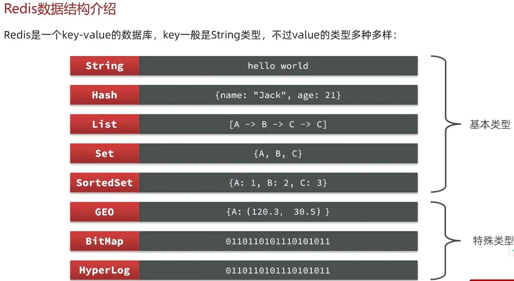

### 2.2 Redis 常用命令

1. KEYS  命令：用于查看键名。

   - 语法：KEY [pattern]
   - 示例：KEY * # 查看所有键名
   - 示例：KEY *key* # 查看包含"key"的键名
2. help [command] 命令：用于查看指定命令的详细信息。
3. del 命令：用于删除指定键。

   - 语法：del [key]
   - 示例：del key1 key2 # 删除key1和key2
4. exist 命令：用于检查键是否存在。

   - 语法：exists [key]
   - 返回值：1表示存在，0表示不存在
5. expire 命令：用于设置键的过期时间,有效期到期后键将自动删除。

   - 语法：expire [key] [seconds]
   - 示例：expire key1 60 # 设置key1的过期时间为60秒
   - 返回值：1表示设置成功，0表示设置失败
6. ttl 命令：用于查看键的过期时间。

   - 语法：ttl [key]
   - 示例：ttl key1 # 查看key1的过期时间
   - 返回值：-1表示永不过期，秒为单位

### 2.3 String 类型（Value 为字符串）命令

1. SET 命令：用于设置键值对。

   - 语法：SET [key] [value]
   - 示例：SET key1 value1 # 设置key1的值为value1
   - 返回值：OK表示设置成功
2. GET 命令：用于获取键值对。

   - 语法：GET [key]
   - 示例：GET key1 # 获取key1的值
   - 返回值：value1
3. MSET 命令：用于设置多个键值对。

   - 语法：MSET [key] [value] ...
   - 示例：MSET key1 value1 key2 value2 # 设置key1和key2的值
   - 返回值：OK表示设置成功
4. MGET 命令：用于获取多个键值对。

   - 语法：MGET [key] ...
   - 示例：MGET key1 key2 # 获取key1和key2的值
   - 返回值：value1 value2
5. INCR 命令：用于将键的值增加1。（仅对数值型键值对有效，其他类型键会报错。）

   - 语法：INCR [key]
   - 示例：INCR key1 # 将key1的值增加1
6. INCRBY 命令：用于将键的值增加指定的增量。

   - 语法：INCRBY [key] [increment]
   - 示例：INCRBY key1 5 # 将key1的值增加5
7. DECR 命令：用于将键的值减少1。（仅对数值型键值对有效，其他类型键会报错。）

   - 语法：DECR [key]
   - 示例：DECR key1 # 将key1的值减少1
8. INCRBYFLOAT 命令：用于将键的值增加指定的浮点数增量。

   - 语法：INCRBYFLOAT [key] [increment]
   - 示例：INCRBYFLOAT key1 5.0 # 将key1的值增加5.0
9. SETNX 命令：用于设置键值对，仅当键不存在时才设置。

   - 语法：SETNX [key] [value]
   - 示例：SETNX key1 value1 # 如果key1不存在，设置key1的值为value1
   - 返回值：1表示设置成功，0表示键已存在
10. SETEX 命令：用于设置键值对，并设置过期时间。

    - 语法：SEEX [key] [seconds] [value]
    - 示例：SEEX key1 60 value1 # 设置key1的值为value1，过期时间为60秒
    - 返回值：OK表示设置成功

---

> Redis没有表结构，不存在唯一索引，因此在键值对上对键进行**层级结构命名**，多个单词间用":"分隔。
>
> 示例：user:123:info
>
> 项目：业务名：类型：键值

---

### 2.4 Hash 类型（Value 为哈希表）命令

- Hash 类型，Value是一个无序字典集合，类似Java中的HashMap。
- 因为值为哈希表，所以Hash类型支持键值对的存储和检索。

1. HSET 命令：用于设置哈希表的键值对。

   - 语法：HSET [key] [field] [value]
   - 示例：HSET key1 field1 value1 # 设置key1的哈希表字段field1的值为value1
   - 返回值：OK表示设置成功
2. HGET 命令：用于获取哈希表的键值对。

   - 语法：HGET [key] [field]
   - 示例：HGET key1 field1 # 获取key1的哈希表字段field1的值
   - 返回值：value1
3. HGETALL 命令：用于获取哈希表的所有键值对。

   - 语法：HGETALL [key]
   - 示例：HGETALL key1 # 获取key1的所有哈希表键值对
   - 返回值：field1:value1 field2:value2 ...
4. HDEL 命令：用于删除哈希表的键值对。

   - 语法：HDEL [key] [field] ...
   - 示例：HDEL key1 field1 field2 # 删除key1的哈希表字段field1和field2
   - 返回值：OK表示删除成功
5. HMSET 命令：用于设置多个哈希表的键值对。

   - 语法：HMSET [key] [field] [value] ...
   - 示例：HMSET key1 field1 value1 field2 value2 # 设置key1的哈希表字段field1和field2的值
   - 返回值：OK表示设置成功
6. HMGET 命令：用于获取多个哈希表的键值对。

   - 语法：HMGET [key] [field] ...
   - 示例：HMGET key1 field1 field2 # 获取key1的哈希表字段field1和field2的值
   - 返回值：value1 value2
7. HKEYS 命令：用于获取哈希表的所有键。

   - 语法：HKEYS [key]
   - 示例：HKEYS key1 # 获取key1的所有哈希表字段
   - 返回值：field1 field2 ...
8. HVALS 命令：用于获取哈希表的所有值。

   - 语法：HVALS [key]
   - 示例：HVALS key1 # 获取key1的所有哈希表字段值
   - 返回值：value1 value2 ...
9. HINCRBY 命令：用于将哈希表的键值对增加指定的增量。

   - 语法：HINCRBY [key] [field] [increment]
   - 示例：HINCRBY key1 field1 5 # 将key1的哈希表字段field1的值增加5
   - 返回值：value1
10. HSETNX 命令：用于设置哈希表的键值对，仅当键不存在时才设置。

    - 语法：HSETNX [key] [field] [value]
    - 示例：HSETNX key1 field1 value1 # 如果key1的哈希表字段field1不存在，设置key1的哈希表字段field1的值为value1
    - 返回值：1表示设置成功，0表示键已存在

### 2.5 List 类型（Value 为列表）命令

- List 类型，Value是一个有序列表，类似Java中的LinkedList,可视为双向链表。
- 特点是：有序、元素可重复、插入和删除快、查询效率低。

1. LPUSH 命令：用于将元素插入到列表的左端。

   - 语法：LPUSH [key] [value]
   - 示例：LPUSH key1 value1 # 将value1插入到列表key1的左端
   - 返回值：列表的长度
2. RPUSH 命令：用于将元素插入到列表的右端。

   - 语法：RPUSH [key] [value]
   - 示例：RPUSH key1 value1 # 将value1插入到列表key1的右端
   - 返回值：列表的长度
3. LPOP 命令：用于从列表的左端弹出元素。**如果列表为空，返回NULL**。

   - 语法：LPOP [key]
   - 示例：LPOP key1 # 从列表key1的左端弹出元素
   - 返回值：value1
4. RPOP 命令：用于从列表的右端弹出元素。**如果列表为空，返回NULL**

   - 语法：RPOP [key]
   - 示例：RPOP key1 # 从列表key1的右端弹出元素
   - 返回值：value1
5. LRANGE 命令：用于获取列表的指定范围内的元素。

   - 语法：LRANGE [key] [start] [end]
   - 示例：LRANGE key1 0 1 # 获取列表key1的第0个元素到第1个元素
   - 返回值：value1 value2
6. LLEN 命令：用于获取列表的长度。

   - 语法：LLEN [key]
   - 示例：LLEN key1 # 获取列表key1的长度
   - 返回值：2
7. BLPOP 命令：用于从列表的左端弹出元素，**若列表为空则阻塞等待**。

   - 语法：BLPOP [key] [timeout]
   - 示例：BLPOP key1 60 # 从列表key1的左端弹出元素，若列表为空则阻塞等待60秒
   - 返回值：value1
   - 说明：若列表key1为空，BLPOP命令会阻塞等待60秒，若60秒内有元素插入到列表key1，BLPOP命令会立即返回该元素。
   - 若60秒内没有元素插入到列表key1，BLPOP命令会返回NULL。
8. BRPOP 命令：用于从列表的右端弹出元素，**若列表为空则阻塞等待**。

---

1. 如何利用List结构实现队列
   - 入口和出口在不同的侧
2. 如何利用List结构实现栈
   - 入口和出口都在列表的同侧
3. 如何利用List结构实现阻塞队列
   - 入口和出口在不同的侧
   - 出队是BLPOP命令，入队是LPUSH命令，通过等待BLPOP命令的超时时间，实现阻塞队列。

### 2.6 Set 类型（Value 为集合）命令

- Set 类型，Value是一个无序集合，类似Java中的HashSet,可视为哈希表的特殊实现。
- 特点是：无序、元素不可重复、插入和删除快、查询效率高。

1. SADD 命令：用于将元素插入到集合中。

   - 语法：SADD [key] [value]
   - 示例：SADD key1 value1 # 将value1插入到集合key1中
   - 返回值：OK表示插入成功
2. SREM 命令：用于从集合中删除元素。

   - 语法：SREM [key] [value]
   - 示例：SREM key1 value1 # 从集合key1中删除元素value1
   - 返回值：OK表示删除成功
   - 说明：若集合key1中不存在元素value1，SREM命令会返回OK。
3. SCARD 命令：用于获取集合的元素数量。

   - 语法：SCARD [key]
   - 示例：SCARD key1 # 获取集合key1的元素数量
4. SISMEMBER 命令：用于判断元素是否在集合中。

   - 语法：SISMEMBER [key] [value]
   - 示例：SISMEMBER key1 value1 # 判断集合key1中是否存在元素value1
   - 返回值：1表示存在，0表示不存在
   - 说明：若集合key1中不存在元素value1，SISMEMBER命令会返回0。
   - 若集合key1中存在元素value1，SISMEMBER命令会返回1。
5. SMEMBERS 命令：用于获取集合中的所有元素。

   - 语法：SMEMBERS [key]
   - 示例：SMEMBERS key1 # 获取集合key1中的所有元素
   - 返回值：value1 value2 ...
6. SINTER 命令：用于获取多个集合的交集。

   - 语法：SINTER [key1] [key2] ...
   - 示例：SINTER key1 key2 # 获取集合key1和集合key2的交集
   - 返回值：value1 value2 ...
7. SUNION 命令：用于获取多个集合的并集。

   - 语法：SUNION [key1] [key2] ...
   - 示例：SUNION key1 key2 # 获取集合key1和集合key2的并集
   - 返回值：value1 value2 ...
8. SDIFF 命令：用于获取多个集合的差集。

   - 语法：SDIFF [key1] [key2] ...
   - 示例：SDIFF key1 key2 # 获取集合key1和集合key2的差集
   - 返回值：value1 value2 ...

### 2.7 SortedSet 类型（Value 为有序集合）命令

- SortedSet 类型，Value是一个有序集合，类似Java中的TreeSet功能，但是redis中底层是一个跳表（SkipList）加hash表。通过每个元素带一个score属性，对元素根据score排序。
- 特点是：可排序，查询效率高。

1. ZADD 命令：用于将元素插入到有序集合中。

   - 语法：ZADD [key] [score] [value]
   - 示例：ZADD key1 100 value1 # 将value1插入到有序集合key1中，score为100
   - 返回值：OK表示插入成功
2. ZREM 命令：用于从有序集合中删除元素。

   - 语法：ZREM [key] [value]
   - 示例：ZREM key1 value1 # 从有序集合key1中删除元素value1
   - 返回值：OK表示删除成功
   - 说明：若有序集合key1中不存在元素value1，ZREM命令会返回OK。
3. ZCARD 命令：用于获取有序集合的元素数量。

   - 语法：ZCARD [key]
   - 示例：ZCARD key1 # 获取有序集合key1的元素数量
   - 返回值：2
   - 说明：有序集合key1中存在2个元素。
4. ZSCORE 命令：用于获取有序集合中元素的score值。

   - 语法：ZSCORE [key] [value]
   - 示例：ZSCORE key1 value1 # 获取有序集合key1中元素value1的score值
   - 返回值：100
   - 说明：有序集合key1中元素value1的score值为100。
   - 若有序集合key1中不存在元素value1，ZSCORE命令会返回NULL。
5. ZRANK 命令：用于获取有序集合中元素的排名。

   - 语法：ZRANK [key] [value]
   - 示例：ZRANK key1 value1 # 获取有序集合key1中元素value1的排名
   - 返回值：0
   - 说明：有序集合key1中元素value1的排名为0，从0开始计数。
   - 若有序集合key1中不存在元素value1，ZRANK命令会返回-1。
6. ZCOUNT 命令：用于获取有序集合中范围元素的数量。

   - 语法：ZCOUNT [key] [min] [max]
   - 示例：ZCOUNT key1 0 100 # 获取有序集合key1中score在0到100之间的元素数量
   - 返回值：2
   - 说明：有序集合key1中score在0到100之间的元素数量为2。
7. ZINCRBY 命令：用于对有序集合中元素的score值进行增量操作。

   - 语法：ZINCRBY [key] [increment] [value]
   - 示例：ZINCRBY key1 10 value1 # 对有序集合key1中元素value1的score值进行10的增量操作
   - 返回值：110
   - 说明：有序集合key1中元素value1的score值为110。

---

> 默认排序是按score值升序排序。

## 3. Redis 的JAVA客户端

1. Jedis 是一个基于Java的Redis客户端，用于连接Redis服务器并执行Redis命令。 线程不安全的
2. Lettuce 是一个基于Java的Redis客户端，用于连接Redis服务器并执行Redis命令。 线程安全的。支持Redis的哨兵模式、集群模式、管道模式
3. Redisson 是一个基于Java的Redis客户端，用于连接Redis服务器并执行Redis命令。

> Spring Data Redis 是一个基于Java的Redis客户端，用于连接Redis服务器并执行Redis命令。

### 3.1 Jedis 客户端

1. 引入Maven依赖

```xml
   <dependency>
      <groupId>redis.clients</groupId>
      <artifactId>jedis</artifactId>
      <version>3.7.0</version>
    </dependency>
```

2. 连接Redis服务器

```java

package COM.HONG.test;

import org.junit.jupiter.api.AfterEach;
import org.junit.jupiter.api.BeforeEach;
import org.junit.jupiter.api.Test;
import redis.clients.jedis.Jedis;

public class JedisConnectTest {
    private Jedis jedis;

    @BeforeEach
    public void setUp() {
        jedis = new Jedis("127.0.0.1", 6379);
        jedis.select(0);
        // 测试是否连接上Redis
        String result = jedis.ping();

        if (result.equals("PONG")) {
            System.out.println("Redis连接成功");
        } else {
            System.out.println("Redis连接失败");
        }
    }

    @Test
    public void testConnect() {
        // 设置数据
        jedis.set("Years", "2023");
        // 获取数据
        String value = jedis.get("Years");
        // 打印获取到的值
        System.out.println("获取到的值: " + value);
    }

    @AfterEach
    public void tearDown() {
        if (jedis != null) {
            jedis.close();
        }
        System.out.println("Redis连接已关闭");
    }
}
```

3. Jedis 连接池

- 连接池可以提高Redis客户端的性能，避免频繁创建和销毁连接。

```java

package COM.HONG.test;

import org.junit.jupiter.api.AfterEach;
import org.junit.jupiter.api.Test;
import redis.clients.jedis.Jedis;
import redis.clients.jedis.JedisPool;
import redis.clients.jedis.JedisPoolConfig;

public class JedisPoolConnectTest {
    // 连接池
    private static JedisPool pool;
    // 连接池配置
    static {
        JedisPoolConfig poolConfig = new JedisPoolConfig();
        poolConfig.setMaxTotal(10); // 最大连接数
        poolConfig.setMaxIdle(5); // 最大空闲连接数

        poolConfig.setMinIdle(0); // 最小空闲连接数

        pool = new JedisPool(poolConfig, "127.0.0.1", 6379);
        Jedis jedis = pool.getResource();

    }

    // 测试连接池
    @Test
    public void testConnect() {
        Jedis jedis = pool.getResource();
        if (jedis != null) {
            System.out.println(jedis.ping());
        }
        String value = jedis.get("Years");
        System.out.println("获取到的值: " + value);
    }

    @AfterEach
    public void tearDown() {
        if (pool != null) {
            pool.close();
        }
        System.out.println("Redis连接池已关闭");
    }
}

```

4. Spring Data Redis

- Spring Data Redis 是一个基于Java的Redis客户端，用于连接Redis服务器并执行Redis命令。它提供了一个高层次的抽象，使得开发者可以更方便地使用Redis。

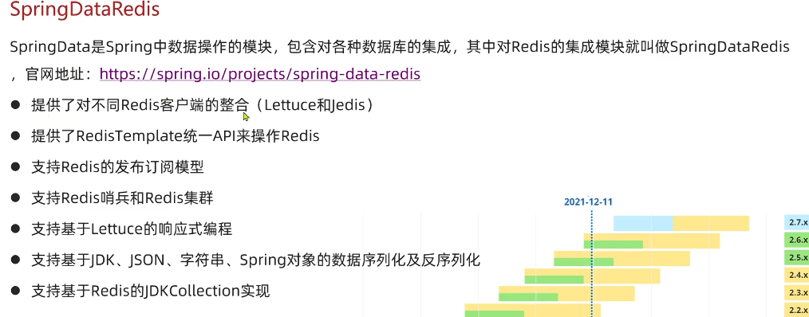

* 同样使用Spring-Boot工程，引入Spring Data Redis依赖。

```xml
    <dependency>
        <groupId>org.springframework.boot</groupId>
        <artifactId>spring-boot-starter-data-redis</artifactId>
    </dependency>
```
- 配置Redis连接
```yaml

# 配置Redis连接
spring:
  data:
    redis:
      host: 127.0.0.1
      port: 6379
#      password:
      timeout: 60s
      lettuce:
        pool:
          max-active: 8
          max-idle: 8
          min-idle: 0
```

- 测试代码
```java
package com.hong.redisproj2;


import org.junit.jupiter.api.Test;
import org.springframework.beans.factory.annotation.Autowired;
import org.springframework.boot.test.context.SpringBootTest;
import org.springframework.data.redis.connection.RedisConnectionFactory;
import org.springframework.data.redis.core.RedisTemplate;

@SpringBootTest
class Redisproj2ApplicationTests {

    //注入RedisTemplate
    @Autowired
    private RedisTemplate redisTemplate; // 泛型表示支持字符串键和对象值


    @Test
    void contextLoads() {
        // 测试连接是否成功
        redisTemplate.opsForValue().set("Redis1", "Hello Redis!");
        String value = (String) redisTemplate.opsForValue().get("Redis1");
        System.out.println("Redis1: " + value);
    }

}

```

---
> 再使用连接池进行写入Redis数据时，实际上传入参数是Object类型。它内部会自动将Object类型转换为Redis支持的类型。但是内部会进行序列化操作，将Object类型转换为字节数组。
>
> 想要通过客户端访问时，实际上键值对要进行反序列化操作，将字节数组转换为Object类型。
>
> 类似于如此：**“Redis1: Hello Redis!”** 我们通过上示例进行写入，但是通过redis-cli查看时，发现键值对**是“Redis1: \xac\xed\x00\x05t\x00\x0cHello Redis!”。**


#### 3.1.1 序列化设置

1. 序列化器

```java

@Configuration
public class RedisConfig {

    @Bean
    public RedisTemplate<String, Object> redisTemplate(RedisConnectionFactory connectionFactory) {
        RedisTemplate<String, Object> template = new RedisTemplate<>();
        template.setConnectionFactory(connectionFactory); // 设置连接工厂
        // 设置序列化工具，JSON序列化
        GenericJackson2JsonRedisSerializer serializer = new GenericJackson2JsonRedisSerializer();
        template.setKeySerializer(new StringRedisSerializer()); // 设置键序列化器
        template.setValueSerializer(serializer); // 设置值序列化器
        template.setHashKeySerializer(new StringRedisSerializer()); // 设置哈希键序列化器
        template.setHashValueSerializer(serializer); // 设置哈希值序列化器
        template.afterPropertiesSet();
        return template;
    }
}
```

- 这种方式序列化可以将Object类型转换为JSON字符串，然后存储到Redis中。
- 反序列化时，会将JSON字符串转换为Object类型。
- 结果类似于此：

``` bash
get user:1
"{\"@class\":\"com.hong.redisproj2.User\",\"id\":1,\"name\":\"\xe5\xbc\xa0\xe4\xb8\x89\",\"email\":\"zhangsan@example.com\"}"

```


2. 使用StringRedisSerializer 和 Objectmapper对对象进行JSON序列化 进行序列化设置


- 测试代码
```java
package com.hong.redisproj2;

import com.fasterxml.jackson.core.JsonProcessingException;
import com.fasterxml.jackson.databind.ObjectMapper;
import org.junit.jupiter.api.Test;
import org.springframework.beans.factory.annotation.Autowired;
import org.springframework.boot.test.context.SpringBootTest;
import org.springframework.data.redis.core.StringRedisTemplate;

@SpringBootTest
class StringRedisTemplateTest {

    @Autowired
    private StringRedisTemplate stringRedisTemplate;

    @Test
    void testStringOperations() {
        String key = "test:string";
        String value = "Hello StringRedisTemplate!";

        stringRedisTemplate.opsForValue().set(key, value);
        String retrievedValue = stringRedisTemplate.opsForValue().get(key);

        System.out.println("Key: " + key);
        System.out.println("Value: " + retrievedValue);
        System.out.println("Test passed: " + value.equals(retrievedValue));
    }

    @Test
    void testObjectSerializationWithObjectMapper() {
        ObjectMapper objectMapper = new ObjectMapper();
        User user = new User(1L, "张三", "zhangsan@example.com", 25);

        try {
            String key = "test:user:" + user.getId();

            String jsonValue = objectMapper.writeValueAsString(user);
            System.out.println("Serialized JSON: " + jsonValue);

            stringRedisTemplate.opsForValue().set(key, jsonValue);

            String retrievedJson = stringRedisTemplate.opsForValue().get(key);
            System.out.println("Retrieved JSON: " + retrievedJson);

            User retrievedUser = objectMapper.readValue(retrievedJson, User.class);
            System.out.println("Retrieved User: " + retrievedUser);

            System.out.println("Test passed: " + user.equals(retrievedUser));

        } catch (JsonProcessingException e) {
            System.err.println("JSON processing error: " + e.getMessage());
            e.printStackTrace();
        }
    }

    @Test
    void testMultipleUsers() {
        ObjectMapper objectMapper = new ObjectMapper();

        User user1 = new User(1L, "张三", "zhangsan@example.com", 25);
        User user2 = new User(2L, "李四", "lisi@example.com", 30);
        User user3 = new User(3L, "王五", "wangwu@example.com", 28);

        try {
            String key1 = "test:user:" + user1.getId();
            String key2 = "test:user:" + user2.getId();
            String key3 = "test:user:" + user3.getId();

            stringRedisTemplate.opsForValue().set(key1, objectMapper.writeValueAsString(user1));
            stringRedisTemplate.opsForValue().set(key2, objectMapper.writeValueAsString(user2));
            stringRedisTemplate.opsForValue().set(key3, objectMapper.writeValueAsString(user3));

            User retrievedUser1 = objectMapper.readValue(stringRedisTemplate.opsForValue().get(key1), User.class);
            User retrievedUser2 = objectMapper.readValue(stringRedisTemplate.opsForValue().get(key2), User.class);
            User retrievedUser3 = objectMapper.readValue(stringRedisTemplate.opsForValue().get(key3), User.class);

            System.out.println("Retrieved User 1: " + retrievedUser1);
            System.out.println("Retrieved User 2: " + retrievedUser2);
            System.out.println("Retrieved User 3: " + retrievedUser3);

            System.out.println("All users stored and retrieved successfully!");

        } catch (JsonProcessingException e) {
            System.err.println("JSON processing error: " + e.getMessage());
            e.printStackTrace();
        }
    }

    @Test
    void testHashOperations() {
        ObjectMapper objectMapper = new ObjectMapper();
        User user = new User(1L, "赵六", "zhaoliu@example.com", 35);

        try {
            String hashKey = "test:user:hash:" + user.getId();

            stringRedisTemplate.opsForHash().put(hashKey, "id", String.valueOf(user.getId()));
            stringRedisTemplate.opsForHash().put(hashKey, "name", user.getName());
            stringRedisTemplate.opsForHash().put(hashKey, "email", user.getEmail());
            stringRedisTemplate.opsForHash().put(hashKey, "age", String.valueOf(user.getAge()));

            String retrievedId = (String) stringRedisTemplate.opsForHash().get(hashKey, "id");
            String retrievedName = (String) stringRedisTemplate.opsForHash().get(hashKey, "name");
            String retrievedEmail = (String) stringRedisTemplate.opsForHash().get(hashKey, "email");
            String retrievedAge = (String) stringRedisTemplate.opsForHash().get(hashKey, "age");

            System.out.println("Hash operations test:");
            System.out.println("ID: " + retrievedId);
            System.out.println("Name: " + retrievedName);
            System.out.println("Email: " + retrievedEmail);
            System.out.println("Age: " + retrievedAge);

            User reconstructedUser = new User(
                    Long.parseLong(retrievedId),
                    retrievedName,
                    retrievedEmail,
                    Integer.parseInt(retrievedAge)
            );

            System.out.println("Reconstructed User: " + reconstructedUser);

        } catch (Exception e) {
            System.err.println("Hash operations error: " + e.getMessage());
            e.printStackTrace();
        }
    }
}

```

- 测试类对象

``` java
package com.hong.redisproj2;

public class User {
    private Long id;
    private String name;
    private String email;
    private Integer age;

    public User() {
    }

    public User(Long id, String name, String email, Integer age) {
        this.id = id;
        this.name = name;
        this.email = email;
        this.age = age;
    }

    public Long getId() {
        return id;
    }

    public void setId(Long id) {
        this.id = id;
    }

    public String getName() {
        return name;
    }

    public void setName(String name) {
        this.name = name;
    }

    public String getEmail() {
        return email;
    }

    public void setEmail(String email) {
        this.email = email;
    }

    public Integer getAge() {
        return age;
    }

    public void setAge(Integer age) {
        this.age = age;
    }

    @Override
    public String toString() {
        return "User{" +
                "id=" + id +
                ", name='" + name + '\'' +
                ", email='" + email + '\'' +
                ", age=" + age +
                '}';
    }
}


- 序列化对象注册
```java
package com.hong.redisproj2;

import org.springframework.context.annotation.Bean;
import org.springframework.context.annotation.Configuration;
import org.springframework.data.redis.connection.RedisConnectionFactory;
import org.springframework.data.redis.core.RedisTemplate;
import org.springframework.data.redis.core.StringRedisTemplate;
import org.springframework.data.redis.serializer.StringRedisSerializer;

@Configuration
public class RedisConfig {

    @Bean  // 使用StringRedisSerializer对键进行序列化和反序列化
    public RedisTemplate<String, Object> redisTemplate(RedisConnectionFactory connectionFactory) {
        RedisTemplate<String, Object> template = new RedisTemplate<>();
        template.setConnectionFactory(connectionFactory);
        template.setKeySerializer(new StringRedisSerializer());
        template.setHashKeySerializer(new StringRedisSerializer());
        template.afterPropertiesSet();
        return template;
    }

    @Bean
    public StringRedisTemplate stringRedisTemplate(RedisConnectionFactory connectionFactory) {
        StringRedisTemplate template = new StringRedisTemplate();
        template.setConnectionFactory(connectionFactory);
        template.setKeySerializer(new StringRedisSerializer());
        template.setHashKeySerializer(new StringRedisSerializer());
        template.afterPropertiesSet();
        return template;
    }
}


``` 

- 通过redis-cli查看时，键值对类似于此：

``` bash
get "test:user:2"
"{\"id\":2,\"name\":\"\xe6\x9d\x8e\xe5\x9b\x9b\",\"email\":\"lisi@example.com\",\"age\":30}"
```

## 4. 黑马点评部分


### 4.1 Session 登录

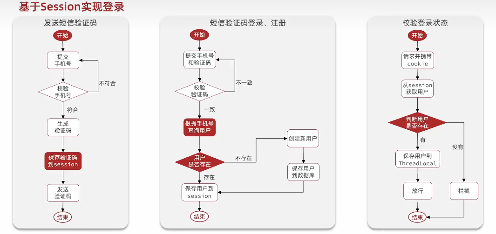
### 4.2 拦截器在登录校验时线程不安全问题

- 问题：
  - 拦截器是单例的：Spring 容器中默认一个拦截器 Bean 只有一个对象。
  - 多个请求线程同时访问：每个请求都会进入同一个拦截器的 preHandle 方法。
- 解决：使用threadLocal存储登录信息，避免线程不安全问题。
  - 拦截器中添加threadLocal，用于存储登录信息。
  - 拦截器中添加方法，用于获取登录信息。preHandleLocal.get() 在开始时获取登录信息，afterCompletionLocal.remove() 在结束时清除登录信息。

---
> // 拦截器并不归于容器管理，需要手动创建，因此它需要在 ApplicationRunner 中创建
> // 同时，在使用其他如RedisTemplate等组件时，也需要在 内部或传入，无法进行自动注入
>
> 
---

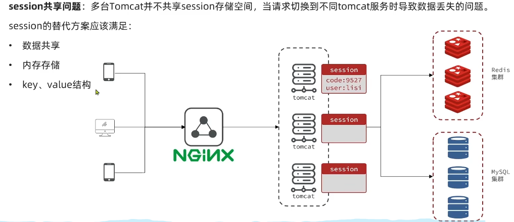

> Session 在针对多台Tomcat时，是相互独立的。每个Tomcat实例都有自己的Session管理器，不会共享Session。
>
> 解决这种问题就是通过Redis来存储Session信息。


### 4.3 Redis 进行登录校验管理

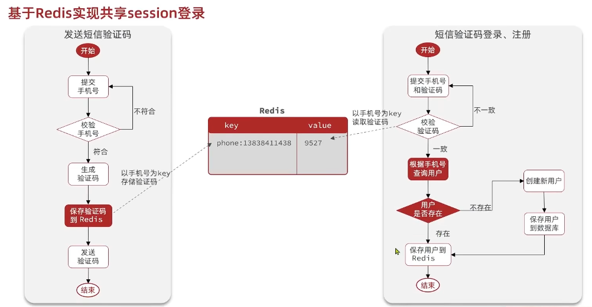

- JWT（JSON Web Token）方式，通过后端生成JWT，作为唯一的标识符（区分每个用户，同时标识Session）。
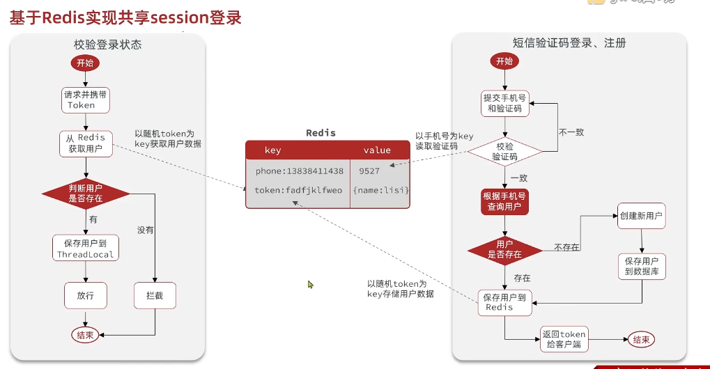

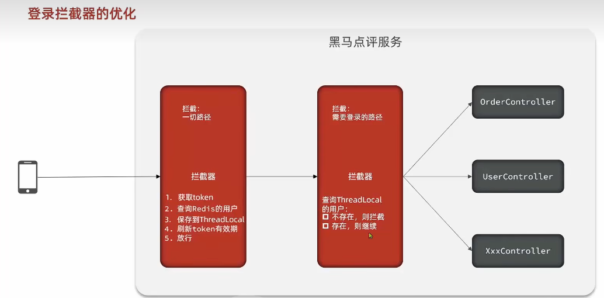


### 4.4 Redis 进行商户缓存

#### 4.4.1 缓存介绍

- 缓存就是数据交换的中间层，用于临时存储数据，提高数据访问速度。

1. 缓存的作用：
     - 提高数据访问速度：通过缓存热门数据，减少数据库访问次数。
     - 减少数据库压力：缓存可以缓存数据库查询结果，避免重复查询。
     - 提供实时数据：缓存可以提供实时数据，避免依赖数据库。

2. 缓存的成本：
     - 存储成本：缓存需要占用内存空间，增加服务器成本。
     - 计算成本：缓存需要占用CPU资源，增加服务器成本。
     - 数据一致性问题：缓存数据和数据库数据不一致，需要通过缓存失效策略来解决。

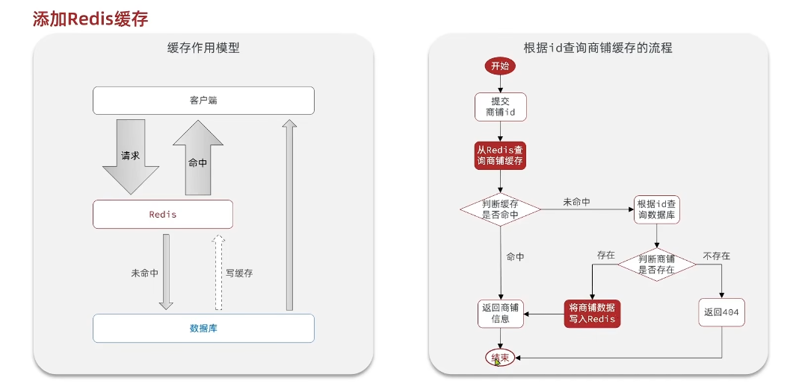


#### 4.4.3 缓存更新策略

- JMeter 工具：用于测试缓存更新策略的性能。

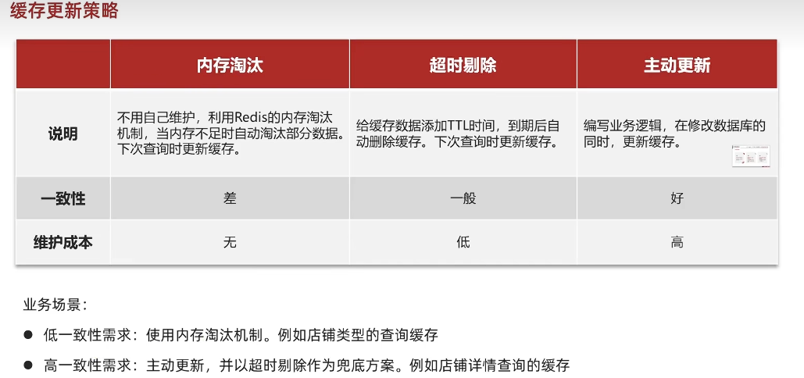

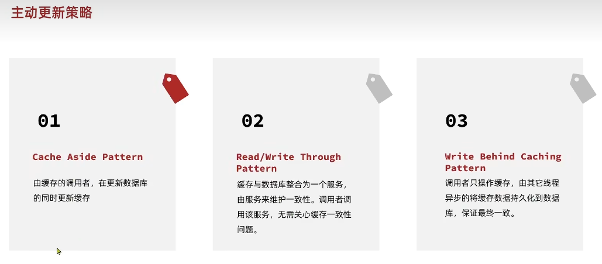
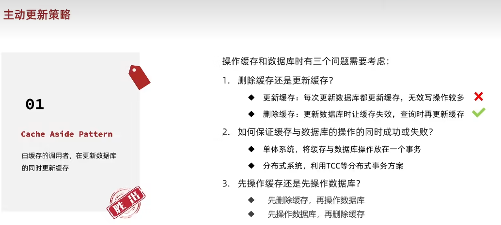
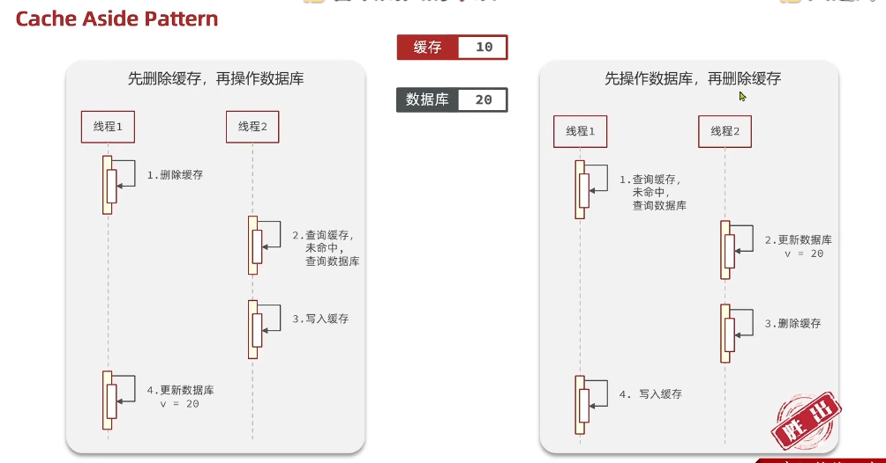

1. 缓存穿透

- 缓存穿透是指当前请求的key不存在缓存中，也不存在数据库中，导致数据库压力增加。
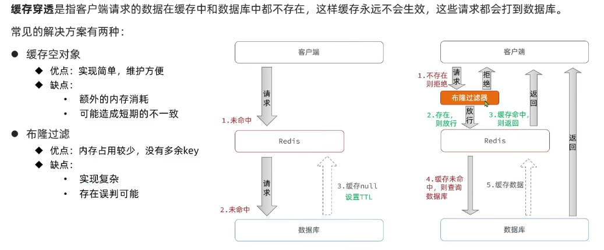
- 解决方案：
    -  缓存空对象，避免数据库压力增加。 这种方式会增加额外内存消耗，可能造成短期的不一致性。
    -  布隆过滤器，避免缓存穿透。
    -  并不仅限于此，也可以通过其他方式来避免缓存穿透。
    -  数据校验，用户权限校验。
  
---
> 缓存穿透的一个解决代码示例：通过缓存空对象，避免数据库压力增加。

``` java 

    @Override
    public Result queryById(Long id) {
        // 1. 从Redis缓存中查询
        String key = CACHE_SHOP_KEY + id;
        String shopJson = stringRedisTemplate.opsForValue().get(key);
        // 2. 判断缓存中是否有数据 StrUtil.isNotBlank() 方法判断字符串是否为空，不包含空格等
        if (StrUtil.isNotBlank(shopJson)) {
            // 存在数据，直接返回
            Shop shop = JSONUtil.toBean(shopJson, Shop.class);
            return Result.ok(shop);
        }
        // 如果缓存中有数据，但是是空字符串，说明店铺不存在，直接返回失败
        if (shopJson != null) {
            return Result.fail("店铺不存在");
        }
        // 4. 如果没有数据，从数据库中查询
        Shop shop = getById(id);

        if (shop == null) {// 店铺不存在
            // 创建空对象，避免缓存穿透问题
            stringRedisTemplate.opsForValue().set(key, "",CACHE_NULL_TTL, TimeUnit.MINUTES);
            return Result.fail("店铺不存在");
        }
        // 6. 如果数据库中也有数据，写入缓存，返回数据
        stringRedisTemplate.opsForValue().set(key, JSONUtil.toJsonStr(shop), CACHE_SHOP_TTL, TimeUnit.MINUTES);
        return Result.ok(shop);
    }

```


1. 缓存雪崩

- 缓存雪崩是指在同一时间，缓存中大量的的数据都失效期，导致数据库压力增加。
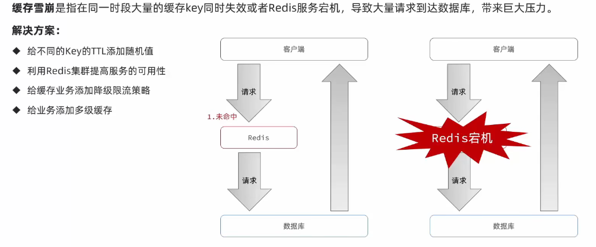


3. 缓存击穿（热点Key问题）

- 缓存击穿问题叫热点key问题。一个被高并发访问并且缓存重建业务复杂的key突然失效，导致数据库压力增加。

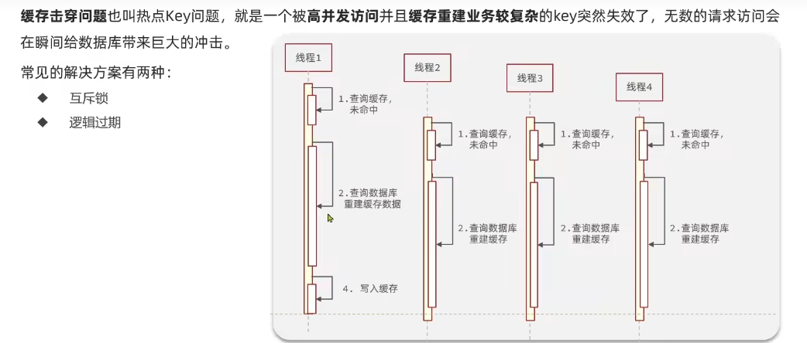

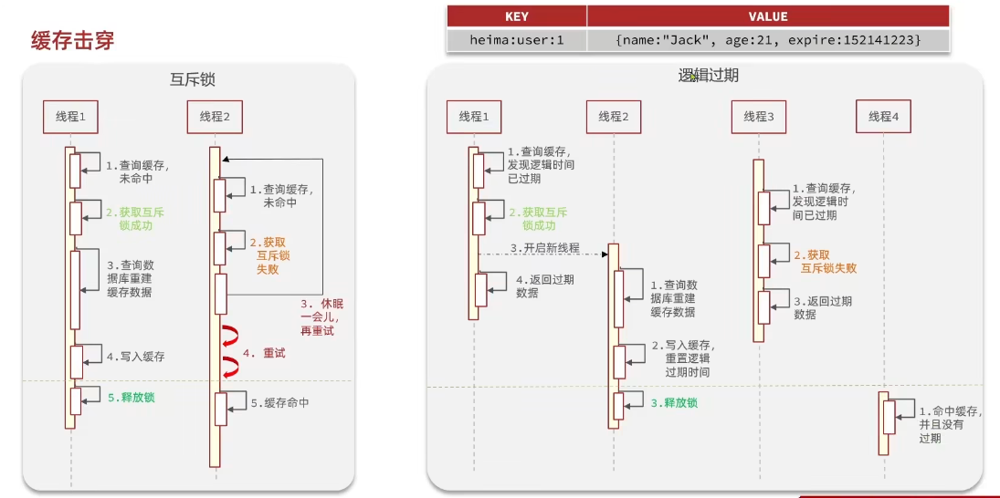

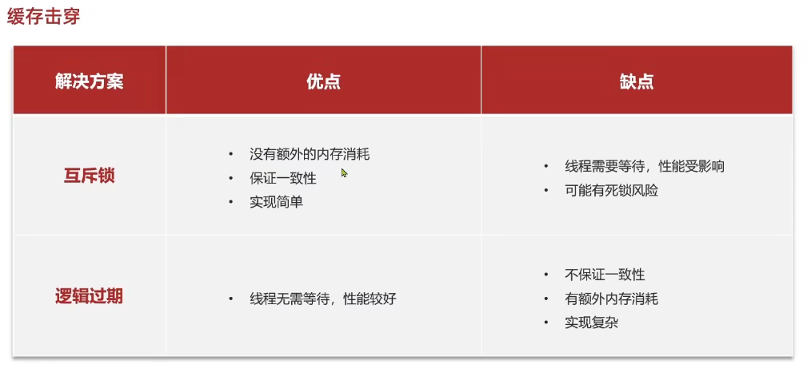


- 互斥锁在Redis中可以使用setnx实现，因为setnx命令在key不存在时，才会设置成功，其他情况都会返回失败。
- 互斥锁的实现原理是：
    -  当线程A请求获取互斥锁时，会使用setnx命令设置互斥锁。
    -  如果互斥锁不存在，会设置互斥锁，返回成功。
    -  如果互斥锁存在，会返回失败。
-  
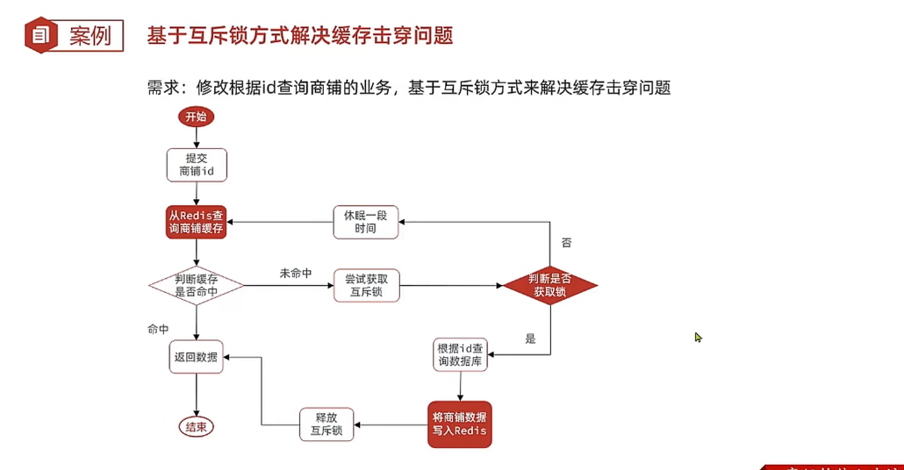

- 热点Key互斥锁解决代码示例：

``` java

    // 使用互斥锁来解决热点Key不存在问题
    public Shop queryWithMutex(Long id){
        // 1. 从Redis缓存中查询
        String key = CACHE_SHOP_KEY + id;
        String shopJson = stringRedisTemplate.opsForValue().get(key);
        // 2. 判断缓存中是否有数据
        if (StrUtil.isNotBlank(shopJson)) {
            // 存在数据，直接返回
            Shop shop = JSONUtil.toBean(shopJson, Shop.class);
            return shop;
        }
        // 如果缓存中有数据，但是是空字符串，说明店铺不存在，直接返回失败
        if (shopJson != null) {
            return null;
        }
        Shop shop = null;
        String lockKey = LOCK_SHOP_KEY + id;
        try {
            // 3. 尝试获取互斥锁
            boolean isLock = tryLock(lockKey, LOCK_SHOP_TTL, TimeUnit.SECONDS);
            if (!isLock) {
                // 获取互斥锁失败，休眠一段时间后重试
                Thread.sleep(50);
                return queryWithMutex(id);
            }
            // 4. 如果没有数据，从数据库中查询
            shop = getById(id);
            if (shop == null) {// 店铺不存在
                // 创建空对象，避免缓存穿透问题
                stringRedisTemplate.opsForValue().set(key, "",CACHE_NULL_TTL, TimeUnit.MINUTES);
                return null;
            }
            // 6. 如果数据库中也有数据，写入缓存，返回数据
            stringRedisTemplate.opsForValue().set(key, JSONUtil.toJsonStr(shop), CACHE_SHOP_TTL, TimeUnit.MINUTES);
        } catch (InterruptedException e) {
            throw new RuntimeException(e);
        }finally {
            // 7. 释放互斥锁
            unlock(lockKey);
        }
        return shop;
    }


```


- 逻辑过期解决热点Key问题：
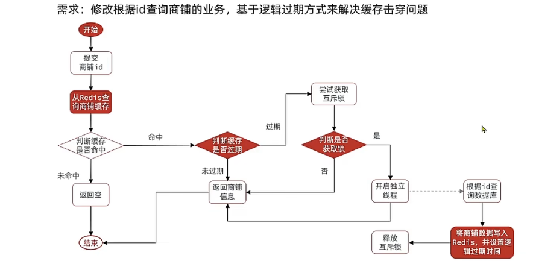

``` java

   @Resource
    private StringRedisTemplate stringRedisTemplate;

    // 逻辑过期缓存时，调用线程进行缓存重建 通过线程池来进行，避免频繁线程销毁申请问题
    private final ExecutorService CACHE_REBUILD_EXECUTOR = Executors.newFixedThreadPool(10);


    @Override
    public Result queryById(Long id) {
        Shop shop = queryWithLogicExpire(id);
        if (shop == null) {
            return Result.fail("店铺不存在");
        }
        return Result.ok(shop);
    }


    // 使用逻辑过期时间来缓解缓存击穿，热点key问题 (这个代码实际在访问时，有bug，如果缓存中没有事先加载缓存数据，启动时，会导致无法查询到数据情况)
    public Shop queryWithLogicExpire(Long id){
        // 1. 从Redis缓存中查询
        String key = CACHE_SHOP_KEY + id;
        String redisDataJson = stringRedisTemplate.opsForValue().get(key);
        // 2. 判断缓存中是否有数据（逻辑过期需要启动前，将数据库数据先缓存到Redis缓存中才行）
        if (StrUtil.isBlank(redisDataJson)) {
            return null;// 缓存中没有数据，直接返回失败
        }
        // 3. 将RedisData转换为Shop
        RedisData redisData = JSONUtil.toBean(redisDataJson, RedisData.class);
        LocalDateTime expireTime = redisData.getExpireTime();
        Shop shop = JSONUtil.toBean((JSONObject) redisData.getData(), Shop.class);
        // 4. 判断缓存是否过期 未过期，则直接返回结果即可
        if (expireTime.isAfter(LocalDateTime.now())) {
            return shop;
        }

        // 5. 如果过期，需要缓存重建，使用互斥锁来进行重建
        String lockKey = LOCK_SHOP_KEY + id;
        boolean islock = tryLock(lockKey, LOCK_SHOP_TTL, TimeUnit.SECONDS);
        if (islock) {
            // 如果获取成功，申请一个线程从线程池，用另一个线程进行更新缓存
            CACHE_REBUILD_EXECUTOR.submit(() -> {
                try {
                    saveShop2Redis(id, CACHE_SHOP_TTL);
                }catch (Exception e){
                    e.printStackTrace();
                }finally {
                    // 8. 释放互斥锁
                    unlock(lockKey);
                }
            });
        }
        // 未获得锁的线程，直接使用旧缓存数据
        return shop;
    }
    // 将Shop+逻辑过期时间写入缓存
    public void saveShop2Redis(Long id , Long expireTime){
        // 因为缓存中的数据，实际上最开始被添加都是从数据库中查询的，
        // 只要保证查询数据在添加时，保存缓存格式是RedisData，包含过期时间和数据就行
        Shop shop = getById(id);
        // 封装RedisData
        RedisData redisData = new RedisData();
        redisData.setExpireTime(LocalDateTime.now().plusSeconds(expireTime));
        redisData.setData(shop);
        // 写入redis缓存 逻辑过期只在过期更新数据，在缓存中实际上一直存在
        stringRedisTemplate.opsForValue().set(CACHE_SHOP_KEY + id,
                JSONUtil.toJsonStr(redisData));
    }
```


#### 4.5 Redis缓存工具封装


1. java 缓存工具类封装

``` java

package com.hmdp.utils;

import cn.hutool.core.util.BooleanUtil;
import cn.hutool.core.util.StrUtil;
import cn.hutool.json.JSONObject;
import cn.hutool.json.JSONUtil;
import com.hmdp.entity.Shop;
import lombok.extern.slf4j.Slf4j;
import org.springframework.data.redis.core.StringRedisTemplate;
import org.springframework.stereotype.Component;

import javax.annotation.Resource;
import java.time.LocalDateTime;
import java.util.concurrent.ExecutorService;
import java.util.concurrent.Executors;
import java.util.concurrent.TimeUnit;
import java.util.function.Function;

import static com.hmdp.utils.RedisConstants.*;
import static com.hmdp.utils.RedisConstants.CACHE_SHOP_TTL;


// 缓存工具类的作用，就是包装，将对于数据库访问的形式都进行封装，方便调用
// 同时针对缓存穿透问题和热点key问题，进行不同的缓存机制。
// 好处是 上级代码在调用时，只需要调用缓存工具类的方法，不需要关注缓存的实现细节。

@Component
@Slf4j
public class CacheClient {


    private  final StringRedisTemplate stringRedisTemplate;

    // 逻辑过期缓存时，调用线程进行缓存重建 通过线程池来进行，避免频繁线程销毁申请问题
    private final ExecutorService CACHE_REBUILD_EXECUTOR = Executors.newFixedThreadPool(10);

    public CacheClient(StringRedisTemplate stringRedisTemplate) {
        this.stringRedisTemplate = stringRedisTemplate;
    }

    // 将对象存储进入缓存
    public void setCache(String key, Object value, long expireTime, TimeUnit timeUnit) {
        stringRedisTemplate.opsForValue().set(key,
                JSONUtil.toJsonStr(value), expireTime, timeUnit);
    }


    // 将逻辑过期时间+对象数据(RedisData)存储进入缓存
    public void setCacheWithLogicExpire(String key, Object value, long expireTime, TimeUnit timeUnit) {
        RedisData redisData = new RedisData();
        redisData.setExpireTime(LocalDateTime.now().plusSeconds(timeUnit.toSeconds(expireTime)));
        redisData.setData(value);
        stringRedisTemplate.opsForValue().set(key,
                JSONUtil.toJsonStr(redisData));
    }


    // 使用空缓存解决缓存穿透问题的取数据方法
    public <R, ID> R getWithPassThrough(String keyPrefix, ID id, Class<R> clazz,
                                          Function<ID,R> dbQuery, long expireTime,
                                          TimeUnit timeUnit) {

        String key = keyPrefix + id;
        String json = stringRedisTemplate.opsForValue().get(key);
        // 1. 判断缓存中是否有数据且不是空缓存
        if (StrUtil.isNotBlank(json)) {
            return JSONUtil.toBean(json, clazz);
        }
        // 2.有数据但是是空缓存，说明数据库没有这数据，不要进行穿透访问后续
        if (json != null) {
            return null;
        }

        // 3. 缓存中没有数据,要查数据库确定是否有这数据
        R data = dbQuery.apply(id);
        if (data == null) { // 数据库也没有这数据，删除缓存中的空缓存
            this.setCache(key, "", expireTime, timeUnit);
            return null;
        }
        // 4. 数据库有这数据，将数据存储进入缓存
        this.setCache(key, data, expireTime, timeUnit);

        return data;
    }


    // 使用逻辑过期时间来缓解缓存击穿，热点key问题,需要启动前加载数据到缓存中
    public <R, ID> R getLogicExpire(String keyPrefix, ID id, Class<R> clazz,
                                        String lockKeyPrefix,Long lockExpireTime, TimeUnit lockTimeUnit,
                                        Function<ID,R> dbQuery, long expireTime, TimeUnit timeUnit){
        // 1. 从Redis缓存中查询
        String key = keyPrefix + id;
        String redisDataJson = stringRedisTemplate.opsForValue().get(key);
        // 2. 判断缓存中是否有数据
        if (StrUtil.isBlank(redisDataJson)) {
            return null;// 缓存中没有数据，直接返回失败
        }
        // 3. 将RedisData转换为Shop
        RedisData redisData = JSONUtil.toBean(redisDataJson, RedisData.class); // 这一步将RedisDataJson转换为RedisData对象
        LocalDateTime jsonExpireTime = redisData.getExpireTime(); // 这一步获取RedisData对象中的过期时间
        R result = JSONUtil.toBean((JSONObject) redisData.getData(), clazz); // 这一步将RedisData对象中的数据转换为Shop对象 JSONUtils.toBean()是将JSONObject转换为Shop对象的工具方法
        // 4. 判断缓存是否过期 未过期，则直接返回结果即可
        if (jsonExpireTime.isAfter(LocalDateTime.now())) {
//            System.out.println("缓存未过期");
            return result;
        }

        // 5. 如果过期，需要缓存重建，使用互斥锁来进行重建
        String lockKey = lockKeyPrefix + id;
        boolean islock = tryLock(lockKey, lockExpireTime, lockTimeUnit);
        if (islock) {
//            System.out.println("获取锁成功");
            // 如果获取成功，申请一个线程从线程池，用另一个线程进行更新缓存
            CACHE_REBUILD_EXECUTOR.submit(() -> {
                try {
                    this.setCacheWithLogicExpire(key, dbQuery.apply(id), expireTime, timeUnit);
                }catch (Exception e){
                    e.printStackTrace();
                }finally {
                    // 8. 释放互斥锁
                    unlock(lockKey);
                }
            });
        }
        // 未获得锁的线程，直接使用旧缓存数据
        return result;
    }


    private boolean tryLock(String key,Long lockTtl,TimeUnit timeUnit){
        Boolean success = stringRedisTemplate.opsForValue().setIfAbsent(key, "1", lockTtl, timeUnit);
        return BooleanUtil.isTrue(success);
    }

    private void unlock(String key){
        stringRedisTemplate.delete(key);
    }
}


```

2. 缓存工具类调用

``` java
@Service
public class ShopServiceImpl extends ServiceImpl<ShopMapper, Shop> implements IShopService {

    @Resource
    private StringRedisTemplate stringRedisTemplate;

//    // 逻辑过期缓存时，调用线程进行缓存重建 通过线程池来进行，避免频繁线程销毁申请问题
//    private final ExecutorService CACHE_REBUILD_EXECUTOR = Executors.newFixedThreadPool(10);

    @Resource
    private CacheClient cacheClient;


    @Override
    public Result queryById(Long id) {
//        Shop shop = cacheClient.getWithPassThrough(CACHE_SHOP_KEY, id, Shop.class,
//                this::getById, CACHE_SHOP_TTL, TimeUnit.MINUTES);
        Shop shop = cacheClient.getLogicExpire(CACHE_SHOP_KEY, id, Shop.class,
                LOCK_SHOP_KEY, LOCK_SHOP_TTL, TimeUnit.SECONDS,
                this::getById, CACHE_SHOP_TTL, TimeUnit.MINUTES);
        if (shop == null) {
            return Result.fail("店铺不存在");
        }
        return Result.ok(shop);
    }

}

```


