---

title: SSM 基础
published: 2026-04-20
description: SSM 基础知识，参考黑马程序员
tags: [SSM, Spring, Mybatis, Spring MVC]
category: 学习记录
# image: image/SSM/1733811477039.png
draft: false
---


# SSM

## 1. Spring框架介绍
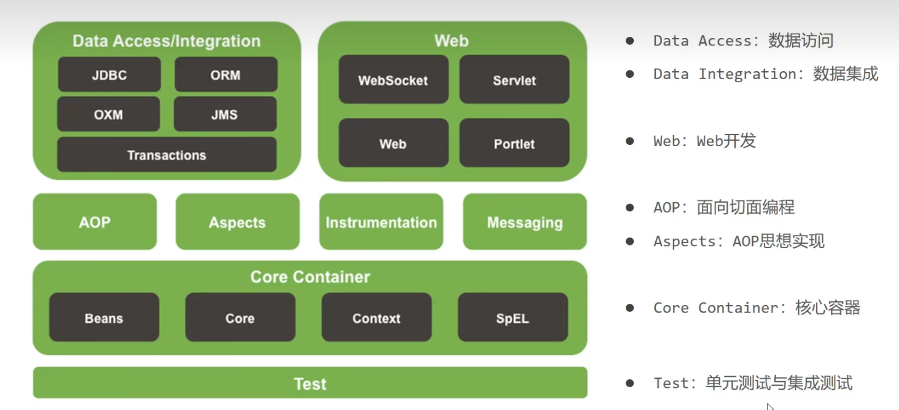

## 2. Spring核心容器

IOC控制反转（IOC容器） 
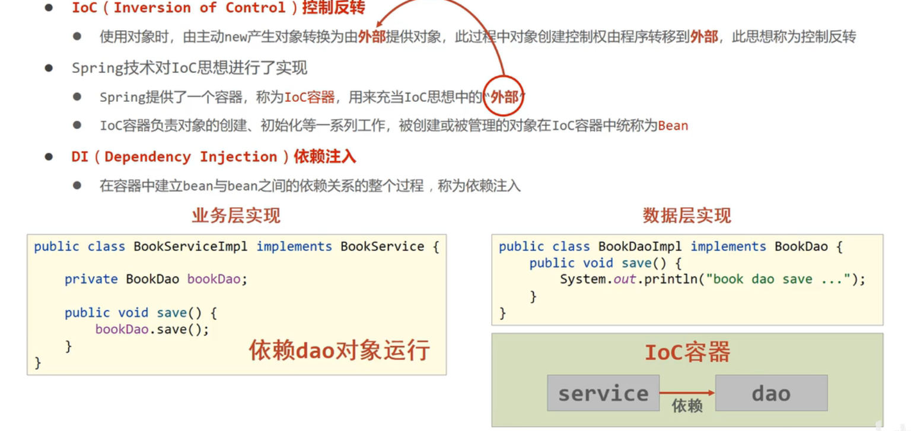

- IOC容器是Spring框架的核心容器，负责管理应用的组件（Bean）。
- 它通过依赖注入（Dependency Injection，DI）将组件之间的依赖关系自动注入到组件中。
- IOC容器的配置可以通过XML文件或注解来实现。
- XML文件的配置示例：
```xml
<?xml version="1.0" encoding="UTF-8"?>
<beans xmlns="http://www.springframework.org/schema/beans"
       xmlns:xsi="http://www.w3.org/2001/XMLSchema-instance"
       xsi:schemaLocation="http://www.springframework.org/schema/beans http://www.springframework.org/schema/beans/spring-beans.xsd">

    <!-- 定义测试服务 -->
    <!-- id 表示bean的唯一标识 class 表示对当前bean的实现类 name 表示bean的别名 -->
    <bean id="testService" name="service1 service2" class="org.HONGYY.Service.TestServiceImpl">
        <!--        设置属性testdao与testservice的关联-->
        <property name="testDao" ref="testDao"></property>

    </bean>
    <!-- scope="prototype" 表示每个bean实例都创建一个新的对象 "singleton"表示默认单例模式 -->
    <bean id="testDao" class="org.HONGYY.Dao.TestDaoImpl" scope="prototype"></bean>

</beans>
```

### 2.1 Bean

- IOC容器的使用需要在应用中引入Spring框架的依赖。
- spring 容器默认是单例的，每个bean实例只创建一次。
  
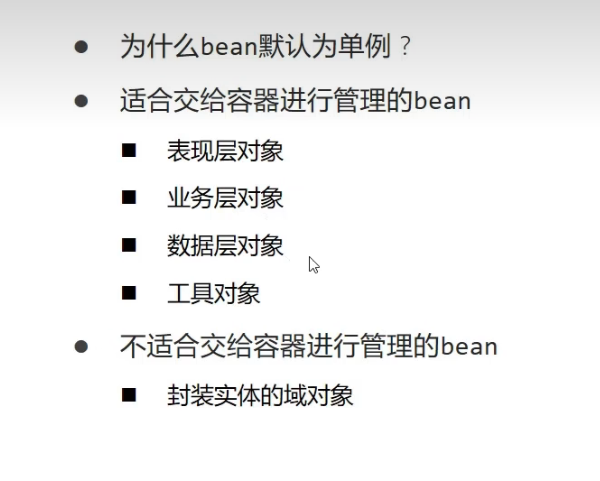

1. bean实例化

- （1）spring 容器会根据bean的配置，调用对应的无参构造函数来创建bean实例。
- （2）静态工厂方法：通过调用静态工厂方法来创建bean实例。
     - ```java
         public class TestDaoFactory {
        public static TestDao getTestDao(){
            return new TestDaoImpl();
        }
    }


        // 配置文件中定义bean 工厂方法创建一个TestDaoFactory类的实例,并调用getTestDao方法创建TestDao实例
        <bean id="testdaofactory" class = "org.HONGYY.Factory.TestDaoFactory"
          factory-method="getTestDao"></bean>
        //
        TestDao testdao = (TestDao) context.getBean("testdaofactory");
        testdao.testSelect();
    }
     ```
- （3）实例工厂方法：通过调用实例工厂方法来创建bean实例。
    - 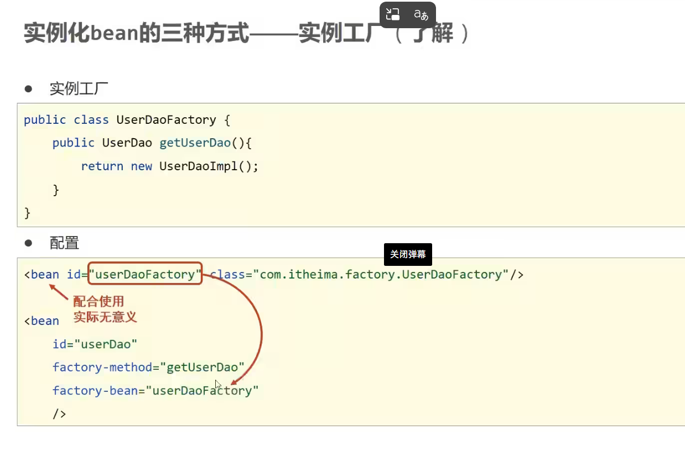
-  (4) FactoryBean 实例：通过调用FactoryBean的getObject方法来创建bean实例。
    - ```java
      // 实例工厂模式的变体，可以简化配置文件的模式进行
      public class TestDaoFactoryBean implements FactoryBean<TestDaoImpl> {

          // 默认是返回实例对象模式
          @Override
          public TestDaoImpl getObject() throws Exception {
              return new TestDaoImpl();
          }

          // 实例对象类型
          @Override
          public Class<?> getObjectType() {
              return TestDaoImpl.class;
          }

          // 是否使用单例模式
          @Override
          public boolean isSingleton() {
              return FactoryBean.super.isSingleton();
          }
      }


      <!--    实例工厂变式模式-->
    <bean id="testdaoofactory2" class = "org.HONGYY.Factory.TestDaoFactoryBean"></bean>

      TestDao testdao2 = (TestDao) context.getBean("testdaoofactory2");
      testdao2.testSelect();


      ```

2. bean生命周期

- ```xml
  <!-- bean生命周期  设置初始化方法和销毁方法-->
  <bean id="testDao" class="org.HONGYY.Dao.TestDaoImpl" init-method="init" destroy-method="destroy"></bean>
  ```

- 另外可以通过实现InitializingBean接口和DisposableBean接口来实现bean的自定义初始化和销毁逻辑。
- ```java
  // 实现InitializingBean接口
  public class TestDaoImpl implements InitializingBean, DisposableBean {
    @Override
    public void destroy() {
        System.out.println("TestDaoImpl 销毁");
    }
    @Override   // afterPropertiesSet 方法在bean的属性设置完成后调用，用于初始化bean的状态
    public void afterPropertiesSet() throws Exception {
        System.out.println("TestDaoImpl 初始化");
    }
  }
  ```
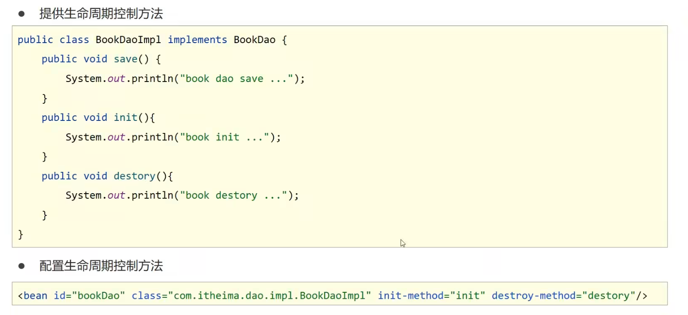
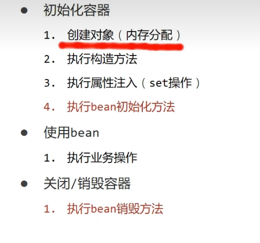
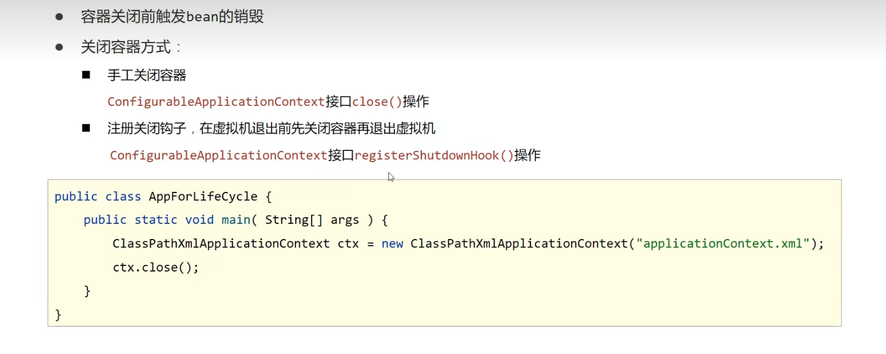


### 2.2 依赖注入（DI） 

- spring中依赖注入是指通过XML文件或注解来实现组件之间的依赖关系自动注入到组件中的过程。包括构造函数注入、属性注入和方法注入。

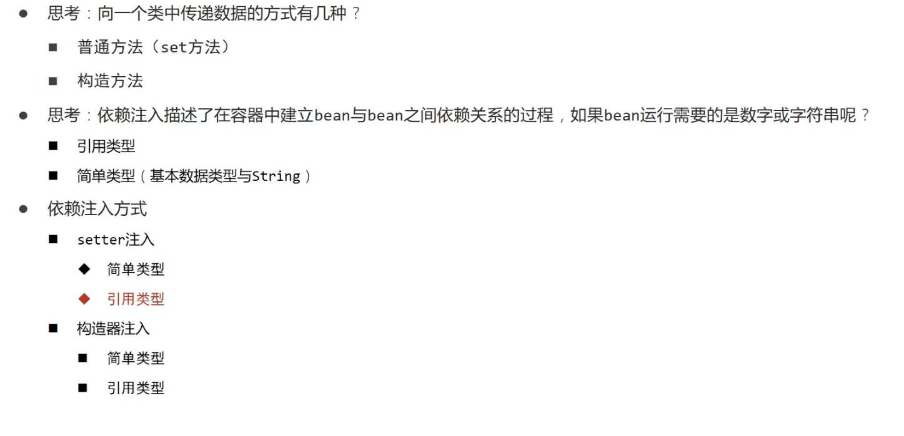
- setter 注入：通过调用setter方法来注入依赖关系。
    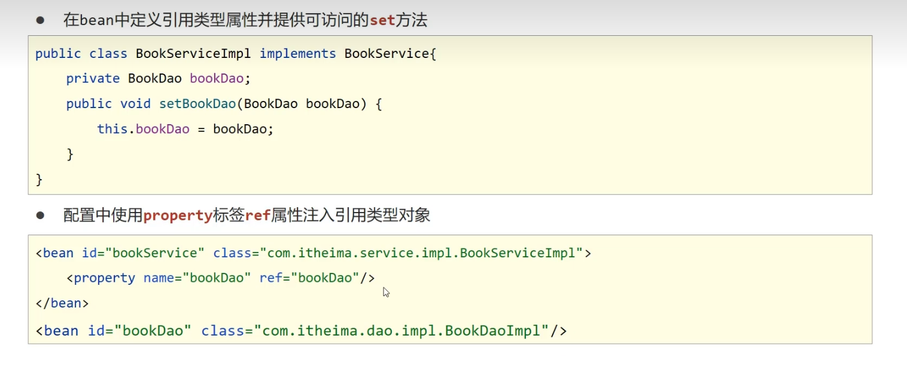
    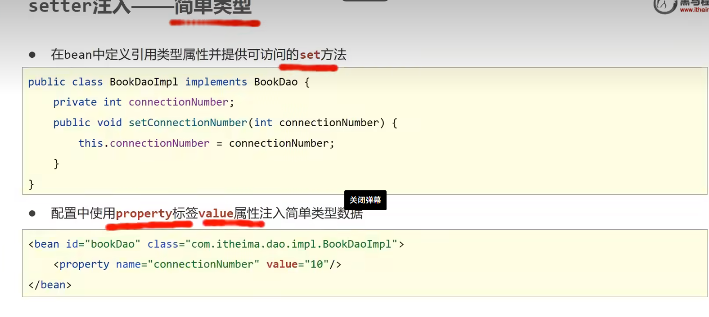
- constructor 注入：通过调用构造函数来注入依赖关系。
    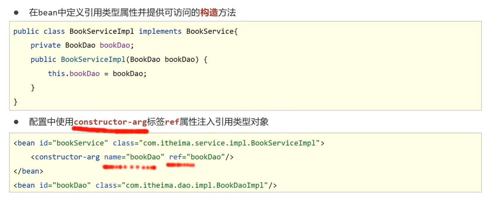

- 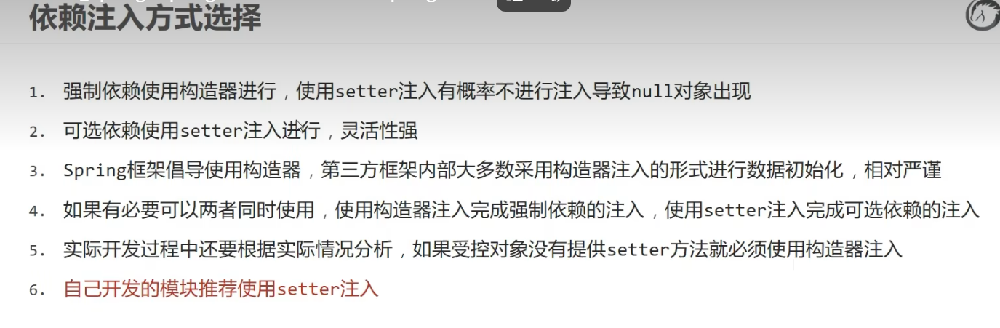


- 自动装配： 不通过XML文件或注解来配置依赖关系，而是通过spring容器来自动装配依赖关系。
   - 1. 自动装配属性：根据属性的类型来自动装配依赖关系。
        - ```xml
            <!-- 自动注入的方式  首先要定义要自动装配的bean 之后会根据类型来自动装配依赖关系-->
          <bean id="testD" class="org.HONGYY.Dao.TestDaoImpl"></bean> 
          <bean id="testService" name="service1 service2" class="org.HONGYY.Service.TestServiceImpl" autowire="byType">
              <property name="testName" value="测试服务"></property>

          </bean>
            ```
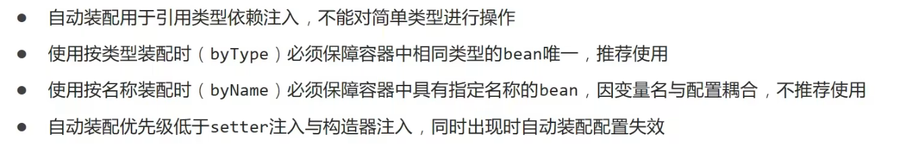


- 集合注入：根据集合（List、Set、Map、Properties等）的类型来自动装配依赖关系。 还是通过setter方法来注入,配置文件中需要定义集合的属性以及内部值。
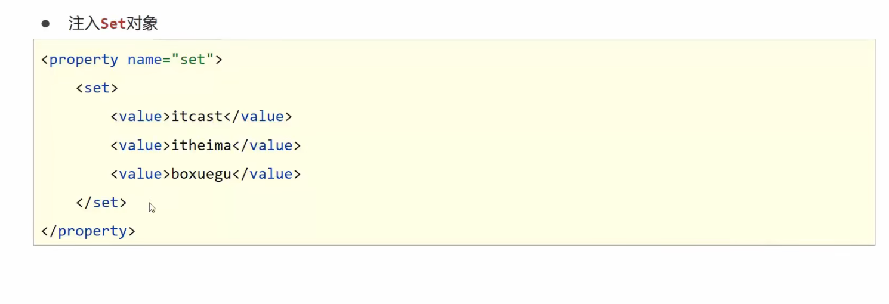

- 第三方注入
- 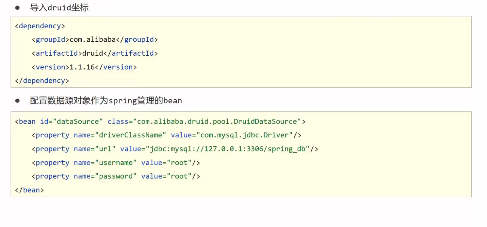

- properties文件注入
   - 首先在xml配置文件中开启context命名空间。使用context:property-placeholder标签来加载properties文件。
   - 然后在bean的属性中使用${}表达式来引用properties文件中的属性。
   - 最后在spring容器中加载properties文件。
   - 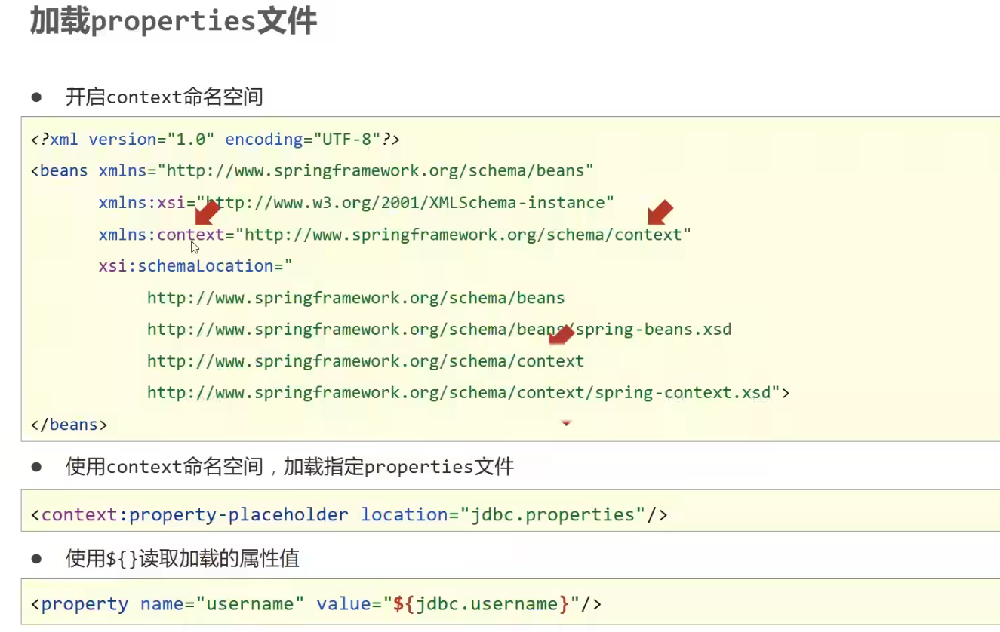
   - <context:property-placeholder location="classpath*:*.properties" system-properties-mode="NEVER"/> // 加载所有依赖包以及当前项目下的所有properties文件
   - 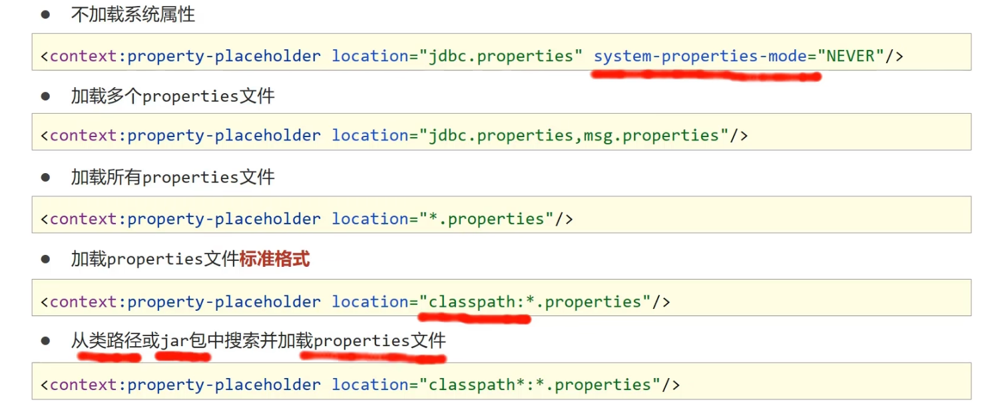


### 2.3 容器

1. 创建容器
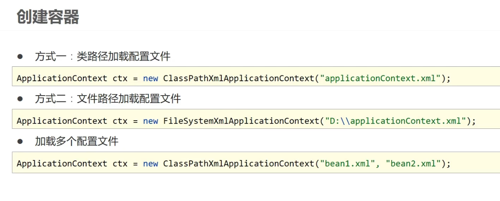

2. 获取bean

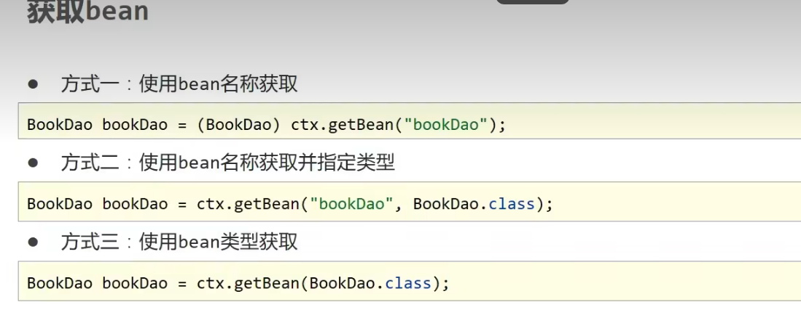


## 3. Spring注解开发

### 3.1 注解声明Bean

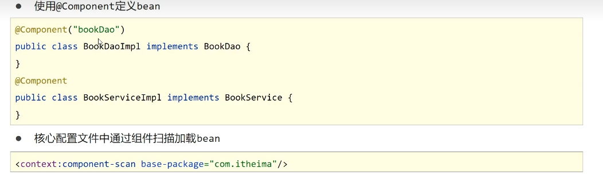
```java
@Component 等同于 <bean id="testDao" class="org.HONGYY.Dao.TestDaoImpl"></bean>
 
 @Component  @Repository @Service @Controller 等价
```
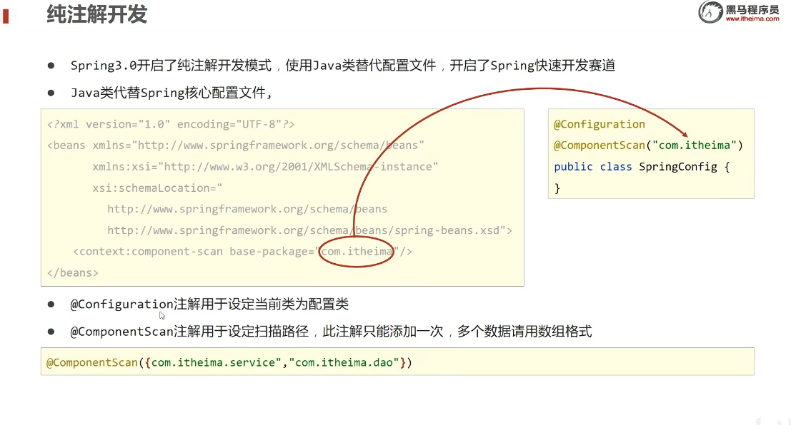
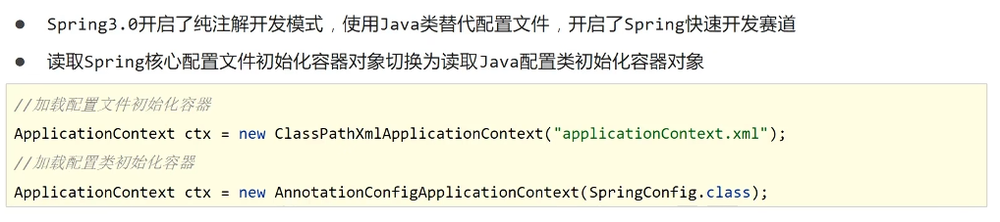

```java
@PropertyResource("c.properties")  //配置类扫描properties文件
@Import({AppConfig.class}) // 导入其他配置类的bean,通过在其他配置类中加载相关配置，再通过@Configuration注解来声明为配置类，从而实现bean的管理。

@Configuration // 声明当前类是一个配置类
public class AppConfig {

}

```


### 3.2 注解Bean生命周期
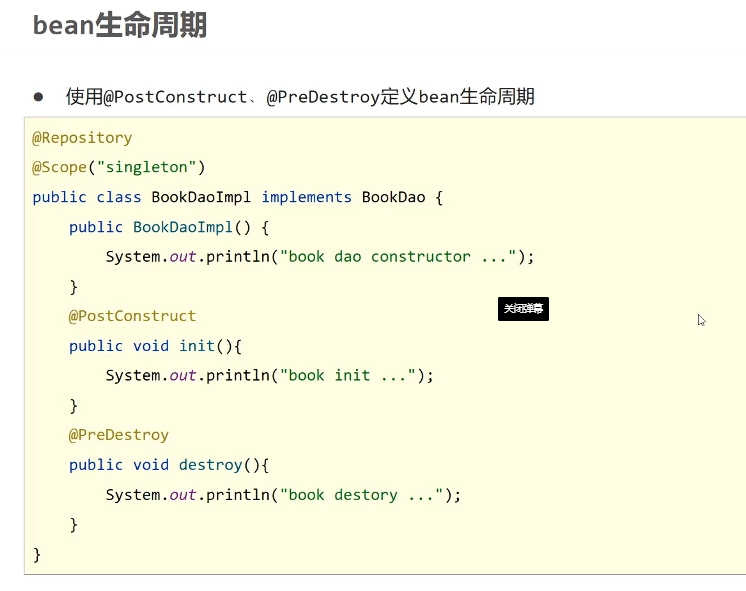


### 3.3 注解依赖注入

```java
@Autowired // 根据类型来注入依赖关系
@Qualifier("testDao") // 根据bean的id来注入依赖关系
@Value("测试服务") // 简单类型注入

```

### 3.4 第三方bean管理

```java
@Configuration // 声明当前类是一个配置类
public class AppConfig {
    @Bean // 声明当前方法返回的对象是一个bean
    public TestDao testDao(){
        return new TestDaoImpl();
    }
}

```

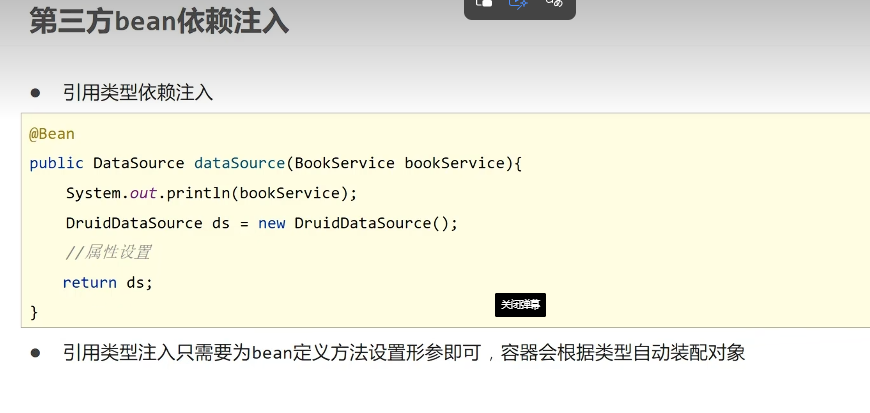


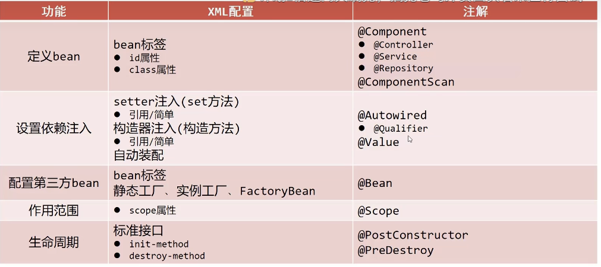


JUnit 测试 : 测试第三方bean管理是否生效。


## 4. AOP (Aspect Oriented Programming,面向切面编程)

 - AOP 是一种通过在不改变原有代码的情况下，添加额外功能的技术。
 - 本质是通过动态代理来实现的，即在运行时动态地创建代理对象，代理对象在调用目标方法之前或之后添加额外的功能。
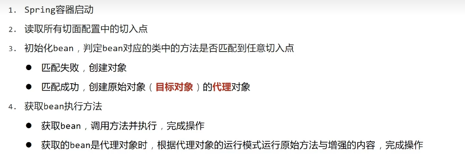

### 4.1 切入点表达式

