---

title: JAVA SE 基础
published: 2026-04-10
description: JAVA 基础知识，参考黑马程序员
tags: [JAVA, 面向对象, 集合]
category: 学习记录
# image: image/JAVA/1733811477039.png
draft: false
---


# JAVA 基础
### 1. JAVA 编译特性
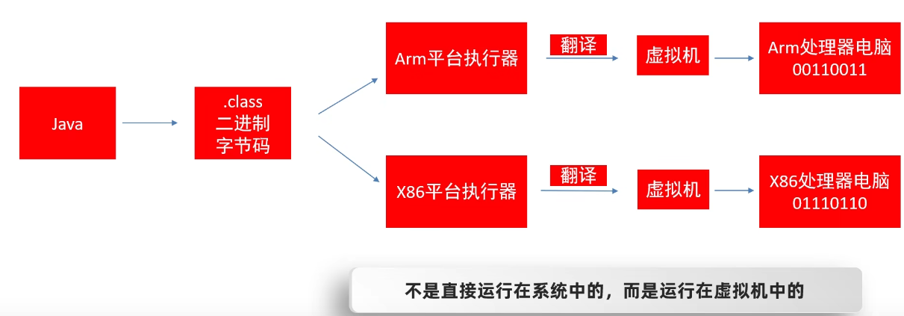
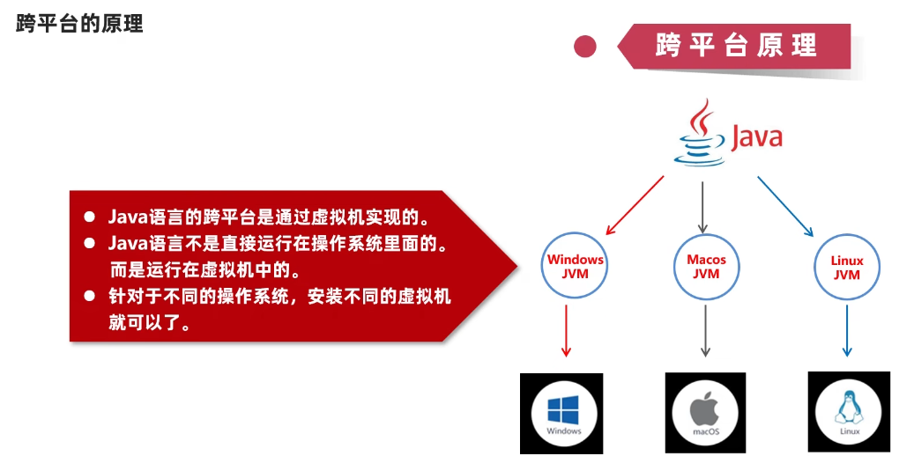
混合型，先编译后解释执行，先将 JAVA 代码编译成字节码文件，再由 JVM 解释执行。综合了编译型和解释型的优点，具有跨平台性。

###### JAVA 常识
- JDK：JAVA Development Kit，JAVA 开发工具包，包含 JAVA 编译器、JVM 等。
- JRE：JAVA Runtime Environment，JAVA 运行时环境，包含 JVM 等。
- JVM：JAVA Virtual Machine，JAVA 虚拟机，负责解释执行 JAVA 字节码文件。


###### 进制表示
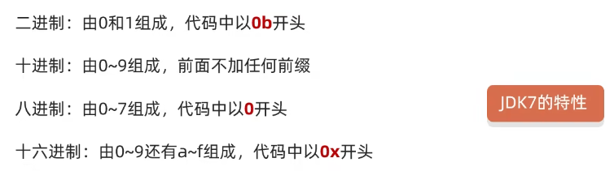

###### 字节数值范围
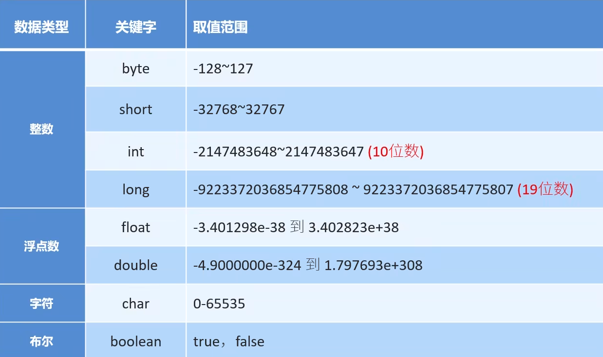

###### 运算符隐式转换
- 数据类型取值范围大小关系：`byte < short < int < long < float < double`
- 当数据类型不一致时，向上类型转换进行运算
- `byte, short, char` 等类型在进行运算时，会先转换为 int 类型。

###### 强制类型转换
- 语法：`(目标类型) 表达式`
- 例如：`int a = (int) 3.14;`
- 强制类型转换可能会导致数据丢失或溢出。
  
``` java
public class test{
    public static void main(String[] args) {
        int b = 200;//二进制表示为 0000 0000 1100 1000
        byte a = (byte) b; // 截断表示，只保留低8位 1100 1000 = -56
        System.out.println(a);//输出 -56

        int c = 300; //二进制表示为 0000 0001 0010 1100
        byte d = (byte) c; // 截断表示，只保留低8位 0010 1100 = 44
        System.out.println(d);//输出 44
    }
}
```

###### 短路运算符
- `&&`：逻辑与运算符，当第一个操作数为 false 时，不会计算第二个操作数。
- `||`：逻辑或运算符，当第一个操作数为 true 时，不会计算第二个操作数。
- `&`：逻辑与运算符，无论第一个操作数是否为 false，都会计算第二个操作数。
- `|`：逻辑或运算符，无论第一个操作数是否为 true，都会计算第二个操作数。

- 移位运算符
    - `<<`：左移运算符，将操作数的二进制位向左移动指定的位数，右侧用 0 填充。
    - `>>`：右移运算符，将操作数的二进制位向右移动指定的位数，左侧用操作数的符号位填充。
    - `>>>`：无符号右移运算符，将操作数的二进制位向右移动指定的位数，左侧用 0 填充。

- 按位运算符
    - `&`：按位与运算符，对应位都为 1 时，结果为 1；否则为 0。
    - `|`：按位或运算符，对应位有一个为 1 时，结果为 1；否则为 0。
    - `^`：按位异或运算符，对应位不同时，结果为 1；否则为 0。
    - `~`：按位取反运算符，将操作数的每一位取反。

###### 三元运算符
- 语法：`(条件表达式) ? 表达式1 : 表达式2`
- 当条件表达式为 true 时，返回表达式1；当条件表达式为 false 时，返回表达式2。


----
### 2. 原码、反码、补码
- 字节数（Byte）：一个字节等于 8 位比特(bit)，即 2^8 = 256 种不同的数值。
1. 原码：直接将二进制数转换为补码，最高位为符号位，0 表示正数，1 表示负数。
2. 反码：正数的反码与原码相同，负数的反码为其原码除符号位外的各位取反。
    
    - 反码的出现是为了方便计算减法。计算机在进行减法运算时，先将减数的反码加 1（也即是补码），然后与被减数进行加法运算。
    - 例如：-5 的原码为 10000101，反码为 11111010，补码为 11111011。
3. 补码：正数的补码与原码相同，负数的补码为其反码加 1。

    - 补码的出现，是在用以8位表示数值时，0 有两种表示方式（00000000 和 10000000），加法视为在上一个数移动若干位，但是跨越了0，导致了错误的结果。因此引入了补码
    - 补码中多记录了一个数的范围，即首位为1，其余位为0，表示最小的负数。此时该数没有原码和反码，只有补码。以一个字节表示范围时，-128 到 127。
  
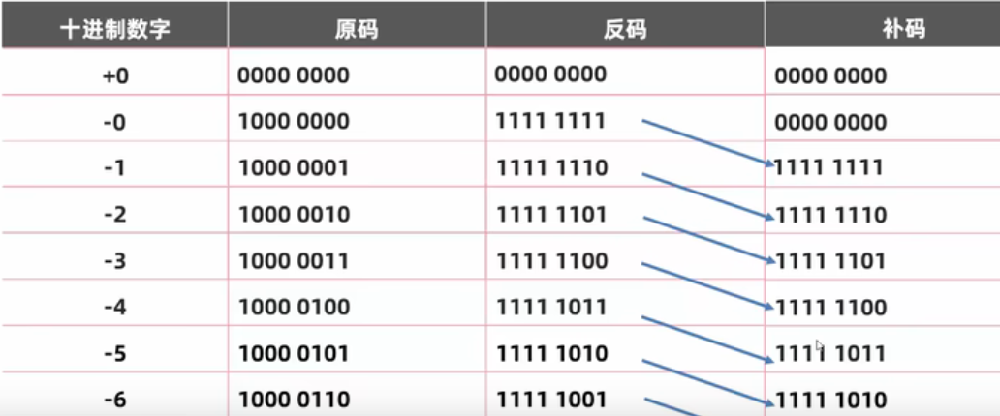


[原码、反码 、补码介绍-知乎](https://zhuanlan.zhihu.com/p/688125947)

### 3. JDK switch语句新特性
```java
    // JDK21 Switch 语句特性测试
    public static void testSwitch(){
        System.out.println("=== JDK21 Switch 新特性测试 ===");
        
        // 1. 箭头语法（无需break）
        System.out.println("\n1. 箭头语法测试:");
        int year = 2020;
        switch(year){
            case 2020 -> System.out.println("当前年份: " + year);
            case 2021 -> System.out.println("当前年份: " + year);
            default -> System.out.println("其他年份: " + year);
        }
        
        // 2. Switch表达式（返回值） 匹配值进行返回指定数据
        System.out.println("\n2. Switch表达式测试:");
        String season = switch(getMonth()){
            case 12, 1, 2 -> "冬季";
            case 3, 4, 5 -> "春季";
            case 6, 7, 8 -> "夏季";
            case 9, 10, 11 -> "秋季";
            default -> "未知季节";
        };
        System.out.println("当前季节: " + season);
        
        // 3. yield关键字， 执行语句中返回指定数据
        System.out.println("\n3. yield返回值测试:");
        int score = 85;
        String grade = switch(score / 10){
            case 9, 10 -> {
                System.out.println("优秀成绩");
                yield "A";
            }
            case 8 -> {
                System.out.println("良好成绩");
                yield "B";
            }
            case 7 -> {
                System.out.println("中等成绩");
                yield "C";
            }
            default -> {
                System.out.println("需要努力");
                yield "D";
            }
        };
        System.out.println("成绩等级: " + grade);
        
        // 4. 多值匹配
        System.out.println("\n4. 多值匹配测试:");
        String day = "周一";
        switch(day){
            case "周一", "周二", "周三", "周四", "周五" -> 
                System.out.println("工作日: " + day);
            case "周六", "周日" -> 
                System.out.println("周末: " + day);
            default -> 
                System.out.println("无效的星期: " + day);
        }
        
        // 5. 传统语法与箭头语法对比
        System.out.println("\n5. 语法对比测试:");
        int num = 2;
        
        // 传统语法
        System.out.print("传统语法: ");
        switch(num){
            case 1:
                System.out.println("一");
                break;
            case 2:
                System.out.println("二");
                break;
            default:
                System.out.println("其他");
        }
        
        // 箭头语法
        System.out.print("箭头语法: ");
        switch(num){
            case 1 -> System.out.println("一");
            case 2 -> System.out.println("二");
            default -> System.out.println("其他");
        }
    }
    
```

### 4. JAVA地址表示

```java
    public static void testArray(){
        // 数组初始化
        int[] arr1 = {1,2,3};
        int[] arr2 = new int[]{2,3,4};
        int[] arr3 = new int[3];// 数组的动态初始化，元素默认值为0
        System.out.println(arr1); //[I@b4c966a
        /*
        *  地址解释，[I@b4c966a 表示数组类型为int，地址为b4c966a
        * [：表示数组类型
        * I：表示数组元素类型为int ，其他如S,表示short,D,表示double,b表示byte
        * @ 为数组在内存中的地址分隔符，固定格式
        * b4c966a 表示数组在内存中的地址，是一个16进制数
        */
       // 动态初始化默认值
       // int 类型默认值为0
       // byte,short,char 类型默认值为0
       // 引用类型默认值为null

       // 二维数组初始化解读
       int[][] arr = new int[2][];//表示二维数组初始化，并且两个一维数组是以引用类型存储在栈内存中的，
       // 换种理解就是 int[]表示数据类型为int类型的指针，int[][]就表示一个数组，数组的每个元素都是int[]类型的指针，
       // 而后面的int[2][]表示2个int[]类型的指针
       arr[0] = new int[2];
       arr[1] = new int[3];


    }
```

### 5. JAVA 内存空间格式

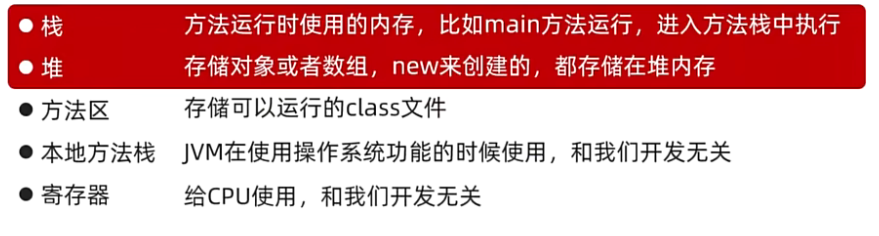
- 栈内存：存储局部变量、方法(函数)调用、返回地址等。栈后入先出。方法调用先压入栈，方法执行完毕后出栈。
- 堆内存：存储对象实例、数组等，new 关键字创建的对象都存储在堆内存中。
- 方法区：存储类的结构信息、静态变量、常量池等。

### 6. JAVA 面向对象

#### 6.1 类（对象）的定义
---
1. javabean类是一种特殊的类，它的主要作用是封装数据，提供对数据的访问和操作。就是通用的类，不包含程序进入的main方法，拥有自己的属性和方法。就是通常描述事物的类

2. 测试类：测试类是用来测试其他类的功能是否正常的类。通常包含main方法，用于创建对象、调用方法、输出结果等。

3. 工具类：工具类是用来提供一些通用的方法的类。通常不包含main方法，只包含静态方法。例如：Math类、Arrays类等。


---


----
1. **一个java文件中可以定义多个类，但是只能有一个类被public修饰，且文件名必须与public类的类名相同。**


3. **就近原则**：在类中定义的属性和方法，优先使用局部变量，其次是类属性，最后是父类属性。

    - ```java 
        public class Student{
            // 类属性
            String name;
            int age;
            public void setName(String name){
                this.name = name;
                System.out.println("姓名设置为: " + name);// 此时输出的name是局部传入的name,而不是类属性name
            }
        }
        ```

4. **this 关键字**：在类的方法中，this 关键字用于引用当前对象的实例。它可以用来访问当前对象的属性和方法。this本质是当前对象的引用（指向当前对象的内存地址）。

5. **构造方法（等同于C++ 的构造函数）**：构造方法是一种特殊的方法，用于创建和初始化对象。它的名称与类名相同，没有返回类型（包括void）。其实是默认返回当前对象的引用。

    - 无参构造 ，默认构造方法，系统帮我们提供。
    - 有参构造，自定义构造方法，我们可以根据需要定义有参构造方法。**当我们定义了有参构造方法后，系统就不会再提供默认的无参构造方法。**

6. 虚拟机在创建对象时，会根据构造方法的参数列表，调用对应的构造方法来初始化对象。

##### 6.1.2 抽象类

---

1. 抽象类：**抽象类是一种特殊的类，它不能被实例化，只能被继承。**抽象类中可以包含抽象方法和非抽象方法。**抽象方法是一种没有方法体的方法，必须在子类中被实现。**

##### 6.1.3 内部类

---

   1. 内部类：类中定义的类，也称为嵌套类。内部类可以访问外部类的属性和方法，也可以被外部类访问。
   2. 外部类要访问内部类的属性和方法，必须先创建内部类的对象，然后通过内部类对象来访问。
   3. 修饰符：内部类可以使用public、protected、private、default（默认）等修饰符。
   4. 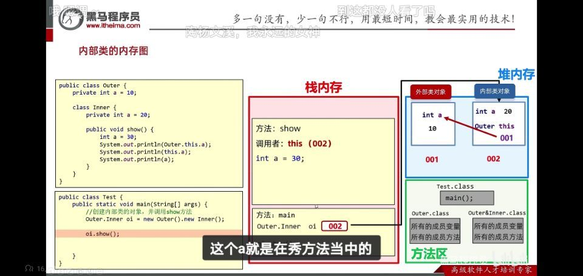

--- 
 1. 静态内部类 ：使用static关键字修饰的内部类，也称为静态嵌套类。
 2. `OuterClass.InnerClass inner = new OuterClass.InnerClass();`：创建静态内部类的对象。

##### 6.1.4 匿名类

---
1. 匿名类：没有类名的内部类，通常用于创建临时的对象。
2. 匿名类的创建格式：
    - ``` java
        new 父类或接口(){
            // 匿名类的成员变量和方法
        }
        ```


#### 6.2 对象的内存图
   
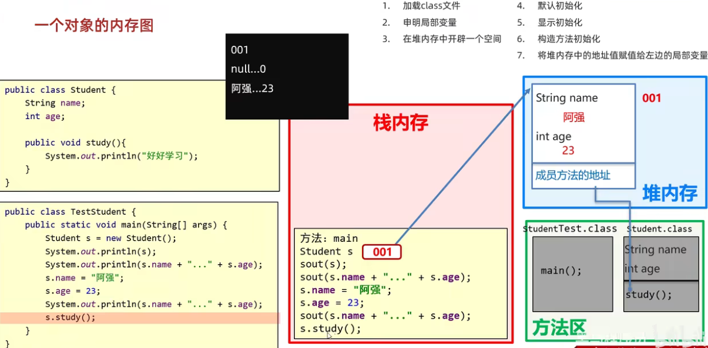
  
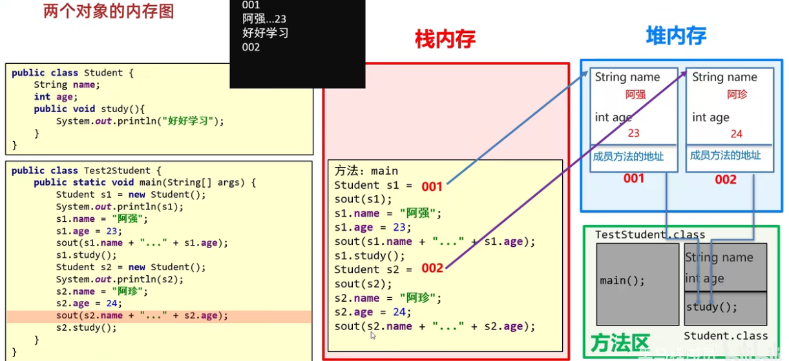

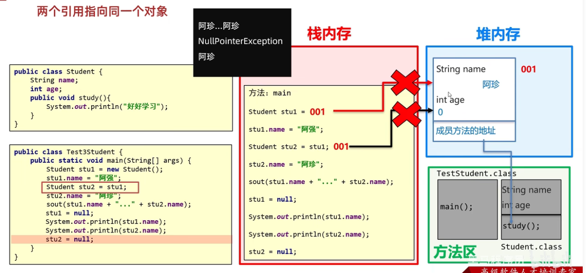


#### 6.3 static 关键字

---
1. static 关键字：静态关键字，用于修饰类的属性和方法。被static修饰的属性和方法，属于类本身，而不是类的实例。

2. JDK8前，静态属性和方法在类加载时就会被初始化，放在方法区的静态区域。
而JDK8及之后版本，静态属性和方法在第一次被访问时才会被初始化。

---
* 静态方法只能访问静态属性和方法，不能访问非静态属性和方法。
* 非静态方法可以访问静态属性和方法，也可以访问非静态属性和方法。
* 静态方法中不能使用this关键字，因为this关键字是指向当前对象的引用，而静态方法是属于类的，不是属于对象的。

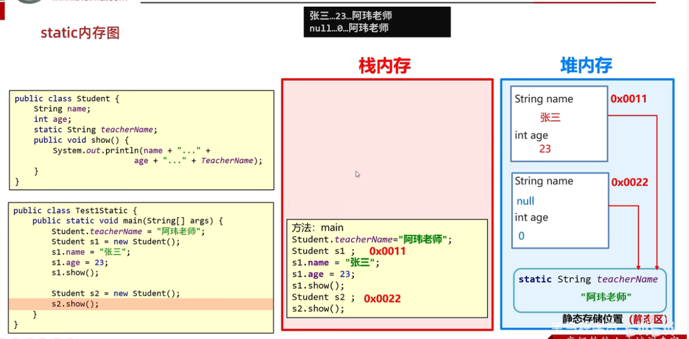

#### 6.4 **继承**

* `public class 子类 extends 父类{}`：子类继承父类，子类可以访问父类的属性和方法。
* 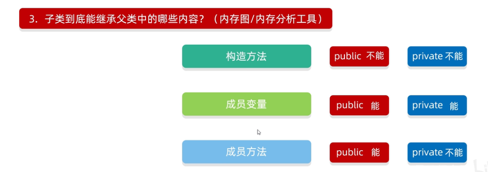
* Object类：所有类的父类，默认继承Object类。
* 子类可以访问父类的非私有的属性和方法。

---
1. **父类的构造方法不会被继承**

    - 子类在创建对象时，默认需要先调用父类的构造方法（无参构造），再调用子类的构造方法。
    - 子类可以在构造方法中使用`super()`来调用父类的构造方法。但是必须放在子类构造方法的第一行。
    - ``` java
        public class Student extends Person{
            String ID;

            public Student(){
                this("xxx", "zhangsan", 18);//此时调用Student类的有参构造，此时的构造是在有参构造内调用的父类构造。
            }
            public Student(String ID, String name, int age){
                super(name, age);
                this.ID = ID;
            }
        }
        ```

2. **父类私有和非私有成员变量都会被继承**
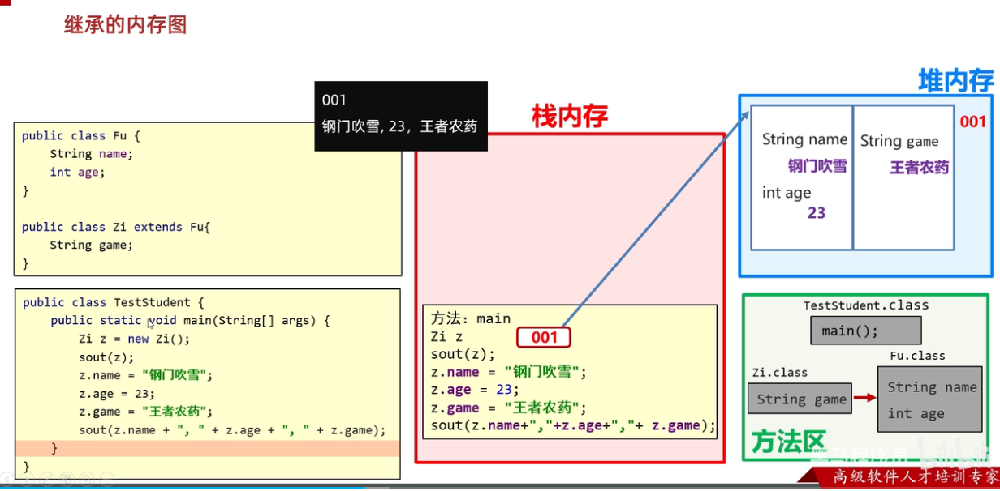

1. **父类方法继承和虚方法表**：只有父类的虚方法表会被继承，子类的虚方法表会覆盖父类的虚方法表。虚方法表是一个指向方法的指针数组，每个元素指向一个方法。

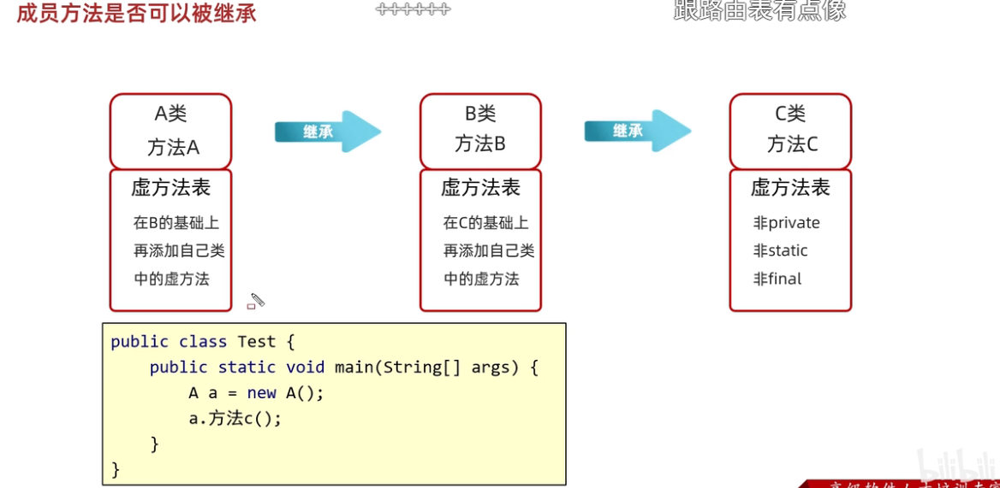


4. **方法重写**：子类可以重写父类的方法，子类重写的方法必须与父类的方法签名相同（方法名、参数列表、返回类型）。

    - 子类重写的方法访问权限必须大于等于父类的权限（public > protected > default）。
    - `@Override`注解可以用来标识重写的方法。放在子类的方法上。


---

#### 6.5 多态

多态：父类引用指向子类对象，通过父类引用调用子类的方法。`父类引用 = new 子类对象();`

---
1. 多态的前提条件   
    - 有继承关系
    - 父类引用指向子类对象
    - 调用的方法是子类重写的方法

--- 

2. 成员变量与成员方法编译与运行时的区别
    - 成员变量：编译时看左边（父类），运行时看左边（父类）。
    - 成员方法：编译时看左边（父类），运行时看右边（子类）。

---
3. 多态的弊端

    - 不能调用子类特有的方法。
    - 不能调用子类特有的属性。

**措施是使用类型转换（强制类型转换）将父类引用转换为子类引用。但是在转换时，需要注意类型转换的安全性，避免出现类型转换异常。**
    
  - `instanceof`运算符：用于判断一个对象是否是一个类的实例。`父类引用 instanceof 子类类名`。 JDK14之后，引入新特性


#####

### 7. String类

String类和StringBuilder类在初始化创建时虽然都是引用返回，但在打印输出时，都会输出字符串的内容。
  - **stringbuilder和stringbuffer类：都是可变的字符串类，用于拼接字符串**。
  - **stringbuilder类：线程不安全，效率高。**
  - **stringbuffer类：线程安全，效率低。**

#### 7.1 String在java中的特点

1. String类是不可变的，一旦创建了一个String对象，就不能改变它的值。
2. java中程序中的字符串都是String类的对象。
3. 字符串不可变，再被修改时，会创建一个新的字符串对象。
4.  **字符串常量池**：符串常量池是java中特殊的内存区域，用于存储字符串常量。
   
    - 当创建一个字符串时，会先检查字符串常量池是否存在相同的字符串常量，
    - 如果存在，则直接返回该字符串常量的引用，否则创建一个新的字符串常量并存储在常量池中。具体程序中使用`String str = "hello";`,此时`"hello"` 作为字符串常量，会考虑常量池中是否存在。
    - JDK7 及之前版本，字符串常量池是在方法区中的永久代（PermGen）中。
    - JDK8 及之后版本，字符串常量池被移动到了堆内存中。
    - [**字符串常量池JDK不同版本下差异，以及intern创建方法的差异考点**](https://blog.csdn.net/qq_45076180/article/details/115082348)

#### 7.2 String对象的构造调用方法

``` java
public class testString{
    public static void main(String[] args){
        // 字符串的构造调用方法
        String str1 = new String("hello");// 调用有参构造方法，创建一个字符串对象，字符串内容为"hello"

        String str2 = "hello";// 调用无参构造方法，创建一个字符串对象，字符串内容为"hello"
        char[] charArray = {'h','e','l','l','o'};
        String str3 = new String(charArray);// 调用有参构造方法，创建一个字符串对象，字符串内容为"hello"
        byte[] byteArray = {97,98,99};
        String str4 = new String(byteArray);// 调用有参构造方法，创建一个字符串对象，字符串内容为"abc"
        System.out.println(str1);// 输出hello
        System.out.println(str2);// 输出hello
        System.out.println(str3);// 输出hello
        System.out.println(str4);// 输出abc
    }
}

```

#### 7.3 String对象的常用方法

1. 字符串比较

    - `equals()`：比较字符串的内容是否相等。`return boolean`
    - `equalsIgnoreCase()`：比较字符串的内容是否相等，忽略大小写。`return boolean`

2. 遍历字符串

    - `charAt(int index)`：返回指定索引处的字符。`return char`
    - `length()`：返回字符串的长度。`return int`

3. 子字符串获取

    - `substring(int beginIndex)`：返回从指定索引开始到字符串末尾的子字符串。`return String`
    - `substring(int beginIndex, int endIndex)`：返回从指定索引开始到结束索引（不包含）的子字符串。`return String`

4. 字符串查找和替换

    - `indexOf(String str)`：返回指定字符串首次出现的索引，如果未找到则返回-1。`return int`
    - `lastIndexOf(String str)`：返回指定字符串最后一次出现的索引，如果未找到则返回-1。`return int`
    - `replace(CharSequence target, CharSequence replacement)`：将字符串中所有匹配的目标序列（旧值）替换为指定的替换序列（新值）。`return String`

5. 字符串拼接

    - `concat(String str)`：将指定字符串连接到该字符串的末尾。`return String`实际操作也是将两个字符串拼接起来，返回一个新的字符串对象。
    - `+`操作符也可以实现字符串拼接，但是效率较低。并且会反复创建新的字符串对象。
    - [字符串拼接concat、 + 、 StringBuilder 对比，在某些场景，StringBuilder效果最迅速](https://javaguidepro.com/blog/concat-in-java/)
  - 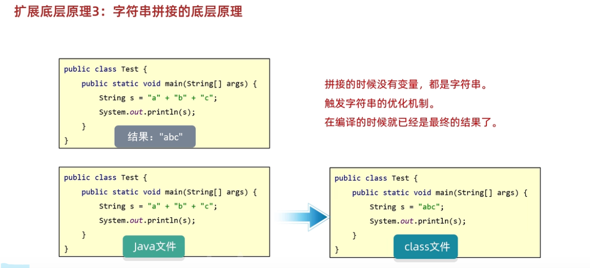
  - JDK8以前 字符串变量与字符串常量拼接原理
  
    * 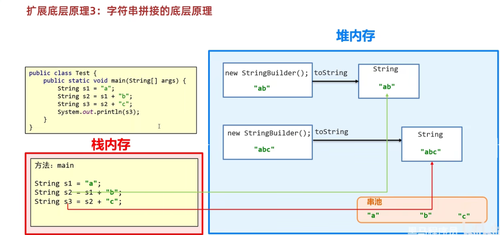
    * `+`的字符串拼接，会先创建一个`StringBuilder`对象，然后调用`append()`方法拼接字符串，最后调用`toString()`方法返回拼接后的字符串。而`toString()`方法会创建一个新的字符串对象。总计创建了2个对象。
  
  - JDK8以后，会预估大约占多少内存，用数组存放进行拼接，最后一次创建新的字符串对象。
  - 如果变量很多有很多次拼接，避免使用`+`操作符。
  - **字符串拼接时，如果没有变量参与，编译器会进行优化，在编译时就会将字符串拼接起来，避免在运行时创建新的字符串对象。此时存在于字符串常量池中。**
  - **如果字符串拼接时，有变量参与，编译器不会进行优化，会在运行时创建新的字符串对象。**
  
#### 7.4 StringBuilder类
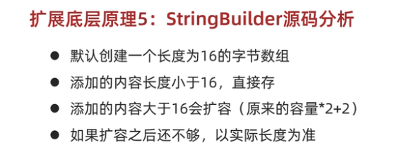
  - `StringBuilder`是一个数组容器，存储的内容是一个字符数组。可以动态地添加、删除、修改字符数组中的元素，而不需要每次都创建新的字符串对象。**扩容机制**
    * 初始容量为16个字符。
    * 当字符串长度超过当前容量时，会自动扩容。
    * 扩容机制为：新容量 = 旧容量 * 2 + 2
    * 如果扩容后容量仍然不够，会以实际需要的容量为准。（前提是不超出`Integer.MAX_VALUE`）
  - `StringBuilder`类：用于高效拼接字符串。`return StringBuilder`

  - **`StringBuilder`类虽然效率较高，但是在多线程环境下，由于多个线程可能同时操作同一个`StringBuilder`对象，因此需要注意线程安全问题。**
  
1. `append(String str)`：将指定字符串连接到该字符串的末尾。`return StringBuilder`
2. `toString()`：将`StringBuilder`对象转换为字符串。`return String`

#### 7.5 StringJoiner类

1. StringJoiner与StringBuilder类相似，都是用于拼接字符串的类。
2. StringJoiner类可以指定分隔符
3. StringJoiner类可以指定前缀和后缀
4. StringJoiner是从JDK8开始引入的类，用于拼接字符串。
5. `StringJoiner(String delimiter)`：创建一个`StringJoiner`对象，使用的分隔符为`delimiter`。
6. `StringJoiner(String delimiter, String prefix, String suffix)`：创建一个`StringJoiner`对象，使用的分隔符为`delimiter`，前缀为`prefix`，后缀为`suffix`。
7. `add(CharSequence str)`：添加指定的字符序列到`StringJoiner`对象中。`return StringJoiner`


### 8. 集合
  
  - 集合可分为两大类：
    * 单列集合：`Collection`接口
    * 双列集合：`Map`接口、键值对集合
  * 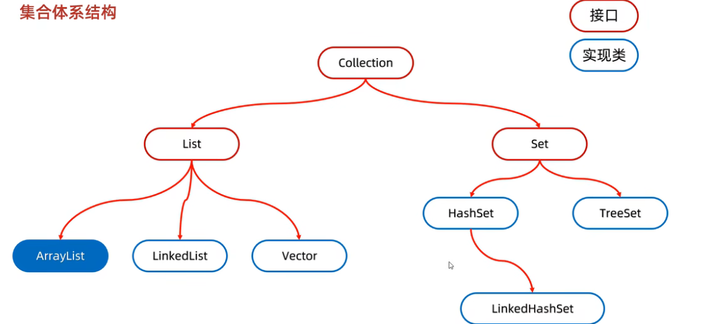
  * 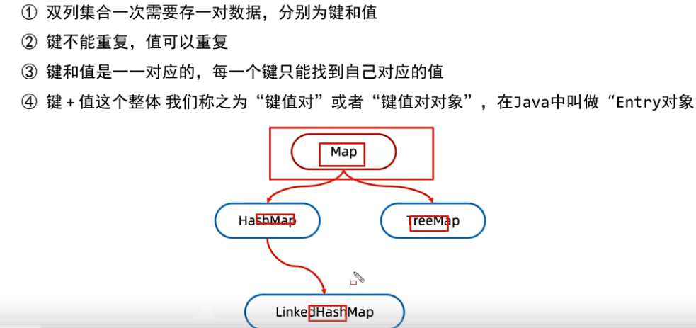
  * `List`接口，有序、可重复相同数据、有索引。
  * `Set`接口，无序、不可重复相同数据、无索引。

---
#### 8.1 集合与数组的区别

1. 数组可以存储多个相同类型的元素。包括基本数据类型和引用数据类型。但是数组的长度是固定的，不可以改变
2. 集合可以存储多个不同类型的元素。但是集合的长度是动态的，根据元素的数量自动改变。**集合不可以存储基本数据类型，只能存储引用数据类型。（想要存储基本数据类型，需要使用包装类）**
3. 包装类
    * 包装类是将基本数据类型封装成引用数据类型的类。
    * 包装类的作用是将基本数据类型转换为对象，方便在集合中存储和操作。
    * 包装类的命名规则为：基本数据类型的首字母大写。
    * 例如：`Integer`类封装了`int`类型，`Boolean`类封装了`boolean`类型。

---
#### 8.2 集合Collection 遍历

##### 1. 迭代器遍历

```java
// 1. 迭代器遍历
Collection<Integer> collection = new ArrayList<>();
Iterator<Integer> iterator = collection.iterator();
while (iterator.hasNext()) {//hasNext()方法判断当前位置是否有元素
    Integer obj = iterator.next();//next()方法返回当前位置的元素，并将当前位置向后移动一位
    System.out.println(obj);
}
```
* 迭代器遍历完所有元素后，指针会指向集合的末尾，不能再遍历。
* 循环中不能调用集合的`remove()`方法，而应该是迭代器的`remove()`方法。


##### 2. 增强for循环遍历

- 增强for循环遍历本质还是迭代器
- 增强for只能遍历数组和单列集合
  

```java
// 2. 增强for循环遍历
for (Integer obj : collection) { //obj是集合中的每个元素，并不是地址
    System.out.println(obj); 
}

```


##### 3. Lambda表达式遍历

- 本质是使用集合的成员函数`forEach()`方法遍历每一个元素。而`forEach()`本质是遍历每个元素，每个元素调用了`函数式接口`的`Consumer`接口的`accept()`方法。
- 因此Lambda表达式，就是对`accept()`函数进行重写实现`Consumer`接口的匿名对象

#### 8.3 List接口

---
1. 重载的调用顺序

    - `remove(int index) 与 remove(Object obj)`的重载，若此时`Object`为`Integer`类型
  
    - **传入 1 时，会调用 `remove(int index)` 方法，删除索引为 1 的元素，而不是调用 `remove(Object obj)` 方法。这里是编译时会优先选择实参与形参一致的方法。**

----

2. `ListIterator`迭代器，增加了`add()`方法


#### 8.4 ArrayList类

1. `ArrayList`类是`List`接口的实现类。
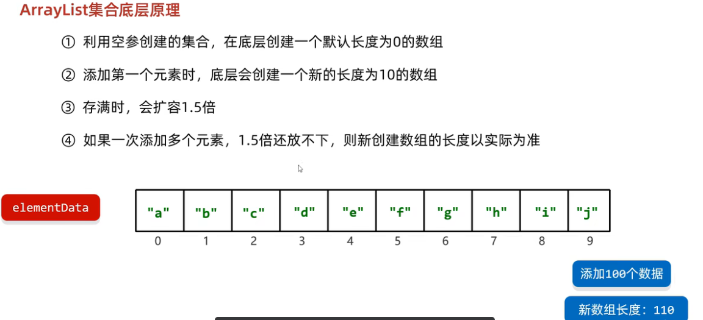
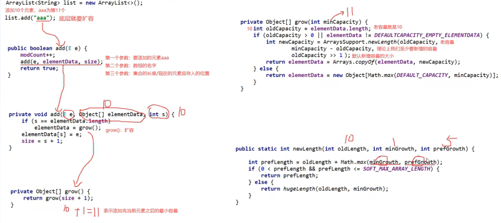

#### 8.5 LinkedList类

1. `LinkedList`类是`List`接口的实现类。双向链表底层
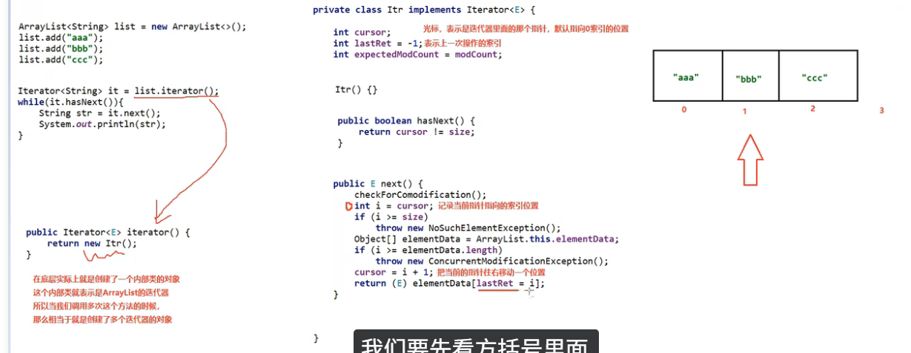


#### 8.6 泛型

- 泛型是一种参数化类型的机制，用于在编译时检查类型安全。
- 只支持引用数据类型 JDK5时引入，类似于`C++`中的模板。
- **伪泛型** ： 泛型只在编译时有效，运行时会被擦除。
- **在进入集合时，会进行类型检查，确保集合中只存储了指定类型的元素。在取出元素时，会进行类型转换。**

---
``` java

# 泛型类
public class MyClass<T> {
    private T t;

    public  T getT() {
        return t;
    }
}

# 泛型方法

public <T> void print(T t) {
    System.out.println(t);
}


# 泛型接口

public interface MyInterface<T> {
    void print(T t);
}

```

1. 泛型不具备继承性，但是数据具有继承性。
2. **泛型的通配符** 用于限定泛型的类型范围。
      - `?` ： 表示任意类型。
      - `<? extends T>` ： 表示`T`类型的子类。表示只能接收`T`类型的子类和`T`类型本身。
      - `<? super T>` ： 表示`T`类型的父类。表示只能接收`T`类型的父类和`T`类型本身。
    

#### 8.7 二叉树

---
1. **二叉查找树** ： 也叫二叉搜索树，是一种特殊的二叉树。
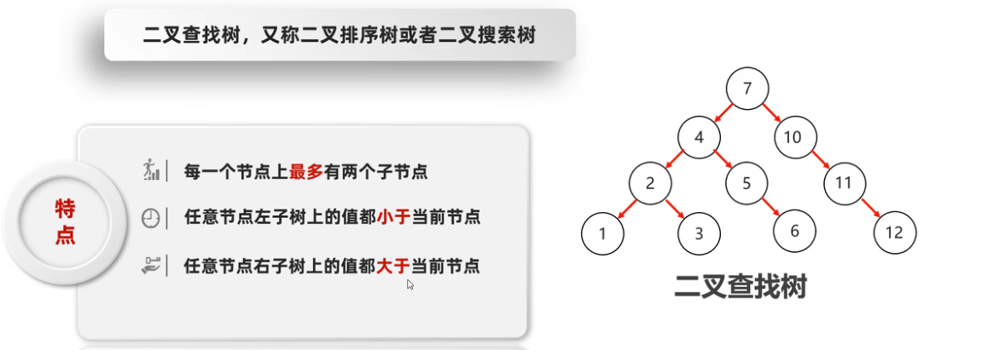

2. **平衡二叉树** 要求每个节点的左右子树高度差不超过1。

3. **红黑树** ： 是一种自平衡的二叉查找树。
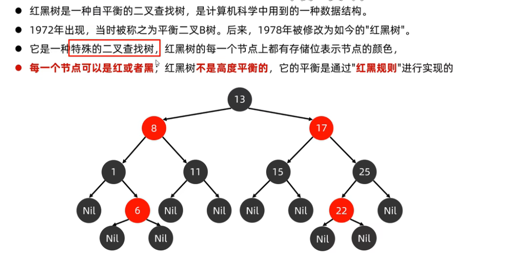
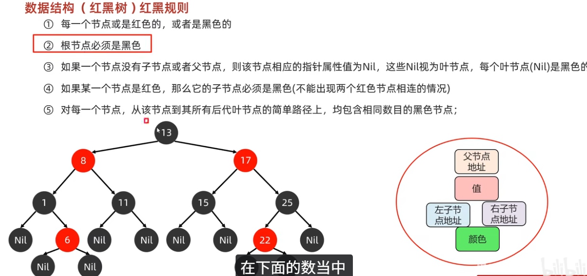
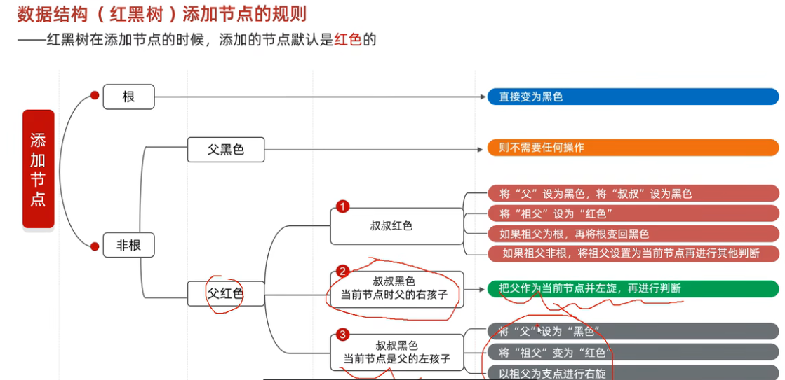
- 每个节点都有一个颜色属性，要么是红色，要么是黑色。
- 根节点是黑色的。
- 每个叶子节点（NIL节点，空节点）是黑色的。
- 如果一个节点是红色的，那么它的子节点必须是黑色的。
- 从每个节点到其所有后代叶子节点的简单路径上，**黑色节点的数量必须相同**。


#### 8.8 Set接口
**Set底层均是基于Map所实现的**

- **HashSet** 无序、不重复、无索引
- **LinkedHashSet** 有序、不重复、无索引
- **TreeSet** 有序、不重复、无索引

1. **HashSet**

- **HashSet** 无序、不重复、无索引
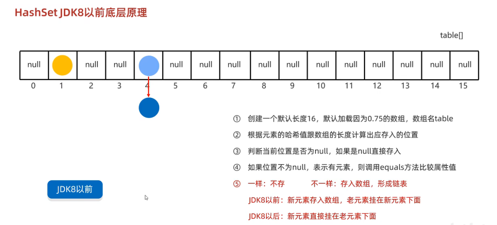

- 当链表长度和哈希表长度较大时，JDK8 引入了**红黑树** 来优化性能。将链表转换为红黑树，**可以提高查找、插入、删除操作的效率**。
- 加载因子用于扩容时，**判断是否需要扩容**。默认值为0.75。
- **JDK8以后，当链表长度超过8，而且数组长度大于等于64时，会将链表转换为红黑树。**
- **哈希值的计算**：是在`Object`类中的`hashCode()`方法中实现的。默认根据对象的内存地址计算哈希值。一般无意义，通常会进行重写，满足需求。
- **哈希冲突** ： 当两个不同的对象，根据哈希函数计算出的哈希值相同，就会发生哈希冲突。
- **自定义类的重写`hashCode()`方法和`equals()`方法**，**确保在 HashSet 中存储的对象是唯一的**。（因为集合Set不允许存在重复元素，因此内部会调用`hashCode()`方法和`equals()`方法来判断是否存在）

2. **LinkedHashSet**

- **LinkedHashSet** 有序、不重复、无索引
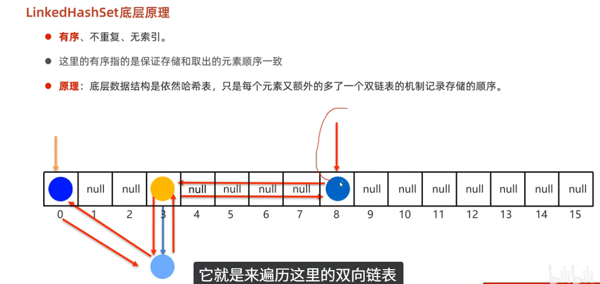

3. **TreeSet**

- **TreeSet** 有序、不重复、无索引
- **本质**：基于红黑树实现的有序集合。插入时需要比较排序，以保持有序性。
- **因此针对自定义类型，需要实现`Comparable`接口的`compareTo()`或`Comparator`接口的`compare()`方法给`TreeSet`对象，以指定排序规则。**
- 这里的`TreeSet`对象为什么可以使用传入的重写`compare()`方法进行比较内部数据。是因为内部通过函数指针接收方法进行比较。


#### 8.9 Map接口
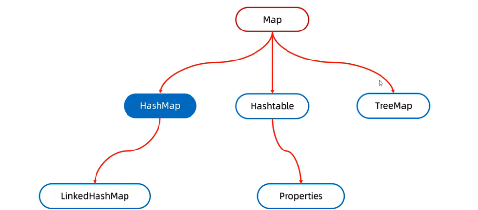
---
1. `Map.put()`方法
     - 放入键值对，若键值已存在，则覆盖旧值。返回旧值。

2. `HashMap `类是`Map`接口的实现类。 **无序、不重复、无索引。**

-  **`HashMap`使用了红黑树，来优化性能。但是对于比较器，内部默认根据哈希值大小来创建红黑树。**

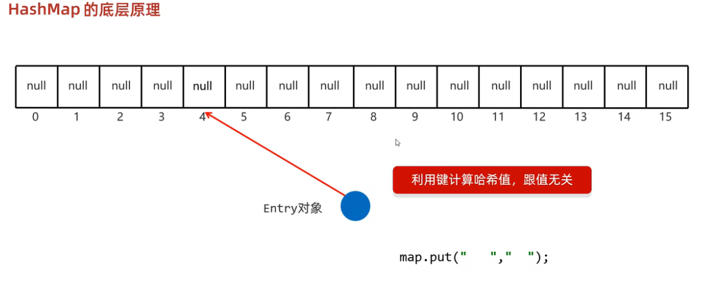

- `HashMap`类的成员变量

``` java 
    static final int DEFAULT_INITIAL_CAPACITY = 1 << 4; // aka 16
    static final float DEFAULT_LOAD_FACTOR = 0.75f;
    static final int TREEIFY_THRESHOLD = 8;
    // HashMap的成员变量存储
    static class Node<K,V> implements Map.Entry<K,V> {
        final int hash;
        final K key;
        V value;
        Node<K,V> next;

```
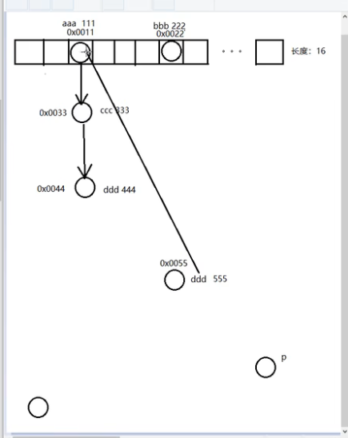
- `HashMap`类的成员变量存储函数方法
``` java


    // HashMap添加新变量时代码
    public V put(K key, V value) {
        return putVal(hash(key), key, value, false, true);
    }

    final V putVal(int hash, K key, V value, boolean onlyIfAbsent, //onlyIfAbsent为true时，若键值已存在，则不覆盖旧值
                   boolean evict) {
        Node<K,V>[] tab; Node<K,V> p; int n, i;// tab为创建栈区临时变量记录哈希表数组table
                                            // p为哈希表中要添加进来的键值对计算出来的位置
                                            // n为创建栈区临时变量记录哈希表数组的长度
                                            // i为要添加进来的索引值
        if ((tab = table) == null || (n = tab.length) == 0)
            n = (tab = resize()).length;// resize()
        // 如果哈希表数组为空，或者哈希表数组的长度为0，则扩容
        // 如果第一次添加数据，底层会创建一个哈希表数组，长度为16，加载因子为0.75
        // 如果不是第一次添加数据，会看数组是否达到扩容条件，若达到扩容条件，则扩容为原来的2倍，加载因子为0.75
        
        // i = 哈希值 & 数组长度 - 1 表示转换成哈希表数组的索引值
        if ((p = tab[i = (n - 1) & hash]) == null)// 如果哈希表数组中要添加进来的键值对计算出来的位置为空，则直接添加
            tab[i] = newNode(hash, key, value, null);
        else {
            Node<K,V> e; K k;
            if (p.hash == hash && ((k = p.key) == key || (key != null && key.equals(k)))) // 如果哈希表数组中要添加进来的键值对计算出来的位置的哈希值和键值对的哈希值相同，且键值对的键值等于要添加进来的键值对的键值，或者键值对的键值不为null，且键值对的键值等于要添加进来的键值对的键值,就直接
                e = p;
            else if (p instanceof TreeNode)//不一致，需要判断是不是红黑树节点进行添加
                e = ((TreeNode<K,V>)p).putTreeVal(this, tab, hash, key, value);
            else {// 不是红黑树节点，需要链表添加
                for (int binCount = 0; ; ++binCount) {
                    if ((e = p.next) == null) {//当前链表到最后也没找到相同的，就直接添加到后面即可
                        p.next = newNode(hash, key, value, null);
                        if (binCount >= TREEIFY_THRESHOLD - 1) // -1 for 1st // 当链表长度大于等于阈值时，需要将链表转换为红黑树
                            treeifyBin(tab, hash);
                        break;
                    }
                    if (e.hash == hash &&
                        ((k = e.key) == key || (key != null && key.equals(k)))) // 遇到相同的键值对，跳出循环结束
                        break;
                    p = e;
                }
            }
            if (e != null) { // existing mapping for key  根据前面判断哈希表中是否存在与要添加进来的键值对的键值相同的键值对，有就是非空，进行决定是否修改值
                V oldValue = e.value;
                if (!onlyIfAbsent || oldValue == null)
                    e.value = value;
                afterNodeAccess(e);
                return oldValue;
            }
        }
        ++modCount;
        if (++size > threshold)
            resize();
        afterNodeInsertion(evict);
        return null;
    }
```
  

1. **`TreeMap`类的成员变量存储函数方法。只使用红黑树结构存储不涉及哈希表与相关**

``` java 
    // TreeMap的成员变量存储
    private final Comparator<? super K> comparator; // 排序规则
    private transient Entry<K,V> root; // 根节点
    static final class Entry<K,V> implements Map.Entry<K,V> {
        K key;
        V value;
        Entry<K,V> left;
        Entry<K,V> right;
        Entry<K,V> parent;
        boolean color = BLACK;

```

``` java 

    private V put(K key, V value, boolean replaceOld) {
        Entry<K,V> t = root; // 从根节点开始遍历
        if (t == null) { // 如果根节点为空，则直接添加
            addEntryToEmptyMap(key, value);
            return null;
        }
        int cmp;
        Entry<K,V> parent;
        // split comparator and comparable paths
        Comparator<? super K> cpr = comparator; // 排序规则,若为null,则使用Comparable接口
        if (cpr != null) {
            do {
                parent = t;
                cmp = cpr.compare(key, t.key);
                if (cmp < 0)
                    t = t.left;
                else if (cmp > 0)
                    t = t.right;
                else {
                    V oldValue = t.value;
                    if (replaceOld || oldValue == null) {
                        t.value = value;
                    }
                    return oldValue;
                }
            } while (t != null);
        } else {
            Objects.requireNonNull(key);
            @SuppressWarnings("unchecked")
            Comparable<? super K> k = (Comparable<? super K>) key;
            do {
                parent = t;// 记录当前节点的父节点
                cmp = k.compareTo(t.key);
                if (cmp < 0)
                    t = t.left;
                else if (cmp > 0)
                    t = t.right;
                else {
                    V oldValue = t.value;
                    if (replaceOld || oldValue == null) {
                        t.value = value;
                    }
                    return oldValue;
                }
            } while (t != null);
        }
        addEntry(key, value, parent, cmp < 0); //添加新节点
        return null;

    private void addEntry(K key, V value, Entry<K, V> parent, boolean addToLeft) { //添加新节点
        Entry<K,V> e = new Entry<>(key, value, parent);
        if (addToLeft)
            parent.left = e;
        else
            parent.right = e;
        fixAfterInsertion(e); // 修复红黑树，使其满足红黑树的性质
        size++;
        modCount++;
    }

    private void fixAfterInsertion(Entry<K,V> x) {
        x.color = RED; // 新节点默认为红色

        while (x != null && x != root && x.parent.color == RED) { 
            if (parentOf(x) == leftOf(parentOf(parentOf(x)))) {
                Entry<K,V> y = rightOf(parentOf(parentOf(x)));
                if (colorOf(y) == RED) {
                    setColor(parentOf(x), BLACK);
                    setColor(y, BLACK);
                    setColor(parentOf(parentOf(x)), RED);
                    x = parentOf(parentOf(x));
                } else {
                    if (x == rightOf(parentOf(x))) {
                        x = parentOf(x);
                        rotateLeft(x);
                    }
                    setColor(parentOf(x), BLACK);
                    setColor(parentOf(parentOf(x)), RED);
                    rotateRight(parentOf(parentOf(x)));
                }
            } else {
                Entry<K,V> y = leftOf(parentOf(parentOf(x)));
                if (colorOf(y) == RED) {
                    setColor(parentOf(x), BLACK);
                    setColor(y, BLACK);
                    setColor(parentOf(parentOf(x)), RED);
                    x = parentOf(parentOf(x));
                } else {
                    if (x == leftOf(parentOf(x))) {
                        x = parentOf(x);
                        rotateRight(x);
                    }
                    setColor(parentOf(x), BLACK);
                    setColor(parentOf(parentOf(x)), RED);
                    rotateLeft(parentOf(parentOf(x)));
                }
            }
        }
        root.color = BLACK;
    }

    }
```

3. `LinkedHashMap `类是`Map`接口的实现类。 **有序、不重复、无索引。**

#### 8.10 可变参数 
#### 8.11 collections工具类

#### 8.12 不可变集合
- 不可变集合是指在创建集合后，集合的大小和元素都不能被改变。
- `List 、`Set 、`Map`等集合接口都有静态方法`unmodifiableList`、`unmodifiableSet`、`unmodifiableMap`，用于创建不可变集合。
- `Set`接口在创建不可变集合时，要保证集合中没有重复元素。

- 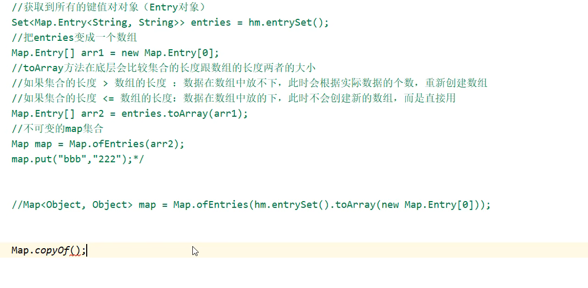


### 9. 包（package）

---
#### 9.1 包的作用
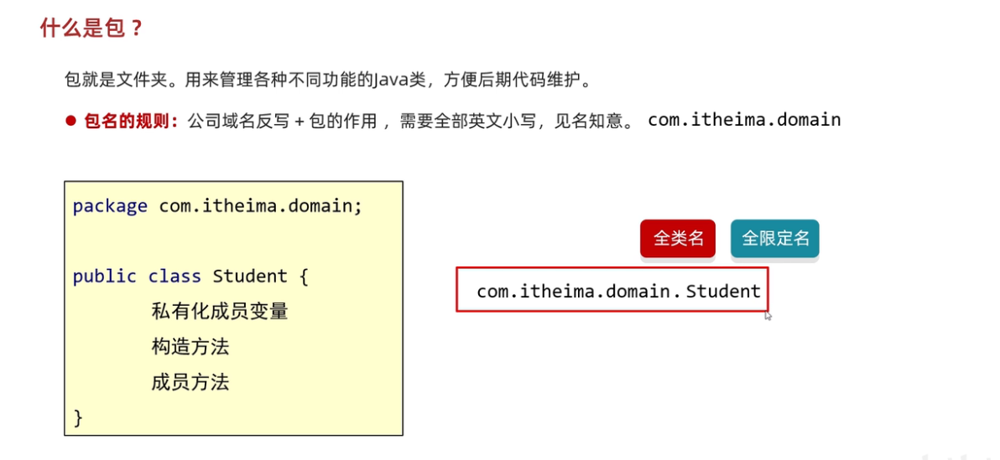


---
#### 9.2 final 关键字
  
  - `final`关键字可以用来修饰类、方法、变量。
  - 被`final`修饰的类不能被继承。
  - 被`final`修饰的方法不能被重写。
  - 被`final`修饰的变量（成员变量或局部变量）只能被赋值一次，不能被改变。

---
#### 9.3 权限修饰符

---
1. 权限修饰符
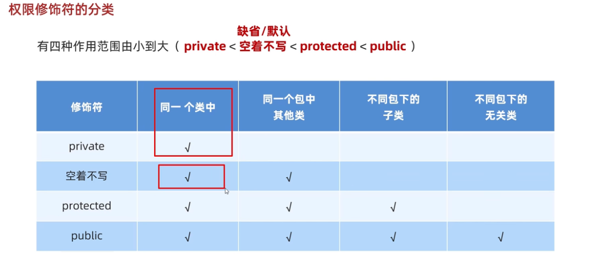

2. 构造代码块
    
    - 构造代码块是在类中定义的代码块，用于初始化对象的成员变量。
    - 构造代码块在每次创建对象时都会被调用。
    - 构造代码块可以用来初始化对象的成员变量，避免在每个构造方法中重复编写初始化代码。

3. 静态代码块
    - 静态代码块是在类中定义的代码块，用于初始化静态成员变量。
    - 静态代码块在类加载时会被调用，且只调用一次。
    - 静态代码块可以用来初始化静态成员变量，避免在每个静态方法中重复编写初始化代码。
---


### 10. 接口（interface）

---

#### 10.1 接口的作用

1. 接口是一种特殊的类，**它不能被实例化，只能被实现**。
2. 接口可以用来定义一种规范，实现类可以根据规范来实现。
3. **接口与类之间的关系**： 实现关系。一个类可以实现多个接口，但是必须实现接口中的所有抽象方法。
4. **接口与接口** ： 继承关系。**一个接口可以继承多个接口，但是只能继承一个类**。
5. **当一个方法的参数是接口类型时，调用该方法时可以传入实现了该接口的类的对象。**

```java
Map<String, String> stringStringHashMap = new HashMap<>(); //HashMap类实现了Map接口（Map接口是包含了Entry接口的）的对象，因此Map接口接受了HashMap类的对象
Set<Map.Entry<String, String>> entrySet = stringStringHashMap.entrySet();//同理，`entrySet`方法返回的是一个Set集合，集合中的元素是`Map.Entry`对象。每个`Map.Entry`对象包含了键值对的信息。

```

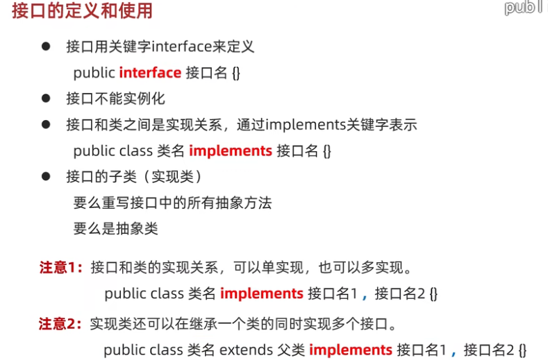


---
#### 10.2 接口成员特点

1. 接口只能包含**抽象方法**和**常量**。
2. 接口中的方法默认都是**public abstract**的，因此可以省略不写。
3. 接口中的常量默认都是**public static final**的，因此可以省略不写。

 - JDK1.8开始，接口中可以包含**默认方法**和**静态方法**。
 - 默认方法：使用`default`关键字修饰的方法，**实现类可以直接调用，也可以重写。** 最初用来适配旧版本更新的问题
 - 静态方法：使用`static`关键字修饰的方法，只能通过接口名调用，不能被实现类重写。
 - 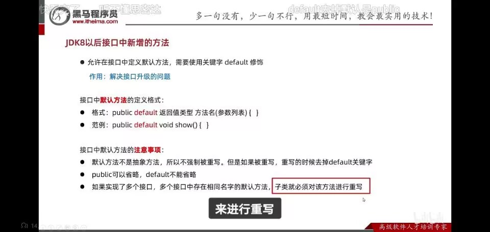


---

#### 10.3 接口适配器模式（Interface Adapter Pattern，设计模式之一）

- 作用：将一个类的接口转换成客户端期望的另一个接口。
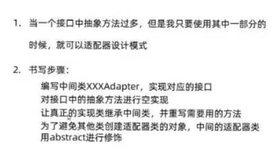


### 11. JAVA常用API

---
#### 11.1 Math类
#### 11.2 System类
##### 11.2.1 Arraycopy方法
#### 11.3 Runtime
#### 11.4 Object类
##### 11.4.1 toString方法
  
  - `toString()`方法返回一个字符串，该字符串表示对象的类名和对象的哈希码。
##### 11.4.2 equals方法

  - `equals()`方法用于比较两个对象是否相等，**比较的是对象的哈希码。**
  - **如果要比较对象的内容是否相等，需要重写`equals()`方法。**
  - 在String类中，`equals()`方法比较的是字符串的内容是否相等。
  - 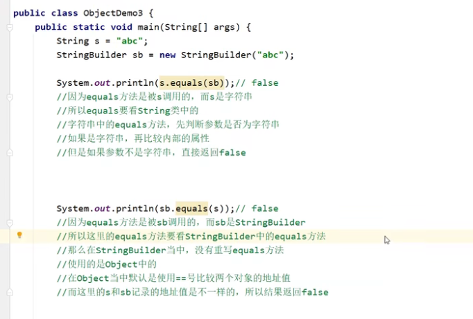

#### 11.5 克隆（拷贝 浅拷贝和深拷贝）

  - `clone()`方法用于创建一个对象的副本。**自带的浅拷贝方法只能实现浅拷贝，不能实现深拷贝。**
  
  - **java深拷贝的特点：**
    * 对于常量成员变量，深拷贝会直接复制值，不会创建新的对象。
    * 对于引用成员变量，深拷贝会创建新的对象，并将引用指向新的对象。
    * 对于字符串，**如果已经存在相同内容的字符串（存在于字符串常量池），深拷贝会直接引用该字符串，不会创建新的对象。**

---

``` java 
public class Student implements Cloneable{
    private String name;
    private int age;
    private int[] scores;//语文、数学、英语

    @Override //深拷贝
    public Student clone() throws CloneNotSupportedException {
        Student stu = (Student) super.clone();//这里调用的是Object类的clone方法，实现的是浅拷贝，返回Object对象，进行强转

        int[] newScores = new int[scores.length];// 深拷贝数组
        for(int i=0;i<scores.length;i++){
            newScores[i] = scores[i];
        }
        stu.scores = newScores;
        return stu;
    }
}
```
1. 这里的`Cloneable`接口是一个标记接口，用于告诉Java运行时，该类支持克隆操作。当调用 Object 的 clone() 方法时，Java 运行时会检查该对象所属的类是否实现了 Cloneable 接口。如果没有实现，就会抛出 CloneNotSupportedException。因此，任何需要调用 clone() 的类都必须显式实现 Cloneable。
2. `public` 方法 `clone()` 用于创建一个对象的副本。是继承于 `Object` 类的拷贝方法，因为是 `protected` 方法，所以只能在类内部或子类中调用。
3. `throws CloneNotSupportedException` 表示该方法可能会抛出克隆不支持异常。

#### 11.6 Objects类

   - `Objects`类是Java 7引入的一个工具类，提供了一些静态方法，用于操作对象。

#### 11.7 BigInteger类、BigDecimal类

---
1. `BigInteger`类：用于表示任意精度的整数。作为类，不同于基本数据类型的运算，需要调用成员函数进行运算，每次创建新对象接受运算结果。
   
   - `BigInteger`对象表示的是一个不可变的整数对象
   - `BigInteger.valueOf(Long xx)`对内部常用数值进行了缓存，不会创建重复出现的这些缓存数值对象 
   - `BigInteger.max`不会创建新对象，而是返回两个对象中较大的那个。`min`同理。

2. `BigInteger`存储原理
    - `BigInteger`类内部使用一个`int[]`数组来存储大整数的32位二进制。按照顺序存储。实际上`int[]`数组大小存在上限，一般达不到存储大整数的需求。
    - 符号位用`-1`表示负数，`0`表示0，`1`表示正数。


---

3. 计算机存储精度丢失问题
    - 计算机只能存储有限的二进制位，而浮点数的小数部分是无限循环的二进制数。
    - 例如，0.1在二进制表示为0.00011001100110011001100110011001100110011001100110011，无限循环。
    - 而计算机只能存储有限的二进制位，因此会丢失精度。

--- 

4. `BigDecimal`类：用于表示任意精度的浮点数。不可以修改，每次运算都返回新对象。
    - `BigDecimal(double val)`存在不确定的精度丢失问题。
    - `BigDecimal(String val)`不存在精度丢失问题。
    - 静态方法`BigDecimal.valueOf(double val)`同样有内部缓存，不会创建重复出现的这些缓存数值对象。内部会先调用`double.toString()`方法，将浮点数转换为字符串，再调用`BigDecimal(String val)`构造方法。
    - `RoundingMode`枚举类：用于指定舍入模式。在调用`BigDecimal`类的`divide`方法时，需要指定舍入模式。

5. `BigDecimal`存储原理
    - 使用`byte[]`数组存储，将浮点数转为字符串包括`+`、`.`、`-`、`0-9`共12个字符，通过存储对应的ASCII码值记录数值

#### 11.8 正则表达式

   1. 正则表达式的基本表达
- 正则表达式是一种用于匹配字符串的强大工具。
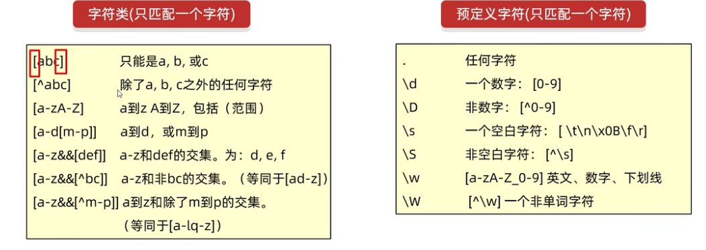 
- 纠正，任意字符在正则表达中是`\.`,因此要是匹配字符`.`,需要使用`\\.`在正则表达式中。
- `(?i)` ：忽略大小写
- `Java(?=8|11)`匹配`Java8`和`Java11`，但只条件返回`Java`字符串，不返回`8`和`11`。
- `Java(?:8|11)`匹配`Java8`和`Java11`，但返回`Java8`和`Java11`
- `Java(?!8|11)`匹配`Java`，但不匹配`Java8`和`Java11`。返回`Java`字符串
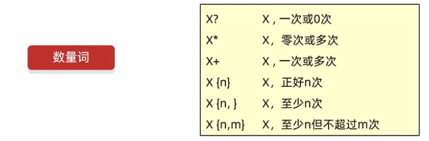
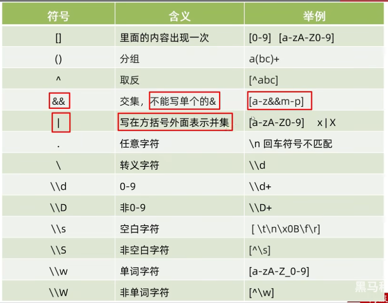

- `&`和`&&`在正则表达式差异。
    * `[a-z&[m-p]]`表示满足`a-z`或`m-p`或`&`字符即可。
    * `[a-z&&[m-p]]`表示满足`a-z`且`m-p`的字符即可。

---
2. 贪婪匹配与非贪婪匹配
    * 贪婪匹配：默认情况下，正则表达式会尽可能多地匹配字符。
    * 非贪婪匹配：在量词后面添加`?`，表示尽可能少地匹配字符。

3. 分组的捕获与非捕获
    * 捕获分组：用`()`括起来的正则表达式，会将匹配到的字符串捕获到一个组中。
    * 非捕获分组：用`(?:)`、`(?!)`、`(?=)`括起来的正则表达式，不会将匹配到的字符串捕获到一个组中。
    * 组的引用：在正则表达式中，可以使用`\数字`引用之前捕获的组。例如，`(a)(b)\2\1`表示匹配`abba`。
    * 组的命名：可以使用`(?<name>正则表达式)`给分组命名，例如`(?<year>\d{4})`表示匹配4位数字，并将其命名为`year`。
    * 组的顺序：在正则表达式中，分组的顺序是根据左括号的出现顺序来确定的。例如，`(a)(b)`表示第一个分组为`a`，第二个分组为`b`。而`(a(b))`表示第一个分组为`a(b)`，第二个分组为`b`。
    * 外部使用：在正则表达式中，可以使用`$数字`引用之前的表达式分组。例如，`$1`表示引用第一个分组，`$2`表示引用第二个分组。


#### 11.9 JDK时间相关类

1. 时间标准： 格林威治时间（GMT） 是世界标准时间，也被称为协调世界时（UTC）。，中国使用的是东八区时间，与GMT相差8小时。
2. 现在采取原子钟作为时间标准。
3. 起始时间：1970年1月1日00:00:00 GMT

##### 11.9.1 JDK7以前的时间类

1. `Date`类：表示特定的瞬间，精确到毫秒。
2. `Calendar`类：提供了对日期字段进行操作的方法。为抽象类，需要通过`Calendar.getInstance()`方法获取实例。
3. `SimpleDateFormat`类：用于格式化和解析日期字符串。


##### 11.9.2 JDK8新增时间类

- JDK7前的时间`Date`和`Calendar`类存在线程安全问题，多用户修改时间，会导致时间错误。因此JDK8保证时间类的线程安全。

1. `LocalDate`类：表示日期，不包含时间和时区信息。
2. `LocalTime`类：表示时间，不包含日期和时区信息。
3. `LocalDateTime`类：表示日期时间，不包含时区信息。
4. `ZonedDateTime`类：表示日期时间，包含时区信息。
5. `Instant`类：表示时间戳，精确到秒。
6. `ZoneId`类：表示时区ID。
7. `ZoneTime`类：表示时区时间，包含时区信息。
8. `ZoneDateTime`类：表示时区日期时间，包含时区信息。
9. `DateTimeFormatter`类：用于格式化和解析日期时间字符串。
10. `Duration`类：表示时间间隔，精确到秒。
11. `Period`类：表示时间间隔，精确到天。
12. `ChronoUnit`计算时间间隔，精确到秒、毫秒、微秒、纳秒。


#### 11.10 包装类

基本数据类型引入的包装类，用于将基本数据类型封装为对象。方便引用地址操作和数组操作。

##### 11.10.1 Integer类

1. 有缓存数据区范围[-128,127]，超出范围的整数，会创建新的对象。在之内的整数，会从缓存中获取对象。
2. 在JDK5中，引入了自动装箱和自动拆箱功能
   - 即可以直接将基本数据类型赋值给包装类对象。可将包装类对象赋值给基本数据类型变量。
   - `Integer`可以视为`int`等价，支持运算符。在运算时会自动拆箱为`int`类型。返回结果也会自动装箱为`Integer`类型。

### 12. 常见算法与Lambda表达式

#### 12.1 查找算法

1. 二分查找
2. 差值查找
3. 斐波那契查找（黄金分割率查找）
4. 分块查找，适用块间有序，块内无序的情况。
    - 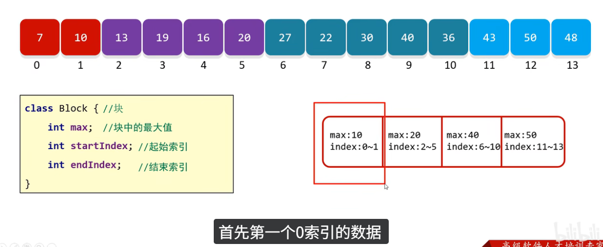
    - **如何分块？？？**
    - 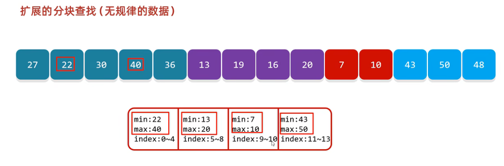
5. 哈希查找
    - 哈希表：将关键码映射到存储位置的函数。

#### 12.2 排序算法

1. 冒泡排序、选择排序
2. 插入排序：将数组分为已排序和未排序两部分，每次将未排序部分的第一个元素插入到已排序部分的合适位置。
3. 快速排序（基准位归位排序）
    - 基本思想：选择一个基准元素，将数组分为两部分，一部分比基准元素小，一部分比基准元素大。然后递归地对这两部分进行排序。
    - 逻辑（单次）：**选中一个元素作为基准，两端同时开始遍历，每次发现左边的元素大于基准，右边的元素小于基准，就交换这两个元素**。当这样执行结束，基准位左边的元素都小于基准，右边的元素都大于基准。之后只需要对基准位左边的子数组和右边的子数组分别进行快速排序即可。
    - 左右两边查找时，**必须先从右边开始查找，再从左边开始查找**。具体原因是因为**基准位左边的元素都小于基准，右边的元素都大于基准**。如果先从左边开始查找，找到的元素可能大于基准（由于起始与终止相等提前结束，基准位此时是不正确的）

#### 12.3 Arrays类

1. `Arrays.sort()`，对数组进行排序。底层是`插入排序`+`二分查找`插入点。其中涉及到比较`compare()`方法。调整其决定排序顺序。

#### 12.4 Lambda表达式

---
1. `Lambda表达式`：是一种匿名函数，用于表示一个函数接口的实例。
    - 格式：`(参数列表) -> 表达式`或`(参数列表) -> { 语句块 }`
    - 它可以简化匿名内部类的代码，使代码更加简洁。
    - 它只可以简化**函数式接口**的匿名内部类
    - **函数式接口**只包含一个抽象方法，用于表示一个函数。接口上方添加`@FunctionalInterface`注解，用于标识该接口是一个函数式接口。

2. `Lambda表达式`的简化表达
    - 参数类型可以省略，编译器可以根据上下文推断参数类型。
    - 如果只有一个参数，参数类型可以省略，同时括号也可以省略。
    - 如果语句块只有一条语句，大括号可以省略，同时语句后面的分号也可以省略。**要同时省略大括号和分号，语句必须是一个表达式。**


### 13. Stream流

---
#### 13.1 Stream流的作用
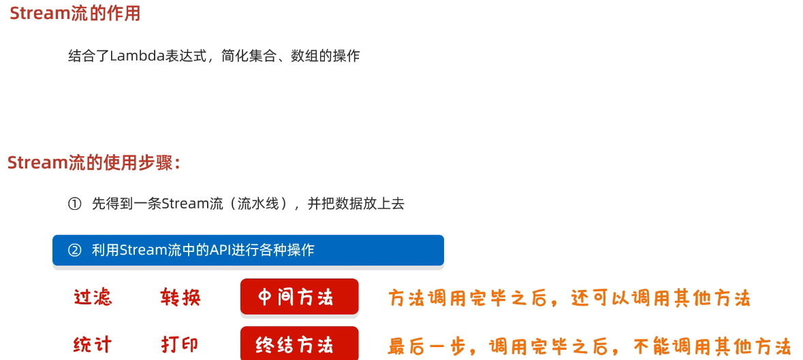

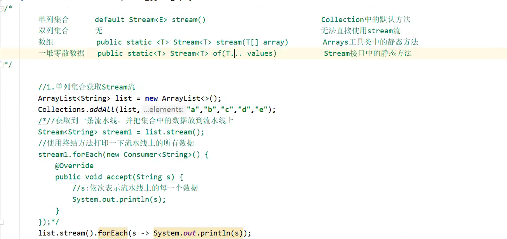

1. 单列集合继承于`Collection`接口，提供了`stream()`方法，用于创建一个流。
2. 双列集合没有提供`stream()`方法，通过转换成单列集合后再创建流。
3. `arraylist.stream().filter(条件).map(映射).collect(收集)` 用于对集合进行流操作。
    - `filter(条件)`：对集合进行过滤，只保留符合条件的元素。
    - `map(映射)`：对集合进行映射，将元素转换为其他类型。
    - `collect(收集)`：对集合进行收集，将元素转换为集合。
---
#### 13.2 Stream流的中间方法

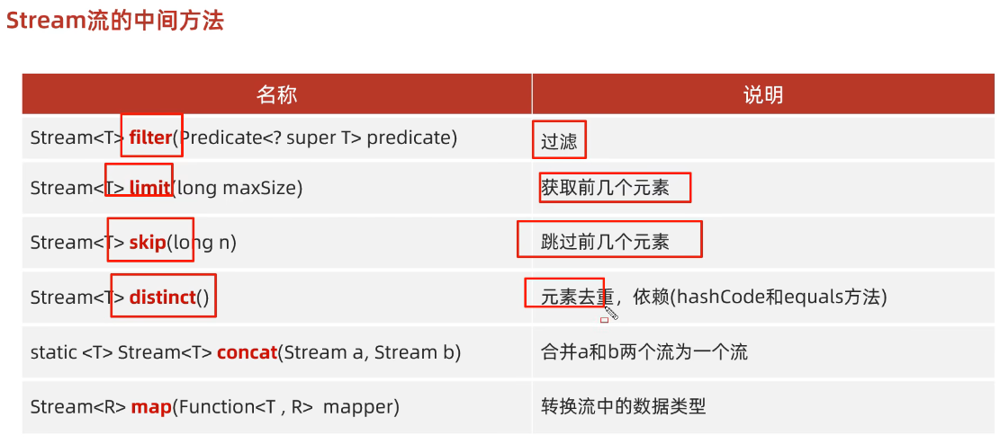

#### 13.3 Stream流的最终方法

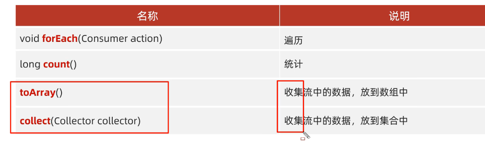

- `collect(Collectors.toList())`：将流转换为列表。
- `collect(Collectors.toSet())`：将流转换为集合。
- `collect(Collectors.toMap(映射键接口对象，映射值接口对象))`：将流转换为字符串。

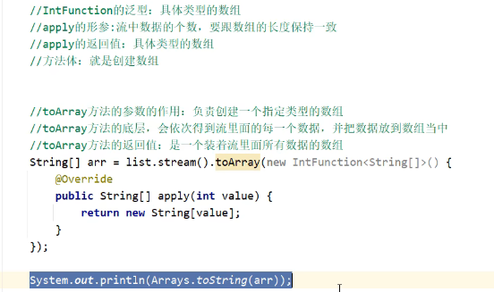


### 14. 方法引用（函数引用）
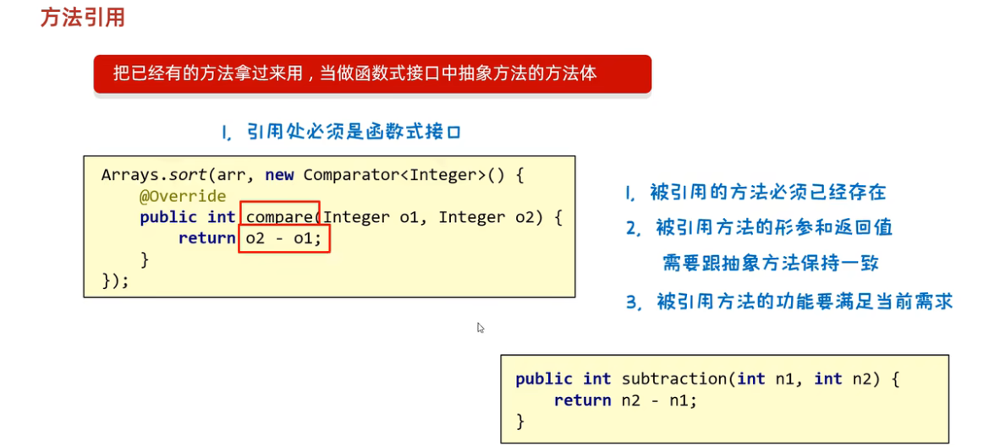
---
#### 14.1 方法引用的分类
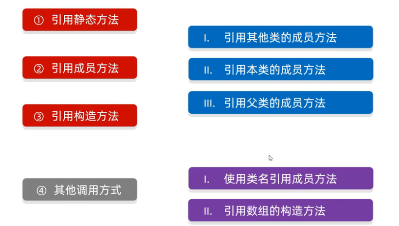

- 成员方法引用格式：`对象::方法名`
- 静态方法引用格式：`类名::方法名`
- 构造方法引用格式：`类名::new` 。构造方法引用只能用于创建对象，不能用于调用方法。
- 父类方法引用格式：`super::方法名` 。**注意使用方法引用的函数不能为静态函数。**
- 当前类方法引用格式：`this::方法名`。**注意使用方法引用的函数不能为静态函数。**

- 类方法引用格式：：`类名::方法名` 。结合当前数据流steam中的类去调用其（非静态）成员方法。
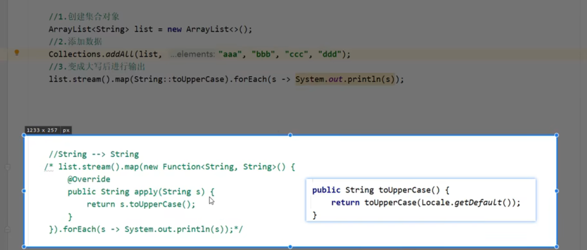
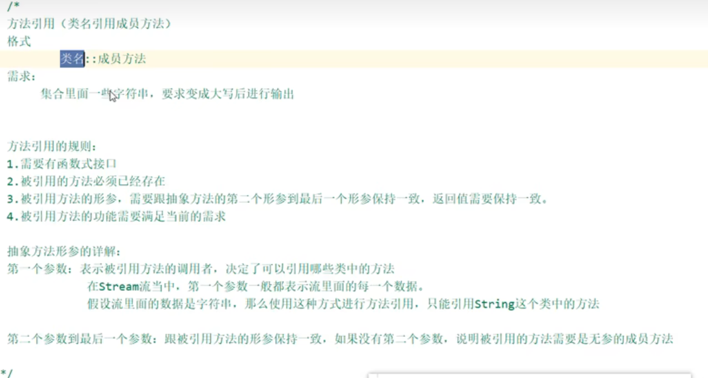

- 数组构造方法的引用格式：`数组类型[]::new`。
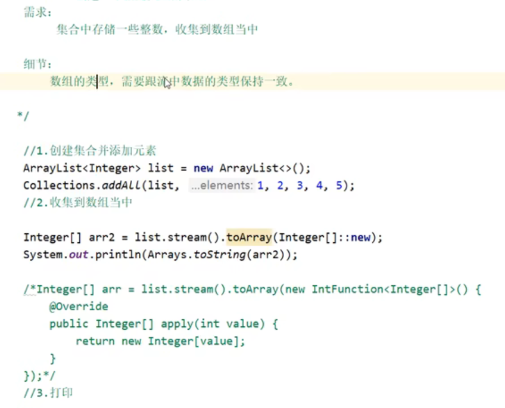


### 15. 异常处理
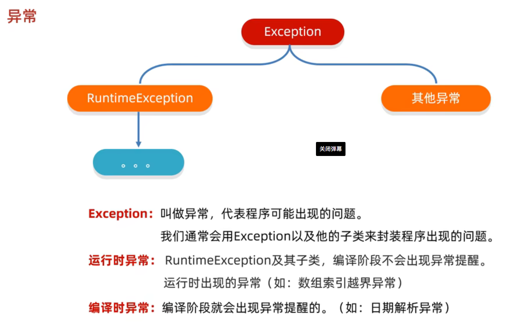

- 编译时异常：没有继承于`RuntimeException`的异常，直接继承于`Exception`。编译时就会报错。一般用于表示程序逻辑错误。
- 运行时异常：继承于`RuntimeException`的本身和其子类异常，编译时不会报错，但是运行时会报错。
- 
#### 15.1 捕获异常

- 捕获异常的格式：`try{代码块}catch(异常类型 e){处理代码}`}`。
```java
    try{
        // 可能会抛出异常的代码
    }catch(异常类型 e){
        // 处理异常
        e.printStackTrace();
    }
    catch(异常类型 e){
        // 处理异常
        e.printStackTrace();// 打印异常信息在控制台
    }finally{
        // 无论是否抛出异常，都会执行的代码
    }
    // ...
```
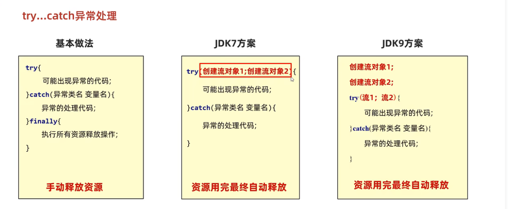
- `try(资源对象)`：用于关闭资源对象。在`try`代码块中，资源对象的`close()`方法会被自动调用，关闭资源。**前提是资源对象实现了`AutoCloseable`接口**。

---
- 执行逻辑：
   - **首先执行`try`代码块中的代码，如果执行过程中抛出异常，就会跳转到`catch`代码块中检查异常类型是否匹配。**
   - 如果异常类型匹配，就会执行对应的`catch`代码块中的代码。
   - 如果异常类型不匹配，就会继续检查下一个`catch`代码块。
   - 如果没有匹配的`catch`代码块，就会报错。
   - **异常的顺序，要使先写子类异常，再写父类异常。因为子类异常是父类异常的子类，所以子类异常会匹配父类异常。**


#### 15.2 抛出异常

- 抛出异常的格式：`throw new 异常类型("异常信息");`
- `throws`：**用于声明方法可能会抛出的异常类型。对于`RuntimeException`的异常，不需要声明。**
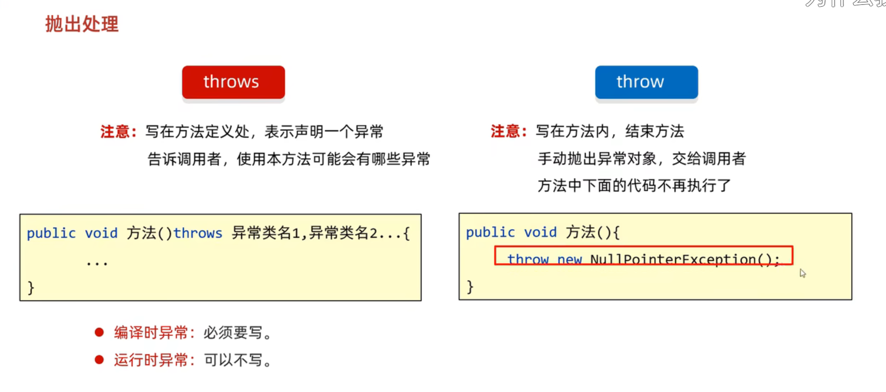

#### 15.3 自定义异常


### 16. 文件流

- `File`类：用于表示文件或目录。将文件或目录的路径表示为`File`对象。可进行文件或目录的创建、删除、重命名、获取路径等操作。


#### 16.1 IO流
以程序作为主体，将数据从文件中读取出来，或者将数据写入文件。
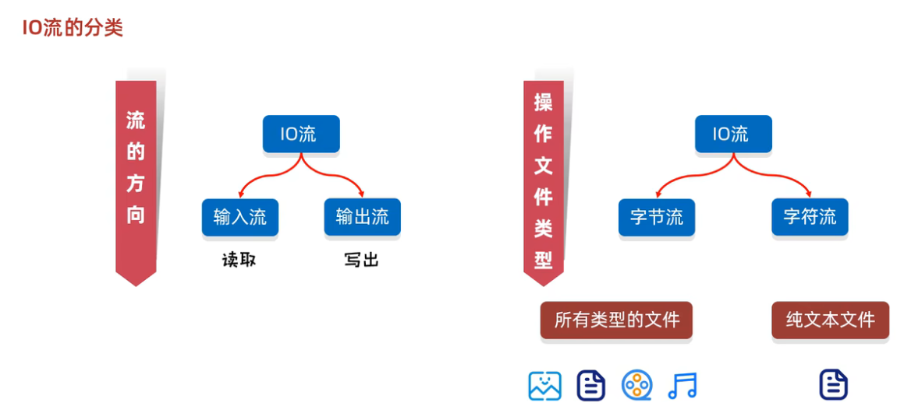
- `InputStream`：输入流，用于从文件中读取数据。抽象类
- `OutputStream`：输出流，用于将数据写入文件。抽象类
- 字节流处理没有缓冲区，直接读取或写入数据。因此效率并不如字符流。

#### 16.2 编码与解码

- ` GBK` : ASCII码对应一个字节（首位比特为0），中文对应两个字节（首位比特为1）。
- `UTF-8`：是一种可变长度的编码格式，能够表示所有字符。**中文使用三个字节存储。**
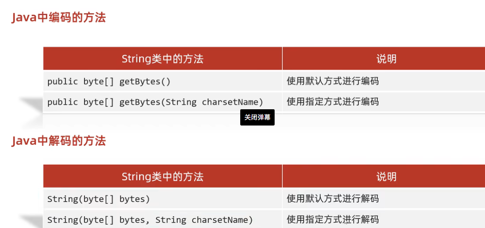
- 字符流：用于处理文本数据。根据不同编码或者映射关系，将字节流转换为字符流。增加了缓冲区，提高了效率。（也是因为单字节无法表述中文，所以需要缓冲区。）
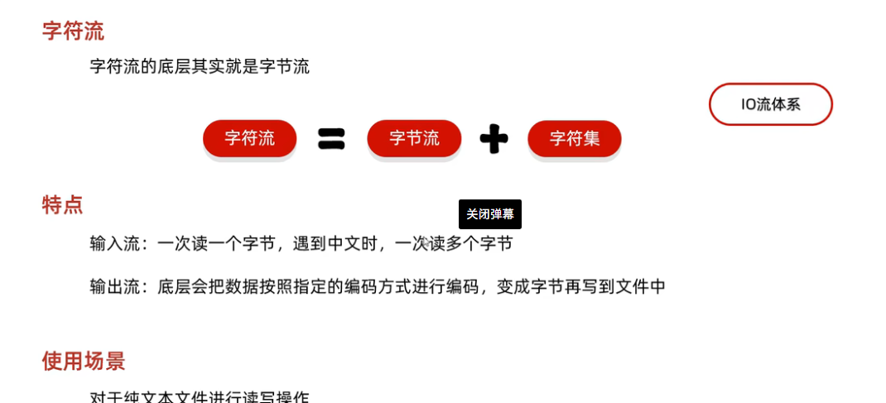
   - `FileReader`：用于从文件中读取字符数据。
   - `FileWriter`：用于将字符数据写入文件。

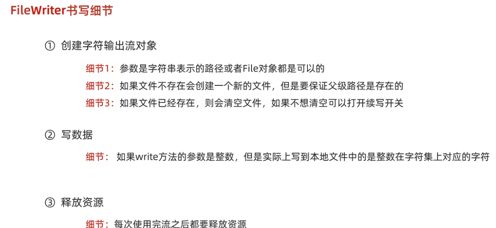

#### 16.3 字符流缓冲原理（写入与写出缓冲一致）
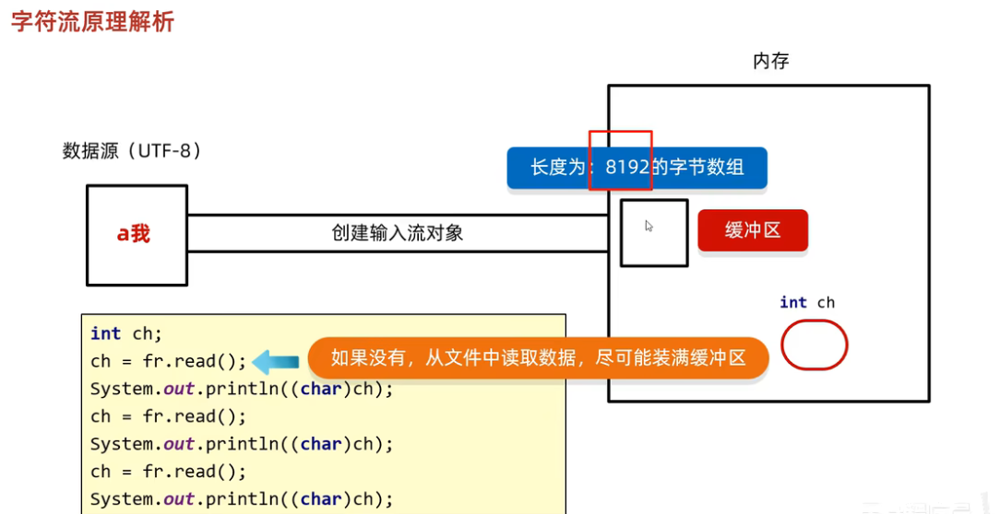
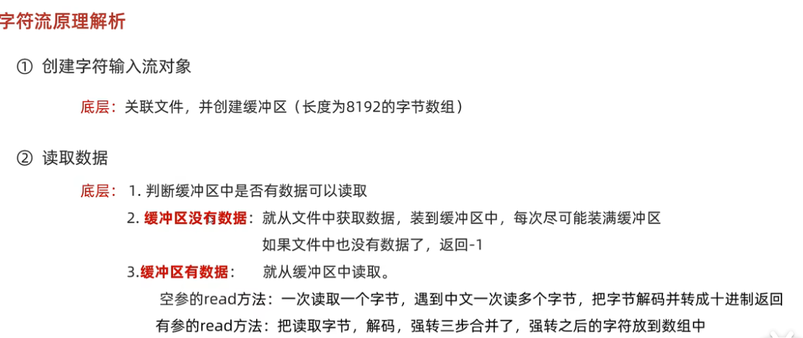
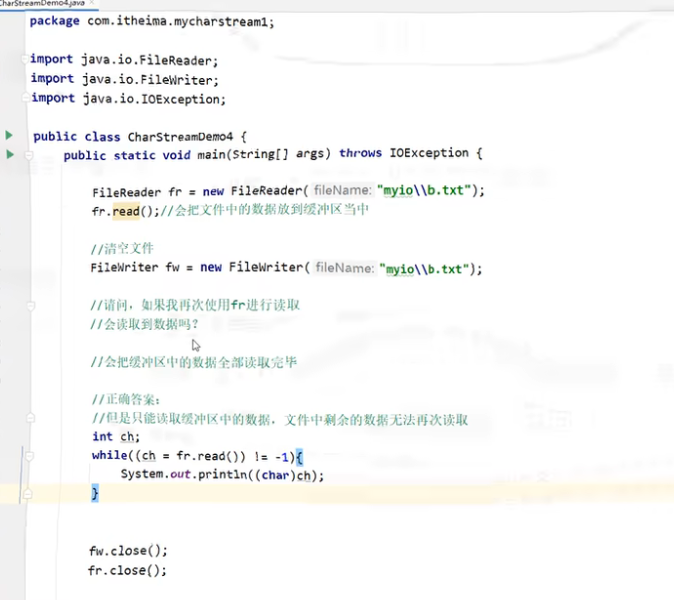
- 字符流的输出缓冲，将字符写入缓冲区，而不是直接写入文件。但是增加了`flush()`方法，用于将缓冲区中的数据写入文件（可人为调用将数据写入文件）。 在程序结束时，会自动调用`flush()`方法，将缓冲区中的数据写入文件。


#### 16.4 高级IO流（引入缓冲流）
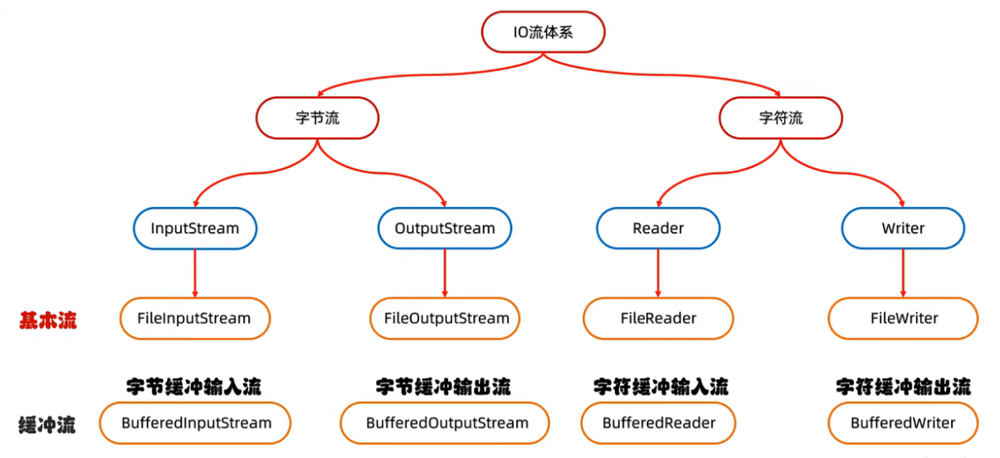

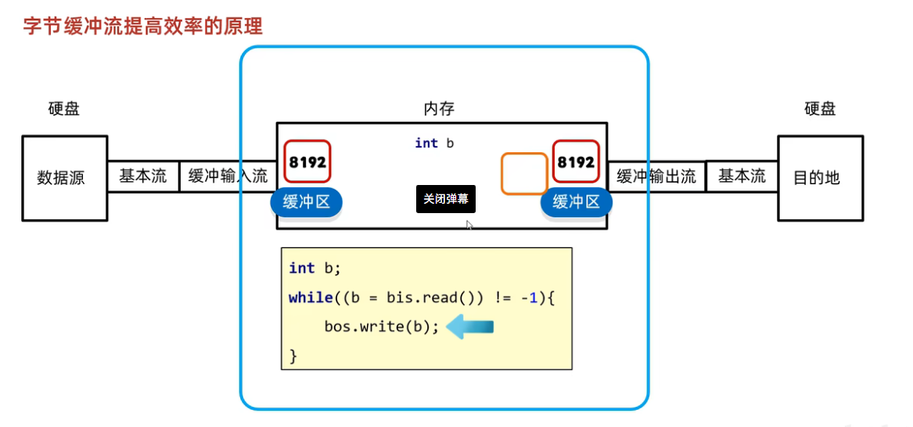
- `BufferedReader 和 BufferedWriter`增加了行读取和写入的功能。

#### 16.5 转换流（JDK8以前使用，JDK11时被淘汰  FileReader 和 FileWriter更推荐使用）

- 转换流：用于将字节流转换为字符流，或者将字符流转换为字节流。
- `InputStreamReader`：将字节流转换为字符流。JDK11时被淘汰，替换为
- `OutputStreamWriter`：将字符流转换为字节流。


#### 16.6 序列化流

- 序列化流：用于将对象转换为字节流，或者将字节流转换为对象。
- `ObjectOutputStream`：将对象转换为字节流。
- `ObjectInputStream`：将字节流转换为对象。
- `Serializable`接口：用于表示对象可以被序列化。**标记型接口，表示当前类可以被序列化。**
- **版本号**用于表示类的版本号
   - 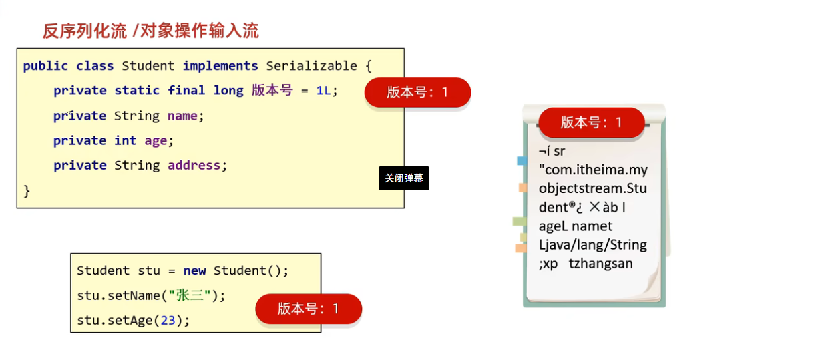
- `transient`：用于表示当前变量不会被序列化。也就无法写出到字节流中。
- 序列化时，存储多个对象时，通常采用数组或集合存储。方便确定对象的数量。便于操作

#### 16.7 打印流
- 打印流：用于将数据打印到控制台或文件中。
- 字节打印流（`PrintStream`）：用于将字节数据打印到控制台或文件中。没有缓冲区
- 字符打印流（`PrintWriter`）：用于将字符数据打印到控制台或文件中。没有缓冲区
- `System.out`实际上是`PrintStream`对象，用于将数据打印到控制台。

#### 16.8 压缩流与解压流

- 压缩流`ZipOutputStream`：用于将数据压缩为字节流。
- 解压流`ZipInputStream`：用于将字节流解压为数据。
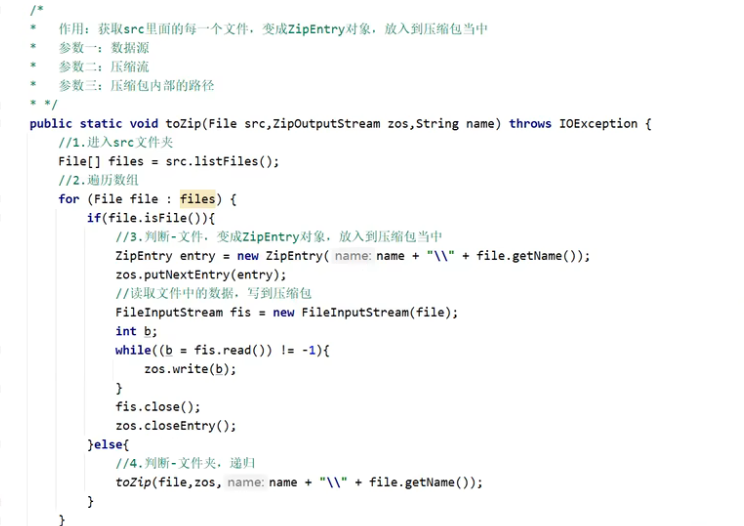


#### 16.9 Commons IO(Apache开发)
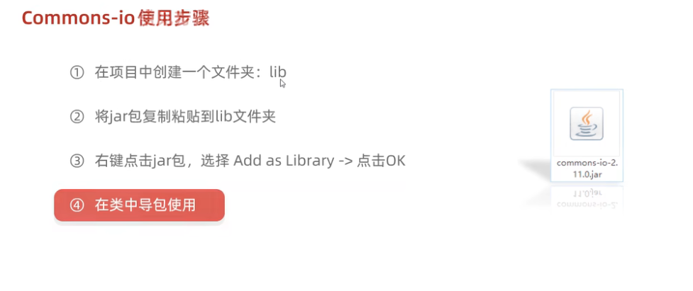
- `FileUtils`：用于处理文件。
- `IOUtils`：用于处理IO流。

#### 16.10 Hutool 工具包

- `Hutool`：一个基于Java的工具包，提供了丰富的工具类。

#### 16.11 properties类

- `Properties`类：用于处理配置文件。存储键值对。
- 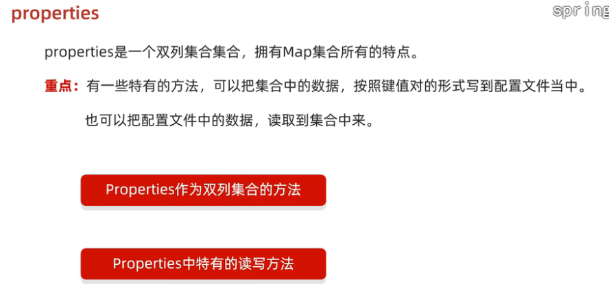

### 17. 多线程

- 线程：程序执行的最小单位。是包含于进程中的一个，每个进程可以包含多个线程。
- 并发：多个线程同时执行，每个线程执行的时间很短。在单处理器上，多个线程是交替执行的。
- 并行：多个线程同时执行，每个线程执行的时间较长。在多处理器上，多个线程是同时执行的。
- JVM中的main线程：程序执行的主线程。所有线程都是在main线程中创建的。

- **守护线程**：**在非守护线程执行完成后，守护线程也会被销毁。主要用于处理一些后台任务，如垃圾回收线程。**
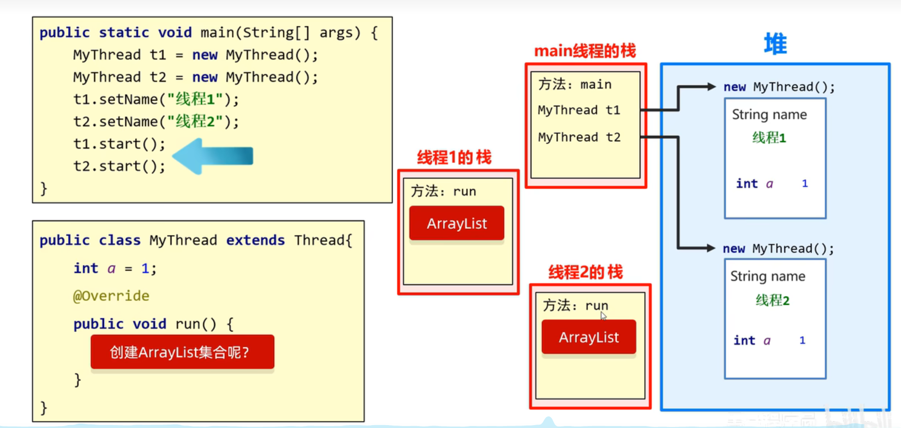

#### 17.1 线程的创建

- 1. 继承`Thread`类 ，  重写`run()`方法。调用`start()`方法启动线程。
- 2. 实现`Runnable`接口  自定义类实现接口中的`run()`方法。使用`new Thread(runnable).start()`启动线程。
- 3. 使用`Callable`接口  自定义类实现接口中的`call()`方法（有返回值，可以抛出异常）。使用`new Thread(new FutureTask<>(callable)).start()`启动线程。
- 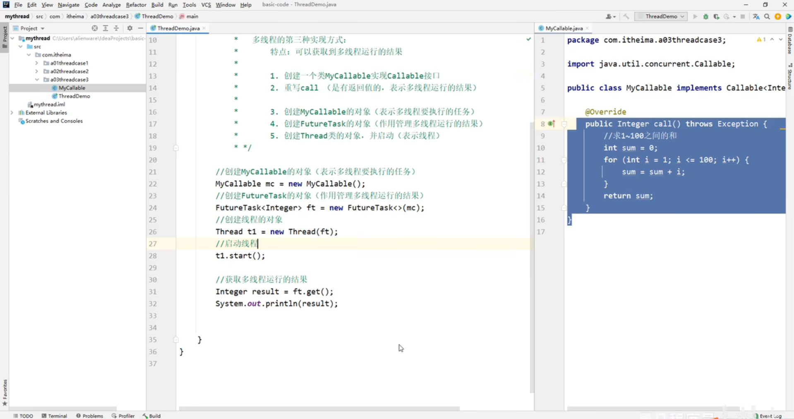

#### 17.2 线程调度

- 线程调度：线程在处理器上执行的过程。
- 抢占式调度：线程在处理器上执行的过程，每个线程都有一个优先级，优先级高的线程先执行。
- 非抢占式调度：线程在处理器上执行的过程，每个线程都有一个时间片，时间片到后，线程重新进入就绪队列，等待被调度。
- **JAVA中，默认采用抢占式调度。**

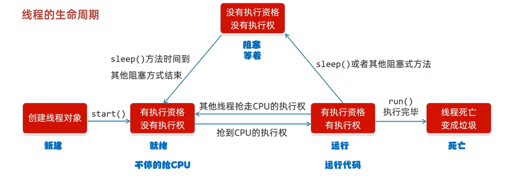

- 同步代码块：用于确保线程安全。在同步代码块中，只能有一个线程执行。`synchronized`关键字用于确保同步代码块的线程安全。锁对象要是唯一的，不能是多个对象。**使用类名的字节码对象（myClass.class）作为锁对象唯一**
- 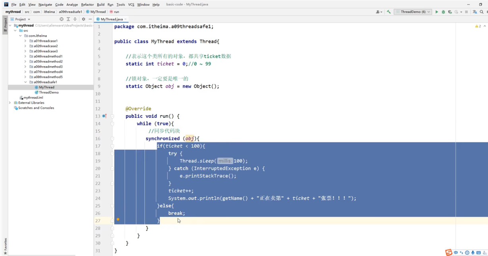
- 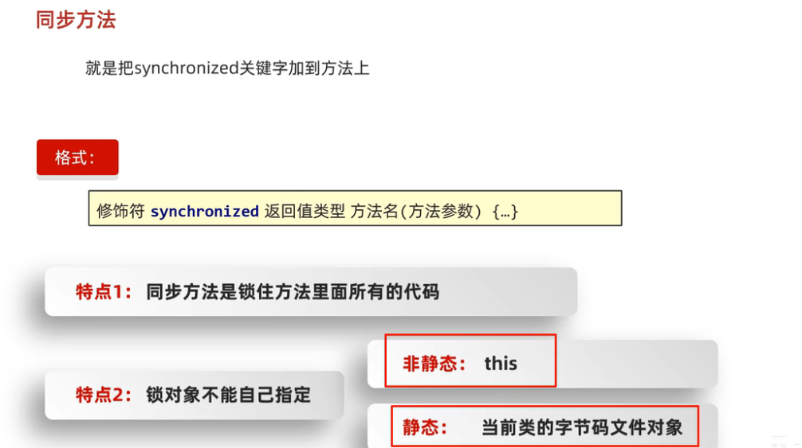

#### 17.3 Lock锁

- lock锁：用于确保线程安全。在lock锁中，只能有一个线程执行。`lock()`方法用于获取锁，`unlock()`方法用于释放锁。
- lock与synchronized关键字的区别：
  - lock锁：更灵活，可以手动释放锁。
  - lock锁：可以中断等待线程。
  - lock锁：可以获取多个锁。

- `ReetrantLock`类，实现`Lock`接口的锁类。
 

#### 17.4 生产者和消费者（等待唤醒机制）

- 用于描述线程之间的共同作用关系，相互协作完成任务。
- 等待唤醒机制：
  - 生产者线程：负责生产数据。
  - 消费者线程：负责消费数据。
  - 生产者和消费者线程之间通过等待唤醒机制，实现数据的生产和消费。
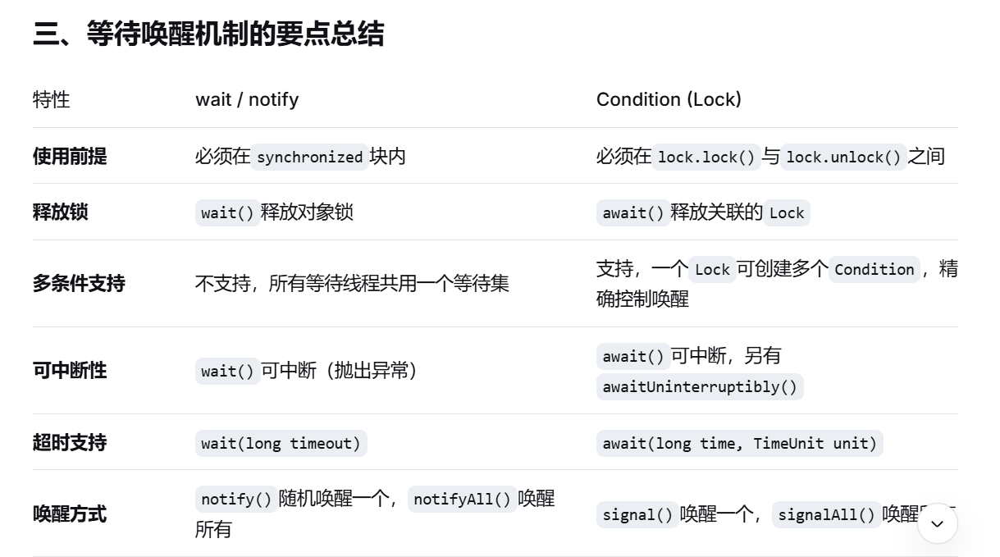

- 单缓冲区生产者和消费者：
```java
public class WaitNotifyDemo {
    private static final Object lock = new Object();
    private static int product = 0;  // 0表示无产品，1表示有产品

    static class Producer implements Runnable {
        @Override
        public void run() {
            while (true) {
                synchronized (lock) {
                    while (product == 1) {  // 产品未消费，等待
                        try {
                            lock.wait();
                        } catch (InterruptedException e) {
                            e.printStackTrace();
                        }
                    }
                    // 生产产品
                    product = 1;
                    System.out.println(Thread.currentThread().getName() + " 生产了产品");
                    lock.notify();  // 唤醒消费者
                }
                // 模拟生产耗时
                try { Thread.sleep(1000); } catch (InterruptedException e) {}
            }
        }
    }

    static class Consumer implements Runnable {
        @Override
        public void run() {
            while (true) {
                synchronized (lock) {
                    while (product == 0) {  // 无产品，等待
                        try {
                            lock.wait();
                        } catch (InterruptedException e) {
                            e.printStackTrace();
                        }
                    }
                    // 消费产品
                    product = 0;
                    System.out.println(Thread.currentThread().getName() + " 消费了产品");
                    lock.notify();  // 唤醒生产者
                }
                // 模拟消费耗时
                try { Thread.sleep(1500); } catch (InterruptedException e) {}
            }
        }
    }

    public static void main(String[] args) {
        new Thread(new Producer(), "生产者").start();
        new Thread(new Consumer(), "消费者").start();
    }
}


```


- 多缓冲区生产者和消费者：
```java
import java.util.concurrent.locks.Condition;
import java.util.concurrent.locks.Lock;
import java.util.concurrent.locks.ReentrantLock;

public class ConditionDemo {
    private static final Lock lock = new ReentrantLock();
    private static final Condition notFull = lock.newCondition();  // 缓冲区未满条件
    private static final Condition notEmpty = lock.newCondition(); // 缓冲区非空条件
    private static final int CAPACITY = 5;
    private static final int[] buffer = new int[CAPACITY];
    private static int count = 0;  // 当前产品数量
    private static int putIndex = 0; // 生产位置
    private static int takeIndex = 0; // 消费位置

    static class Producer implements Runnable {
        @Override
        public void run() {
            int value = 0;
            while (true) {
                lock.lock();
                try {
                    while (count == CAPACITY) {
                        notFull.await();  // 缓冲区满，等待
                    }
                    buffer[putIndex] = value++;
                    putIndex = (putIndex + 1) % CAPACITY;
                    count++;
                    System.out.println(Thread.currentThread().getName() + " 生产，产品数=" + count);
                    notEmpty.signal(); // 唤醒一个等待非空条件的消费者
                } catch (InterruptedException e) {
                    e.printStackTrace();
                } finally {
                    lock.unlock();
                }
                try { Thread.sleep(500); } catch (InterruptedException e) {}
            }
        }
    }

    static class Consumer implements Runnable {
        @Override
        public void run() {
            while (true) {
                lock.lock();
                try {
                    while (count == 0) {
                        notEmpty.await(); // 缓冲区空，等待
                    }
                    int value = buffer[takeIndex];
                    takeIndex = (takeIndex + 1) % CAPACITY;
                    count--;
                    System.out.println(Thread.currentThread().getName() + " 消费，产品数=" + count);
                    notFull.signal(); // 唤醒一个等待未满条件的生产者
                } catch (InterruptedException e) {
                    e.printStackTrace();
                } finally {
                    lock.unlock();
                }
                try { Thread.sleep(1000); } catch (InterruptedException e) {}
            }
        }
    }

    public static void main(String[] args) {
        new Thread(new Producer(), "生产者1").start();
        new Thread(new Producer(), "生产者2").start();
        new Thread(new Consumer(), "消费者1").start();
        new Thread(new Consumer(), "消费者2").start();
    }
}
```

#### 17.5 阻塞队列

1. 阻塞队列：用于存储数据的队列，当队列满时，生产者线程会等待，当队列空时，消费者线程会等待。
2. `BlockingQueue`接口：定义了阻塞队列的基本操作，如`put()`、`take()`、`offer()`、`poll()`等。
3. `ArrayBlockingQueue`类：基于数组实现的阻塞队列，支持指定队列容。`LinkedBlockingQueue`类：基于链表实现的阻塞队列，支持无界队列。


#### 17.6 线程池

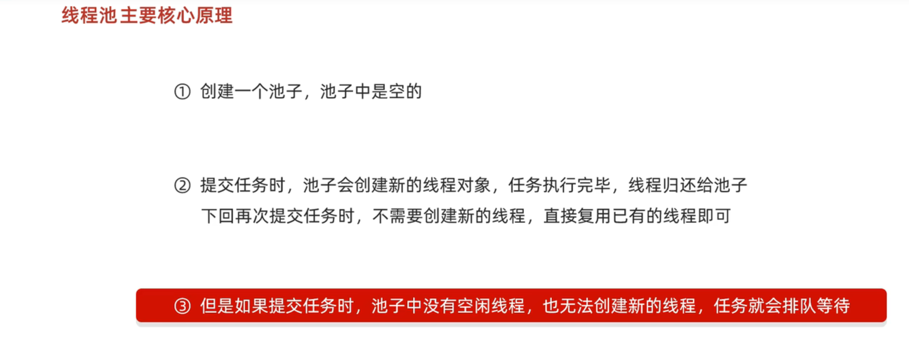

- `ExecutorService`接口：定义了线程池的基本操作，如`submit()`、`execute()`等。`Executors`类：提供了创建线程池的工厂方法。

- 自定义线程池：
   - 核心线程数：线程池中保持的线程数，即使没有任务可执行。
   - 临时线程数：当核心线程数不足时，线程池会创建临时线程来执行任务。（阻塞队列满时，会创建临时线程执行任务）
   - 线程存活时间：当临时线程数超过核心线程数时，线程池会等待一定时间，超过时间后会销毁临时线程。
   - 最大线程数：线程池中最大线程数，包括核心线程数和临时线程数。
   - 阻塞队列：用于存储任务的队列，当队列满时，新任务会（采取不同策略处理新任务）
   - 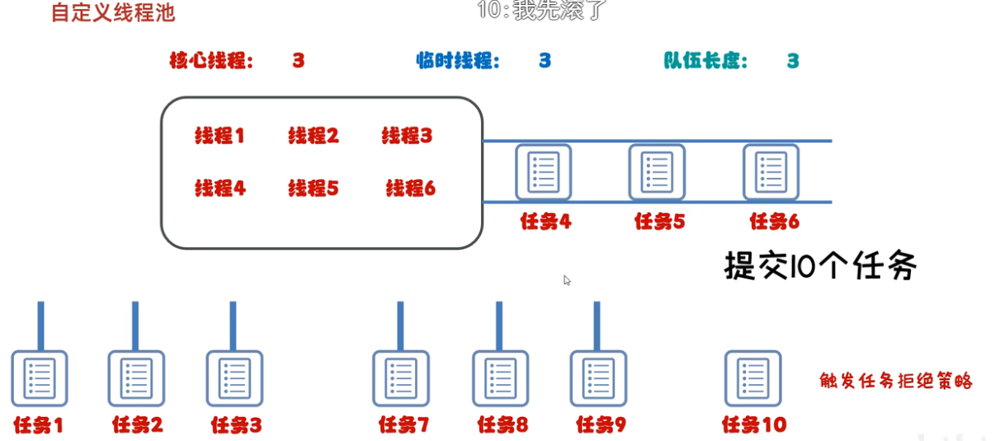
   - 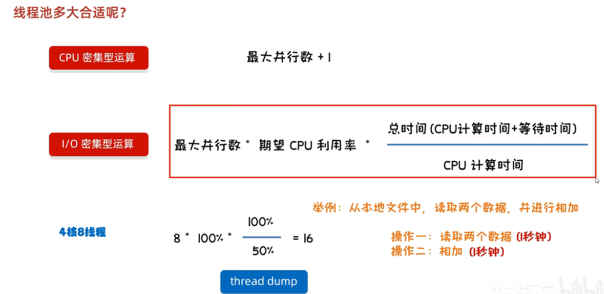

---
面试点（多线程）：

---

### 18. 网络编程

1. CS/ BS模型：
    - CS模型：客户端-服务器模型，客户端请求服务，服务器处理请求并返回结果。
    - BS模型：服务器-客户端模型，服务器请求服务，客户端处理请求并返回结果。
2. 网络编程的基本概念：
   - IP地址：用于标识网络上的设备的唯一标识符
   - 端口号：用于标识进程的软件的标识
   - 协议：用于标识数据包的类型，如TCP、UDP等。
   - 127.0.0.1：回环地址，用于测试和调试。表示本地主机。

3. 单播、多播、组播：
   - 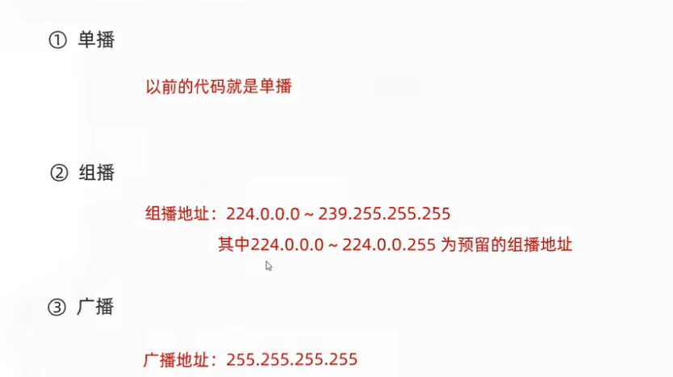

### 19. 反射机制

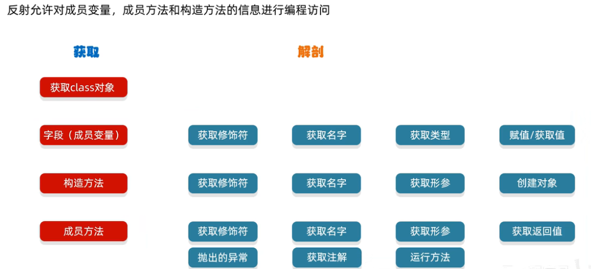
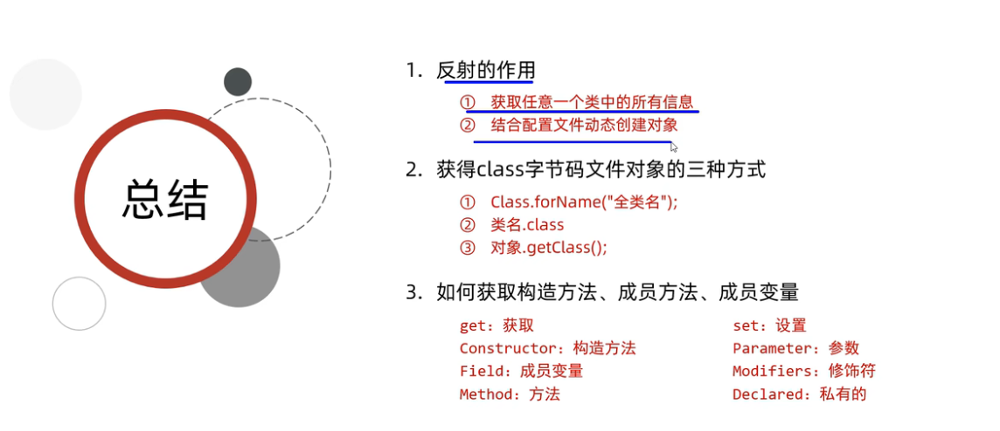

1. 获取类对象：
   - `Class.forName()`：根据类名获取类对象。通常通过他获取class对象。
   - `对象.getClass()`：获取当前对象的类对象。
   - `类名.class`：根据类名获取类对象。 在线程安全设置锁时常用，
2. 构造方法：
   - `Constructor`类：用于创建对象的构造方法。
   - `Constructor.newInstance()`：使用获取到的构造方法创建对象。
3. 成员变量：
   - `Field`类：用于获取和设置对象的成员变量。
4. 方法员：
   - `Method`类用于调用对象的方法。
   - `invoke()`：调用对象的方法。

### 20. 代理模式

1. 代理模式：
   - 代理模式是一种设计模式，用于在不改变原对象的情况下，为原对象添加额外的功能。
   - 代理模式的实现：
      - 静态代理：在编译时就确定了代理对象和被代理对象的实现类。相当于在接口上实现代理对象的某些操作。
      - 动态代理：在运行时根据需要创建代理对象和被代理对象的实现类。
   
   - 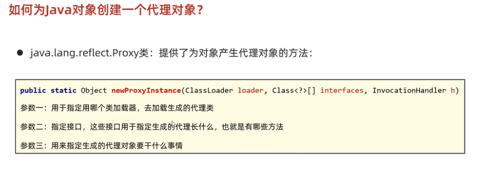
   - 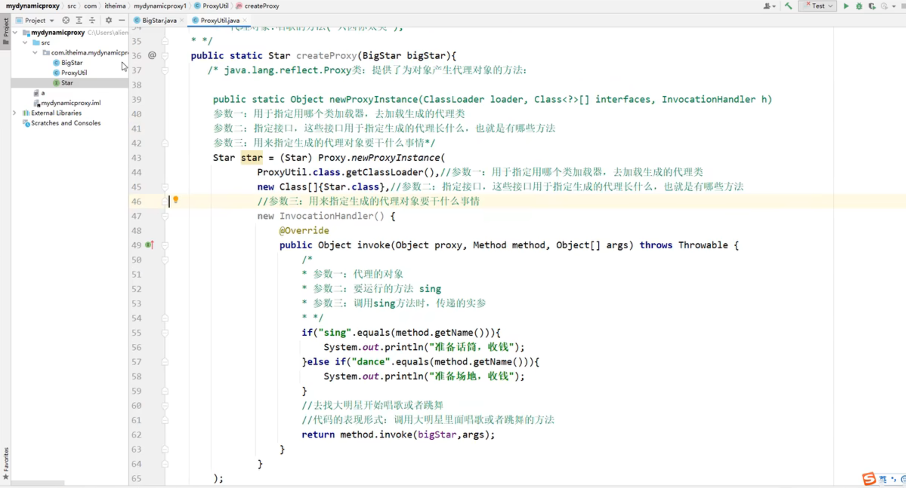